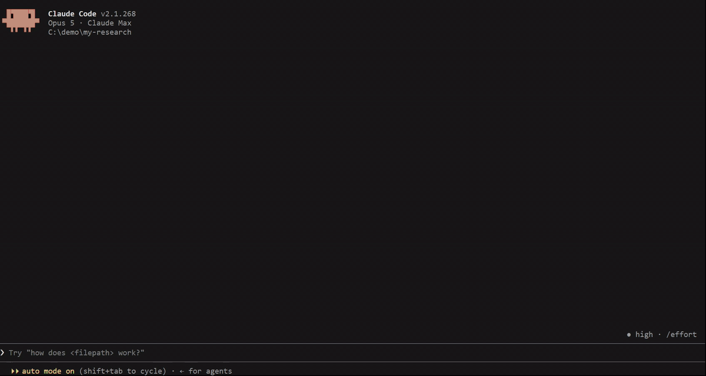
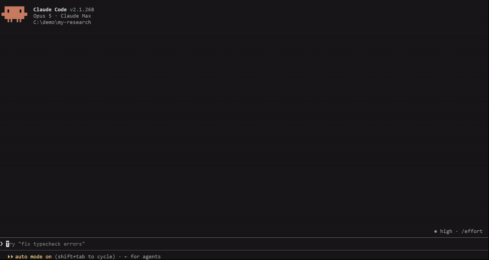
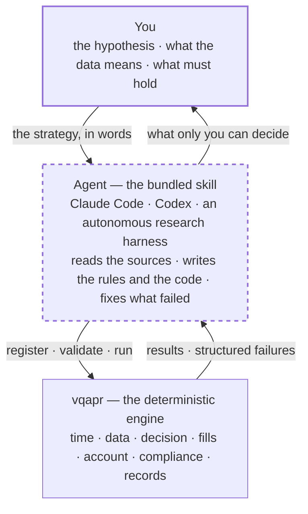
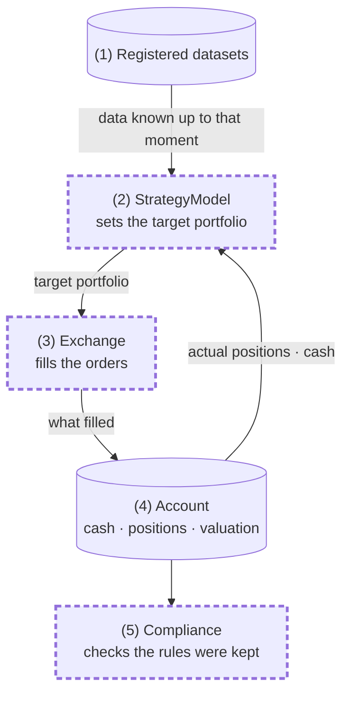
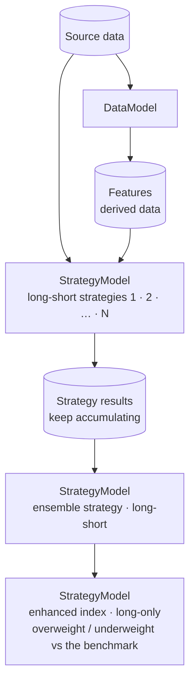

# vqapr

> 🌐 **한국어** → [README.md](README.md)

**V**ibe **Q**uant for **A**sset **P**ricing / **A**lpha **P**ortfolio **R**esearch

**A quant strategy research framework you drive by talking.**
You describe the strategy in plain language, a coding agent turns it into rules and code, and the
framework validates and runs it deterministically.



> 🎬 **Demo — from one sentence to a backtest.**
> Asked in Korean: *"Build a strategy — the top 30 by 12-month momentum, equal-weighted at month end,
> a 5% single-name cap — backtest it, and show me the excess return over KOSPI200."* The agent writes
> the strategy, backtests it with KRX costs, and sums up the result and its limits. A real Claude Code
> session (about 12 minutes), edited only by fast-forwarding.

---

## What the framework is

### Built for coding agents — Claude Code, Codex, and the like

- **The skill that teaches the framework ships with it.** Install it and your AI agent can drive the
  framework immediately.
- You can state a strategy loosely. The agent interviews you into concrete rules and handles
  everything from data registration to running it and reporting the result.

### Four things you customize

- You write the strategy, together with your AI. There is no built-in strategy.
- Four components are yours to write and plug in.
  - `StrategyModel` — how capital is divided
  - `DataModel` — features, signals and risk estimates that several strategies share
  - `Exchange` — which venue fills orders, under which rules. Subclass the built-in `Academic` or
    `KRX` to add listings and costs
  - `Compliance` — whether the filled account kept the rules. Measured and recorded at every market
    instant
- What ships built in is only the arithmetic that is easy to get wrong.
  - Fama-French breakpoints — cut points taken on a reference market and applied to the universe
  - Neutralization — regress market, sector and size exposures out of a signal and keep the residual
    (weighted regression supported)
  - Weighting — equal, size-proportional and signal-proportional allocation, and budget rescaling
  - Optimization within limits — target weights that respect no-short, single-name caps and halts,
    solved in one step
  - Integer quantity conversion — turning target weights into tradable lot sizes

### The decisions that matter are settled with you

- When something about the strategy or the data is ambiguous, the agent settles it with you. When a
  financial statement became knowable, for instance, is yours to decide.
- The framework never guesses. It does not substitute a similar value for a missing one, and when it
  does not know, it stops before producing a result.



> 🎬 **Demo — registering three CSVs it has never seen.**
> Asked in Korean: *"Register the files in the data/ folder with vqapr."* The agent opens the files and
> separates what the data confirms from what a person has to answer — when prices became knowable, that
> the financials carry no filing date, that the only fill price is an adjusted close. Once answered, it
> registers them and writes down the assumptions it cannot check as limits of the result. A real session
> (about 6 minutes), edited only by fast-forwarding.

### A loop-based backtesting engine

- A strategy is generalized as **taking a declared lookback of data and returning weights per
  instrument.**
- Strategies are stateful. They can keep prior decisions and outcomes in memory, which is what makes
  path-dependent strategies such as stop-loss expressible.
- Those weights leave as orders and are filled — or not — under the venue's rules: fees, taxes,
  integer quantities, halts, available cash. **The outcome lands in the account and comes back as
  the input to the next decision.**
- The engine enforces that a strategy sees only what was available at that moment.
  **Forward-looking (look-ahead) bias is structurally impossible.**

### BYOD — Bring Your Own Data

- Bring any data and register it. No vendor connectors, no bundled datasets.
- What you settle at registration is what the data means.
  - `available_at` — when each value became usable
  - for execution data, at what time and at what price a fill is taken to happen
  - which tickers are stocks and which are ETFs
- Once you have settled that, the agent does the registration.

### A strategy (alpha) factory

- Registered data, computed features, strategies you ran and what came out of them are all kept —
  **including the attempts that failed and why.**
- A strategy's output becomes data that the next strategy reads. Stack long-short strategies,
  ensemble them, and turn the ensemble into a long-only enhanced index.
  → [Strategy factory](#strategy-factory)

---

## How it is put together



**You** decide meaning: which hypothesis to test, what the data is, when it became knowable, which
rules must hold. Every decision that changes what a result means lives here.

**The agent** reads the bundled skill. It opens your source files with its own tools, and when
something fails it reads the failure and fixes it. A person can sit in that seat and talk, or an
autonomous harness can sit there and run a hypothesis loop.

**The engine** decides whether things are valid, and runs them.

---

## How a backtest runs



> The dashed bold borders are what you plug in as your own code.

**(1) Registered datasets** — a strategy never opens the data itself. It declares what it needs, and
the engine hands it only what was known up to that moment.

**(2) StrategyModel** — where your strategy code goes. At each decision time it looks at the data and
its own account and sets a target portfolio. Limits such as a single-name cap are applied here with
the built-in functions (`bounds`, `optimize`).

**(3) Exchange** — turns the target portfolio into orders and fills them. Orders are built from the
positions, cash and prices at fill time, not at decision time. `Academic` fills everything, fractional
quantities included, at zero cost, for academic work; `KRX` applies fees, taxes, whole-share lots and
cash shortfalls. Subclass either to add listings or costs.

**(4) Account** — only what actually filled is recorded here. Performance is measured on this cash and
these positions, not on targets or orders, and the next decision starts from them. "Did not decide",
"kept as is" and "ordered but nothing filled" stay distinct in the result.

**(5) Compliance** — checks at every point whether the account keeps the rules (say, a 5% single-name
cap). If prices move a position past its cap, that is recorded as a breach even on a day with no
orders. It only records and never stops the run, because stopping would hide what the strategy
actually does.

Future information is kept out in two places: the strategy receives only data known up to that moment,
and fill prices are invisible to it. What the data cannot tell is when a fill price was actually
observed. The agent warns about that, you decide, and it is written into the result as a limitation.

---

## Strategy factory

What vqapr aims at is not one backtest but **a research cycle that accumulates and combines
strategies.** Features and strategy outputs alike are stored as data carrying their own timestamps,
so past research becomes the input to the next.



1. **Build features.** Market cap, beta, predictions, factor loadings — values several strategies
   share are computed once by a `DataModel` and stored as derived data, read exactly like source
   data. It is optional: a strategy may compute its own.
2. **Build several long-short strategies.** Each reads source data and features and sets a buy (+) or
   sell (−) weight per instrument. A strategy is not shrunk to long-only up front just because shorting
   is hard in practice.
3. **Strategy results accumulate.** Each strategy's weights and performance are kept as timestamped
   data. You can compare correlation and incremental contribution against existing strategies, and
   failed attempts stay with their reasons.
4. **Ensemble.** Read the accumulated results and combine them into a single long-short strategy,
   without re-running the members. How to combine them (equal weight, IC weight, …) is yours to decide;
   the framework measures how much nets out between instruments.
5. **Turn it into an enhanced index.** Following the ensemble's signal, overweight or underweight names
   against the benchmark to build a long-only portfolio you could actually hold. Limits such as a
   single-name cap are applied with `optimize` and checked by `Compliance`. You don't have to go through
   every step — a single strategy or an ensemble backtests just as well on its own.

---

## Getting started

```bash
uv add "vqapr @ git+https://github.com/jaepil-choi/vqapr@develop"
uv run vqapr skill install
```

Two lines. It is not on PyPI yet and releases live on the `develop` branch, so it installs from GitHub.
To pin a version, use a release tag (say `@v0.16.1`) instead of `@develop`. The first line installs the
engine; **the second installs the skill your agent reads.** Without the skill the agent does not know
how to use the framework. The skill goes to both `.agents/skills/` (Codex and others) and
`.claude/skills/` (Claude Code), with identical contents. **Your `AGENTS.md` and `CLAUDE.md` are never
touched.** Add `--dry-run` to see the paths first.

From there you work in sentences.

```text
Register the data in data/.
Research a new reversal strategy from the registered signals.
Ensemble the stored strategies and backtest them as a long-only enhanced index.
Show me which data and signals this result depended on.
```

You never need to open the package source. If ordinary use requires reading it, that is a defect in
the product.

---

## FAQ

**Is it daily only, or does it do minute bars?**
It does. **Strategies are not tied to a frequency.** Frequency is not baked into the engine; it lives
in the data you register and the execution table you declare. Observation, decision, fills, valuation
and monitoring can each run on their own cadence, so observing and marking daily while rebalancing
monthly and monitoring the account every day is expressible as it stands. Register minute data and a
minute-level execution table and the same strategy code runs on minute bars. Order books, partial
fills and market impact are not modelled.

**What about futures, bonds and options?**
Today it is physical execution of **stocks and ETFs**. **Factors** can be traded against a synthetic
unit price for academic work, and indices are referenced — as benchmarks — rather than held.
Other asset classes **are planned**, and each arrives once its own semantics are defined: contract
size, margin, rolls, coupons and maturity. Adding a name to a list while treating it like a stock is
not how they will arrive.

**And shorting?**
You can **write and backtest long-short strategies as they are.** What is not modelled is what real
shorting needs — borrowing the shares, collateral, margin. So short positions fill on the hypothetical
`Academic` exchange and are marked *hypothetical* in the result.

**Can it send real orders?**
No. Broker connectivity, authentication, always-on scheduling and order slicing or replacement are
out of scope. This is a research and simulation engine.

---

## Acknowledgements

- The approach of building many strategies and combining them is inspired by WorldQuant's alpha
  factory.
- The structures of [Qlib](https://github.com/microsoft/qlib) and
  [NautilusTrader](https://github.com/nautechsystems/nautilus_trader) were a reference.

---

## License

Apache License 2.0 — [`LICENSE`](LICENSE).
