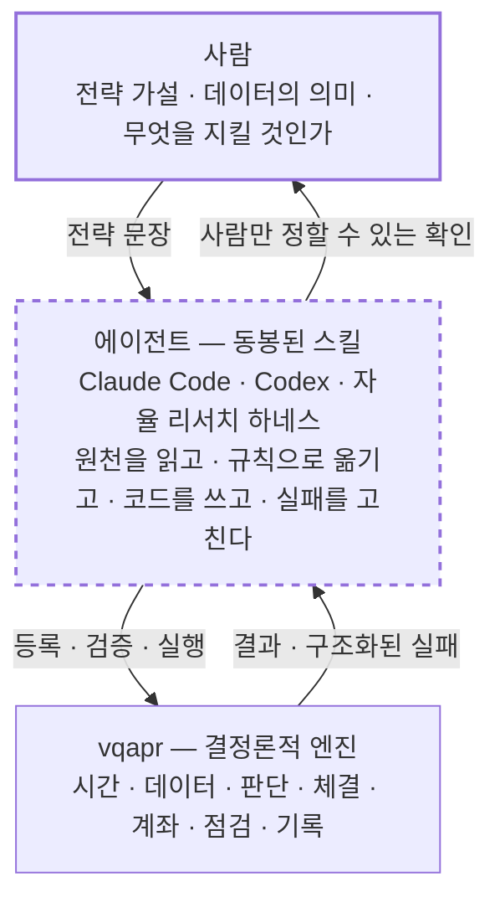
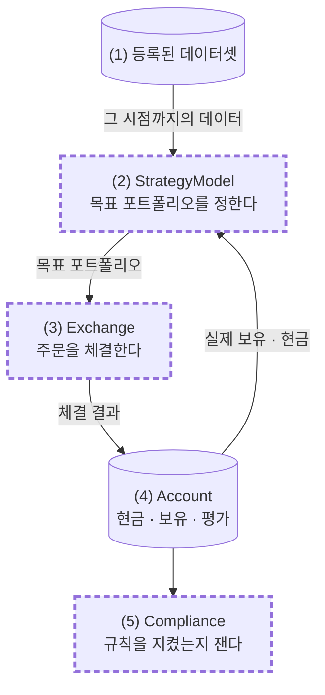
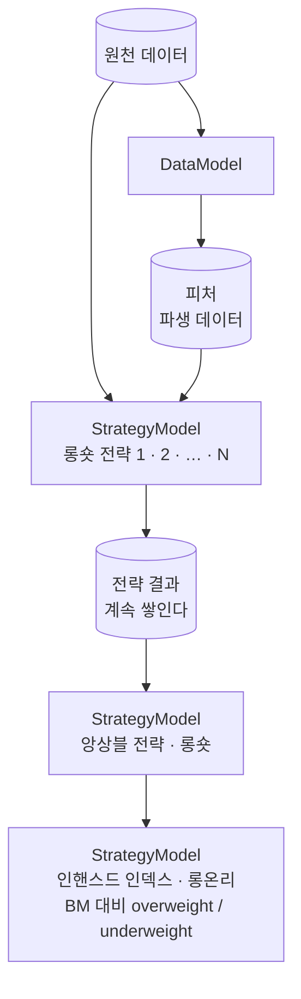

# vqapr

> 🌐 **English** → [README.en.md](README.en.md)

**V**ibe **Q**uant for **A**sset **P**ricing / **A**lpha **P**ortfolio **R**esearch

**말로 하는 퀀트 전략 리서치 프레임워크입니다.**
전략은 말로 설명하고, 코딩 에이전트가 그것을 규칙과 코드로 옮기고, 프레임워크가 결정론적으로 검증하고 실행합니다.


> 🎬 **데모 — 한 문장에서 백테스트 결과까지.**
> *"12개월 모멘텀 상위 30종목, 월말 동일비중, 단일종목 5%로 전략 만들어서 백테스트 돌리고, KOSPI200 대비
> 초과수익 그래프까지 보여줘."* 에이전트가 전략 코드를 쓰고, KRX 비용을 반영해 백테스트하고, 결과와 한계를
> 정리합니다. 실제 Claude Code 세션(약 12분)이며, 편집은 빨리감기뿐입니다.

---

## 프레임워크의 특징

### Claude Code · Codex 등 코딩 에이전트 사용 최적화

- 프레임워크 사용법을 담은 **스킬이 내장되어 있습니다.** 설치하면 AI 에이전트가 곧바로 프레임워크를 다룹니다.
- 전략을 추상적으로 말해도 됩니다. 에이전트가 사용자와 인터뷰하며 구체적인 규칙으로 만들고, 데이터 등록부터
  실행과 리포트까지 처리합니다.

### 사용자가 커스터마이징하는 네 가지

- 전략은 사용자가 AI와 함께 짭니다. 내장 전략은 없습니다.
- 네 가지 요소를 직접 만들어 끼울 수 있습니다.
  - `StrategyModel` — 자본을 어떻게 나눌 것인가
  - `DataModel` — 여러 전략이 나눠 쓸 피처·시그널·리스크 추정
  - `Exchange` — 어느 시장에서 어떤 규칙으로 체결되는가. 내장 `Academic`·`KRX`를 상속해 종목과 비용을 더합니다
  - `Compliance` — 체결된 계좌가 규칙을 지켰는가. 매 시장 시각에 재고 기록합니다
- 내장으로 제공하는 것은 자주 쓰지만 틀리기 쉬운 계산뿐입니다.
  - Fama-French 브레이크포인트 — 기준 시장에서 컷포인트를 잡아 전체 유니버스에 적용
  - 중립화 — 시그널에서 시장·섹터·사이즈 노출을 회귀로 걷어내고 잔차만 남김(시총가중 회귀 지원)
  - 가중 배분 — 동일가중, 크기비례, 시그널비례 배분과 예산 재조정
  - 한도 안의 최적화 — 공매도 금지·단일종목 상한·거래정지를 지키는 목표 비중을 한 번에 풀기
  - 정수 수량 변환 — 목표 비중을 거래 단위에 맞춰 떨어뜨리기

### 중요한 결정은 사용자와의 인터뷰로 확정

- 전략이나 데이터에 불분명한 부분이 있으면 에이전트가 사용자와 함께 결정합니다. 예를 들어 재무제표를 언제부터
  알 수 있었다고 볼 것인지는 사용자가 확정합니다.
- 프레임워크는 추측하지 않습니다. 빠진 값을 비슷한 것으로 대체하지 않고, 모르면 결과를 만들기 전에 멈춥니다.


> 🎬 **데모 — 처음 보는 CSV 세 개를 등록하기.**
> *"data/ 폴더에 있는 파일들을 vqapr에 등록해줘."* 에이전트가 파일을 열어보고, 데이터로 확인되는 것과 사람이
> 답해야 하는 것(가격을 언제부터 알 수 있나, 재무 자료에 공시일이 없다, 체결가가 수정종가뿐이다)을 나눠 묻습니다.
> 답을 받아 등록하고, 검사할 수 없는 가정은 결과의 한계로 적습니다. 실제 세션(약 6분)이며, 편집은 빨리감기뿐입니다.

### Loop 기반 백테스팅 엔진

- 전략은 **정해진 lookback의 데이터를 받아 종목별 가중치를 내는 것**으로 일반화됩니다.
- 전략은 stateful합니다. 이전 판단과 결과를 memory에 남길 수 있어 손절 같은 path-dependent 전략을
  구현할 수 있습니다.
- 가중치는 주문으로 나가고, 거래소별 조건(수수료·세금·정수 수량·거래정지·현금)에 따라 체결되거나 못 됩니다.
  **그 결과가 계좌에 반영되어 다음 판단으로 되돌아옵니다.**
- 전략은 그 시점에 available했던 데이터만 볼 수 있도록 엔진이 강제합니다.
  **forward-looking(look-ahead) bias가 원천 차단됩니다.**

### BYOD — Bring Your Own Data

- 임의의 데이터를 가져와 등록해 쓸 수 있습니다. 벤더 커넥터도 번들 데이터셋도 없습니다.
- 등록할 때 정하는 것은 데이터의 의미입니다.
  - `available_at` — 각 값을 언제부터 쓸 수 있었는가
  - 체결 데이터라면 언제 얼마에 체결되는 것으로 볼 것인가
  - 어떤 종목코드가 주식이고 어떤 것이 ETF인가
- 사용자가 이것을 정해주면 등록은 에이전트가 합니다.

### 전략(알파) 팩토리 구조

- 등록한 데이터, 만든 피처, 돌린 전략과 그 결과가 **실패한 시도까지 전부 기록으로 남습니다.**
- 전략의 결과는 다시 데이터가 되어 다음 전략이 씁니다. 롱숏 전략을 쌓고, 앙상블하고, 롱온리 인핸스드
  인덱스로 만듭니다. → [전략 팩토리](#전략-팩토리)

---

## 프레임워크 구조



**사람**은 의미를 정합니다. 무슨 가설을 검증할지, 이 데이터가 무엇인지, 언제부터 알 수 있었는지, 무엇을
지키게 할지. 결과의 의미를 바꾸는 결정은 전부 여기에 있습니다.

**에이전트**는 동봉된 스킬을 읽습니다. 원천 파일은 에이전트가 자기 도구로 직접 열어보고, 실패가 나면 그 실패를
읽고 고칩니다. 이 자리에 사람이 앉아 대화할 수도, 자율 하네스가 앉아 가설 루프를 돌 수도 있습니다.

**엔진**은 판정하고 실행합니다.

---

## 백테스트 구조



> 점선 굵은 테두리는 사용자가 코드로 직접 끼우는 자리입니다.

**(1) 등록된 데이터셋** — 전략은 데이터를 직접 열지 않습니다. 필요한 데이터를 선언하면 엔진이 그 시점까지의
데이터만 잘라서 건넵니다.

**(2) StrategyModel** — 전략 코드가 들어가는 곳입니다. 정해진 판단 시점마다 데이터와 자기 계좌 상태를 보고
목표 포트폴리오를 정합니다. 단일종목 한도 같은 제약은 여기서 내장 함수(`bounds`·`optimize`)로 반영합니다.

**(3) Exchange** — 목표 포트폴리오를 주문으로 바꿔 체결합니다. 주문은 판단 시점이 아니라 체결 시점의 보유·현금·
가격으로 만들어집니다. `Academic`은 비용 없이 소수점 수량까지 전부 체결하는 학술용이고, `KRX`는 수수료·세금·
1주 단위·현금 부족을 반영합니다. 종목이나 비용을 더하려면 둘 중 하나를 상속합니다.

**(4) Account** — 실제로 체결된 결과만 기록됩니다. 성과는 목표나 주문이 아니라 여기 남은 현금과 보유로 계산하고,
다음 판단도 이것을 보고 합니다. "판단하지 않음", "그대로 유지", "주문했지만 체결 안 됨"은 결과에서 서로
구분됩니다.

**(5) Compliance** — 계좌가 규칙(예: 단일종목 5%)을 지키고 있는지 매 시점 잽니다. 주문이 없던 날이라도 가격이
움직여 한도를 넘으면 위반으로 기록합니다. 기록만 하고 실행을 멈추지는 않습니다. 멈추면 전략이 실제로 어떻게
움직이는지 끝까지 볼 수 없기 때문입니다.

미래 정보는 두 곳에서 막힙니다. 전략은 그 시점까지의 데이터만 받고, 체결 가격은 전략에게 보이지 않습니다.
다만 체결 가격이 실제로 언제 관측된 값인지는 데이터만으로 알 수 없습니다. 이 부분은 에이전트가 경고하고
사용자가 정한 뒤, 결과에 한계로 적습니다.

---

## 전략 팩토리

vqapr가 겨냥하는 것은 백테스트 한 번이 아니라 **전략을 쌓고 조합하는 연구 사이클**입니다.
피처도 전략 결과도 시점이 붙은 데이터로 쌓이기 때문에, 지난 연구가 다음 연구의 입력이 됩니다.



1. **피처를 만듭니다.** 시가총액, 베타, 예측값, 팩터 노출처럼 여러 전략이 함께 쓰는 값을 `DataModel`이 한 번
   계산해 파생 데이터로 저장합니다. 원천 데이터와 똑같은 방식으로 읽힙니다. 꼭 거칠 필요는 없고, 전략 안에서
   직접 계산해도 됩니다.
2. **롱숏 전략을 여러 개 만듭니다.** 원천 데이터와 피처를 읽어 종목마다 살(+) 비중과 팔(−) 비중을 정합니다.
   실제로 공매도가 어렵다고 해서 처음부터 롱온리로 줄여 짜지 않습니다.
3. **전략 결과가 쌓입니다.** 각 전략의 비중과 성과가 시점이 붙은 데이터로 남습니다. 기존 전략과의 상관이나
   추가 기여를 비교할 수 있고, 실패한 시도도 이유와 함께 남습니다.
4. **앙상블합니다.** 쌓인 전략 결과를 읽어 하나의 롱숏 전략으로 합칩니다. 구성 전략을 다시 돌리지 않습니다.
   어떻게 합칠지(동일가중, IC 가중 등)는 연구자가 정하고, 종목끼리 상쇄된 양은 프레임워크가 잽니다.
5. **인핸스드 인덱스로 만듭니다.** 앙상블의 신호에 따라 벤치마크 대비 비중을 늘리거나(overweight)
   줄여서(underweight) 실제로 운용할 수 있는 롱온리 포트폴리오를 만듭니다. 단일종목 한도 같은 제약은
   `optimize`로 반영하고 `Compliance`로 확인합니다. 모든 단계를 거칠 필요는 없습니다. 단독 전략이나 앙상블도
   그대로 백테스트할 수 있습니다.

---

## 시작하기

```bash
uv add "vqapr @ git+https://github.com/jaepil-choi/vqapr@develop"
uv run vqapr skill install
```

두 줄이 전부입니다. 아직 PyPI에 올리기 전이고 릴리스가 `develop` 브랜치에 있어, GitHub에서 직접 설치합니다.
버전을 고정하려면 `@develop` 대신 릴리스 태그(예: `@v0.16.1`)를 씁니다.
첫 줄이 엔진을 설치하고, **둘째 줄이 에이전트가 읽을 스킬을 프로젝트에 설치합니다.**
스킬이 없으면 에이전트는 이 프레임워크를 쓸 줄 모릅니다. 스킬은 `.agents/skills/`(Codex 등)와
`.claude/skills/`(Claude Code)에 같은 내용으로 놓입니다.
**기존 `AGENTS.md`나 `CLAUDE.md`는 건드리지 않습니다.** 무엇이 만들어질지 먼저 보려면 `--dry-run`을 붙입니다.

그다음부터는 문장으로 시작합니다.

```text
data/의 데이터를 등록해줘.
등록된 신호로 새로운 리버설 전략을 연구해줘.
저장된 전략들을 앙상블해서 롱온리 인핸스드 인덱스로 백테스트해줘.
이번 결과가 어떤 데이터와 신호에 의존하는지 보여줘.
```

패키지 소스를 열어볼 필요는 없습니다. 정상적인 사용을 위해 내부를 읽어야 한다면 그것은 제품의 결함입니다.

---

## FAQ

**일별만 되나요? 분 단위도 되나요?**
됩니다. **전략은 주기에 묶여 있지 않습니다.** 주기는 엔진에 박혀 있지 않고 등록한 데이터와 체결 선언에
있습니다. 관측·판단·체결·평가·관찰이 각각 다른 주기를 가질 수 있어서, 일별로 보고 평가하면서 월별로
리밸런스하고 매일 계좌를 관찰하는 구성이 그대로 표현됩니다. 분 단위 데이터와 분 단위 체결 테이블을 등록하면
같은 전략 코드가 분 단위로 돕니다. 다만 호가창·부분 체결·시장 충격은 모델링하지 않습니다.

**주식 말고 선물·채권·옵션도 되나요?**
지금은 **주식과 ETF**의 실물 체결입니다. 학술 연구용으로 **팩터**를 합성 단가로 사고팔 수 있고,
지수는 벤치마크처럼 참조만 합니다.
다른 자산군은 **추가할 예정**이며, 계약 단위·증거금·롤·쿠폰과 만기처럼 그 자산군 고유의 의미가 정의된 뒤에
들어옵니다. 목록에 이름만 늘리고 실제로는 주식처럼 다루는 방식은 하지 않습니다.

**공매도는요?**
롱숏 전략은 연구 단계에서 **그대로 짜고 백테스트할 수 있습니다.** 다만 실제 공매도에 필요한 주식 차입·담보·
마진은 모델링하지 않습니다. 그래서 숏 포지션은 가상 거래소(`Academic`)에서 체결되고, 결과에 *가상*으로
표시됩니다.

**실제 주문을 낼 수 있나요?**
아닙니다. 브로커 연결, 인증, 상시 스케줄링, 주문 분할·재전송은 범위 밖입니다. 리서치와 시뮬레이션 엔진입니다.

---

## 참고

- 여러 전략을 만들어 조합하는 방식은 WorldQuant의 alpha factory 접근에서 영감을 얻었습니다.
- [Qlib](https://github.com/microsoft/qlib)과 [NautilusTrader](https://github.com/nautechsystems/nautilus_trader)의 구조를 참고하였습니다.

---

## 라이선스

Apache License 2.0 — [`LICENSE`](LICENSE).
