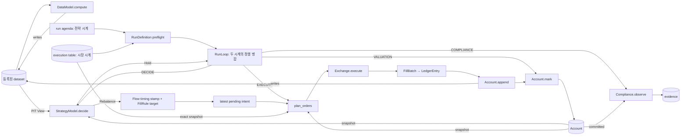

# vqapr Architecture

- **Status**: target design. `src/vqapr/`는 이 문서가 승인된 뒤에 만든다.
- **Authority**: `docs/vqapr-prd.md`가 제품 authority. 이 문서는 그것을 구현하는 설계 authority.
- **읽는 법**: 각 설계 결정은 `결정 → 왜 → 없으면 무엇이 깨지는가 → 어떤 UC` 순서로 적는다.
  근거 없는 결정은 이 문서에 두지 않는다.

---

## 1. 한 장 요약

### 1.1 실행 척추



- **시계는 둘이다.** 전략 시계(run의 `agenda`)에서 판단이, 시장 시계(체결 테이블의 모든 시각)에서
  ACCRUE → EXECUTE → VALUATION → COMPLIANCE가 돈다(§3.2). 누가 어느 시계에 불리고 답이 어디로 가는지는
  배선표가 정한다(§10.2, `domain/wiring.py`).
- 위 경로를 통과하지 않고 return/NAV/PnL/turnover를 만드는 코드는 없다. — PRD §2.2
- **DataModel은 척추에 들어오지 않는다. StrategyModel은 반드시 통과한다.** 이것이 두 역할의 판정
  기준이다(PRD §2.3).
- StrategyModel의 결과도 dataset이 되므로 **다른 StrategyModel이 그것을 읽을 수 있다**(§5.2).
  그림의 마지막 화살표가 그것이다.

### 1.2 일곱 layer

| layer | 답하는 질문 | module |
|---|---|---|
| Runtime | 언제 호출하는가 | `flow/engine/` · `flow/run/` · `domain/wiring.py` |
| Data | 그때 무엇을 읽을 수 있는가 | `data/` |
| Value | 어떤 값을 만드는가 | `authoring/`(DataModel) · `transforms/` |
| Decision | 무엇을 의도하는가 | `authoring/`(StrategyModel) · `portfolio/`(bound kit 포함) |
| Execution | 의도가 어떤 주문·체결이 되는가 | `exchange/` (`planning.py` · `venue.py`) |
| State | 실제 상태가 어떻게 바뀌는가 | `account/` · `domain/ledger.py` |
| Evidence | 무엇을 읽었고 무엇이 일어났는가 | `record/` · `compliance/` · `report/` · `analysis/` |

**`authoring/`가 두 층에 걸친다. 그게 우연이 아니라 사실의 표현이다** — 두 역할이 state와 data 접근 계약
(`inputs` · `memory` · payload · `recorder`)을 공유하고, 갈리는 것은 **execution을 통과하는가**
하나뿐이다(§4.4). 둘 다 자기 시계 — run의 `agenda` — 를 선언하는 **부품**이고, Exchange와 Compliance는 시장
시계에 붙는 **도구**다(§10.2).

`flow/`는 이 layer들을 조립하고 이벤트를 배달한다. **경제 규칙을 소유하지 않는다.**

`extension/` · `project/` · `agent/` · `cli/` · `public.py`는 층이 아니라 **제품 표면**이다. 런타임
정보 흐름에 참여하지 않고, 사용자와 agent가 이 시스템에 닿는 지점을 이룬다(§10.2~§10.4).

> **Reference — 세 프레임워크가 서로 다른 것으로 층을 갈랐다**
>
> ```text
> nautilus   메시지의 역할    DataEngine이 받고 RiskEngine이 검사하고 ExecEngine이 보낸다
> qlib       작업의 순서      data → model → strategy → backtest → workflow
> vqapr      시간의 질문      위 표의 두 번째 열이 전부 물음표인 것이 그것이다
> ```
>
> 층 이름 옆이 전부 질문이고 그 질문이 시간 순서인 것은 우연이 아니다. **PIT correctness가 중심
> 요구(§3.2)이므로, 층을 정보 흐름으로 그으면 "그때 무엇을 알 수 있었나"가 층 경계에 드러난다.**
>
> 그리고 이것은 **판단 시점과 체결 시점이 갈라져 있기 때문에 가능한 선택**이다. 실거래에서는 그 간격이
> 없어 질문 자체가 성립하지 않는다. §2.2·§2.3·§5.2·§6.1의 차이가 전부 여기서 나오므로, 그 자리에서는
> 이 문단을 가리키기만 한다.
>
> 공통점도 있다. nautilus의 `model/`과 우리 `domain/`은 같은 자리다 — venue도 storage도 모르는 순수
> 타입을 바닥에 둔다. qlib에는 이 층이 없고 `DataFrame`이 그 자리를 대신하므로, "이 표가 무엇인가"가
> 컬럼 이름 관례로만 표현된다.

### 1.3 세 줄 규칙

1. **아무도 Store를 직접 열지 않는다.** 소비자는 requirement를 선언하고 Flow가 bounded View를 준다.
2. **Account만 상태를 쓴다.** 나머지는 전부 값을 계산해 Flow에 반환한다.
3. **Component는 서로를 호출하지 않는다.** 다음 단계를 부르는 건 Flow다.

---

## 2. 설계 원칙

### 2.1 IoC — Component는 자기 시계를, Flow는 진행과 배달을, Strategy는 판단을 소유한다

**결정.** 시계는 둘이다(§3.2). run의 `agenda`가 **전략 시계**이고 — DataModel과 StrategyModel이 거기서 불린다 —
체결 테이블이 가진 모든 시각이 **시장 시계**다. Valuation은 자기 cadence를 갖지 않는다 — 장부는 시장 시계의
매 점에서 평가된다(§7.4). Compliance도 자기 agenda를 갖지 않는다 — VALUATION 직후 같은 점에서 관측한다.
preflight는 agenda 전개 결과의 identity와 inclusive run slice, execution input, initial Model state를 freeze한다.
Flow는 두 시계를 deterministic merge하고 current occurrence만 전달한다.

- **부품(DataModel · StrategyModel)이 소유하는 것**: 자기 시계 — run의 `agenda` — 와 경제적 cadence.
- **도구(Exchange · Compliance · Accrual 자리)가 소유하는 것**: 시계 없음. 배선표가 정한 시장 시계의 자리에서
  불린다(§10.2).
- **Flow가 소유하는 것**: agenda 전개/freeze, 두 시계의 merge, 한 시각 안의 고정 순서, bounded View 주입,
  callback result validation, current occurrence evaluation time의 non-overridable decision-time stamp, atomic
  state acceptance와 체결 연결.
- **Strategy가 소유하는 것**: callback 안에서 warm-up/cooldown, 지금 판단할지, 판단했다면 어떤 economic intent를
  만들지, 그리고 어떤 bound 안에서 만들지(§5.7). timestamp와 exact execution target은 소유하지 않는다.
- **fill 규칙(`FillRule`)이 소유하는 것**: Flow-stamped decision time 뒤의 exact execution target — 결정 이후 첫
  시장 시계 점, `at`·`after`·`within`으로 좁힌 것.
- **왜**: Flow가 recurrence/calendar를 해석하거나 ExecutionTable rows로 판단의 **시각**을 만들면 cadence를 숨은
  orchestration 규칙으로 바꾼다(날짜는 유도한다 — 밀도 무관이다, §3.6). 반대로 Strategy가 future agenda나
  execution rows를 보면 PIT와 authority가 무너진다.
- **결정성**: 같은 frozen agenda/slice, 같은 체결 테이블과 complete frozen inputs는 같은 occurrence, state
  transition과 trace를 만든다. agenda는 DECISION 목록이 아니라 invocation opportunities다.
- **UC**: `UC-TIME-002`, `UC-TRIGGER-001`, `UC-STATE-001`, `UC-EXEC-001`, `UC-EXEC-003`

### 2.2 Least authority — bounded View

**결정.** 각 소비자는 `DataRequirement`를 선언하고, Flow의 resolver가 `available_at <= evaluation_time`을
적용한 **읽기 전용 View**를 주입한다. Store 핸들은 어디에도 전달하지 않는다.

- **왜**: PIT은 규칙이 아니라 **접근 불가능성**으로 강제해야 한다. 규칙은 잊히고 캡슐화는 잊히지 않는다.
- **없으면**: `store.query(...)` 한 줄이면 look-ahead가 가능하다. 리뷰로 막는 것은 확장되지 않는다.
- **UC**: `UC-PIT-001`, `UC-LOOKBACK-001`, `UC-DATA-002`, `UC-TIME-001`

> **Reference — 두 레퍼런스는 전략에게 넓게 연다**
>
> qlib의 전략은 `common_infra`로 exchange와 account를, `level_infra`로 executor와 calendar를 받는다
> (`BaseStrategy.__init__`). nautilus의 `Strategy`는 `self.cache`로 캐시 전체를 본다.
>
> **그래도 되는 이유가 있다** — 실거래에서는 넓게 봐도 미래를 볼 수 없다. 아직 없기 때문이다.
> 백테스트에서는 **접근할 수 있는 것이 곧 볼 수 있는 미래**라 같은 설계가 성립하지 않는다(§1.2).
> 이 하나의 결정이 §6.1까지 파급된다.

### 2.3 Aggregate Root — Account

**결정.** cash, position, version, 원장의 쓰기 권한은 `Account` 하나가 갖는다. 문은
`append(entries, expected_version)`과 `mark(marks, expected_version)` 둘뿐이고, Account는 *"이 항목을 이 원장
뒤에 붙일 수 있는가"*만 판단한다(§7.1). 통장으로 가는 답은 둘이다 — Exchange의 체결과 (자리만 있는)
Accrual — 그래서 누가 append를 허가하는가가 독립적으로 존재해야 한다.

- **왜**: committed Account state의 authority를 하나로 유지하려면 쓰기 권한이 **한 객체**에 있어야 한다
  (PRD §2.4).
- **없으면**: intended 값을 상태에 쓰는 경로가 생기고 `intended ≠ committed`가 무너진다.
- **UC**: `UC-CLOSED-LOOP-001`, `UC-ACCOUNT-HISTORY-001`, `UC-CONSTRAINT-ADJUST-001`

> **Reference — nautilus의 `Cache`와 우리 `Account`는 방향이 반대다**
>
> ```text
> Cache     읽기를 모으고 쓰기를 분산한다      여러 엔진이 쓴다
> Account   쓰기를 모으고 읽기를 좁힌다        스냅샷으로만 나간다
> ```
>
> 둘 다 "하나의 중심"인데 범위가 반대다. 공유 캐시에 intended를 넣는 순간 §2.4의
> `intended ≠ requested ≠ dealt ≠ committed`가 흐려진다. **그 네 단계를 구분해야 하는 쪽이 더 좁은
> authority를 갖는다.** qlib은 아예 흩어져 있다 — Exchange가 시세를, Account가 포지션을 갖고 전략이
> `common_infra`로 둘 다 만진다.

### 2.4 Functional Core / Imperative Shell

**결정.** 계산(weighting, construction, planning, matching, valuation 산술)은 순수 함수. 부작용(commit,
publication, state 전달)은 Flow에만 있다.

- **왜**: PRD가 요구하는 deterministic replay는 계산이 순수할 때 공짜로 얻어진다.
- **없으면**: 계산 안에 I/O가 섞이면 fixture 테스트가 불가능해지고 `UC-SCALE-001`의 3,000종목 검증이
  단일종목 검증과 등가임을 보일 수 없다.
- **UC**: 전 범위 (deterministic replay는 cross-cutting invariant)

### 2.5 StrategyModel Pattern — profile은 주입한다

**결정.** `Exchange`는 시장 시계에 붙는 도구(`Tool`)의 ABC이고 Academic/KRX는 그 구현이다. run 선언의
`exchange:`로 주입한다. profile별 Flow를 만들지 않는다.

- **왜**: 두 profile은 **같은 lifecycle에 다른 정책**이다(PRD §6.4). Flow를 나누면 그 사실이 거짓이 된다.
- **없으면**: `UC-PORTFOLIO-001`(같은 alpha를 두 profile로)이 두 코드 경로의 우연한 일치가 된다.
- **UC**: `UC-PROFILE-001`, `UC-ACADEMIC-001`, `UC-PORTFOLIO-001`

### 2.6 Facade — 단일 public 진입점

**결정 (2026-08-28 개정).** 문서화된 표면은 **CLI**이고, `vqapr.public`이 그것이 서 있는 지원되는
구현 표면이다. 내부 module 경로는 계약이 아니다.

> **이 절은 더 이상 판정의 출처가 아니다.** 두 번째 facade — `vqapr/project.py`와 `vqapr.open` —
> 가 존재하며 **미출하·동결** 상태다. 확정 판정과 그 측정 근거, 그리고 `vqapr.public` 삭제(G008)가
> 충족해야 할 조건은 `docs/design/agent-first-surface.md`의 "The ruling — 2026-08-28" 절에 있다.
> 이 표면을 건드리기 전에 그 절을 읽는다. 이 문서는 `.agent/project.yaml`의
> `canonical_documents`에 없다.

- **왜**: `UC-FACADE-001`이 "package source를 열지 않고 완주"를 요구한다.
- **없으면**: 사용자가 내부 import에 의존하면 리팩터가 breaking change가 된다.
- **UC**: `UC-FACADE-001`, `UC-EXTENSION-002`

> **Reference — qlib의 `contrib/`이 반면교사다**
>
> model·strategy·ops·report·evaluate·rolling·online이 전부 패키지 안 `contrib/`에 쌓인다. **확장 지점을
> 패키지 안에 두면 사용자 코드가 패키지에 축적되고, 결국 그것을 읽어야 쓸 수 있게 된다.**
> `UC-FACADE-001`이 요구하는 *"package source를 열지 않고 완주"*가 구조적으로 불가능해진다.
>
> nautilus는 `adapters/`를 1급 층으로 두는데, 그것은 venue 연결이라 패키지가 소유하는 것이 맞다.
> **연구 로직은 다르다** — 그것이 §2.7이 project-local StrategyModel을 primary extension point로 둔 이유다.

### 2.7 DRY의 경계 — 무엇을 공유하고 무엇을 나누는가

DRY는 **모양이 같은 것**이 아니라 **변경 이유가 같은 것**에 적용한다.

| 공유한다 (변경 이유가 하나) | 나눈다 (변경 이유가 다르다) |
|---|---|
| `PortfolioIntent` / `OrderBatch` / `FillBatch` envelope | Academic vs KRX의 가격·비용·수량 규칙 |
| `Account.commit` / `mark` / history | long-only vs signed의 전이 유효성 |
| 이벤트 순서와 failure taxonomy | profile별 realism label과 limitation |
| requirement → View 해석 경로 | 각 소비자가 무엇을 요구하는가 |

- **없으면 (과한 공유)**: 두 profile의 비용 정책을 한 함수에 합치면 `UC-COST-004`의 "ETF에 Equity policy를
  적용하지 않는다"가 조건 분기 하나 차이로 무너진다.
- **없으면 (부족한 공유)**: envelope을 profile마다 따로 두면 `UC-PORTFOLIO-001`을 비교할 공통 축이 사라진다.

### 2.8 어떤 제약이 어디에 속하는가

새 제약이 생길 때마다 "이건 Exchange야 Account야"를 다시 논쟁하지 않기 위한 판정 규칙이다.

> **venue를 바꾸면 달라지는가?** → **Exchange**
> **계좌를 바꾸면 달라지는가?** → **Account**
> **둘 다 안 바꾸고 회계 항등식인가?** → **공통 불변식**

| 제약 | 검사 | 소속 |
|---|---|---|
| fractional / lot / quantity step | 같은 종목이 academic venue에선 `0.000001`, KRX에선 `1` | Exchange |
| permitted side | venue가 그 방향을 지원하는가 | Exchange |
| 가격·비용·체결 시점 | venue 규칙 | Exchange |
| 음수 position | 같은 venue에서도 계좌 유형에 따라 다르다 | Account |
| 음수 cash | 같은 venue에서도 현금계좌/증거금계좌에 따라 다르다 | Account |
| `NAV = cash + Σ position value` | 무엇을 바꿔도 성립해야 한다 | 공통 불변식 |

- **왜 이 규칙이 필요한가**: fractional은 **상장의 성질**이고 음수 cash는 **계좌의 성질**이다. 둘 다
  "허용되는가"라는 같은 모양의 질문이라 규칙 없이는 헷갈린다.
- **없으면**: 제약이 편한 곳에 붙는다. 그러면 venue를 하나 추가할 때 Account를 고치게 되고 §2.5의
  주입이 더 이상 순수하지 않다.

#### 두 번째 축 — 시점에 따라 변하는가

instrument의 **속성**을 어디에 둘지는 위 규칙만으로 안 갈린다. 축이 하나 더 필요하다.

> **venue를 바꾸면 달라지나?** → 예: **Exchange**
> **시점에 따라 변하나?** → 예: **데이터**
> 둘 다 아니면 → **Instrument**

| 속성 | 변하나 | venue별인가 | 소속 |
|---|---|---|---|
| `kind` (stock / etf) | ✗ 주식이 ETF가 되지 않는다 | ✗ | **Instrument** |
| `currency` | ✗ | ✗ | **Instrument** |
| 보통주/우선주 | ✗ | ✗ | **Instrument** |
| `quantity_step` · `permitted_sides` | ✗ | ✅ | **ListingRule** |
| 거래비용 요율 | 기간별 | ✅ | **CostRule** |
| **거래 가능 여부 · 체결 가격** | **✅ 매 체결 시점** | **✅** | **체결 테이블** (§6.2) |
| 업종 분류 | ✅ 재분류된다 | ✗ | **데이터** |
| 투자 유니버스 편입 여부 | ✅ | ✗ | **데이터** |

- **왜 이 축이 필요한가**: 업종 분류와 `kind`는 둘 다 "이 종목이 무엇인가"처럼 보이지만, 하나는
  **재분류될 수 있고** 하나는 아니다. 변하는 것을 정적 선언에 넣으면 과거 시점의 판단이 오늘의 분류로
  오염된다.
- **없으면**: 거래정지 여부를 Instrument에 넣는 실수가 나온다. 그러면 시점이 적용되지 않아 **어제의 판단이
  오늘의 정지 상태를 보게 된다.**

#### venue가 아는 것은 넷이고 변화 속도만 다르다

```text
안 변함     ListingRule     수량 단위, 허용 방향
기간별      CostRule        요율
매 시점     체결 테이블      거래 가능 여부, 가격
```

**거래정지는 venue가 판단하는 것이다.** 같은 종목이 KRX에서 정지여도 academic venue에서는 거래 가능일 수
있고, `UC-ACADEMIC-001`이 요구하는 explicit academic listing이 바로 그것이다. 시점에 따라 변한다는 이유만으로
데이터 쪽에 두면 venue를 바꿀 때 따라오지 않는다.

**투자 유니버스는 그 반대다.** "이 종목을 내 연구 대상으로 볼 것인가"는 venue와 무관하고 연구자가 정하므로
보통의 데이터이며, 전략이 자기 requirement로 읽는다(§6.2).

---

## 3. 시간

### 3.1 Authority와 frozen inputs

| 사실 | authority | runtime 역할 |
|---|---|---|
| 판단 occurrence (전략 시계) | run의 `agenda` — 거래일 필터 + 하루 안의 규칙, preflight가 전개해 얼린 것 | current occurrence 하나를 전달 |
| 시장 시계의 점 | 체결 테이블의 `trade_at` 집합 (run 안) | ACCRUE → EXECUTE → VALUATION → COMPLIANCE |
| observation visibility | `available_at` | `available_at <= evaluation_time` View |
| accepted decision time | Flow | current occurrence evaluation time을 stamp |
| exact execution target | `FillRule` | 결정 이후 첫 시장 시계 점 (`at`·`after`·`within`) |
| actual state | Account | append/mark commit |

`OperationAgenda`는 timezone, ordered stable occurrences, content identity를 가진 finite immutable economic
input이며, 사람이 목록을 타이핑하는 것이 아니라 `AgendaRule`(`every` · `at` | `from`/`to`)을 체결 테이블의
거래일 위에서 전개한 것이다(`domain/agendas.py`). preflight는 그 identity와 inclusive `[start,end]` slice를
freeze한다. Flow는 recurrence, weekday, observation coverage에서 occurrence를 만들지 않으며, execution rows에서
**날짜**는 유도하되 **시각**은 유도하지 않는다.

### 3.2 두 시계의 정렬 병합과 동일 timestamp 순서

Flow는 정적 소스 둘 — 전략 시계(얼린 occurrence)와 시장 시계(run 안의 execution table instant) — 을 다음 key로
merge한다. 실행 중에 만들어지는 이벤트는 없다(기록 `206`).

```text
(timezone-aware instant, 시장 시계 먼저, stable occurrence ID)
```

동일 instant의 순서는 고정한다(설계 §3.1, `domain/wiring.py`의 `MARKET_CLOCK_ORDER`, 기록 `207`).

```text
1. ACCRUE      직전 보유 기간에 대해 발생한 것          → 통장   (자리만, §10.2)
2. EXECUTE     이 시각을 target으로 하는 pending intent → 통장
3. VALUATION   결과 장부를 venue 가격으로 평가           → 통장
4. COMPLIANCE  선언된 규칙이 committed 계좌를 관측        → evidence
5. DECIDE      전략 시계가 이 시각에 걸렸으면            → 주문 (별도 이벤트, 뒤에 정렬)
```

- **ACCRUE가 EXECUTE 앞인 이유**: 배당·이자·대차수익·funding은 과거 보유 기간에 대한 대가다. 이번 시각에
  체결된 것은 아직 그 기간을 보유하지 않았다.
- **DECIDE가 마지막인 이유**: 방금 평가된 장부를 봐야 한다. COMPLIANCE와 DECIDE의 순서는 correctness상
  자유이나(둘 다 계좌를 바꾸지 않는다) 결정성을 위해 고정한다.

`DATA_AVAILABLE`은 event가 아니다. `available_at == current instant`인 row가 보인다는 resolver predicate일 뿐
emit 주체가 없다.

originating callback과 execution이 같은 timestamp인 configuration은 허용하지 않는다.
`execution_time > decision_time == occurrence.evaluation_time`이 항상 성립한다. pending intent의 target이 later
callback과 같은 instant이면 시장 시계가 먼저 돌므로 callback은 committed, marked actual state를 본다.

### 3.2.1 두 개의 시계와 NAV — 읽는 사람이 반복해서 틀리는 지점

이 절은 새로운 규칙을 세우지 않는다. 위의 3.1 표와 3.2 merge order가 이미 authority이고, 여기서는
그것이 **실제로 무엇을 뜻하는지**를 적는다. 아래는 리뷰에서 실제로 잘못 읽힌 것들이다.

**시계는 둘이고, 사용자가 선언하는 것은 하나다.**

| 시계 | 무엇을 정하나 | 언제 도나 |
|---|---|---|
| 전략 시계 | 판단을 내리는 시각 | run의 `agenda` 선언 — 거래일 위의 규칙 |
| 시장 시계 | 체결·평가·관측이 일어나는 시각 | 체결 테이블의 모든 `trade_at` — 데이터가 정한다 |

체결은 시장 시계의 점 중 하나다: callback이 intent를 만들면 `FillRule`이 결정 이후 첫 점(또는 `at`으로 좁힌
점)을 `target_at`으로 고르고, 그것이 pending으로 대기하다가 merge loop가 그 점에 도달할 때 체결된다. 그래서
**결정과 체결은 서로 다른 이벤트이다.** valuation과 compliance는 자기 시계가 없다 — 시장 시계의 **매 점**에서
돈다(기록 `148`이 `ValuationConfig`·`MonitoringPolicy`를 지웠고, 기록 `206`이 시장 시계를 이벤트 소스로
만들었다).

**valuation은 거래가 있는 날에만 돌지 않는다.** 흔한 오독은 "체결이 commit된 다음이 valuation 시점"인데,
그렇게 구현되어 있다면 **거래가 없는 날에는 valuation이 돌지 않게 되고, 그것이 정확히 `implementations/056`이
제거한 결함이다** — 거래가 있을 때만 움직이는 NAV 시계열. 지금 코드는 `MarketClock.at`
(`flow/run/loop.py`)이 시장 시계의 매 점에서 pending이 있으면 체결 뒤 그 스냅샷으로, 없으면 새 스냅샷으로
장부를 잰다(`flow/run/valuation.py`의 `ValuationHandler.mark`, 기록 `226`). 일별 테이블이면 NAV 시계열은 거래일마다 한
점, 1분 테이블이면 분마다 한 점이다. execution authority가 없는 run(callback만 돌리는 연구 run)은 시장 시계가
없으므로 venue 가격으로 재지 않는다.

**valuation은 항상 판단보다 촘촘하거나 같다.** 매일 평가하고 한 달에 한 번 거래하는 것이 연구의 표준
형태이고, 시장 시계가 평가를 정하므로 이것은 선택이 아니라 정의다. 1분 테이블을 등록한 프로젝트의 월 1회
전략은 월 1회 판단하고 매 분 평가된다 — 비교 가능성을 위해 손잡이를 없앴다(설계 §5, 기록 `206`).

**NAV는 보유분 전체를 평가하며, 정지 종목을 떨어뜨리지 않는다.** 그날 거래한 종목만 평가하는 것이
아니다. 그리고 venue가 오늘 가격을 발표하지 않은 보유분은 `_marks_from_execution_snapshot`
(`flow/run/valuation.py`)이 **직전 마크의 가격을 그대로 carry forward** 한다 — 다만 `observed_at`은 캐리하지
않고 그 가격이 원래 관측된 instant를 유지하므로, 행은 자기가 며칠 된 값인지 정직하게 말한다. 사흘 정지된
보유분은 사흘 내내 마지막 가격으로 NAV에 남는다.

`account/marking.py`에서 가격이 없어 `continue`하는 분기를 **정지 종목의 처리로 읽으면 안 된다.**
그 분기에 도달했다는 것은 carry forward가 이미 시도되었고 캐리할 직전 마크가 없었다는 뜻이므로,
그것은 venue가 **한 번도 값을 매긴 적 없는** 보유분이다. 수량은 스냅샷에 남으므로 장부가 아니라
평가에서만 빠진다.

### 3.3 표준 daily-close fixture

```text
03-05 15:30  close observation이 available해짐.  시장 시계의 점 — 장부 평가
03-06 04:00  DECIDE (전략 시계: every trading-day, at 04:00)
              ├─ Hold      — Model state commit, existing pending 유지
              └─ Rebalance
                   → Flow stamps decision_time=04:00
                   → FillRule: 결정 이후 첫 시장 시계 점 = 15:30 target
                   → staged state/decision/pending atomic commit
03-06 15:30  시장 시계의 점
              → ACCRUE (자리) → EXECUTE: exact snapshot + current Account → orders → fills → Account.append
              → VALUATION: 체결 스냅샷으로 mark → COMPLIANCE: 선언된 규칙이 관측
```

- observation에 04:00 row가 없어도 callback은 발생한다.
- `available_at == 04:00`은 보이고 1 microsecond 늦은 row는 보이지 않는다.
- 04:00은 `agenda`의 규칙이, 15:30 exact target은 `FillRule`이 정한다(`at`을 비웠으면 결정 이후 첫 점).
- 03-06의 거래일 여부는 체결 테이블이 답한다. 테이블이 판단의 **시각**을 만들지는 않는다.

### 3.4 StrategyModel은 current occurrence에서 stateful decision을 소유한다

StrategyModel configuration은 callback agenda reference를 갖는다. callback implementation은 current occurrence,
PIT window와 permitted Account snapshot만 받고 `NoDecision` 또는 timestamp 없는 economic intent payload를
반환한다. 전체 agenda, future occurrence, ExecutionTable과 selected target은 보지 못한다.

Flow는 counter, warm-up, cooldown과 stop logic을 해석하지 않는다. 다음 결과에 영향을 주는 progression은
§5.1.1의 memory/payload에 있어야 한다. `EveryNCallbacks` 같은 규칙은 Strategy code나 reusable Strategy-side
helper다.

```python
def decide(self, call):
    count = int((self.memory or {}).get("callback_count", 0)) + 1
    self.memory = {**(self.memory or {}), "callback_count": count}
    if count % self.n:
        return Hold(reason="cadence")
    return self.make_rebalance(call)
```

public callback/type 이름은 normative하지 않다. 핵심은 Strategy가 selector-authoritative timestamp를 반환하지
않고 Flow가 accepted-intent/evidence timing metadata를 소유한다는 behavior다.

```text
NoDecision        callback 성공, decision 없음, Model state commit, pending 유지
economic intent   target resolution까지 성공하면 decision/state/latest pending atomic commit
FillBatch dealt=0 accepted decision과 order가 있었지만 venue에서 체결되지 않음
```

month-end callback이 필요하면 project가 해당 instant를 agenda에 명시한다. Strategy가 future agenda를 읽거나
Flow가 calendar를 추론해 decision date를 고르지는 않는다.

### 3.5 Warm-up과 atomic callback acceptance

Warm-up은 Strategy memory의 정상적인 `NoDecision`이다. Flow가 run start에서 occurrence를 세어 skip하지 않는다.

economic intent가 반환되면 다음을 한 acceptance boundary로 stage한다.

1. economic payload validation
2. Flow decision-time stamp
3. `FillRule` exact target resolution — 결정 이후 첫 시장 시계 점
4. target causality/range/timezone/provenance validation
5. Model state, decision evidence, latest pending pointer commit

target 없음, target `<= decision_time`, target `> end`, invalid intent/timezone/provenance에서는 이 callback의 새
writes를 전부 버린다. 이전 pending intent, committed authority와 immutable evidence는 유지한다.

### 3.6 Frequency independence와 calendar 경계

observation과 Strategy callback의 frequency는 독립적이다. 같은 날짜에 zero, one, many callbacks가 가능하다.
체결·평가·compliance는 셋이 한 시계 — 시장 시계 — 위에 있어 서로 독립이 아니고, 전략 시계와는 독립이다.

**valuation은 시장 시계의 매 점에서 돈다.** callback이 `Hold`를 반환해도, callback이 없는 날에도, 체결 테이블에
행이 있으면 그 시각에 venue가 공표한 가격으로 평가가 갱신된다(§7.4). 두 점 사이에는 평가를 바꿀 새 가격이
존재하지 않으므로 따로 평가할 것도 없다.

결과로 따라오는 것: **판단보다 자주 평가한다.** 일별 NAV를 원하면 일별 체결 테이블이면 충분하고 callback은
월 1회여도 된다. 1분 테이블 위의 월 1회 전략은 매 분 평가된다 — 밀도의 비용은 평가 횟수이지 판단 횟수가
아니다.

execution row density가 바뀌어도 frozen callback occurrence 집합·evaluation time·stable-ID order는 바뀌지
않는다 — 거래일 집합은 밀도와 무관하고 하루 안의 시각은 규칙에서 오기 때문이다. 판단과 체결의 trace는 같고,
평가·관측의 횟수는 점의 수를 따른다.

별도 venue calendar/provider, cron/RRULE, live timer, data-arrival callback과 pluggable event source는 없다.
거래일은 체결 테이블에 행이 있는 날이고, 그 외의 calendar dataset을 만들지 않는다. `UC-CALENDAR-001`은
retired이며 되살아난 것은 **날짜** 유도뿐이다 — `agenda`는 venue calendar가 아니다.

MVP execution은 intent당 exact snapshot 하나다. partial fill, child orders, TWAP/VWAP/pacing은 future capability다.

---

## 4. Data

이 층에는 **독자가 셋**이고 보는 것이 전혀 다르다.

```text
준비하는 쪽   xlsx · csv · DB → parquet + config          **우리 밖.** user와 그들의 agent
등록하는 쪽   경로 · 파티션 · 물리 컬럼 이름                config를 쓰고 우리가 검증한다
소비하는 쪽   dataset_id · framework field 이름 · lookback  그것뿐
```

**첫 줄이 package 밖이라는 것이 이 층의 출발점이다**(PRD §4.0). 우리는 형식 변환도 스키마 추론도 하지
않고, 완성된 parquet과 그것을 읽는 config를 받아 **계약을 만족하는지 판정**한다. 대신 그 계약을
machine-readable하게 발행할 책임을 진다 — 그것이 없으면 user의 agent가 무엇을 만들지 알 수 없다.

§4.1~§4.5는 둘째 줄을 정하고, **둘째와 셋째 사이의 경계는 §4.6이 정한다.** 아래를 읽으며 *"이건 누가
보는 것인가"*를 계속 물어야 한다 — 등록 쪽 개념이 소비자에게 새는 것이 이 층에서 가장 흔한 설계 실수다.

### 4.1 Registration — 두 층, 그리고 최소한만

**결정.** 등록은 두 층이다. **물리 배치는 source가 알고, 의미는 dataset이 안다.**

```python
class SourceSpec(BaseModel):                      # 물리 — 어디에 어떻게 쌓여 있나
    source_id: str
    path: Path                                     # 단일 parquet 또는 디렉터리
    hive_partitioned: bool = False                 # 선언. 우리가 읽을 수 있으면 그만이다
    field_partition: FieldPartition | None = None

class FieldPartition(BaseModel):
    key: str                                       # 파티션 키. 폴더 이름이 field 이름이 된다
    value: str                                     # 파일 안의 값 컬럼

class DatasetRegistration(BaseModel):             # 의미
    dataset_id: str
    source: str
    instrument_field: str
    available_at: str                              # tz-aware timestamp **컬럼 이름**
    key_fields: tuple[str, ...]
    fields: Mapping[str, str]                      # 프레임워크 이름 → 물리 위치
```

**`available_at`은 컬럼 이름이지 규칙이 아니다.** user가 준비 단계에서 계산해 넣은 값이며(PRD §4.0),
package는 그것이 어떤 가정에서 나왔는지 묻지도 평가하지도 기록하지도 않는다. 검증하는 것은 tz-aware
인가, null이 없는가, logical key와 함께 유일한가뿐이다.

- **없으면**: 규칙을 config로 받아 평가하는 경로가 생기고, 그 평가가 읽기마다 돌며, 같은 의미를
  표현하는 방법이 둘(컬럼 vs 규칙)이 되어 소비자가 어느 쪽인지 알아야 한다.
- **그래서 `data/availability.py`가 없다.** 남는 것이 스키마 검증뿐이고, 그것은 `data/validation.py`
  한 문이 한다(기록 `234`): 파일은 workspace에 들어오는 문에서 한 번 재고, 이후의 모든 읽기는 내용이
  아니라 identity(digest)를 대조한다.

#### `query`를 두지 않는다

**결정.** 등록에 SQL을 두지 않는다.

- **왜**: 준비가 전부 밖이라면(PRD §4.0) config 안의 query는 **숨은 두 번째 ETL**이다. 사용자는 "정리된
  parquet을 준다"고 믿는데 실제로는 우리 config가 한 번 더 바꾸는 것이 된다.
- **없으면 무엇이 아쉬운가**: 아무것도. 투영이나 필터가 필요하면 준비 단계에서 하면 되고, 그 결과가
  곧 등록 대상이다.
- **`ExecutionTableSpec.query`는 남는다**(§6.2). 그것은 ETL이 아니라 **venue 유도 규칙의 선언**이며
  (`거래대금 > 0`), `UC-TRADABILITY-001`이 명시적으로 요구한다. 두 query는 하는 일이 다르다.

- 의미 층은 여전히 여섯 개가 전부다. `fiscal_period`, `session_date`, `revision`, `horizon_end`는
  **일반 column**이다.
- **종목 축이 없는 시계열도 같은 계약을 쓴다.** 지수 레벨, 금리, 환율처럼 instrument가 없어 보이는
  데이터는 상수 컬럼 하나를 두어 합성 instrument(`_KOSPI`, `_CD91`)로 등록한다.
  - **왜 예외를 만들지 않나**: 예외를 두면 `ModelWindow`가 두 모양을 갖게 되고, 소비자가 "이건 종목이
    있나 없나"로 분기해야 한다. `UC-ACADEMIC-001`이 tracking-only Index를 instrument로 인정하는 것과도
    일관된다.
- **UC**: `UC-DATA-001`, `UC-DATA-003`, `UC-AGENT-001`

#### `field_partition`은 source 성질이고 dataset 위로 올라가지 않는다

field가 많고 성긴 데이터는 넓은 표가 낭비다. 재무 계정 500개를 컬럼으로 펴면 대부분 종목에서 대부분이
비어 있다. 그때는 field를 **폴더로 올린다.**

```text
fundamentals/
  item=BPS/     part-0.parquet     [available_at, ticker, value: double]
  item=EPS/     part-0.parquet     [available_at, ticker, value: double]
  item=SECTOR/  part-0.parquet     [available_at, ticker, value: string]
```

**소비자는 이 차이를 보지 않는다.** 넓은 표든 폴더든 `fields=("bps",)`라고 쓰고, resolver가 컬럼 선택으로
번역할지 경로 선택으로 번역할지 정한다(§4.2).

- **왜 dataset 위로 안 올리나**: 올리면 소비자가 "이건 폴더인가 컬럼인가"로 분기하게 되고, 나중에 재무를
  넓은 표로 바꿀 때 dataset 정의와 소비자 코드가 같이 바뀐다. 배치는 성능 결정이고 의미가 아니다.

##### 어느 쪽을 고르나 — 하드 기준과 소프트 기준

**하드 기준. 걸리면 넓은 표로는 표현이 안 된다.**

| 질문 | 왜 |
|---|---|
| field마다 **알 수 있게 되는 시각**이 다른가 | 넓은 표는 한 행에 `available_at`이 **하나**다. 같은 행의 모든 컬럼이 같은 순간에 알려졌다고 선언하는 것이다 |
| field마다 **key 축**이 다른가 | 어떤 항목은 `(시각, 종목)`이고 다른 항목은 `(시각, 종목, 회계연도)`면 한 표에 못 넣는다 |

**소프트 기준. 표현은 되는데 운영이 나빠진다.**

| 질문 | 왜 |
|---|---|
| field 집합이 **열려 있는가** | 항목 하나 추가가 스키마 변경 + 전체 파일 재작성이 된다. 폴더면 디렉터리 하나다 |
| 대부분의 (종목, 시점)에서 **대부분이 비는가** | 넓은 표는 그만큼 null을 들고 다닌다 |

```text
일별 시세    같은 시각 · 같은 key · 여섯 개 고정        →  넓은 표
재무 계정    같은 시각이지만 수백 개 · 업종마다 다름     →  폴더
             새 계정이 계속 생긴다                          (소프트 기준이 결정한다)
```

**헷갈리면 넓은 표로 간다.** 소비자가 차이를 못 보므로(§4.2) 나중에 옮겨도 전략 코드가 안 변한다.
**되돌릴 수 있는 선택**이라, 단순한 쪽으로 시작하고 null이 많아지거나 항목 추가가 잦아지면 그때 옮긴다.

#### 한 디렉터리 = 한 스키마

폴더로 나누는 것의 핵심은 저장 크기가 아니라 **파티션 키가 스키마를 결정한다**는 것이다.

`item`을 **컬럼으로** 두면 `value` 하나에 double과 string이 섞여 전부 문자열로 밀어 넣게 되고, 무엇을 읽든
`WHERE item = ...`을 붙여야 하고, 이질적인 값이 한 컬럼에 모여 압축도 나빠진다. **폴더로 올리면 셋 다
사라진다** — 폴더마다 자기 타입을 갖고, `item`은 컬럼이 아니라 경로라 파일 안에 저장되지도 않으며,
조건이 평가되는 게 아니라 **파일을 안 연다.**

> **Reference.** nautilus는 카탈로그를 `data/<data_class>/<identifier>/*.parquet`로 나눈다
> (`ParquetDataCatalog._make_path`). `data/bar/` 안은 전부 Bar 스키마고 `data/quote_tick/` 안은 전부
> QuoteTick 스키마라, 두 종류를 한 테이블에 섞어 값 컬럼 하나로 담는 일이 **구조적으로 불가능하다.**
> 나누는 축만 다를 뿐 원리가 같다.
>
> **우리가 식별자 축으로는 안 나누는 이유**: nautilus는 종목 하나씩 스트림으로 재생하므로 종목별 분리가
> 이득이다. 우리는 **횡단면 계산이 기본**이라 한 시점의 전 종목을 함께 읽는다. 종목으로 나누면 3,000개
> 디렉터리를 열게 된다.

#### 물리 층을 여는 것은 한 곳이다 — `scan.py`

**결정.** `SourceSpec`을 실제로 열어 스캔 가능한 형태로 만드는 코드는 `data/scan.py` 하나다.
등록 검증도, `ObservationStore` 구현도, 체결 테이블도 전부 그 위에 선다.

**왜 별도 층인가**: 같은 물리 파일에 **서로 다른 모양의 질문 셋**이 온다.

| 질문 | 누가 | 모양 | 어디 |
|---|---|---|---|
| 이 컬럼이 있나 · 이 key가 유일한가 | 등록 검증 | **스캔** | §4.1 |
| `available_at <= t`인 최근 N행 | 소비자 | **창** | §4.2·§4.3 |
| `trade_at = t`인 행 | Exchange | **점** | §6.2 |

- **`sources.py`에 넣지 않는 이유**: 그것은 **선언(값)**이다. I/O를 붙이면 값이 아니게 되고, 등록
  선언을 만드는 것만으로 파일이 열린다.
- **`stores/duckdb.py`에 넣지 않는 이유**: 그러면 체결 테이블이 특정 backend를 import하게 되어
  **venue가 storage 구현에 묶인다.** §6.2가 물리 층만 재사용하기로 한 것이 불가능해진다.
- **없으면 무엇이 깨지나**: 등록 검증이 `ObservationStore`를 거쳐야 하는데 그것은 창 조회라
  *"이 key가 전체에서 유일한가"*를 물을 수 없다. 억지로 물으려면 lookback 없는 전체 조회를
  허용해야 하고, 그 구멍이 곧 look-ahead 경로가 된다.

`scan.py`는 의미를 모른다. 어느 컬럼이 `available_at`인지, 어느 lookback이 몇 행인지는 각각
`datasets.py`와 `resolution.py`가 이미 정했다.

#### 파티션에는 축이 둘이고 하는 일이 다르다

같은 hive 문법인데 목적이 다르다. 섞어 읽으면 안 된다.

```text
item=BPS/    파티션 키가 **field 이름이 된다**       스키마를 결정한다   `field_partition`
year=2024/   파티션 키가 **가지치기에만 쓰인다**      성능              선언만 한다
```

- **첫째는 의미다.** 어느 폴더에서 왔는지가 그 값이 무엇인지를 말하므로 `field_partition`이 그 대응을
  선언해야 한다(위).
- **둘째는 성능이다.** 큰 dataset에서 권장되지만 **요구하지 않는다.** 단일 parquet이든 hive든 상관없고,
  우리가 config로 읽을 수만 있으면 된다. `hive_partitioned` 선언은 읽는 방법을 알려주기 위한 것이지
  품질 기준이 아니다.
- **그래서 파티션 스킴이 결과를 바꾸지 않는다.** 같은 데이터를 단일 파일에서 연도 파티션으로 옮겨도
  소비자 선언도 결과도 그대로다(§4.6). 달라지는 것은 얼마나 읽느냐뿐이다.

> lookback pushdown(§4.2)이 실제로 덜 읽게 되는 것은 파티션과 row group 통계 덕이다. 파티션 없이 큰
> dataset을 쓰면 느린 것이 결함이 아니라 **선택의 결과**이며, 그 선택은 준비하는 쪽에 있다.

#### 개명은 되고 role은 안 된다

`fields`는 **프레임워크 이름 → 물리 위치** 매핑이다.

```yaml
fields:
  open:   "당일시가(원)"       # 물리 컬럼
  bps:    BPS                  # 또는 폴더 이름
```

물리 컬럼 이름이 SQL 식별자도 Python 인자도 될 수 없는 경우가 흔하므로 개명은 필요하다. 그러나 **role은
여전히 금지다.**

| | 예 | 왜 |
|---|---|---|
| **허용 — 개명** | `"당일시가(원)"` → `open` | 누가 읽을지 말하지 않는다. 안정적인 손잡이일 뿐 |
| **금지 — role** | `"당일종가(원)"` → `execution_price` | **누가 읽을지를 등록이 미리 정한다** |

- **왜**: 같은 `close`를 StrategyModel·Exchange·Valuation이 각자 요구해야 누가 무엇을 읽었는지 lineage에 남는다.
- **없으면**: `UC-EXEC-002`의 "어떤 가격으로 체결했는가"가 등록 시점의 이름 선택에 숨는다.
- **프레임워크는 여전히 `open`이 무슨 뜻인지 모른다.** 관례적인 이름을 제안하는 것은 agent의 일이고
  (PRD §11.1), 사용자가 `px_o`라고 붙여도 된다.
- `fields`가 **물리 컬럼일 필요가 없다**는 것이 `field_partition`을 가능하게 한다.

#### 등록이 보장하는 것과 보장하지 않는 것

**결정.** 등록된 값이 point-in-time으로 안전한지 package는 **판정하지 않는다.**

```sql
-- 사용자의 ETL이 이런 것을 만들어 와도 우리는 모른다
select date, ticker,
       avg(close) over (order by date rows between 10 preceding and 10 following) as ma
from prices
```

- **왜 안 막나**: 준비가 전부 package 밖이므로(PRD §4.0) **막을 지점이 아예 없다.** 우리가 보는 것은
  완성된 parquet뿐이고, 그 안의 값이 어떤 창을 보고 계산되었는지는 데이터에 적혀 있지 않다.
- **막는 척하면 오히려 나쁘다**: "프레임워크가 검사한다"는 인상이 방심을 만든다. **반쪽 보장은 무보장보다
  나쁘다.**
- 이것은 PRD §3.2가 이미 정한 경계다 — *"vqapr가 보장하는 것은 **선언된 availability의 준수**다. source의
  실제 경제적 공시 시점에 대한 최종 확인은 user가 내리고, bundled agent skill이 근거 있는 후보를 제시한다."*
- **그래서 어디서 막나**: 이동평균·누적합·순위·시간축 집계 같은 패턴은 **bundled agent skill의 discouraged
  목록**에서 다룬다. 등록 이전의 인터뷰가 그 자리다(PRD §11.1).

### 4.2 Requirement — 소비자가 선언한다

```python
class DataRequirement(BaseModel):
    consumer_id: str
    dataset_id: str
    fields: tuple[str, ...]
    lookback: Lookback          # RowsLookback | CalendarLookback
    coverage: CoverageRequirement | None = None
```

- **DataModel**은 계산 입력을, **StrategyModel**은 signal/benchmark/constituent field를,
  Valuation은 보유 종목 mark field를 각각 선언한다.
  - **Exchange는 여기에 없다.** 체결에 필요한 가격과 거래 가능 여부는 `DataRequirement`가 아니라
    체결 테이블 조회로 얻는다(§6.2). 창도 lookback도 거치지 않는다.
- `lookback`은 **Store query까지 그대로 내려간다.** 전체 읽고 자르기 금지 → `UC-LOOKBACK-001`
- **`Lookback`은 전부 과거 방향이다.** 미래 방향 타입이 존재하지 않으므로, 어떤 소비자도 미래 관측을
  당겨 읽을 수 없다. label처럼 미래가 필요해 보이는 계산은 값을 나중 시점에 기록하고 소비자가 시점을 맞춰
  읽는다(PRD §3.5).

#### `fields`는 물리 배치에 따라 번역된다

소비자가 쓰는 것은 언제나 프레임워크 이름이고, resolver가 §4.1의 배치를 보고 물리 접근으로 바꾼다.

```text
DataRequirement(dataset_id="fundamentals", fields=("bps",), lookback=RowsLookback(20))

  넓은 표      →  컬럼 `BPS` 선택
  field 폴더   →  경로 `item=BPS/` 선택          ← 조건 평가가 아니라 파일 선택
                  + available_at <= evaluation_time
                  + (instrument × field)별 최근 20행
```

**소비자 코드가 배치에 따라 달라지지 않는다.** 재무를 폴더에서 넓은 표로 바꿔도 이 선언은 그대로다.

이것은 더 넓은 규칙의 한 사례다 — 소비자는 배치뿐 아니라 경로도 파티션 스킴도 보지 못한다(§4.6).

#### `RowsLookback`은 (instrument × field)별로 센다

**결정.** `rows`가 세는 단위는 instrument가 아니라 **(instrument × field)**다.

- **왜 이게 더 맞나**: 분기 재무는 항목마다 공시 시점이 다를 수 있다. *"각 항목의 최근 20개"*가
  *"최근 20개 시점"*보다 정확하다.
- **왜 규칙이 하나로 통일되나**: 넓은 표에서 모든 field가 같은 행에 있으면 두 해석의 결과가 같다. 그래서
  배치와 무관하게 같은 규칙을 쓴다.
- **없으면**: field 폴더에서 `RowsLookback(20)`이 field 5개일 때 field당 4행이 되고, PRD §3.5의
  *"있는 만큼 반환한다"*에 걸려 **실패하지 않고 조용히 절반만 온다.** 넓은 표에서 폴더로 바꾸는 순간
  모든 lookback이 줄어드는데 아무도 모른다.
- `CalendarLookback`은 시간 경계라 field 수와 무관하다. 영향 없음.
- **UC**: `UC-LOOKBACK-001`, `UC-DATA-003`

#### vocabulary를 늘리지 않고 넓게 받아 거른다

"이번 달 행만", "직전 분기만" 같은 경계를 `Lookback`에 추가하지 않는다. 필요하면 **넉넉히 받아 소비자가
거른다.**

- **왜**: 경계를 타입으로 만들면 "이번 달"이 월초인지 첫 거래일인지가 또 결정 대상이 되고, 종류가 늘수록
  조합이 폭발한다.
- **어차피 그 판단은 소비자 것이다.** PRD §3.5 — "계산에 필요한 최소 관측치와 ragged-panel 처리 방식은
  그 Model의 경제적 규칙이다."
- 대가는 창이 조금 큰 것뿐이고, `available_at` 상한은 그대로라 PIT은 영향받지 않는다.

#### `ArtifactRequirement`를 만들지 않는다

**결정.** 계산 결과를 읽을 때도 `DataRequirement` 하나만 쓴다. 별도의 artifact 요구 타입을 두지 않는다.

- **왜**: 계산 결과는 dataset이다(PRD §4.1). DataModel이 다른 DataModel의 결과를 읽는 것은 **그냥 데이터를
  읽는 것**이다.
- **없으면**: PIT 처리(`available_at` 필터, lookback 경계)를 두 경로에 각각 구현하게 되고, 둘이 어긋나는
  순간 **파생 데이터에서만** look-ahead가 생긴다. 그 버그는 원본 데이터 테스트로는 잡히지 않는다.
- 계산이 몇 단으로 이어져도 개념이 늘지 않는다.

### 4.3 View — 창은 사각형 하나다

```python
class ModelWindow(Protocol):                      # 두 종류가 공유
    evaluation_time: datetime
    instruments: tuple[InstrumentId, ...]
    def observations(self, requirement: DataRequirement) -> ObservationBatch: ...
```

**창은 (선언 종목 × 선언 lookback) 사각형 하나다.**

```text
              종목A  종목B  종목C  …  종목N
   t-2          ·      ·      ·         ·
   t-1          ·      ·      ·         ·
   t            ·      ·      ·         ·
```

| 계산 | lookback | 창 |
|---|---|---|
| 횡단면 회귀·정렬·랭킹 | 1 | 1 × N |
| 20일 이동평균 | 20 | 20 × N |
| 5년 rolling beta | 1,260 | 1,260 × N |
| 패널 회귀 | 252 | 252 × N |

- **모양이 다른 게 아니라 비율이 다르다.** "횡단면 창"과 "시계열 창"을 별도 개념으로 두지 않는다.
- **왜 이게 가능한가**: 계산식 DSL을 두지 않고 사각형을 통째로 넘기기 때문이다. DSL을 쓰면 rolling 연산자와
  횡단면 연산자를 따로 만들어야 하고, 그때 두 개념이 갈린다.
- requirement가 여럿이면 dataset마다 사각형 하나씩이다.
- **물리 배치는 여기까지 올라오지 않는다.** 넓은 표에서 왔든 field 폴더에서 왔든 창은 같은 사각형이다.
  번역은 §4.2의 resolver가 끝냈다. §4.1이 종목 축 없는 시계열에 예외를 두지 않은 것과 같은 이유 —
  **소비자에게 분기를 만들지 않는다.**

두 Model이 공유하는 invocation 문맥은 현재 state를 working checkpoint로 저장해 달라는 lifecycle 명령만
제공한다. state 자체는 context에서 읽고 쓰지 않는다.

```python
class ModelContext(Protocol):
    window: ModelWindow
    def checkpoint(self) -> None: ...

class DataModelContext(ModelContext, Protocol):
    pass

class StrategyModelContext(ModelContext, Protocol):
    occurrence: CurrentOperationOccurrence
    def account(self) -> AccountSnapshot: ...
    def account_history(self, requirement: HistoryRequirement) -> AccountHistory: ...
    def prior_feedback(self) -> tuple[ExecutionFeedback, ...]: ...

class ComplianceContext(ModelContext, Protocol):
    instruments: tuple[InstrumentId, ...]      # committed 계좌는 observe()의 둘째 인자로 따로 온다
```

- **DataModel에는 `account`가 없다.** 있으면 결과가 그 run에 묶여 재사용할 수 없게 된다(PRD §2.3).
- memory와 recorder는 창에도 context에도 없다. 공통 invocation 경계가 호출 전에 memory를 복원하고 payload가
  있으면 `load_payload()`를 호출하며 recorder를 연결한다. Model은 `self.memory`, runtime payload,
  `self.recorder`를 쓴다(§5.1.1, §9.1). `checkpoint()`는 state 값을 받거나 돌려주지 않고 현재 Model state의
  staging 저장만 요청하므로 두 번째 상태 경로가 아니다.
- 창은 실제 access를 기록해 lineage를 만든다. **읽지 않은 dataset은 dependency가 아니다.**
- `account_history`가 `memory`와 **독립**인 것이 핵심 — `UC-ACCOUNT-HISTORY-001`은 state 없이
  stop-loss가 가능해야 한다고 요구한다.
- context에 `constraint_bounds()`는 **없다**(기록 `208`). bound는 전략이 콜백 안에서 `portfolio/bounds.py`의
  kit으로 만들고, 그 kit이 요구하는 data(벤치마크 비중)는 **전략이 자기 `inputs()`로 구독한다**(§5.7). 제약을
  걸지 않은 전략은 아무것도 부르지 않는다 → `UC-CONSTRAINT-001`.

### 4.4 Model 공통 계약과 DataModel

```python
class Model(ABC):                                        # 공통 부모
    memory: ModelMemory = None
    recorder: Recorder                                   # write-only (§9.1)
    def requirements(self) -> tuple[DataRequirement, ...]: ...
    def tables(self) -> tuple[TableSpec, ...]: ...       # 기록할 것을 미리 선언
    def save_payload(self, target: BinaryIO) -> None: ... # 기본 구현은 no-op
    def load_payload(self, source: BinaryIO) -> None: ... # payload가 있을 때만 호출

class DataModel(Model):
    def compute(self, context: DataModelContext) -> Rows: ...
```

| | 공유 | DataModel | StrategyModel |
|---|---|---|---|
| `requirements()` · `memory` · payload · `recorder` · checkpoint | ✅ | | |
| **execution 통과** | | **✗ 거치지 않는다** | **✅ 반드시 거친다** |
| 출력 | | 값 (rows) | 배분 (`PortfolioIntent`) |
| account 접근 | | ✗ | ✅ |
| callback occurrence | | ✗ | ✅ `NoDecision | PortfolioIntent` |

**판정 기준은 execution 통과 여부다.** 아래 세 행은 그 결과다 — 배분은 체결될 수 있으므로 계좌가 필요하고,
값은 체결될 것이 없으므로 계좌가 없다(PRD §2.3). **계좌 접근으로 두 역할을 가르면 틀린다.**

**공유 항목의 해석 코드는 하나다.** state 저장·복원과 requirement resolution은 각각 한 군데에만 존재한다.
Strategy callback agenda는 DataModel materialization과 공유하지 않는다. 두 operation은 같은 finite agenda
형식을 쓸 수 있지만 서로 독립적인 artifact와 authority를 갖는다. StrategyModel 고유 부분은 §5.1에 있다.

#### 왜 DataModel에도 recorder가 있나

출력으로 표현할 수 없는 것이 생기기 때문이다. **모양이 다르다.**

```text
출력   살아남은 종목당 한 행
진단   "이 30종목을 왜 뺐는가"      ← 카디널리티도 key도 다르다
```

§11.1이 membership DataModel에게 breakpoint 값을 **컬럼으로** 남기라고 한 것은 그것이 출력과 같은 모양이기
때문이다. 제외 사유는 그렇지 않다.

- **recorder는 출력이 아니다.** `compute()`가 반환한 `Rows`만 등록된 dataset이 되고, 기록은 별도 table로
  간다(§9.1). 둘을 섞으면 소비자가 진단 행까지 데이터로 읽는다.
- **Model state와 다르다.** state는 다음 계산으로 이어지고 recorder는 되읽을 수 없다. 그래서 recorder는
  결과를 바꾸거나 checkpoint를 복원할 수 없다.

#### DataModel이 Data layer에 있는 이유

**data → data.** DataModel은 data layer를 넓히는 장치이지 execution 경로의 단계가 아니다.

- **체결될 것이 없다.** 시가총액이나 베타를 체결한다는 말은 성립하지 않는다. 그래서 계산이 execution
  앞에서 끝나고, 그 결과를 여러 소비자가 나눠 쓸 수 있다.
- **account를 안 받는 것은 그 결과다.** 받으면 결과가 그 run에 묶여 나눠 쓸 수 없게 된다.
- **시계가 하나다.** datamodel run은 전략 시계만 걷고 시장 시계가 없다 — 같은 `RunLoop`를 `MarketClock` 없이
  조립하는 것이 `flow/run/loop.py`의 `datamodel_loop`다(기록 `227`, 함수가 된 것은 `231`).
  한 번 만든 dataset을 여러 run이 `reads`로 공유한다.
- **없어도 된다.** StrategyModel이 같은 계산을 직접 수행해도 된다(PRD §2.3). DataModel은 공유와 절약을
  위한 선택이다.

#### `materialize()` — DataModel을 dataset으로 만든다

> **2026-09-03 정정 (기록 `148`), 2026-09-10 갱신 (기록 `201`-`214`).** `materialize()`와 spec 파일은 삭제됐다.
> DataModel은 **등록된 run**이다 — `runs:` 항목의 `datamodel:`이 component 하나와 `value_fields`를, run이
> `writes`(만들 dataset의 이름, 필수)와 `agenda`(`every` · `at` | `from`/`to` · `days_from`: 거래일을 빌려 올
> 체결 테이블)를 든다. `flow/run/loop.py`의 `RunLoop`가 strategy run과 같은 걸음이고
> `flow/run/compute.py`의 `ComputeHandler`가 callback 자리에 선다: account도 venue도 시장 시계도 없다.
> 행은 `.vqapr/materialized/<dataset_id>/`에 모여 마지막 세션 뒤 한 번 등록된다(`flow/run/output.py`).
> 아래 본문은 그 결정 전의 설명이며 `compute()`의 계약(한 frozen evaluation time, PIT window,
> package가 `available_at`을 붙임)은 그대로다.

`compute()`는 한 frozen evaluation time의 값을 계산하고, `materialize(evaluation_times)`는 caller가 명시한
정렬된 evaluation time을 순회해 `compute()` 결과를 검증·저장하고 registered dataset으로 publish하는
operation이다. Strategy callback agenda나 decision trigger가 이 목록을 만들지 않는다.

**`materialize`는 `flow/`에 산다**(§10). `compute`는 `models/`의 순수 계약이고 materialize는 state를
commit하고 dataset을 publish하는 **부작용**이다 — §2.4의 Functional Core / Imperative Shell 경계가 정확히
둘 사이를 지난다. 그리고 `run()`이 이미 Model state를 commit하므로, materialize를 다른 층에 두면 state
store 접근이 **두 층에서** 일어나고 §16의 *"state 저장·복원 코드가 한 곳에만 있다"*가 깨진다.

```text
frozen evaluation time 목록 검증
  → 첫 evaluation 전에 initial committed Model state 복원
  → PIT ModelWindow 구성
  → DataModel.compute(context)
       └── 필요하면 context.checkpoint()로 working state 저장
  → Rows와 새 candidate Model state 검증
  → 다음 evaluation time으로 진행
  → 완료된 dataset과 state snapshot들을 함께 publish
```

materialize는 checkpoint, recorder, execution의 다른 이름이 아니다. CNN 사례에서는 학습과 daily inference로
만든 `(time, instrument, score)`를 한 dataset으로 만들기 때문에 StrategyModel이 weight를 읽거나 CNN을 다시
학습하지 않고 score만 재사용할 수 있다. 각 evaluation에는 그 시점의 PIT window만 주고 package가 `available_at`을
붙인다.

#### warm-up이 없다

데이터가 부족하면 그 시점 행을 만들지 않으면 된다. StrategyModel과 달리 "판단하지 않았음"을 기록할 이벤트
자체가 없고, 부족한 coverage는 그 결과를 읽는 쪽의 `CoverageRequirement`가 잡는다.

#### Model state를 쓰면 순차 생성이 된다

Model state를 쓰는 DataModel은 **frozen evaluation-time 순서대로 호출되어야** 같은 값이 나온다. 따라서 병렬 계산과 부분
재생성이 불가능해지고, **그 사실이 출력에 남아야 한다.** 남지 않으면 나중에 구간만 다시 만들려는 시도가
조용히 다른 값을 만든다.

Model state를 쓰지 않으면 이 제약이 없다. 순서 무관이고 병렬 가능하다.

#### 성능 한계와 그 대응

창을 시점마다 넘기므로, **긴 lookback × 잦은 출력** 조합에서만 벡터화된 rolling 연산보다 느리다.
데이터 조회는 한 번이고 잘라 쓰는 것이므로 대부분의 사례는 감당된다.

정말 병목이 되면 **causal primitive**(창 밖을 건드리지 않음이 구현으로 보장되는 순수 함수)를 제공해
패널 전체를 안전하게 넘길 수 있다. 그 방식을 나중에 추가해도 **지금의 창 계약을 뜯지 않는다** — 두
방식이 공존 가능하다. 그래서 지금 만들지 않는다.

### 4.5 `available_at`은 package가 붙인다

$$available\_at = \max\big(\text{materialization evaluation time},\ \max(\text{창 안 } available\_at)\big)$$

- **생산자가 주장하지 않는다.** 실제로 읽은 것에서 나오므로 위조할 수 없다.
- **자기 행 시각보다 먼저 알 수는 없다.** 재무만 읽는 6월말 계산이 3월 공시를 썼더라도 `available_at`은
  6월말이다. 그렇지 않으면 "6월말 분류"가 5월에 보인다.

#### 창을 크게 잡으면 스스로 쓸모없어진다

전체 기간을 한 번에 읽어 빠르게 계산하고 싶은 유혹이 있다. 그렇게 하면 창 안 최댓값이 마지막 날이 되고,
**모든 출력 행이 마지막 날부터 유효**해진다. 과거 시점의 판단이 그 데이터를 하나도 읽을 수 없다.

- **금지 규칙을 쓰지 않아도 된다.** "전체 패널을 보지 마세요"라고 적을 필요가 없다 — 그렇게 하면 결과가
  쓸모없어지므로 아무도 하지 않는다.
- 진짜로 마지막 날에나 알 수 있는 값(전 기간 통계 등)은 이 규칙이 **정확히 맞다.** 예외 처리가 필요 없다.

### 4.6 소비자가 아는 것과 모르는 것

**결정.** 등록 이후 모든 데이터 접근은 **config로만** 표현된다. 소비자는 그 값이 물리적으로 어디서
왔는지도, 어떻게 준비되었는지도 **알 수 없다.**

소비자의 어휘는 이것이 전부다.

```text
dataset_id      무엇을
fields          프레임워크 이름으로 (등록이 부여한 안정적인 손잡이)
lookback        얼마나 과거까지
coverage        최소 몇 개가 있어야 하는가
```

**여기 없는 것**: 경로 · 파일 형식 · 물리 컬럼 이름 · SQL · 넓은 표인지 폴더인지 · 원본인지 계산
결과인지 · 어느 store backend인지.

#### 왜 이 정도로 막나

- **배치를 바꿔도 소비자가 안 변한다.** 재무를 폴더에서 넓은 표로 옮겨도, 단일 parquet을 연도
  파티션으로 나눠도, store를 교체해도 `DataRequirement` 선언이 그대로다(`UC-DATA-003`).
- **계산 결과와 원본이 구분되지 않는다.** DataModel이 만든 dataset을 읽는 것이 "그냥 데이터를 읽는
  것"이 되려면 소비자 쪽에 *"원본이냐 파생이냐"* 분기가 없어야 한다(§4.2).
- **준비 과정이 보이면 그것을 재현하거나 우회하려는 코드가 생긴다.** 소비자가 원천 배치와 준비 방식을
  알면 그것을 흉내 내는 경로가 만들어지고, 그 순간 PIT 처리가 두 곳이 된다.

#### 감사 가능한 것과 보이는 것은 다르다

```text
frozen input   경로 · 파티션 스킴 · 유도 규칙 · store 선택   전부 기록된다.  감사 가능
소비자 API     dataset_id · fields · lookback                 그것뿐.        불투명
```

기록하지 않는다는 뜻이 아니다. **기록은 전부 하되 소비자에게 주지 않는다.** 그래야 "이 결과가 어느
파일에서 나왔나"를 나중에 답할 수 있으면서도, 그 답이 소비자 코드의 입력이 되지 않는다.

#### dataset의 identity는 **선언**이지 파일 내용이 아니다

**데이터는 자란다.** daily batch가 매일 한 행씩 붙이는 것이 정상 운영이다. 파일 내용을 identity로
삼으면 **매일 새 dataset이 생긴다.**

identity에 들어가는 것은 선언이다 — `dataset_id`, 어느 컬럼이 `available_at`인가, logical key가
무엇인가, 어느 field를 어떤 이름으로 노출하는가. 이것이 바뀌면 같은 이름이 다른 것을 뜻하게 되므로
그때는 다른 dataset이다.

##### 그런데 재현은 어떻게 되나 — append는 공짜다

`available_at`이 커지면서 붙는 행은 **그보다 이른 evaluation time에 보이지 않는다.** PIT 술어가 이미
그것을 보장하므로, 재현을 위해 파일을 얼릴 필요가 없다.

```text
2024-03-06 04:00의 판단     available_at <= 04:00 인 행만 본다
그 뒤 2026년치가 append됨    위 판단이 보는 집합은 그대로다  → 같은 결과
```

**이것이 point-in-time 데이터를 쓰는 이유 그 자체다.** 파일 불변성이 아니라 술어가 재현을 만든다.

##### 진짜 위험은 restatement다

위험한 것은 행이 **늘어나는** 것이 아니라 과거 행이 **제자리에서 고쳐지는** 것이다. 그러면 같은
evaluation time이 다른 값을 본다.

point-in-time 데이터는 정정을 **새 `available_at`을 가진 새 행**으로 표현한다 — 그것이 §4.1이
`revision`을 일반 column으로 둔 이유다. 정정을 제자리 수정으로 표현하면 그 데이터는 애초에
point-in-time이 아니다.

- **제자리 수정은 우리 보장 밖이다.** §4.1이 준비된 값의 PIT 안전성을 판정하지 않는 것과 같은 경계다.
  준비가 package 밖이므로(PRD §4.0) 우리가 볼 수 있는 것은 지금 파일에 있는 것뿐이다.
- **그래서 파일 해시나 행 수를 등록에 박지 않는다.** 정상 운영에서 매일 달라지는 값이라 위조 방지에
  쓸 수 없고, 실제로 막아야 할 제자리 수정은 잡지 못한다.
- evidence가 남기는 것은 파일의 상태가 아니라 **실제로 읽은 것**이다(§9의 lineage).

#### 등록 전과 후

`SourceSpec`을 직접 여는 것은 **등록 검증 때뿐이다**(§4.1의 `scan.py`). 그때는 아직 dataset이 없으므로
물리 컬럼을 이름으로 확인할 수밖에 없다.

```text
등록 전   scan(SourceSpec)          물리 컬럼 이름으로. 검증만
등록 후   dataset_id + framework 이름   물리를 다시 볼 일이 없다
```

execution table은 observation registration 뒤의 dataset 조회가 아니다. §6.2의 별도 `ExecutionTableSpec`으로
동결되고 Flow/Exchange만 selected target의 exact-time snapshot 경로로 읽는다.

#### 창 없는 조회는 Model에게 열려 있지 않다

- Model에는 lookback 없는 observation 조회, ExecutionTable, 전체 agenda 조회가 없다. Model이 받는 것은
  `ModelWindow`와 Strategy의 current occurrence뿐이다 — 규칙이 아니라 **경로의 부재**로 막힌다(§10.1).
- 그래서 Strategy callback이나 `compute()` 안에서 "전체를 한 번 읽어보기"가 불가능하다.

---

## 5. Decision

### 5.1 StrategyModel

공통 계약(`requirements`·`memory`)은 §4.4에 있다. 여기서는 StrategyModel 고유 callback occurrence 계약만 다룬다.

```python
class StrategyModel(Model):
    callback_agenda_ref: ArtifactRef
    def decide(self, call: StrategyCall) -> Hold | Rebalance: ...
```

- 위 이름과 signature는 illustrative다. normative behavior는 StrategyModel configuration이 immutable callback
  agenda를 참조하고 current occurrence 하나에서 economic payload를 반환한다는 것이다.
- `StrategyModelContext`는 `window`, **현재 occurrence 하나**, account 접근과 선언한 account history만
  준다(§4.3). bound는 전략이 kit으로 만든다(§5.7). future agenda·Store·Exchange·execution table·mutable
  Account는 없다.
- 기록은 context가 아니라 `self.recorder`로 한다(§4.4, §9.1). **두 종류가 공유하는 것이므로 StrategyModel
  쪽에만 있는 자리에 두지 않는다.**
- `recorder`는 읽을 수 없으며 `memory`나 `PortfolioIntent`의 일부가 아니다.

#### 실행을 건너뛸 수 없다

accepted `PortfolioIntent`는 **반드시 §6의 execution lifecycle로 들어간다.** Flow timing stamp와 exact target
resolution이 실패하면 callback 전체가 commit되지 않는다. 성공한 accepted intent는 latest pending pointer가
되며 이전 pending을 교체할 수 있다. `NoDecision`은 execution을 만들지 않고 기존 pending을 유지한다.

- **왜**: 배분은 체결될 수 있고, 체결되면 return이 생긴다(PRD §2.2). 실행을 건너뛰면 그 return이 어떤
  체결·비용·계좌 상태에서 나왔는지 말할 수 없게 된다.
- **비용이 문제라면 profile을 바꾼다.** zero-friction academic profile은 비용 0에 전량 체결이지만
  **체결·계좌 반영·feedback은 그대로 일어난다.** 그래서 turnover-aware한 전략이 자기 계좌를 볼 수 있고,
  adaptive ensemble이 member의 realized outcome을 볼 수 있다.
- **hold도 통과한다**(§5.5). delta 0인 `OrderBatch`가 되고 no-trade 진단만 남는다.
- 이것이 DataModel과의 판정 기준이다(§4.4).

**현재 occurrence만 보인다.** `context.occurrence`는 current identity와 evaluation time만 담는다. 몇 번째
callback인지, 직전 판단으로부터 몇 callback 지났는지는 Strategy가 memory의 과거 값과 비교한다.

- 전체 agenda나 future occurrence view는 없다. 경로의 부재로 미래 schedule 노출을 막는다.
- callback count와 last occurrence처럼 다음 결과에 영향을 주는 값은 memory에 둔다.
- month-end cadence가 필요하면 project가 해당 instant를 agenda에 명시한다. Flow가 future calendar를 추론하지
  않는다.

### 5.1.1 Model state — JSON memory와 optional payload

> **두 종류가 공유한다.** 이 절의 규칙은 StrategyModel과 DataModel에 똑같이 적용되며, state를 저장·복원하는
> invocation 코드는 한 곳에만 존재한다.

```python
ModelMemory: TypeAlias = (
    bool | int | float | str | list["ModelMemory"] | dict[str, "ModelMemory"] | None
)
```

Model의 committed state는 논리적으로 하나이고 두 부분을 가질 수 있다.

```text
Model state
├── memory    strict JSON
└── payload   optional private state
```

- **memory**: 진행 위치, 최근 시점, 작은 계수처럼 구조적이고 사람이 검사할 수 있는 상태다.
  `normalize_memory`가 비유한 수치와 문자열 아닌 key를 거부하고 detached deep copy를 만든다.
- **payload**: 신경망 weight처럼 JSON으로 표현하기 부적합한 Model 고유 상태다. Model은 `save_payload()`와
  `load_payload()`로 저장·복원하고 framework는 내용을 해석하지 않는다. payload가 없는 Model의 기본 hook은
  no-op이다.
- **state reference**: memory와 optional payload 전체를 가리킨다. payload의 로컬 파일 경로나 storage object
  key를 Model memory에 노출하지 않는다.

`self.network` 같은 runtime object는 허용한다. 다만 다음 invocation의 결과에 영향을 주는 mutable attribute는
memory 또는 `save_payload()`가 만든 snapshot에 반드시 포함되어야 한다. 포함되지 않은 `self.losses`,
`self.counter`를 숨은 durable state처럼 이어가는 것은 금지한다. Model을 새로 만들고 committed state를 복원해도
같은 결과가 나와야 한다. 전략 파라미터(`n`, `threshold`)는 immutable configuration이므로 state가 아니다.

**Model invocation이 성공하면 framework가 state를 스냅샷한다.**

```python
memory_snapshot = normalize_memory(model.memory)
model.save_payload(payload_target)       # default no-op
state_ref = state_store.commit(memory_snapshot, payload_target)
```

**state store는 `flow/`의 port다**(§10). `data/`의 store가 관측을 보관하듯 이쪽은 Model state를 보관하고
`ModelStateRef`를 발행한다. 둘 다 port이므로 로컬 파일이든 객체 저장소든 바꿀 수 있다.

- **Model은 이것을 import하지 않는다.** `save_payload(target)`이 받는 것은 열려 있는 대상일 뿐이고 그것이
  어디에 쓰이는지 모른다. §10.1의 *"Model이 state를 자기가 commit하지 못한다"*가 그렇게 성립한다.
- **왜 `evidence/`가 아닌가**: state는 영수증이 아니라 **authority**다(§2.4). evidence에 두면 그 구분이
  흐려지고, 기록을 지우면 state가 사라지는 것처럼 보인다.
- **왜 `flow/`인가**: `save_payload()`를 부르는 것이 invocation 경계이고 그것이 flow다. 저장은 경제 규칙이
  아니라 배관이라 §1.2의 *"flow는 경제 규칙을 소유하지 않는다"*와 부딪히지 않는다.

- detached memory와 저장된 payload는 이후 runtime object 변경에 따라 바뀌지 않는다.
- `StrategyStateUpdate` 같은 별도 반환 타입은 없다. Model이 memory나 payload를 바꾸지 않으면 이전 state가
  그대로 유지된다.
- 스냅샷은 fill 발생과 무관하게 일어난다 → `UC-STATE-001`
- result는 `model_state_ref`와 `actual_state_ref`를 분리한다. DataModel의 순차 계산을 Account 경로 의존성과
  같은 boolean으로 표시하지 않는다 → PRD §5.1, §5.7

#### 증분 계산 — 창 계약을 바꾸지 않아도 된다

창이 한 칸 움직이면 실제로 바뀌는 것은 두 행뿐이다.

```text
t    :  [ x₁ x₂ x₃ … x_N       ]
t+1  :  [    x₂ x₃ … x_N x_N₊₁ ]
          ↑ 하나 빠짐      ↑ 하나 추가
```

**delta를 프레임워크가 알려줄 필요가 없다.** Model이 이전 창의 경계를 memory에 적어두고 이번 창과 비교하면
스스로 계산할 수 있다.

```python
memory = {"last_window_start": "2020-01-02", "coef": [...]}
```

- 창 계약을 바꾸지 않으므로 **증분을 쓰지 않는 Model에는 아무 영향이 없다.**
- 대가는 순차 생성이다(§4.4).

#### Working checkpoint — 같은 invocation의 staging state

긴 계산 중 Model이 `context.checkpoint()`를 호출하면 framework는 그 시점의 normalized memory와
`save_payload()` 결과를 working state로 저장한다.

```text
committed state j
    │
    ├── 계산 중 → working checkpoint
    │                 ├── 실패: committed state j 유지
    │                 └── 같은 frozen operation만 load 후 재개
    │
    └── 계산 + output validation 성공 → committed state j+1
```

- working checkpoint는 inference나 downstream input으로 resolve되지 않는다.
- Model implementation, configuration, dataset binding/cutoff, training window, seed policy,
  operation/subperiod identity가 모두 같을 때만 복원한다.
- CNN 학습 중에는 weight, optimizer, RNG, 필요한 이전 weight를 payload에 넣는다. 완료된 inference state에는
  해당 Model이 추론에 필요하다고 정의한 값만 남긴다.
- 이것은 한 Model invocation의 재개다. event cursor, fill, Account commit을 포함한 simulation run recovery는
  §8.2와 PRD `UC-RECOVERY-001`의 future 범위다.

**UC**: `UC-STATE-001`, `UC-STATE-002`, `UC-MODEL-003`, `UC-ALPHA-ADAPTIVE-001`,
`UC-ALPHA-PATH-001`

### 5.2 StrategyModel 내부의 3단 — 강제하지 않는다

```text
research values  ──►  weights  ──►  PortfolioIntent
   (자유)            (built-in 가능)      (StrategyModel 책임)
```

**결정.** 프레임워크는 Strategy callback의 중간값 타입을 표준화하지 않는다. 대신 재사용 가능한 **순수 weighting
함수**를 제공한다.

- **왜**: peer momentum(랭크 기반)과 top-N(선택 기반)이 서로 다른 중간값을 쓴다. 하나로 표준화하면 한쪽이
  정보를 잃거나 우회 경로를 만든다.
- **왜 함수인가**: 타입 계약은 모든 StrategyModel을 구속하고, 함수 시그니처는 **그것을 부르기로 한 StrategyModel만**
  구속한다.
- **없으면**: 표준 타입을 두면 6개월 뒤 그것이 사실상 두 번째 signal 계약이 되어 PRD §5.3과 중복된다.
- **UC**: `UC-SIGNAL-001`, `UC-SIGNAL-002`, `UC-PORTFOLIO-001`

> built-in weighting 함수는 공통적으로 instrument별 signed 값을 받는다. 이는 **built-in을 부르는 StrategyModel만
> 구속하는 사실**이며 Strategy callback의 요구 shape가 아니다. built-in을 쓰지 않는 StrategyModel은 그런 중간값을 만들지
> 않아도 된다.

#### 3단 바깥 — StrategyModel이 StrategyModel의 결과를 읽는다

위 3단은 **하나의 Strategy callback 안**이다. 그 바깥에 체인이 있다.

```text
[StrategyModel A]  research values → weights → Intent → 실행 → 저장된 결과
                                                                     │
[StrategyModel B]  ◄──────── DataRequirement로 읽음 ─────────────────┘
                   research values → weights → Intent → 실행 → 저장된 결과
                                                                     │
[StrategyModel C]  ◄─────────────────────────────────────────────────┘
```

- **저장된 결과를 읽는 것은 특별한 일이 아니다.** 그것도 dataset이므로 `DataRequirement` 하나로 읽는다(§4.2).
  `ArtifactRequirement` 같은 별도 타입이 없는 이유가 여기에도 적용된다.
- **"저장된 결과"는 배분만이 아니다.** 그 run이 남긴 **성과 시계열(NAV·수익률)**도 함께 읽을 수 있다.
  member의 실현 성과로 가중을 정하는 ensemble이 그것을 요구한다.
  - 성과 시계열의 availability는 그 값을 만든 mark 시점이다. 그래서 다음 판단이 자기보다 앞선 성과만
    보게 되고, 별도 장치가 필요 없다.
- **run은 각자 자기 계좌를 갖는다.** C는 B의 **결과**를 읽지 B의 **계좌**를 읽지 않는다. `UC-ALPHA-PATH-001`이
  account A와 account B를 구분하는 것이 이 뜻이다 — A의 배분이 계좌 A 기준으로 만들어졌고 계좌 C에서
  재계산된 것이 아님을 lineage가 보존해야 한다.
- **왜 한 Strategy callback 안에서 변환하지 않나**: PRD §2.1의 *"signed alpha를 덮어쓰지 않는다"*를 구조가 지킨다.
  한 계산 안에서 long-short를 long-only로 바꾸면 원본이 중간값으로 사라지고, 그것을 보존하려면 별도 장치가
  필요해진다. 그리고 benchmark나 배분 강도를 바꿔볼 때 앞 단계를 다시 실행하지 않아도 된다.
- **UC**: `UC-ENSEMBLE-001`, `UC-ALPHA-PATH-001`, `UC-ALPHA-CHILD-001`

#### 중첩 run은 없다

StrategyModel이 자기 판단 안에서 다른 run을 실행하지 않는다. 파라미터 후보를 각각 backtest해 비교하고
싶은 요구가 대표적인데, 그것은 위 체인으로 표현한다(§11.4).

| 이유 | |
|---|---|
| **시간 소유가 깨진다** | 중첩 run은 중첩 clock이다. Flow 하나가 시간을 소유한다는 §2.1이 무너지고 이벤트 순서가 두 축이 된다 |
| **재귀에 경계가 없다** | 깊이 제한을 두면 임의의 숫자이고, 두지 않으면 무한이다 |
| **계산이 곱으로 는다** | 250 판단 × 후보 3개 × 250일 재생 = 187,500 decision-day. 바깥 loop는 750이다. 그리고 중첩은 순차라 병렬화도 안 된다 |
| **바깥으로 뺄 수 있다** | 후보를 각각 run으로 돌리고 결과를 읽어 고르면 된다. 위 체인 그대로다 |

**PIT도 바깥 쪽이 유리하다.** 후보 성과를 읽는 창이 `t`까지만 보므로 미래 성과를 볼 수 없다. 중첩에서는
그 경계를 손으로 지켜야 한다.

> **Reference — 같은 문제를 nautilus는 중첩 없이 푼다**
>
> qlib의 `NestedExecutor`는 핵심 기능이다. 일별 전략이 결정하면 그 안에서 분별 전략이 쪼갠다 —
> `inner_executor`, `inner_strategy`를 들고 자기 안에서 시간을 진행시킨다.
>
> nautilus는 중첩을 쓰지 않는다. 주문 분할을 `ExecAlgorithm`이라는 **별도 컴포넌트**로 처리한다. 하나의
> clock 안에서 컴포넌트가 하나 늘 뿐이다.
>
> **우리가 주문 분할을 지원하게 되면 nautilus 방식이 이 구조에 맞는다.** §13.2의 partial fill이 열릴 때
> 이 관찰이 딸려 나와야 한다 — 그때 `NestedExecutor` 모양으로 가면 §2.1이 무너진다.

### 5.3 `portfolio/` — 순수 계산 leaf

> **주의 — 이 이름은 nautilus와 반대 뜻이다.** nautilus의 `portfolio/`는 캐시에서 읽어 노출·마진·미실현
> 손익을 집계하는 **State 쪽** 컴포넌트이고, 우리 `account/` + `valuation/`이 거기 해당한다. 우리
> `portfolio/`는 값을 배분으로 바꾸는 **Decision 쪽** 순수 함수이며, nautilus에서 여기 대응하는 것은
> 전략 안에 있다. 두 코드베이스를 오가면 반드시 걸리는 지점이다.

값을 weight로 바꾸는 함수들이다. **전부 순수 함수**이고 같은 import 규칙을 받는다.

#### `weighting.py` — 배분

부호는 항상 signal에서 오고, **크기**만 다르다.

| 함수 | 크기 | 외부 입력 |
|---|---|---|
| `signal_weight(signal)` | `\|signal\|`에 비례 | 없음 |
| `proportional_weight(signal, sizes)` | `signal × sizes`에 비례 | 크기 panel |
| `equal_weight(signal)` | 균등 (크기를 버린다) | 없음 |

`proportional_weight`는 **panel을 받는 `signal_weight`**이고, panel이 균일하면 `signal_weight`로
환원된다. 방향만 쓰고 싶으면 signal을 부호로 먼저 줄여서 넘긴다 — 함수가 그걸 몰래 하면
`equal_weight`가 두 개가 된다.

셋 다 **총노출 1로 정규화된** 비중을 낸다(`Σ\|w\| = 1`). 이건 예산 선언이 아니라 **단위**다 — 정규화하지
않으면 그건 비중이 아니라 그냥 signal이다.

##### 만들기와 맞추기는 분리한다

**예산은 만드는 연산이 정하지 않는다**(PRD §5.5). 그래서 예산을 맞추는 일은 별도 함수다.

```python
rescale(weights, *, long, short, grid=None) -> Weights
```

long 쪽 합을 `long`으로, short 쪽 합을 `short`로 **각각** 맞춘다. 달러 중립은 `long=1, short=-1`이고,
전액투자 롱온리는 `long=1, short=0`이다.

둘을 나눈 이유는 PRD §5.5의 금지 때문이다. fixed budget과 flexible budget은 **둘 다 정상**이고 패키지가
몰래 바꾸면 안 된다. 만드는 함수가 알아서 정규화하면 flexible이 조용히 fixed가 된다. 그래서:

- **fixed budget** — `rescale`을 호출한다. 신호가 약해도 선언한 만큼 채운다(집중된다).
- **flexible budget** — 호출하지 않는다. 총노출 1 단위 그대로 두거나 자기 규칙으로 줄인다.

코드만 봐도 어느 쪽인지 보인다. 이것이 §5.5가 요구하는 구분이다.

**`rescale`은 채우지 않고 맞춘다.** 없는 쪽을 만들어내지 않는다 — long이 하나도 없는데 `long=1`을
요구하면 거부한다. short이 있는데 `short=0`을 요구해도 거부한다. 그건 재조정이 아니라 포지션 삭제다.

##### 격자 위에서 예산을 맞추려면 `grid`를 넘긴다

`grid` 없이 호출하면 결과는 **정확한 비율**이다. 비중이 다시 산술에 들어갈 때 원하는 값이 그쪽이다.

비중이 **격자 위에 있으면서 동시에 예산에 정확히 맞아야** 하면 `grid`를 넘긴다(보통 `QUANTUM`).
받은 결과를 나중에 quantize하는 걸로는 그 둘을 같이 얻을 수 없다 — quantize가 방금 맞춘 합을 다시
깨뜨리기 때문에 호출자가 손으로 한 번 더 settle해야 한다. **순서가 본질이다: quantize 먼저, settle
나중.** 반대로 하면 그게 고치려던 버그다.

`grid`는 두 예산을 모두 나누어떨어지게 해야 한다. 격자 위의 비중은 격자 위에 없는 합에 도달할 수
없으므로, 그렇지 않으면 거부한다. 표준 격자(`QUANTUM`, §5.3)보다 촘촘한 격자도 거부한다.

현금은 여기 나오지 않는다. 현금은 `optimize`의 **결정 변수**이고(§5.3 `optimize.py`), weighting은 목표
비중까지만 만든다.

#### `optimize.py` — 제약 하 배분

상한·하한·거래정지·비용이 함께 걸리면 **자르고 재분배하는 대신 한 번에 푼다.**

```python
def optimize(
    *, desired, current, lower, upper, frozen,
    cash_range, cost, turnover_penalty,
    L=None,                      # 노출 매핑. 기본은 항등(= look-through 없음)
) -> OptimizeResult: ...   # weights · cash · multiplier · 결속된 상하한
```

$$\min_{w,\,c}\ \underbrace{\|Lw - x^{desired}\|^2}_{\text{원하는 노출과의 거리}}
\;+\; \underbrace{\textstyle\sum_i \text{cost}_i\,|w_i - w^0_i|}_{\text{거래비용}}
\;+\; \lambda\|w-w^0\|_1$$

$$\text{s.t.}\quad \textstyle\sum w + c = 1,\quad l \le w \le u,\quad c_{lo} \le c \le c_{hi},
\quad w_j = w^0_j\ \ (j \in \text{frozen})$$

**구현 범위는 이 선언의 부분집합이며, 선언 자체를 줄이지 않는다.** 현재 `cost`, `turnover_penalty`, `L`은 구현된 시그니처에 **존재하지 않는다** — 전달하면
평범한 `TypeError`가 난다. 굳이 typed refusal을 만들지 않는 이유는, 없는 인자를 받아서 거부하는 것이
나중에 진짜로 구현할 때 지워야 할 코드이기 때문이다. 이 세 인자를 선언에서 지우지 않는 이유는 나중에 추가할 때 **기존 호출자를 깨뜨리지 않고
더하기만 하면 되도록** 남겨두기 위해서다. 구현은 선언에 대한 부재증명이지 반증이 아니다.

비용·회전율 항이 없는 부분집합은 **budget hyperplane 위의 box 투영**이다. 목적함수가 $\|w - x^{desired}\|^2$로
줄어들고 해는 승수 $\lambda$ 하나로 매개된다: $w_i = \mathrm{clip}(x^{desired}_i - \lambda,\ l_i,\ u_i)$. 절단점
$x^{desired}_i - l_i$와 $x^{desired}_i - u_i$ **2n개를 정렬하면** 각 구간에서 합이 affine이므로 $\lambda$를 **유리수에서 정확히**
풀 수 있다. 이분법도 solver 패키지도 필요 없고, 정밀도 예산을 선언할 이유도 생기지 않는다.

**`L`은 목적함수에만 들어가고 제약에는 들어가지 않는다.**

- **제약은 physical `w`에만 건다**(PRD §8.2). 계좌에 남는 것은 실제 보유이고, Compliance가 판정할 대상도
  그것이다. 노출은 계산값이라 **매핑이 바뀌면 과거 판정까지 달라진다.**
- 그래서 **임의의 선형 제약이 필요 없다.** 종목별 상하한 벡터면 충분하다.
- **패키지는 `L`을 만들지 않는다**(PRD §8.2). StrategyModel이 구성종목 데이터를 읽어 만들어 넘긴다.
  `L=None`이면 ETF 없이 physical == exposure인 보통의 경우다.

- **`c`(현금)는 결정 변수다.** 유도값이 아니라 예산 항등식 `Σw + c = 1`을 만족하는 해의 일부다.
  그래서 **"상한에 걸려 잘린 비중을 어디로 보내나"라는 질문이 생기지 않는다** — 현금이 흡수한다.
- **거래 불가 종목은 제외가 아니라 `w_j = w⁰_j` 제약이다.** 조용히 빼면 PRD §10.2 위반이다.
- 리스크 항(`active′Σactive`)은 **선택**이며 기본은 없다. 공분산을 요구하는 순간 계약이 무거워진다.
- **왜 자르지 않고 푸는가**: 자르면 남은 비중을 재분배해야 하고, 재분배하면 다른 종목이 다시 상한에 걸려
  반복이 생긴다. 그리고 무엇보다 **잘릴 것을 미리 알았다면 다른 종목을 다르게 잡았을** 기회가 사라진다.

##### `c`가 결정 변수라는 것이 체결 시점 현금을 보장하지는 않는다

`optimize`가 푸는 것은 **비중 공간이고 판단 시점**이다. 체결 가격을 모른다.

그런데 **가격 변동 자체는 문제가 되지 않는다.** 체결 시점에 NAV를 그 시점 가격으로 다시 계산하고 weight를
거기에 적용하므로,

$$\sum_i(\text{매수 delta}) - \sum_i(\text{매도 delta}) \;=\; \sum_i w_i \cdot NAV - (NAV - cash) \;=\; cash - NAV \cdot c$$

$$\textbf{순매수} \;=\; \textbf{현재 현금} - \textbf{목표 현금}$$

전 종목이 갭 상승하면 NAV도 목표 금액도 보유 금액도 같은 비율로 오른다. 개별 종목이 서로 다르게 움직여도
합 수준에서 상쇄된다. 목표 현금 $c \ge 0$ 이므로 **순매수가 현재 현금을 넘을 수 없다.**

부족의 원인은 따로 있다.

| 원인 | 크기 | 왜 항등식이 못 잡나 |
|---|---|---|
| **거래비용** | 매수액의 몇 bp | **주범이다.** 목표 금액 **위에** 얹히므로 항등식 밖이다 |
| **매도 실패** | 클 수 있다 | 예상한 대금이 안 들어온다 |
| **정수 반올림 잔차** | 종목당 1주 미만 | 매도 내림(손실)과 매수 내림(절약)이 대체로 상쇄 |

첫 번째가 결정적이다. `cash_range=(0, 0)`이면 순매수 = 현재 현금이고 **비용만큼 반드시 부족하다.**
그래서 `cash_range`의 하한은 예산 의미를 표현하는 수단이면서 동시에 **비용을 담을 자리**다(PRD §5.5).

- **그래서 clipping은 예외 상황이 아니다.** 매 리밸런싱에 어느 정도 일어나는 것이 정상이고, §6.1이 규칙을
  명시해야 하는 이유도 그것이다.
- 목표는 언제나 weight이므로 이 항등식은 모든 intent에 성립한다(§5.4).

`weighting`과 `optimize`는 복잡도만 다른 같은 계열이다. 전자는 제약 없는 배분, 후자는 제약 하 배분이다.

결측은 StrategyModel/DataModel이 자신의 방법론에 맞춰 명시적으로 처리한다. 0으로 채우기는 "포지션 없음" 또는
"수익률 0"이라는 경제적 주장이라 package가 generic helper로 숨기지 않는다. drop은 Python comprehension,
complete 검사는 set difference로 직접 표현한다.

##### 숫자 그리드 소유권

이 package에는 정밀도가 다른 숫자가 여럿 경계를 넘나든다. **어느 그리드가 어느 경계를 지배하는지를 이곳에서 한 번만
정한다.** 이건 한 모듈의 구현 사항이 아니라 cross-component 계약이라 canon에 있어야 한다.

| 그리드 | 소유하는 경계 | 명시적으로 소유하지 **않는** 것 |
|---|---|---|
| 벤더 정규화 scale | 외부 데이터 **등록 경계** 하나뿐. 벤더 표기를 fraction으로 바꿔 고정 scale로 적는다 | package가 생산한 어떤 weight도 지배하지 않는다 |
| canonical quantization 그리드 | `optimize()` 경계를 **양방향으로** 지나는 모든 weight. 반환값과 발행된 배분이 모두 이 그리드 위에 있다 | 호출자가 넘기는 bound가 더 거친 것은 허용한다. 더 **세밀한** 것만 typed refusal이다 |
| 선언된 working precision | `optimize()` **내부 조립**만. exact solve는 `fractions.Fraction`이라 context와 무관하다 | `optimize()` 밖의 어느 것도 — **`validate_economic_intent` 포함**. context manager는 나중 호출자에게 닿지 않는다 |

세 번째 행의 "소유하지 않는 것" 칸이 핵심이다. `localcontext()`는 블록을 벗어나면 만료되므로, 나중에 `Σw + cash == 1`을
검사하는 쪽은 자기 주변 context에서 도다. 그래서 정밀도로 덮는 대신 **반환되는 모든 weight를 그리드 위에 올려둔다.**
그러면 부분합의 유효자릿수가 경계 안에 머물러 결합법칙 문제가 줄어드는 게 아니라 **사라진다.**

`frozen` 종목은 quantize하지 않고 그대로 내보낸다(§8.2 frozen invariance). 대신 **입구에서** 그리드보다 세밀한
`current[j]`를 typed refusal로 거부한다. 방향이 반대다 — 나가는 것을 고치는 게 아니라 들어오는 것을 제한한다.

#### `allocation.py` — 배분 입력 계약

배분 입력은 **출처가 아니라 선언된 invariant로 규정된다.** 등록된 PIT 데이터와 발행된 run 결과는
invariant를 만족하는 한 같은 종류의 입력이며, 그래서 benchmark는 합성 run이 필요 없고 alpha 결과는
전용 reader가 필요 없다. 둘 다 평범한 `DataRequirement`로 소비된다.

```python
AllocationInvariants(sign, weight_sum_upper, tolerance, required_coverage)
validate_allocation(weights, invariants, *, label) -> ValidatedAllocation
```

두 가지가 하중을 받는다.

- **검증은 소비 시점에 한다.** 등록 시점도 preflight도 아니다. PIT 의미가 살아있는 유일한 지점이라
  구성종목 변경이 등록을 무효화하지 않고 자연스럽게 흡수되며, 소비자가 실제로 볼 수 있는 행만 판정한다.
- **weight sum invariant는 coverage-scoped다.** 200종목 지수의 4종목 슬라이스는 합이 약 `0.549`다.
  1을 요구하면 진짜 벤더 데이터가 거부되고, 정규화하면 벤더가 말하지 않은 숫자를 벤더 이름으로 저장하게
  된다. 덮이지 않은 나머지는 누락이 아니라 **현금**이다.

`tolerance`는 package 상수가 아니라 호출자가 fixture manifest에서 읽어 넘긴다. 원본 데이터를 더 정밀한
구간으로 재생성하면 허용치가 **좁아진다** — 고정 상수였다면 진짜 오차를 통과시켰을 자리다.

#### `diagnostics.py` — 판단 시점의 배분 진단

`optimize`가 만든 배분을 그대로 쓰기 전에 물어볼 값들이다 — gross/net, 집중도, 유효 종목 수, 그리고
**의도 회전율** $\sum_i |w_i - w^0_i|$.

- **`analysis/activity.py`의 실현 회전율과 의도적으로 분리한다.** 입력이 다르다 — 이쪽은 판단 시점의
  weight 차이고 저쪽은 체결 기록이다. PRD §2.2가 경고하는 혼동이 정확히 여기라, 이름과 파일이 갈려 있어야
  한다. 정수 변환과 미체결 때문에 두 값은 **당연히 다르다.**
- 순수 함수이므로 같은 leaf 규칙을 받는다.

불변식:

- **`weighting`과 `optimize` 모두 `domain`(+ solver) 외에는 아무것도 import하지 않는다.** 아래는 전부 금지다.
  ```text
  vqapr.data  vqapr.account  vqapr.exchange  vqapr.runtime  vqapr.flow  vqapr.models
  ```
  시가총액이 필요하면 **인자로 받는다.** 여기서 직접 읽으면 그 data가 StrategyModel의 declared requirement를
  거치지 않아 §4.2의 lineage에 남지 않는다.
- `sizes`에 선택된 종목이 없으면 **실패**. 빼고 재정규화하지 않는다.
- `signal`의 결측은 다루지 않는다. 호출자가 위 helper로 먼저 해소한다.
- 선택된 종목이 없으면 실패하지 않고 **빈 weights**를 낸다 → hold(§6.7)를 표현할 수 있어야 하므로
- `PortfolioIntent`를 반환하지 않는다. `intent_id`, `account_version_seen`은 run 문맥이고 Flow-stamped
  `decision_time`은 accepted metadata이므로 순수 함수가 알 수 없다.

**`fill_missing`은 제공하지 않는다.** 0으로 채우기는 "포지션 없음"이라는 경제적 주장이고, 평균으로 채우기는
연구 결정이다. built-in이 대신 말하면 안 된다.

- **왜 이 제약들인가**: 이것이 없으면 built-in은 편의 함수가 아니라 **보이지 않는 곳에서 판단하는 두 번째
  StrategyModel**이 된다. 특히 "결측 빼고 재정규화"는 PRD §10.2가 금지한 바로 그 행위다.
- **UC**: `UC-BUILTIN-001`, `UC-ALPHA-BUDGET-001`

#### 이 leaf 규칙은 시그니처가 지킨다

**결정.** 도구 계약을 두지 않는다. 순수성은 **함수가 받는 것**으로 이미 강제된다.

- `signal_weight(signal, *, cash_range)`는 registered data도 account도 clock도 **인자로 받지 않는다.**
  받지 않는 것을 쓰려면 import를 새로 써야 하고, 그 import는 리뷰에서 눈에 띈다. 시가총액이 필요하면
  `proportional_weight(signal, sizes, …)`처럼 **호출자가 넘긴다** — 그래야 그 data가 StrategyModel의
  declared requirement를 거쳐 §4.2의 lineage에 남는다.
- `weighting.py`와 `optimize.py`의 module docstring 첫 줄에 같은 금지와 그 이유(`UC-BUILTIN-001`)를 적는다.
  파일을 여는 사람이 가장 먼저 보는 곳이기 때문이다.
- **왜 린터를 안 쓰나**: §10.1을 본다. PRD §0.1이 module layout을 normative가 아니라고 선언했는데 도구
  계약이 존재하면 배치가 계약 문자열에 맞춰진다. 그리고 여기서 지킬 것은 이미 **인자 목록**이 지킨다.

> **signal과 weights는 shape가 같고 의미가 다르다.** 타입이 경계를 지켜주지 못하므로, 위 함수를 통과했다는
> 사실 자체가 전환이 의도되었다는 증거가 된다.

### 5.4 `PortfolioIntent`

```python
class PortfolioIntent(BaseModel):
    intent_id: UUID
    strategy_id: str
    targets: tuple[PortfolioTarget, ...]
    cash_target: Decimal             # 결정된 값. 유도하지 않는다
    budget: BudgetSemantics          # 선언된 현금 범위 + direction
    source_refs: tuple[ArtifactRef, ...]
    account_version_seen: int
    model_state_ref: ModelStateRef | None  # 소비한 committed Model state
```

이 schema는 **Strategy가 반환하는 economic payload**만 설명한다. Strategy-controlled `decision_time`과
`effective_after`는 없다. Flow는 result validation 뒤 atomic acceptance 안에서 current occurrence의
`evaluation_time`을 accepted-intent/evidence의 non-overridable `decision_time` metadata로 stamp한다.
`FillRule`은 그 metadata만 사용한다. accepted wrapper나 field의 public 이름과 signature는 normative하지
않는다.

문서의 두 phase를 구분한다.

| phase | authority | 내용 |
|---|---|---|
| proposed portfolio intent | StrategyModel | economic payload와 lineage. timing/target 없음 |
| accepted intent record | Flow | proposed payload + stamped decision metadata + resolved target. pending pointer가 참조 |

이 표는 의미를 고정할 뿐 public class를 둘로 만들라는 요구가 아니다. 이후 “accepted intent”와 “pending
intent”는 두 번째 phase를 뜻한다.

- `PortfolioTarget`은 **weight 하나뿐이다.** 수량으로는 선언할 수 없다.
- **왜 수량이 없나**: callback은 체결 가격도 NAV도 볼 수 없다(§2.2, `StrategyModelContext`는 `occurrence`,
  `window`, `account`, `account_history`만 준다). 그래서 전략이 수량을 말하려면 **이전 시점 가격으로**
  환산해야 하는데, 그 수량은 체결 시점에 이미 틀린 값이다. 목표를 수량으로 고정하면 `cash_target`도
  `수량 × 체결가 / NAV`와 정확히 일치해야 하므로, 가격이 조금만 움직여도 batch 전체가 거부된다.
  **비중은 그 문제가 없다** — 체결 시점 NAV에 적용되므로 §5.3의 항등식이 성립하고 갭이 상쇄된다.
- 수량 환산은 `plan_orders`가 체결 가격으로 **한 번만** 한다(§6.1). 그것이 그 함수의 존재 이유다.
- **`cash_target`은 유도하지 않는다.** `1 - Σw`로 계산되는 값이 아니라 §5.3이 결정한 값이다.
  **의도된 현금 포지션**(무위험자산 보유)과 **배분하지 못한 잔여**는 선언한 현금 범위의 폭으로 구분된다
  (PRD §5.5).

#### 생성 시 검증 — 계산한 쪽을 믿지 않는다

```text
Σw + cash_target = 1        예산 항등식
c_lo ≤ cash ≤ c_hi          선언된 현금 범위
유일 instrument · 유한 값 · lineage · profile direction 호환
```

- **왜 검사하나**: solver가 수치적으로 살짝 벗어날 수 있고, `optimize`를 쓰지 않고 직접 target을 만드는
  StrategyModel도 있고, 전략에 버그가 있을 수 있다. **§7.2의 이중 방어와 같은 논리다** — 계산한 쪽을
  authority가 신뢰하지 않는다.
- **종목별 상하한은 여기서 검사하지 않는다**(기록 `208`). bound는 전략의 재량이라 프레임워크가 알 수 없고,
  지켜졌는지는 Compliance가 committed 계좌에서 관측한다(§5.7). 판단을 다시 채점하는 자리는 없다.
- 어기거나 Flow timing stamp/target validation이 실패하면 callback의 staged Model state, decision evidence와
  pending update를 commit하지 않는다. 주문과 account mutation도 생기지 않는다.
- **fractional/lot 검증은 하지 않는다.** 그건 venue가 안다(§6.2).

### 5.5 Hold도 `PortfolioIntent`다

- 별도 action enum이나 `None`을 두지 않는다. 현재와 같은 완전한 target을 반환한다.
- `plan_orders`가 delta 0인 `OrderBatch`를 만들고, no-trade diagnostic만 남는다.
- **왜**: "판단 안 함 / 판단해서 유지 / 주문했는데 dealt 0" 세 가지가 구분되어야 한다.

### 5.6 `transforms/` — 값을 값으로

**결정.** signal을 다루는 재사용 가능한 순수 함수를 `portfolio/`와 **같은 급의 leaf**로 제공한다.

§5.2의 3단 중 가운데만 built-in이 있었다.

```text
research values  ──►  weights  ──►  PortfolioIntent
  transforms/        portfolio/       portfolio/intents
```

- **왜 필요한가**: PRD §2.7은 구현이 어렵거나 방법론상 틀리기 쉬운 transform만 built-in으로 둔다.
  `UC-EXTENSION-001`의 exact neutralization과 Fama-French reference-market breakpoint가 그 기준을 충족한다.
- **왜 `portfolio/`와 합치지 않나**: 다루는 대상이 다르다. transform은 signal을 signal로 바꾸고
  weighting은 signal을 weight로 바꾼다. 합치면 *"weighting은 결측을 다루지 않는다"*(§5.3) 같은 경계가
  같은 파일 안의 관례가 된다.

| 파일 | 무엇 | 왜 이것인가 |
|---|---|---|
| `cross_section.py` | tie-aware Decimal rank | pandas 변환 없이 exact Decimal tie rank가 필요할 때 쓴다 |
| `fama_french.py` | reference-market cut points · full-universe assignment | §11.1의 KOSPI/NYSE 기준 breakpoint를 equal-count quantile과 혼동하지 않게 방법론 이름으로 제공한다 |
| `neutralize.py` | 노출을 회귀로 제거 | `UC-EXTENSION-001`이 지목한 원본 |

demean, zscore, winsorize, rolling mean/stdev/max와 결측 drop은 pandas·numpy·stdlib 또는 직접 산술로
표현한다. ETF look-through는 PRD §8.2대로 StrategyModel이 $L_t p_t$를 직접 계산하며 package helper가
semantics를 소유하지 않는다.

- **UC**: `UC-EXTENSION-001`, `UC-FACTOR-001`, `UC-BUILTIN-001`

### 5.7 `portfolio/bounds.py`와 `compliance/` — 구성은 전략의 것, 관측은 규칙의 것

PRD §7이 제약의 두 일을 갈랐다: **판단 시점의 bound**(구성)와 **committed state의 관측**(compliance). 예전에는
하나의 `Constraint` 선언이 둘 다에게 갔다. 지금은 둘이 서로 다른 자리에 있고 서로의 값을 물려받지 않는다
(기록 `208`·`209`, 설계 §7).

```text
portfolio/bounds.py    순수 함수 kit.  no_short · single_name_cap · intersect → (lower, upper) box
                       전략이 콜백 안에서 부른다.  확장점이 아니다
compliance/            Compliance 확장점.  시장 시계 위, VALUATION 직후.  observe(call) → finding
                       run이 exchange: 옆에 compliance: [...] 로 선언한다.  built-in 둘은 compliance/builtin/
```

#### 왜 bound는 확장점이 아닌가

**best effort는 재량이고 재량은 전략의 것이므로 프레임워크가 보장할 것이 없다.** 구성은 한계를 입력으로 받아
그 안에서 만들 수 있는 최선의 portfolio를 만든다 — 그 "최선"이 무엇인지는 전략이 정한다. 프레임워크가 그
자리에 확장점을 두면 보장하지 못하는 것에 문을 다는 것이다(§10의 *"없는 확장점의 겉모습"*).

```python
lo, hi = no_short(call.instruments)
lo, hi = intersect((lo, hi), single_name_cap(call.instruments, bench, cap))
return Rebalance(optimize(desired, lower=lo, upper=hi, frozen=..., cash_range=...))
```

- **정직해지는 것**: `single_name_cap`이 벤치마크 비중을 읽으려면 **전략이 그 데이터를 구독해야 한다.** 예전엔
  제약의 requirement 안에 숨어 전략의 데이터 의존성이 보이지 않았다. 없으면 콜백이 실패하고 콜백 실패는
  원자적이다 — `UC-CONSTRAINT-002`의 보장(*"binding이 없으면 결과를 만들기 전에 실패"*)은 유지된다.
- **잃는 것**: PRD §7.1이 요구하던 *"constraint별 before/after와 잔여 보존"*이 프레임워크 보장에서 전략이
  직접 기록하는 것으로 내려갔다. 전략은 `tables()`로 남긴다.
- kit은 `weighting`·`optimize`와 같은 leaf 규칙이다(§5.3): 인자로만 값을 받고 data·state·clock을 모른다.

#### 관측은 확장점이고, 세는 것은 기억한다

**앞은 best effort, 뒤는 사실 관찰이다.** Compliance는 실제로 committed된 것을 보고 넘었는지 말한다. **최선을
다했는지는 Compliance의 질문이 아니다** — 넘었으면 넘은 것이다.

```text
Compliance   시장 시계 위, VALUATION 직후 (§3.2)
             구독한다 (inputs) · 기억한다 (memory) · committed 계좌를 관측한다 · finding을 남긴다
             계좌를 바꾸지 않는다 (PRD §6.8)
```

- **memory가 여기 있는 이유**: *"세 번째 위반이다"*, *"연속 5일 초과 중"*. 위반은 세는 것이고 세는 것은
  기억한다. 그래서 `Compliance`는 `Component` 아래의 도구(`Tool`)이고 `memory`를 갖는다(§10.2).
- **소유자 결정 (2026-09-09): 전략이 쓴 값과 Compliance가 재는 값을 맞추지 않는다.** 감시자가 감시 대상의
  목표를 물려받으면 감시가 아니라 자기채점이다. 규칙은 자기 파라미터(cap, 벤치마크 dataset, tolerance)를
  갖고, 그것이 전략의 kit 호출과 다르면 둘이 다른 것이 정보이며 리포트에 나란히 남는다.
- **그래서 판단을 만든 직후에 그 판단을 다시 채점하는 자리는 없다.** 한때 있었고, 그것이 무엇을 만들었는지
  기록해 둔다: 같은 규칙이 판단을 잴 때와 계좌를 잴 때 서로 다른 답을 냈고(`docs/issues/archive/014`), *"판단
  시점엔 통과했는데 나중엔 위반"*이 **실행이 계획과 달라져서인지 두 채점이 갈려서인지 구분되지 않았다.**
  세는 자리가 하나면 그 모호함이 생길 수 없다.
- **왜 관측 쪽을 남기는가**: 지켜졌는지에 대한 답은 계획이 아니라 **실제 장부**에 있다. 그리고
  판단 시점에는 원리적으로 알 수 없는 breach가 있다 — 정수 수량 변환이 비중을 살짝 넘기는 경우
  (`UC-CONSTRAINT-ADJUST-001`)는 어느 가격에 몇 주가 체결될지 정해지기 전에는 계산될 수 없다. 규칙의
  `tolerance`가 그 잔여를 흡수한다 — tolerance 안이면 breach가 아니다.
- **한계를 넘은 판단이 run을 중단시키지 않는다**: 중단하면 그 전략이 실제로 무엇을 하는지 끝까지 볼 수
  없다. 정지 종목이 rebalance를 멈추지 않고 미체결이 사유와 함께 기록되는 것과 같은 규칙이다 —
  **경제적 사실은 기록하고, 진행은 막지 않는다.**

#### finding이 싣는 것은 셋이고, 그 이상은 싣지 않는다

**어느 규칙 · 그때의 한도 · 그때의 점검값.** 통과/위반과 초과폭은 그 셋에서 나온다. `vqapr.monitoring`의 행이
그것이고, 열 이름은 `rule`이다.

**읽은 것을 판정마다 따라 적지 않는다.** 그렇게 하면 관찰이 무거워지고, 무거운 관찰은 시장 시계의 밀도를
따라갈 수 없어 결국 덜 관찰하게 된다 — 관찰을 촘촘하게 두는 것이 이 층의 목적이므로 그 교환은 손해다. 무엇을
읽었는가는 창이 이미 기록하고 있고(§4.3), 그것은 run 단위의 사실이지 finding마다 복제할 사실이 아니다.

#### 규칙이 스스로 자기 data를 선언한다

single-name cap의 $w^{index}(t)$가 time-varying PIT data라 그렇게 될 수밖에 없다. 그리고 그 data가 없으면
**0으로 추정하지 않고 관측을 실패시킨다**(PRD §7). 한계가 데이터에서 오는 규칙은, 데이터가 없을 때
조용히 느슨해지면 안 된다. 규칙의 창은 시장 시계의 그 점에 대해 만들어진다(`compliance_window_at`).

#### 어디에 선언하나 — 전략이 아니라 run이다

**결정.** run 정의가 `compliance: [rule-id, ...]`를 `exchange:` 옆에 갖는다. 규칙은 `register_compliance`로 등록된
component이고 identity는 `FrozenStrategy.compliance`로 run에 접힌다.

- **왜 전략이 아닌가**: 관찰이 관찰이려면 관찰 대상 바깥에 있어야 한다. 전략이 자기 한계를 스스로 정하고
  스스로 지켰다고 말하면 그것은 관찰이 아니다. 선언이 전략 바깥에 있는 것이 그 독립성의 전부다.
- **왜 exchange 옆인가**: 둘 다 시장 시계에 붙는 도구다(§10.2). 전략 시계의 부품은 run당 하나, 도구는 여럿이거나
  없다.
- datamodel run은 `compliance:`를 거절한다 — 관측할 계좌가 없다.

#### 현재 둘뿐이고, `frozen`은 여기 없다

MVP가 지원하는 hard constraint는 `no_short`와 `single_name_cap` 둘이며, kit 함수와 built-in 규칙(`no-short`,
`single-name-cap`) 양쪽으로 있다(PRD §7). sector·turnover·liquidity·leverage·gross/net·override는 future work다.

**거래 불가 종목의 `w_j = w⁰_j` 고정은 제약이 아니다.** 그것은 compliance가 아니라 전략이 등록 dataset에서
읽은 시장 사실이고, `optimize`의 별도 인자로 남는다. 섞으면 *"제약을 위반했다"*와 *"거래할 수 없었다"*가
같은 finding으로 나온다.

#### 사용자가 만들 수 있다 — 규칙은. bound는 만들 것이 없다

`Compliance`는 §10.2의 네 확장점 중 하나다. metric의 경제적 의미와 bound는 user project가 소유하므로
(PRD §12.4) 패키지가 목록을 닫아둘 근거가 없다. `compliance/builtin/`의 둘은 다른 내장과 같은 지위다 —
같은 문으로 들어오고 같은 conformance를 통과한다(§10.2). `vqapr new compliance <id> --cap`이 템플릿을 깐다.
bound 쪽은 확장점이 아니라 함수이므로 사용자는 자기 함수를 쓰면 된다 — 등록도 conformance도 없다.

- **UC**: `UC-CONSTRAINT-001`, `UC-CONSTRAINT-002`, `UC-CONSTRAINT-ADJUST-001`, `UC-EXEC-003`,
  `UC-MONITOR-001`

---

## 6. Execution

> **execution 경로에는 제약 평가가 없다.** `plan_orders`는 확정된 target을 수량으로 바꾸고 Exchange는
> 체결시킨다. 제약 평가는 경제적 판단이므로 §5.7에 있다(PRD §7.1).
>
> execution으로 미루면 그 시점에 할 수 있는 일이 **기록밖에 없다.** 다시 최적화하는 것은 판단을 되돌리는
> 것이라 §2.4가 금지하기 때문이다. 수량 변환 때문에 뒤늦게 생긴 위반은 fill 진단에 남고 Compliance가
> 잡는다(`UC-EXEC-003`).

> **Reference — nautilus는 `RiskEngine`을 따로 둔다**
>
> 주문 제출 직전에 한 번 더 검사하는 층이다. 우리에게는 검증이 이미 셋 있다 — preflight(§12), intent
> 생성 시(§5.4), commit 시(§7.2). 네 번째를 두면 중복이고, 무엇보다 **제약 평가는 경제적 판단이라 판단
> 시점에 있어야 한다.** 그래서 `risk/` 층이 없다.


### 6.1 `plan_orders` — execution time의 책임

```python
def plan_orders(intent, account: AccountSnapshot,
                venue: ExecutionSnapshot, rules: ExchangeRulesView) -> OrderBatch: ...
```

**Protocol이 아니라 함수다.** 구현이 하나이고 `exchange/planning.py`가 닫힌 층이기 때문이다(§10.2). venue마다 달라지는
것 — 수량 단위, 체결 순서, 현금 clipping — 은 전부 `ListingRule`과 Exchange 구현 안에 있고(§6.2), 여기
남는 것은 델타 산술 하나다. **구현이 하나인데 Protocol을 두면 없는 확장점을 있는 것처럼 보이게 한다.**

- decision time의 stale quantity를 **재사용하지 않는다.** execution 시점의 committed position/cash와
  체결 테이블의 그 시각 행으로 delta를 계산한다.
- StrategyModel을 재호출하거나 intent를 재계산하지 않는다.
- `ExecutionSnapshot`은 체결 테이블을 **집합 단위로 한 번** 조회한 결과다(§6.2). `DataRequirement`도
  `ModelWindow`도 거치지 않는다.
- 각 `OrderRequest`: instrument, side, quantity, 출처 intent/target, account version, 변환 가격,
  rounding/clipping/skip 진단.
- **UC**: `UC-EXEC-001`, `UC-COST-003`, `UC-CONSTRAINT-ADJUST-001`, `UC-TRADABILITY-002`, `UC-SCALE-001`

> **Reference — 이 분리는 우리만의 것이 아니다. 강제되는 것이 다르다**
>
> qlib에도 있다. `WeightStrategyBase`가 목표 비중을 만들고 `order_generator`가 수량으로 바꾼다. Zipline의
> `order_target_percent`도 같은 모양이다. **다만 qlib에서는 선택이다** — 어느 base class를 상속하느냐로
> 갈리고, 나뉘더라도 전략 안에서 일어나며 그러려면 전략이 `trade_exchange`를 손에 들고 있어야 한다.
>
> 우리는 우회할 방법이 없다. Strategy callback에서 decision으로 반환할 수 있는 것은 `PortfolioIntent` 하나이고, 전략이
> Exchange를 볼 수 없으므로(§2.2) 변환할 재료가 없다. **§2.2의 결과이지 독립된 설계가 아니다.**
>
> **갈라놓은 것은 델타를 언제 계산하는가다.** 목표는 체결 시점의 포트폴리오에 대한 진술인데, 판단
> 시점의 계좌는 이전 가격으로 평가되어 있다. 그래서 전략은 **비중으로만** 말하고(§5.4), 그 비중이
> 몇 주인지는 체결 가격이 정해진 뒤 `plan_orders`가 계산한다. 전략이 수량을 직접 말하게 하면 이 분리가
> 무너진다 — 이전 가격으로 계산한 수량을 체결 시점에 그대로 쓰는 것이기 때문이다.
>
> nautilus는 분리하지 않는다. 판단과 제출 사이에 간격이 없고, 단위가 목표 포트폴리오가 아니라 **주문**이라
> 100주에서 150주로 갈 때 전략이 50주 매수를 직접 만든다. 델타라는 파생값 자체가 없다.

#### 두 종류의 실패는 급이 다르다

체결 테이블 조회는 한 번이고, **그 한 번의 결과에서 셋이 갈린다.**

| 상황 | 판정 | 왜 |
|---|---|---|
| 조회 결과에 행이 없다 | **zero-dealt + reason** | 그 시점 이 venue에 없다(상장 전/상폐 후). 시장 사실 |
| `is_tradable = false` | **zero-dealt + reason** | 거래 불가. 시장 사실 |
| `is_tradable = true` 인데 선언된 가격이 없거나 ≤ 0 | **batch 실패** | `is_tradable ⟹ price > 0` 불변식 위반. 데이터 계약 문제다 |

- **왜 셋째만 batch 실패인가**: 앞 둘은 고칠 것이 없는 시장 사실이고, 셋째는 **거래할 수 있다고 선언해
  놓고 가격을 주지 않은 것**이다. 연구자가 고칠 수 있고 고쳐야 한다.
- **왜 앞 둘을 batch 실패로 묶으면 안 되나**: 3,000종목 × 250세션에서 정지와 상폐는 매일 나온다. 묶으면
  run이 첫 주에 죽는다.
- 셋째는 **preflight가 미리 검사**하므로(§12) 런타임에 오는 일이 드물다. 오면 그 사이에 데이터가 바뀐 것이다.
- **종목별로 물어보면 앞 둘이 안 갈린다.** 하나씩 조회하면 *"없다"*로 똑같이 보인다. 집합으로 물어야
  조회에 안 나온 것과 나왔는데 false인 것이 구분된다.
- 따라서 **거래 가능 여부는 batch 단위 실행의 전제조건**이다. 없으면 정지 종목을 표현할 자리가 없다.

#### `batch-atomic`이 뜻하는 것

**전제조건은 all-or-nothing이고, 체결 결과는 종목별로 다를 수 있다.** 두 개는 다른 얘기다.

```text
호출 전    체결 테이블 조회 · listing · CostRule 매칭이 하나라도 안 되면 전체 실패
호출 후    정지 zero-dealt, 현금 부족 미체결이 섞인 FillBatch 하나
```

- **없으면**: "부분 성공 없음"으로 읽혀 정지 종목 하나에 rebalance 전체가 실패한다.

#### 체결 순서 — 매도 전량 → 매수

**결정.** 매도를 먼저 처리하고 그 대금으로 매수한다. 각 side 안에서는 **delta 내림차순**, 동률은
`instrument_id` 사전순.

```text
① 각 주문의 수량을 먼저 정한다        목표금액 / 체결가 → 정수 내림
② 그 수량의 실제 소요액을 구한다      수량 × 가격 + 비용
③ delta 큰 것부터 누적한다
④ 현금을 넘는 지점 — 그 종목은 가능한 수량만큼, 이후는 0주
```

- **왜 ①이 ③보다 먼저인가**: 목표 금액으로 누적하면 **있는 현금을 못 쓴다.** 각 주문이 내림 때문에 목표보다
  조금씩 적게 나가고, 100종목이면 그 잔여가 쌓여 실제 소요액이 목표 합보다 뚜렷하게 적다.
- **왜 delta 기준인가**: 목표 10%인데 이미 9.9% 보유한 종목은 delta 0.1%다. 이미 잡고 있으므로 먼저 채워도
  얻는 것이 없다. **실패했을 때 잃는 것은 delta로 잰다** — 목표 2%를 통째로 못 사면 2% 벗어난다.
- **왜 동률 tie-break가 필요한가**: 균등가중 전략은 전 종목이 동률이다. 정하지 않으면 컨테이너 순서가
  결과를 바꿔 §2.4의 deterministic replay가 깨진다.
- **매도도 정렬한다.** 현재는 결과에 영향이 없지만(매도는 현금을 쓰지 않으므로 순서 무관) 진단과 로그
  순서가 재현되고, 매도에 제약이 생기면 그때 순서가 의미를 갖는다.
- **매도가 먼저인 두 번째 이유**: 인과가 남는다. *"A 매도 실패(정지) → 현금 부족 → C·D 매수 실패"*가
  진단에 그대로 보인다. 한꺼번에 계산하면 *"현금이 부족했다"*만 남는다.

#### 비례 축소를 쓰지 않는 이유

모든 종목의 수량을 조금씩 깎는 방식은 쓰지 않는다.

- **비례도 판단이다.** *"모든 종목을 똑같이 깎는다"*는 것도 경제적 선택이지 중립이 아니다. 중립적 선택이
  없으므로 기준은 "편향 없음"이 아니라 **"의도를 얼마나 보존하는가"**여야 한다.
- 비례는 **전부를 틀리게** 하고, delta 우선은 **대부분을 정확히** 만들고 일부만 포기한다.
- 진단이 비교가 안 된다.
  ```text
  비례        "모든 종목이 목표의 98.7%만 체결됨"     ← 원인을 알 수 없다
  delta 우선  "현금 부족으로 C·D·E 미체결"            ← 무엇을 잃었는지 보인다
  ```

#### 순차 의미론, 벡터 구현

위 규칙은 **순서로 정의되지만 순차로 구현할 필요가 없다.**

```text
정렬 → 각자 정수 내림 → 실제 소요액 → 누적합 → 현금 초과 지점 찾기 → 경계 하나만 조정
```

누적합 한 번이면 끝난다. `UC-SCALE-001`의 3,000종목에서도 벡터 연산이다. **적어두지 않으면 구현할 때
for 루프를 돈다.**

### 6.2 Exchange

```python
class Exchange(Tool):                       # 시장 시계에 붙는 도구 (§10.2)
    exchange_id: str
    @property
    def rules(self) -> ExchangeRulesView: ...              # venue 자신의 수량·비용 규칙
    @property
    def settings(self) -> Mapping[str, ModelMemory]: ...   # venue 자신의 설정. 스키마는 venue의 것
    def execution_requirements(self) -> tuple[ExecutionFieldRequirement, ...]: ...
    def execute(self, call: ExecutionCall) -> FillBatch: ...

@dataclass(frozen=True)
class ExecutionCall:
    at: datetime                        # 시장 시계의 이 점
    orders: OrderBatch                  # 주문 배치
    account: AccountSnapshot            # 계좌 스냅샷
    snapshot: ExactExecutionSnapshot    # 그 시각의 시장 상태 — 체결 테이블 한 점
    instruments: InstrumentRoster       # 주문에 등장하는 종목의 정체 — 사전, 통째로
    rules: ExchangeRulesView            # 그 사전에 묶인 규칙
```

**계약은 좁다**(설계 §6.1, 기록 `210`). 받는 것은 넷 — 주문 배치, 그 시각의 시장 상태, 계좌 스냅샷, 종목 사전 —
이고 주는 것은 체결 결과(수량·가격·비용·미체결이면 그 사유)다. **어떻게 채우는지는 전부 venue 내부다.**
프레임워크가 단계를 고정하지 않는다: 단계를 고정하려 했다가 기각됐다. 선물(승수·일일정산·증거금·만기),
중국 A주(T+1 — 계좌 이력에 의존), 채권(경과이자), 옵션(만기 정산)에서 깨진다 — 여럿이 **주문 → 체결 밖의
일**을 하므로 단계를 프레임워크가 정하면 담을 수 없는 venue가 반드시 생긴다.

**설정은 venue의 것이다.** 규칙 on/off(수수료율·세율·가격제한)는 venue가 스키마를 정의하고 프레임워크는
*"venue는 설정을 갖는다"*만 안다 — strict JSON이어야 하고 run identity에 접히므로 **같은 venue의 다른 설정은
다른 run이다**(`AC-11`). `KrxSettings`가 그 예이고, KRX 프로파일이 *"구현함 / 구현 안 함"*을 docstring에 적던
것은 `KRX_NOT_MODELLED`라는 데이터가 됐다.

#### 체결 테이블 — 시장 시계이자 venue가 그 시점에 아는 것

**결정.** 거래 가능 여부와 체결 가격은 **Exchange가 소유하는 고정 스키마 테이블**이며, `DataRequirement`로
읽는 dataset이 아니다.

```text
필수   trade_at        체결 시각 (tz-aware timestamp)
       instrument
       is_tradable     boolean 하나 — 방향을 가르지 않는다
       <가격 컬럼>     하나 이상

없음   available_at · lookback · DataRequirement 경로 · ModelWindow
```

이 테이블은 exact-time venue 상태를 제공하고, 그 `trade_at` 집합이 run의 **시장 시계**다(§3.2, 기록 `206`).
run 안의 매 `trade_at`에서 pending intent가 체결되고, 장부가 평가되고, Compliance가 관측한다. Flow는 그 점에서
같은 `trade_at`의 instrument rows를 하나의 execution snapshot으로 읽는다. 전략 시계와의 관계는 한 방향이다 —
테이블에 행이 있는 **날**이 `agenda`가 전개되는 거래일이고, 판단의 **시각**은 테이블이 만들지 않는다(§3.6).

##### 어떻게 정의되나 — 물리 층은 공유하고 의미 층은 쓰지 않는다

체결 테이블도 결국 parquet에서 온다. 그래서 **§4.1의 물리 층(`SourceSpec`과 `scan.py`)은 그대로
재사용**하되 의미 층(`DatasetRegistration`)은 쓰지 않는다. `scan.py`가 backend를 감추므로 venue가
특정 storage 구현을 import하지 않는다.

```python
class ExecutionTableSpec(BaseModel):
    source: str                       # §4.1의 SourceSpec
    query: str | None = None
    trade_at_field: str
    instrument_field: str
    is_tradable_field: str
    price_fields: Mapping[str, str]   # 프레임워크 이름 → 물리 컬럼. 하나 이상
```

- **왜 `DatasetRegistration`을 안 쓰나**: 그 타입이 요구하는 `available_at`·`key_fields`·`fields`는 창 조회를
  위한 것이고 여기엔 창이 없다. 억지로 끼워 맞추면 소비자가 "이 dataset은 창으로 읽나 점으로 읽나"를
  구분해야 한다.
- **왜 물리 층은 공유하나**: 경로·디렉터리·파티션은 저장 방식의 문제이지 의미의 문제가 아니다. 두 벌
  만들면 hive 지원 같은 것을 두 번 구현하게 된다.
- **거래 가능 여부의 유도가 여기서 일어난다.** 정지 이력이 없는 project는 `is_tradable_field`를 만드는
  규칙을 `query`에 쓴다 — `"거래대금" > 0` 같은 것. 별도 DataModel도 별도 개념도 필요 없고, 선택된 규칙이
  Exchange config에 남아 frozen input이 된다(PRD §4.5).

##### 왜 `available_at`이 없나

`available_at`이 존재하는 이유는 **관측자가 미래를 못 보게 하기 위해서**다. 체결 테이블에는 관측자가 없다.
읽는 것은 Exchange 하나뿐이고, Exchange는 관측하는 것이 아니라 **그 순간을 만든다.** 15:30에 체결하는
Exchange에게 15:30의 가격은 지연을 두고 알게 되는 관측이 아니라 venue 상태 그 자체다.

그래서 접근 방식이 근본적으로 다르다.

| | 관측 dataset | 체결 테이블 |
|---|---|---|
| 술어 | `available_at ≤ evaluation_time` — 범위 | `trade_at = execution_time` — 점 |
| 결과 | 창. 여러 행 | 정확히 한 행 |
| `available_at` | 필수 | 없음 |
| lookback | 필수 선언 | 없음 |
| 읽는 주체 | 선언한 누구나 | **Exchange 하나** |

**부등호냐 등호냐가 두 세계를 가른다.** 등호면 딸려오는 것이 전부 없어진다.

> nautilus는 모든 데이터가 `ts_event`/`ts_init` 두 시각을 갖고 예외가 없는데, 그것은 **거래소조차 스트림
> 소비자**이기 때문이다. 우리는 소비 방식이 창 조회와 점 조회 둘이라 갈린다. 연구용과 실거래용의 구조적
> 차이이지 어느 쪽의 결함이 아니다.

##### StrategyModel과 DataModel은 접근 경로가 없다

**결정.** Model은 체결 테이블을 읽을 수 없다. 규칙이 아니라 **경로가 없다** — §2.2가 Store 핸들을 아무 데도
넘기지 않는 것과 같은 방식이고, §10.1의 import 계약으로 강제한다.

- **왜**: 전략이 daily 데이터로 판단하면서 체결은 minutely로 하는 구성이 가능해야 한다. 같은 등록·조회
  경로에 두면 `ModelWindow`가 두 granularity를 동시에 표현해야 하고, `RowsLookback(60)`이 minutely
  테이블에서 무슨 뜻인지를 정해야 한다. **분리하면 그 질문이 생기지 않는다.**
- **없으면**: 전략이 그 시점의 정지 여부를 미리 아는 경로가 생긴다. 어느 종목이 오늘 정지될지 아침에
  아는 것이 된다.

##### 전략이 알아야 할 거래 가능 여부는 따로 온다

전략도 후보를 고르고 비중을 고정하려면 거래 가능 여부가 필요하다. 그것은 **보통의 dataset**으로 읽는다.

```text
체결 테이블      Exchange 전용. 그 시점 venue 상태
투자 유니버스     전략이 구독. available_at이 붙는 보통의 dataset. DataModel로 만들어도 된다
```

- **선택이다.** 안 만들면 정지 종목에도 주문이 나가고 zero-dealt로 남는다. 전략이 몰랐고 시장이
  알려준 것이니 정직한 기본값이다.
- **두 개가 어긋날 수 있다.** 전략은 어제까지 알려진 것으로 판단했고 오늘 새로 정지가 걸렸다. 그
  어긋남이 zero-dealt다. **하나로 합치면 "전략이 틀렸다"를 표현할 방법이 사라진다.**

##### 행이 없으면 — 추측이 아니라 선언이다

```text
행 있고 is_tradable = false   →  상장돼 있는데 그 시점 거래 불가
행 없음                        →  그 시점 이 venue에 없다 (상장 전 / 상폐 후)
```

둘 다 체결되지 않지만 `FillBatch`의 reason에서 구분한다(§6.4).

##### 거래 불가와 평가 불가는 다르다

**정지되어도 가격은 존재한다.** 그리고 그 둘은 **같은 행의 다른 컬럼**이다.

```text
한 조회   trade_at = <execution_time> AND instrument IN (<target ∪ held>)

  price = 190, is_tradable = false   →  체결 0주, 평가 190원
  price = 190, is_tradable = true    →  체결 가능, 평가 190원
  행 없음                             →  체결 0주, 직전 마크 유지 (§7.4)
```

**호가 거부와 체결 거부는 다른 사실이다.** venue가 가격을 공표했다면 그것이 그 보유분의 가치에 대한
가장 좋은 진술이고, 그 시점에 팔 수 없다는 것은 별개의 사실이다. 그래서 `is_tradable = false`는 체결을
막고 평가를 막지 않는다. 불변식 `is_tradable = true ⟹ 가격 > 0`은 **한 방향**이라 정지 종목이 가격을
갖는 것을 막지 않는다.

예전에는 평가가 등록된 관측을 따로 구독했다. 그러면 한 run이 자기 장부의 가치에 대해 **답을 둘** 갖게
된다 — 체결한 가격과 종가. 그리고 관측가로 매긴 답은 그 run이 실제로는 체결할 수 없었던 가격이다.

qlib은 **가격 테이블**의 결측에서 정지를 유도해 정지·벤더누락·미상장·파일잘림 넷을 뭉갠다. 우리는
**체결 테이블**의 행 유무를 본다. 표면은 비슷하지만 결정적으로 다르다 — 사용자가 이 테이블을 *"이것이
이 venue의 완전한 상태"*라고 **선언**했으므로, 없는 것은 없는 것이다. PRD §10.2의 silent skip에 해당하지
않는 이유가 이것이다.

##### 조회는 집합 단위로 한 번

```sql
trade_at = <execution_time>  AND  instrument IN (<InstrumentSet>)
```

`is_tradable` 필터도 가격 결합도 비용률 매칭도 전부 컬럼 연산이다. 그리고 §6.1의 두 실패 등급이
**이 한 번의 결과에서** 갈린다.

#### FillRule — 결정 이후 첫 시장 시계 점

```python
@dataclass(frozen=True)
class FillRule:
    trade_price: str          # 어느 가격 컬럼으로 — execution: 선언의 것
    timezone: str             # run의 timezone
    at: time | None = None    # 하루 중 시각으로 후보를 좁힌다
    after: str | None = None  # 최소 경과
    within: str | None = None # 최대 허용 간격. 넘으면 실패
```

**결정.** Flow가 current occurrence `evaluation_time`으로 stamp한 non-overridable `decision_time`과 어느
execution value를 사용할지는 분리한다. `FillRule`은 이 decision time과 frozen 시장 시계로 strictly-later exact
`trade_at` 하나를 결정적으로 고른다 — **기본은 결정 이후 첫 점**이고, `at`·`after`·`within`이 후보를 좁힌다
(기록 `205`). Strategy economic payload의 timestamp나 `effective_after`를 selector input으로 받지 않는다.

- candidate는 `trade_at > decision_time`이고 `trade_at <= end`인 시장 시계의 점이다. `at`이 있으면 run timezone의
  그 local time에 해당하는 점만, `after`가 있으면 decision 뒤 그만큼 지난 점부터, `within`이 있으면 그 안의 점만.
- `SAME_DAY`/`NEXT_ELIGIBLE` 열거와 `local_time`+`timezone` 조합은 사라졌다. 둘의 차이(*"놓쳤을 때 다음 날로
  넘기나"*)는 `within`이 흡수하고, *"오늘 15:20이냐 내일 15:20이냐"*는 "결정 이후 첫 번째"가 자동으로 가른다.
- **`at`을 비우면 매 분 체결이다.** 후보가 격자 전체이고 결정 이후 첫 점이 곧 다음 분이다(`AC-1`).
- candidate가 없거나 present row의 `(trade_at, instrument)` key가 중복되면 실패한다. selected target에 requested
  instrument row가 없으면 venue absence이므로 해당 instrument만 zero-dealt다. 다른 date/time/price column으로
  대체하지 않는다.
- target은 `[start,end]` 안이어야 하고 `execution_time > decision_time`이어야 한다. equality override, 다른
  row·column으로의 fallback과 run 간 pending 이월은 없다.
- target resolution은 valid economic intent가 생긴 뒤 callback acceptance 전에 수행한다. `Hold`에는 execution
  row를 요구하지 않는다.
- target을 찾지 못하거나 causality/range/timezone/provenance가 invalid면 staged Model state, decision evidence,
  pending update와 Account write를 전부 버리고 이전 pending을 유지한다.
- future execution rows를 찾는 동작과 selected target은 StrategyModel context에 노출하지 않는다.
- **`at`과 `trade_price`를 함께 바꾸면 `UC-ALPHA-CHILD-001`이 성립한다.** next-close와 next-open 비교는
  각각 exact 15:30/09:00 snapshots를 선택한다. 필요한 snapshots가 같은 frozen execution table에 이미 있으면
  테이블을 재생성하지 않는다.
- **컬럼 이름에 의미가 없다.** 프레임워크는 그 컬럼이 시가인지 종가인지 모른다. `trade_price: "D"`도
  성립한다. `trade_price`는 run의 `execution:` 선언에 있다(§12) — 어느 가격으로 체결할지는 venue가 아니라 run의
  선택이다.
- **대체하지 않는다.** 선언한 컬럼이 없거나 값이 유한하지 않거나 양수가 아니면 **다른 컬럼으로 떨어지지
  않고** 실패한다. qlib이 체결가가 NaN일 때 경고를 찍고 종가로 대체하는 것을 명시적으로 금지한다.
  `UC-COST-004`가 비용에 대해 요구하는 것과 같다. → `UC-FILL-001`
- **매수/매도에 다른 컬럼을 쓰고 싶으면** `trade_price`를 side별로 나눈다. 컬럼에 의미가 없으므로 공짜로
  표현된다.

##### 측정할 수 없는 것 — stale price

`trade_at = 15:30`인 행의 컬럼이 실제로는 09:00 관측일 수 있다. 그러면 **6시간 전 가격으로 체결했다고
주장하는 것**이고, 미래를 훔친 것이 아니라 지나간 가격을 붙잡은 것이다.

**package는 이것을 알 수 없다.** 컬럼에 "이건 9시 가격입니다"라고 적혀 있지 않고, 프레임워크가 아는 것은
`trade_at`뿐이다. 그래서 검사 대상이 아니라 **profile의 선언된 limitation**이고(§6.3), 컬럼 이름을 보고
경고하는 것은 agent의 일이다(PRD §11.1).

정직하게 표현하려면 execution table에 필요한 exact snapshots를 둔다.

| 하려는 것 | 체결 테이블 | `execution:` + `fill:` |
|---|---|---|
| 다음 종가 체결 | eligible `15:30` snapshots | `trade_price: close`, `at: 15:30` |
| 다음 시가 체결 | eligible `09:00` snapshots | `trade_price: open`, `at: 09:00` |
| 매 분 체결 | 분당 snapshots | `fill:` 없음 — 결정 이후 첫 점 |
| stale 시가 컬럼 | `15:30` row + `open` 컬럼 | `trade_price: open`, `at: 15:30` ← **stale limitation** |

ExecutionTable이 촘촘해져도 판단은 늘지 않는다 — 평가와 관측이 는다(§3.6). Future TWAP/slicing은 one exact
target MVP를 대체하는 별도 execution-plan capability다.

#### 체결 알고리즘은 Exchange 구현의 것이다

**결정.** §6.1의 순서 규칙은 **계약이 아니라 KRX profile의 알고리즘**이다. profile 간에 공유하는 것은
`OrderBatch`/`FillBatch` envelope뿐이다. §2.7의 "나눈다" 쪽이다.

##### Academic — 구조적으로 현금 부족이 불가능하다

$$q_i = \frac{w_i \cdot NAV}{P_i}, \qquad \sum_i q_i P_i = NAV \sum_i w_i \le NAV$$

fractional이라 내림이 없고 비용이 0이므로 **정확히 맞아떨어진다.** 잔여도 부족도 없다.

```text
① is_tradable 필터
② q = w × NAV / P
③ 끝
```

**정렬도 누적합도 없다.** 3,000종목이 나눗셈 한 번이다.

##### KRX — 두 경로, 결과는 같다

```text
빠른 경로   Σ목표매수 + Σ예상비용 ≤ 현금 + Σ예상매도대금   →  각 주문 독립 계산
느린 경로   그 외                                          →  §6.1의 정렬 + 누적합
```

빠른 경로 판별이 안전한 이유는 **내림이 단조롭기 때문**이다.

> 목표 금액 기준으로 여유가 있으면, 정수 내림 후 실제 소요액 기준으로도 **반드시** 여유가 있다.
> 내림은 항상 소요액을 줄인다.

그래서 빠른 경로 조건에서는 정렬을 해도 아무도 실패하지 않고, **두 경로의 관측 가능한 결과가 같다.**

- **이것은 사용자가 고르는 모드가 아니다.** `AccountMode`처럼 선언되는 것이 아니라 구현 내부의 최적화다.
- **성능 경로는 결과 동일성이 증명될 때만 둔다.** 적어두지 않으면 최적화가 결과를 바꾸는 사고가 난다.

#### Instrument — `domain`에 있고 venue를 모른다

```python
class InstrumentBase(BaseModel):          # 공통 필드는 여기 한 번만
    instrument_id: InstrumentId
    currency: str

class StockInstrument(InstrumentBase):
    kind: Literal["stock"] = "stock"

class EtfInstrument(InstrumentBase):
    kind: Literal["etf"] = "etf"

Instrument = Annotated[StockInstrument | EtfInstrument, Field(discriminator="kind")]
```

| 결정 | 왜 |
|---|---|
| **`kind`가 있는 이유** | **직렬화 경계를 건너기 위한 꼬리표다.** JSON에는 클래스가 없어서, 두 종류의 필드가 같으면 읽을 때 어느 것인지 복원할 수 없다. PRD §2.5가 raw dict가 아닌 typed object 복원을 요구한다 |
| **`Literal`인 이유** | 꼬리표가 클래스와 어긋날 수 없게. `str`이면 `StockInstrument(kind="etf")`가 통과한다 |
| **클래스 이름을 저장하지 않는 이유** | config가 Python 클래스 이름에 묶여 리팩터가 예전 config를 깨뜨리고, Python 밖에서 읽을 수 없다. `"stock"`은 안정적인 도메인 용어다 |
| **미리 나누는 이유** | 나중에 나누면 **모든 생성 지점**을 고쳐야 한다. 반대로 **필드 추가는 나중이 싸다**(기본값을 주면 기존 생성 지점이 안 변한다). 그래서 클래스는 미리, 필드는 나중에 |
| **지금 비어 있는 이유** | 우선주 구분 같은 것은 실제로 필요할 때 넣는다. 미리 넣으면 추측이다 |
| **`exchange_id`가 없는 이유** | 아래 §6.2가 *"같은 종목이 venue마다 다른 수량 단위"*를 전제한다. venue를 넣으면 종목을 venue마다 다시 선언하게 되어 **"같은 종목"이라는 사실이 깨진다** |
| **거래 가능 여부를 넣지 않는 이유** | `permitted_sides`가 이미 표현한다. 같은 사실을 두 곳에 두지 않는다 |
| **`domain`에 두는 이유** | venue 무관이고 Account·Valuation도 참조한다. `exchange/`에 두면 `account`가 `exchange`를 import하게 되어 §10.1을 깬다 |

**언제 하위를 늘리나**: 어떤 종류가 **고유 필드**를 갖게 될 때다. Future(만기·계약 승수·결제통화),
Perpetual(funding 시각), Bond(만기·쿠폰)가 그 시점이다. `kind`가 discriminator라 그때 추가가 국소적이다.

#### 종목 사전 — 창고가 아니라 통째로 읽는다

**결정.** 종목의 정체(`kind`·`currency`)는 시점에 따라 변하지 않으므로(§2.8) PIT 창으로 읽지 않는다. run은
`instruments:`로 등록된 roster를 지목하고, Flow가 그 사전을 **통째로** `ExecutionCall.instruments`에 실어 venue에
건넨다(설계 §6.4, 기록 `203`·`210`). 창고에 넣으면 *"이 종목이 언제부터 ETF였나"* 같은 없는 질문이 생긴다.

**세 집합은 독립이다.** 체결 테이블(3,000 종목), 종목 선언(200), 실제 주문(30). 요구되는 포함관계는 둘뿐이다
— `주문 ⊆ 선언`(venue가 정체를 알아야 세금·승수를 정한다), `주문 ⊆ 테이블`(가격을 알아야 체결한다). 선언과
테이블 사이에는 아무것도 요구하지 않는다: ETF가 테이블에 섞여 있어도 주식만 선언하고 주식만 주문하면 돈다.

**검사는 두 시점으로 갈린다.** preflight는 선언이 하나라도 있는가만 본다(`roster.absent`, 412 — 0개면 어떤
주문도 성공할 수 없다). 어느 종목에 주문이 나갈지는 전략이 판단해 봐야 알므로, 미등록 종목은 runtime의
`simulation.due.instrument_declaration` 단계에서 **전부 모아** `instrument.undeclared`로 run을 실패시킨다.
미등록은 경제적 사실이 아니라 설정 오류이므로 typed zero-dealt로 넘기지 않는다(`docs/issues/archive/007`:
*"an undeclared instrument is silently a share"*).

#### ListingRule — venue별 수량 규칙

```python
class ListingRule(BaseModel):
    instrument_id: InstrumentId
    quantity_step: Decimal
    minimum_quantity: Decimal
    fractional_allowed: bool
    permitted_sides: frozenset[Side]
```

**결정.** fractional/lot은 **Exchange의 instrument listing**이 정한다. Account가 아니다.

- **왜**: 같은 종목이 academic venue에서는 `step=0.000001`, KRX에서는 `1`일 수 있다. 계좌 성질이 아니라
  상장 성질이다.
- **없으면**: "academic이니까 소수점"이라는 잘못된 결합이 생겨 profile을 늘릴 때마다 Account를 고쳐야 한다.
- Exchange는 Store를 모른다. 자기 체결 테이블을 `ExecutionSnapshot`으로 조회할 뿐이다.
- **UC**: `UC-ACADEMIC-001`, `UC-PROFILE-001`

#### listing의 소유자는 Exchange다

**결정.** 어떤 instrument가 그 venue에 상장되어 있고 어떤 수량 규칙을 갖는지는 **Exchange의 frozen
config**가 소유한다. `RunDefinition`에 별도 listing 필드를 두지 않는다.

- **왜**: fractional/lot이 이미 Exchange 소관이다. listing을 다른 곳에 두면 "거래 가능한데 lot을 모른다"는
  상태가 생긴다. 하나의 사실은 한 곳에 있어야 한다.
- **없으면**: venue를 추가할 때마다 `RunDefinition`을 고쳐야 하고, Exchange 교체가 더 이상 §2.5의 순수한
  주입이 아니게 된다.
- **dataset registration과 listing은 다른 일이다.** 가격 데이터가 등록되어 있다는 사실이 그 종목을 그 venue에서
  거래할 수 있다는 뜻이 아니다. 거꾸로도 마찬가지다.
- runtime이 주문의 **모든 instrument**가 선언된 사전에 있는지 검사한다(위). 없는 것은 전부 모아 실패한다.
  listing 규칙은 그 사전에 묶인 `ExchangeRulesView`로 온다 — 다른 사전에 묶인 view는 거절된다.

#### CostRule — 종목이 아니라 종류에 건다

```python
class CostRule(BaseModel):
    rule_id: str
    kind: InstrumentKind          # ← 종목 id가 아니라 종류
    side: Side
    effective_from: datetime
    effective_to: datetime | None
    rate: Decimal
    minimum_cost: Decimal
```

**결정.** 비용 정책의 선택자는 `(kind, side, 적용 기간)`이다. 3,000종목을 거래해도 주식 규칙 하나와 ETF
규칙 하나면 된다.

- **왜**: 종목마다 요율을 적으면 세율이 바뀔 때 3,000줄을 고쳐야 하고, `UC-COST-002`의 시기별 요율은
  종목마다 시계열이 되어 감당할 수 없다.
- **왜 `kind`가 Instrument에 있고 요율은 Exchange에 있나**: *"삼성전자는 주식이다"*는 venue를 바꿔도 안
  변하고, *"주식 매도세는 15bp다"*는 KRX의 규칙이다(§2.8).

**모호함을 두 겹으로 막는다.**

```text
[선언 시]  같은 (kind, side)에 적용 기간이 겹치면  →  config 생성 실패
[해석 시]  matches = [(kind, side)가 맞고 event_time을 포함하는 규칙]
           len(matches) == 1 이어야 한다.  0개도 2개도 실패
```

- **`len(matches) == 1` 하나가 두 요구를 동시에 만족시킨다.** 0개 실패가 `UC-COST-004`(비슷한 종류의
  정책으로 대체하지 않는다)이고, 2개 이상 실패가 모호한 정책으로 조용히 계산하지 않는 것이다.
- **UC**: `UC-COST-001`, `UC-COST-002`, `UC-COST-004`

### 6.3 두 fixture profile

> **module 이름은 `krx`이지 `krx_daily`가 아니다.** venue가 소유하는 것 중 daily와 minutely 사이에서
> 달라지는 것이 **하나도 없다** — `ListingRule`의 수량 단위도, `CostRule`의 요율도, 매도 우선 + delta
> 내림차순 + 누적합 알고리즘도 같다. cadence는 전부 run의 `fill:` 규칙(§6.2)과 체결 테이블의 행 밀도라는
> **두 선언**에 있다. 이름에 cadence를 구우면 나중에 `krx_minutely`가 생겨 listing·cost·알고리즘을 통째로
> 복제한다. 아래 표의 "daily"는 이 fixture가 일별 테이블 위에서 쓰이는 것을 뜻한다.

| | Academic | KRX (daily convention) |
|---|---|---|
| direction | signed | long-only |
| quantity | listing별 fractional 허용 | listing의 정수 step |
| price | run의 `execution: trade_price` (§6.2) | run의 `execution: trade_price` (§6.2) |
| fill | 전량 | 지원 order 전량 |
| cost | fee/tax/slippage/impact/borrow = 0 | effective-dated fee/tax + cash clipping |
| settings | `{profile: academic, costs: none, partial_fills: never}` — 고정 | `KrxSettings(commission_rate, sale_tax_rate, price_limits)` — run identity에 접힌다 |
| 체결 알고리즘 | 나눗셈 한 번. 부족 불가능 | 정렬 + 누적. 두 경로 |
| 미모델링 | borrow/locate/margin/collateral | `KRX_NOT_MODELLED` — partial fill, volume impact, 실제 결제 |
| 공통 미모델링 | **stale price** — 체결 시각보다 이른 관측을 체결가로 쓰면 그 가격엔 실제로 거래할 수 없다. package는 측정할 수 없다(§6.2) | |
| 공통 미모델링 | **수량 확정과 체결이 같은 순간이다** — 목표 비중을 체결 시점 가격으로 나눠 수량을 만들고 그 자리에서 체결한다. 아래 참고 | |

#### 수량 확정과 체결을 분리하지 않는다

실제 운용에서는 주문 수량이 **체결 이전에** 확정된다. 장 시작 전에 이미 아는 가격(전일 종가 등)으로
수량을 정해 내보내고, 체결가는 그 뒤에 정해진다.

우리는 둘을 한 순간에 둔다. 그러면 체결 금액이 목표 금액과 정확히 같아진다.

$$\frac{w \cdot NAV}{P} \times P = w \cdot NAV$$

분리하면 어긋난다. 사이징 가격과 체결 가격이 다르면 체결 금액이 $w \cdot NAV \times (P_{fill}/P_{size})$가
되어, 갭이 큰 날 의도한 비중을 넘어선다. **슬리피지와는 다른 종류의 오차**다 — 체결가가 기준가에서 벗어나는
것이 아니라 수량을 정할 때 쓴 가격 때문에 비중 자체가 어긋난다.

- **왜 지금 분리하지 않나**: 이것은 legacy OMS가 요구하는 운영 형태이지 경제적 의미의 차이가 아니다.
  분리하면 `FillRule`에 가격이 둘이 되거나 이벤트가 하나 늘어나는데, 백테스트 성과에 주는 것보다
  구조에 주는 부담이 크다.
- **실제 주문 형태가 필요하면 기록으로 남긴다**(§9.1). 판단 시점에 아는 가격으로 수량을 계산해 진단
  table에 적고, 체결은 위 경로를 그대로 따른다. **기록된 수량은 체결이 아니다.**

> **Reference — qlib은 반대 선택을 했다**
>
> 기본 order generator가 체결일 **이전** 가격으로 수량을 고정한다(`OrderGenWOInteract` — *"will only use
> the price before the trade date"*). 다른 하나(`OrderGenWInteract`)는 체결일 가격을 쓴다. 둘을 갈라 둔
> 것이다.
>
> ```text
> qlib 기본값   앞선 가격에 수량을 고정한다     실제 운용을 재현한다
> vqapr         체결 시점까지 수량을 미룬다     의도가 정확히 구현된다
> ```
>
> 둘 다 defensible하며 **무엇을 재현하려는지가 다르다.** 다만 qlib이 이것을 위해 generator를 둘 만들어
> 뒀다는 사실은 **그 구분이 이색적이지 않다는 증거**다. 나중에 이 가정을 열어야 한다면 이 선례를 먼저 본다.
| realism | `hypothetical` | `simulation` |

- 이름이 realism을 주장하지 않는다. **구현된 rule과 명시한 limitation만** 주장한다.
- 두 profile 모두 `OrderBatch → FillBatch → commit → mark`를 그대로 따른다. **envelope은 공유하고 안을
  채우는 알고리즘은 나눈다**(§6.2).

### 6.4 FillBatch

- requested/dealt quantity, 가격, fee/tax, reason, 적용 listing rule, execution data lineage,
  exchange id, intent id, order batch id.
- **zero-dealt와 rejected를 Fill로 가장하지 않는다.** → `UC-CLOSED-LOOP-001`
- zero-dealt의 reason은 최소한 셋을 구분한다 → `UC-TRADABILITY-002`
  ```text
  체결 테이블에 행이 없음        그 시점 이 venue에 없다 (상장 전 / 상폐 후)
  is_tradable = false           상장돼 있으나 거래 불가
  현금 부족                      앞선 주문이 현금을 소진했다 (§6.1)
  ```
- **한 `FillBatch` 안에 세 경우와 정상 체결이 섞인다.** 그것이 §6.1의 `batch-atomic`이 전제조건에만
  걸리는 이유다.
- `is_tradable = true`인데 가격이 없는 경우는 여기 없다. **그것은 zero-dealt가 아니라 batch 실패**이므로
  `FillBatch` 자체가 만들어지지 않는다(§6.1).

---

## 7. State

> **Account는 자기가 어떤 profile에 쓰이는지 모른다.** "academic Account"나 "KRX Account" 같은 것은 없다.
> profile 차이는 전부 Exchange에 있고(§6), Account는 **상태 전이의 유효성**만 본다. 같은 Account 구현이
> academic run과 KRX run에서 그대로 쓰인다.

### 7.1 Account — 통장은 append-only 원장이다

```python
class Account:
    def bind(self, state: AccountState) -> None: ...
    def append(self, state, entries: tuple[LedgerEntry, ...], *, expected_version) -> PreparedAppend: ...
    def mark(self, state, marks: MarkBatch, *, provenance, marked_at, observed_at) -> PreparedMark: ...
    def commit_append(self, prepared: PreparedAppend) -> AccountState: ...
    def commit_mark(self, prepared: PreparedMark) -> AccountState: ...

@dataclass(frozen=True)
class LedgerEntry:                     # 한 모양 + 출처 태그 (설계 §5.2, 기록 211)
    at: datetime
    cash: Decimal                      # Δ현금
    positions: Mapping[str, Decimal]   # {종목: Δ수량}
    origin: str                        # 무엇이 이걸 만들었나 — 지금은 "fill" 하나
    detail: Mapping[str, object]       # 출처별 상세. fill이면 수량·가격·비용·사유

AccountState(snapshot, marks, ledger)  # = fold(초기 snapshot, ledger) + 마크 창 + 마지막 append
```

- **Ledger는 append-only 사실의 열이고 Account는 권한이다.** Account가 판단하는 것은 *"이 항목을 이 원장 뒤에
  붙일 수 있는가"* — append-only, 버전 순서, 결과 상태(mode·`cash >= 0`)가 유효한가 — 뿐이다. *"가격 × 수량 =
  현금"* 같은 출처별 불변식은 만든 쪽(Exchange)이 검사한다. 통장이 체결의 불변식을 알면 통장이 체결을 알게
  되고, 그러면 상품군마다 통장을 고치게 된다.
- **한 모양인 이유**: `TradeEvent | CashFlowEvent | PositionAdjustmentEvent` 같은 합타입은 과하다. 분류 기준이
  "무엇이 변하나"인데 그것은 Δ현금·Δ수량 두 칸이 이미 말한다 — 체결(둘 다), 배당·funding·정산(현금만),
  분할·무상증자(수량만), 설정·환매(현금만). `origin`은 라벨이고 구조화하지 않는다(소유자 결정; TWR이
  필요해지면 *"외생적 현금흐름인가"*가 구조적으로 필요해질 것이고 그때 다시 본다).
- **왜 fill-only 인코딩이 안 되는가**: 배당을 `side=BUY, quantity=0, cost=-배당금`으로 적으면 계좌의 숫자는 맞지만
  **증거가 오염된다** — 체결 건수, 회전율, 체결 비용 분석, fill rate가 전부 거짓이 된다. `vqapr.fill`의 행은
  `origin == "fill"`인 항목의 `detail`에서만 나온다.
- **죽은 run이 남기는 것이 손상된 계좌가 아니라 짧은 이야기다.** append-only 자료구조에는 중간 상태가 없고 모든
  앞부분이 유효한 원장이다. fill 행은 commit마다 디스크로 흘러가므로 셋째 결정에서 죽은 run의 `vqapr.fill`을
  fold하면 마지막 `vqapr.account` 행과 일치한다(`AC-12`, 기록 `211`).
- `expected_version`으로 optimistic concurrency. 불일치면 mutation 없이 실패. validation 실패 시 **하나도 바꾸지
  않는다** (all-or-nothing). mode와 무관하게 같은 구조를 쓴다.

#### `cash >= 0`은 공통 불변식이다 — mode가 아니다

commit 후 cash가 음수면 mutation 없이 실패한다. **모든 mode, 모든 profile에서 동일하다.**

- **왜 mode로 만들지 않나**: 차입을 허용하면서 **차입 비용·유지증거금·강제청산**을 모델링하지 않으면
  그 mode는 **공짜 돈 버튼**이다. 레버리지를 올릴수록 수익이 선형으로 커지는데 대가가 없다.
  `UC-REAL-SHORT-001`이 "borrow/locate/collateral/margin/proceeds/recall/fee를 함께 검증해야 한다"고
  요구하는 것과 같은 논리이며, PRD §13.2가 margin/leverage를 범위 밖으로 둔 것과 일관된다.
- **gross를 키우는 것과 차입은 다르다.** NAV 100에서 long 2.0 / short 1.0은 공매도 대금이 매수를
  조달하므로 cash가 정확히 0이 되고 **차입이 없다.** cash가 음수가 되는 것만 차입이다.
  BAB의 `+1.43 / -0.71`도 cash가 `+0.28`이라 차입이 아니다.
- 이중 방어: Exchange가 이미 cash clipping을 한다(§6.2, `UC-COST-003`). 여기까지 오는 것은 intent가
  명시적으로 과도한 gross를 요구한 경우뿐이고, 그건 조용히 넘어가면 안 된다.
- **확장 지점**: margin이 범위에 들어오면 §15-2를 먼저 정한다.

#### 유휴자본이 무엇을 버는지는 사용자가 선언한다

`cash`는 **이자를 벌지 않는 numéraire**다. 유휴자본에 수익을 주고 싶으면 §4.4의 derived unit price로
등록한 자산을 **포지션으로** 보유한다.

$$P_t = P_{t-1}(1 + r_{f,t})$$

- BAB의 `1/\beta` leg 조정 뒤 남는 `+0.28`을 무위험자산으로 보유하면 총수익 − $r_f$가 정확히 BAB가 된다.
- **왜 cash에 이자를 자동으로 주지 않나**: 그것은 lifecycle cash flow이고 `UC-CASHFLOW-001`이 future다.
  그리고 조용한 기본값보다 **선언된 포지션**이 낫다 — 무엇을 얼마에 들었는지 lineage에 남는다.

### 7.2 AccountMode — 하는 일이 하나뿐이다

```python
class AccountMode(str, Enum):
    LONG_ONLY = "long_only"   # 적용 후 어떤 position도 < 0 이면 실패
    SIGNED    = "signed"      # 음수 position 허용
```

- **이것 말고는 아무것도 결정하지 않는다.** fractional, lot, rounding, 가격, 비용, 체결 시점 전부 아니다.
- run 시작 시 동결. 중간 변경 불가.
- **이중 방어**: Exchange가 venue 규칙에 맞는 Fill만 만들고, Account는 그걸 믿지 않고 자기 mode와 회계
  불변식으로 마지막에 다시 검증한다. signed Fill을 `LONG_ONLY` Account에 commit하면 mutation 전에 실패.
  - **왜 두 번 검사하나**: Exchange는 교체 가능한 주입물이다(§2.5). authority가 주입물을 신뢰하면 authority가
    아니다.

### 7.3 History — 기록은 고정, 구독은 선언

**결정.** Account는 **`commit`과 `mark`가 이미 계산하는 값**을 기록한다. 이력을 위해 추가로 계산하지 않는다.
기록 대상을 run마다 설정하는 스위치는 두지 않는다.

```text
account series     cash, nav, realized_pnl, gross/net exposure
instrument panel   quantity, avg_entry_price, realized_pnl, last_mark_price
```

- **왜 설정하지 않는가**: 위 값들은 commit을 수행하려면 어차피 구해야 한다. 기록은 한 줄 append일 뿐이고
  3,000종목 × 250세션도 무겁지 않다. 설정 가능하게 만들면 **얻는 것 없이 run identity에 필드만 하나 는다.**
- **왜 고정 집합인가**: 집합이 고정이어야 "집합 밖 항목 요구 → 계산 전 실패"가 성립한다.
  추정 금지(PRD §6.6)를 지키는 데 필요한 건 *선언*이 아니라 *경계*다.
- 소비자(StrategyModel/Compliance)는 `AccountHistoryInput`으로 **읽을 항목과 범위를 좁혀** 선언한다 — data 접근과
  같은 원칙이고 `RowsLookback`을 그대로 쓴다. `dataset_id`가 없는 것은 run에 계좌가 하나뿐이라 고를 것이
  없기 때문이고, `scope`가 없는 것은 **필드 이름이 이미 스코프**이기 때문이다(`nav`는 시점당 하나,
  `quantity`는 종목마다). lookback은 **필수** — 없으면 콜백당 O(전체 이력)이 되어 run당 제곱이 된다.
- **선언이 보존도 정한다.** run은 누군가 읽겠다고 선언한 만큼만 마크를 들고 있고, 선언이 없으면 현재
  마크 하나만 남는다. 전체 기록은 `vqapr.account`로 **발행**되므로 사후 재구성은 메모리가 아니라 발행물에서
  한다. 쓰지 않는 기능 때문에 성능을 내주지 않는다.
- 원장 항목은 `AccountState.ledger`로 보이고 `vqapr.fill`로 발행된다(§7.1). 소비자는 `AccountHistoryInput`으로
  좁힌 이력만 본다.
- **왜 `memory`와 분리되어 있나**: `UC-ACCOUNT-HISTORY-001`은 strategy state 없이 stop-loss/cooldown이 표현
  가능해야 한다고 요구한다. history를 memory 위에 얹으면 research-only StrategyModel이 그 규칙을 쓸 수 없다.

### 7.4 Valuation — 시장 시계의 단계

**결정.** valuation은 아무것도 구독하지 않고 자기 agenda도 없다. 시장 시계의 **매 점**에서(§3.2) 장부는 **venue가 그
시점에 체결 가능하다고 공표한 가격**으로 평가된다 — run이 이미 체결하려고 읽는 바로 그 스냅샷이다(§6.2). 그
점에 체결이 있었으면 체결 스냅샷으로(`mark_fill`), 없었으면 새로 읽은 스냅샷으로(`mark_held`) 잰다
(`flow/run/valuation.py`, 기록 `207`).

`ValuationConfig`는 없다(기록 `148`). valuation은 프레임워크의 것이라 확장점이 아니다(§10.2) — NAV 정의가
run마다 다르면 두 run의 성과를 비교할 수 없다.

```text
 execution snapshot (target ∪ held, 한 번의 조회)
   행 있고 가격 있음   →  그 가격으로 마크.  observed_at = 체결 시각
   행 없음/가격 없음   →  직전 마크를 승계.  observed_at = 원래 관측 시각 그대로
   승계할 직전도 없음  →  마크 없음. NAV 분모에서 빠지고 수량은 계좌에 남는다
```

**세 규칙이 각각 막는 것.**

| 규칙 | 안 지키면 |
|---|---|
| 정지 종목은 직전 마크를 승계한다 | 정지 기간 동안 NAV가 실제보다 작아진다 |
| 승계할 때 `observed_at`을 다시 찍지 않는다 | 1년 정지된 종목이 매 occurrence마다 갓 평가된 것처럼 보인다 |
| 값을 못 매기는 보유분은 분모에서 빠진다 | 지어낸 가격이 이후 모든 weight의 환산 기준이 된다 |

마크의 정체성은 **찍힌 시각**이지 account version이 아니다. 체결 없는 occurrence도 장부를 평가하므로
한 version에 마크가 여럿 붙는다. `AccountState.marks`의 순서는 `marked_at`이 지킨다.

- NAV는 **지금 값을 매길 수 있는 것**을 평가한다. 못 매기는 보유분은 stale quote로 가격을 지어내는 대신
  분모에 안 들어간다. 포지션 자체는 snapshot에 그대로 남으므로 **장부에서 사라지는 것이 아니라 평가에서만
  빠진다.**
- 정지와 상폐는 cutoff 시점에 동일하며, 다시 거래되는지로만 갈린다 — 그건 미래의 사실이다. valuation은
  `observed_at`이라는 **사실**을 기록하고 그 간격의 **의미**는 reporting에 맡긴다(§9).
- valuation 실패는 **Fill이 이미 commit된 뒤**일 수 있는 유일한 실패다(`mutation: true`) → 정확한 account version을 기록(§8.3).

---

## 8. Flow

### 8.1 하나의 Flow — 두 시계의 정렬 병합

```python
# flow/engine/loop.py — 이벤트와 그 순서만: OccurrenceEvent · MarketEvent(같은 시각이면 먼저, sort_key -1)

class RunLoop[TraceT, ResultT]:                      # flow/run/loop.py — 루프 하나 (기록 227 · 231)
    run()                   → start · sorted(events) 를 한 번 걷는다 · finish. 여기 한 번 쓰여 있다
    events = OccurrenceEvent(부품의 agenda) ∪ MarketEvent(market.instants(), 시장 시계가 있을 때)
    start(cutoff)           → part.start
    handle(OccurrenceEvent) → part.dispatch(occurrence)       # DECIDE 또는 compute
    handle(MarketEvent)     → market.at(event)                # ACCRUE → EXECUTE → VALUATION → COMPLIANCE → close
    finish(traces)          → part.finish(traces, elapsed)

class Part[TraceT, ResultT](Protocol):               # 부품: 자기 시계를 선언하고 수신자를 소유한다
    StrategyPart    CallbackHandler.dispatch · root 확정 · timing
    DataModelPart   ComputeHandler.dispatch · 창고 문(RunOutput)

class MarketClock:                                    # 시장 시계: 도구들이 붙는다
    at(event): MarketInstant 위의 fold (기록 226) —
        accrual.accrue → execution.fill → valuation.mark → compliance.observe → execution.close
        단계마다 (MarketInstant) -> MarketInstant. 순서는 이 다섯 줄이다

strategy_loop(...) -> RunLoop    조립: 권한 검사 · FlowContext · handler 다섯 · MarketClock
datamodel_loop(...) -> RunLoop   조립: ComputeHandler · DataModelPart · 시장 시계 없음
```

> **2026-09-10 (기록 `231`).** 추상 `EventLoop`는 서브클래스가 `RunLoop` 하나뿐이었고(`docs/issues/097`),
> 조립 둘은 `__init__`만 있는 클래스였다. 걷기는 `RunLoop.run`으로 접혔고 조립은 함수 둘이 됐다.
> `flow/engine/loop.py`에는 이벤트 둘과 정렬 규칙만 남는다.

책임: run 동결과 preflight · 두 시계의 merge · 이벤트 dispatch · requirement resolution과 View 생성 ·
Model current-occurrence callback과 result validation · Flow-owned timing stamp · `FillRule` target resolution ·
Model state/decision/latest-pending atomic acceptance · 시장 시계의 점마다 `plan_orders`/Exchange 호출 · append ·
mark · Compliance 호출 · evidence · finalize.

- **Academic Flow와 KRX Flow를 따로 만들지 않는다.** Exchange, AccountMode, execution input, compliance 규칙을
  주입한다.
- **strategy run과 datamodel run은 같은 루프다.** `RunLoop` 하나가 둘을 걷고(기록 `227`; `214`가 척추 변경이라
  미뤘던 것을, 루프가 수신자 위에 서지 않게 하여 접었다), 차이는 생성자가 무엇을 조립했는가 — 부품(`Part`)과
  시장 시계(`MarketClock`)의 유무 — 뿐이다. handler는 배선표의 행마다 하나 — `callback`·`compute`(전략 시계),
  `accrual`·`execution`·`valuation`·`compliance`(시장 시계, §3.2의 순서), 모두 `(MarketInstant) -> MarketInstant`.
- Flow는 StrategyModel의 decision cadence를 모른다. frozen callback occurrences를 전달하고 Strategy state가
  `Hold | Rebalance`를 결정한다.
- **Compliance도 여기서 dispatch만 한다.** 그 경제 규칙은 `compliance/evaluation.py`와 각 규칙에 있다(§5.7).
  flow에 두면 §1.2의 *"flow는 경제 규칙을 소유하지 않는다"*가 거짓이 된다.

> **Reference — nautilus는 배달과 조립을 나눈다**
>
> `MessageBus`가 배달하고 `NautilusKernel`이 조립한다. 우리 `flow/`는 둘 다 하되 **경제 규칙을 소유하지
> 않는다**는 제약이 붙는다(§1.2). flow가 경제 규칙을 가지면 profile마다 flow가 갈리고 §2.5의
> *"같은 lifecycle에 다른 정책"*이 거짓이 된다. 나누는 것보다 **소유하지 않는 것**이 그 보장의 핵심이다.

### 8.2 State machine

```text
CREATED → PREFLIGHTED → RUNNING
    OCCURRENCE (전략 시계)
        → CALLBACK_STATE → CALLBACK_WINDOW → CALLBACK_INTENT
        → Hold       → MODEL_STATE_COMMITTED → (계속)
        → Rebalance  → DECISION_TIME_STAMPED → FILL_TARGET_RESOLVED
                     → MODEL_STATE + DECISION_EVIDENCE + LATEST_PENDING COMMITTED (CALLBACK_PUBLICATION)
    MARKET (시장 시계의 점)
        → MARKET_ACCRUE                                                          (자리)
        → DUE_SNAPSHOT → DUE_INSTRUMENT_DECLARATION → DUE_ORDER_PLANNING
        → DUE_EXCHANGE_EXECUTION → DUE_ACCOUNT_PREPARATION → DUE_ACCOUNT_COMMIT   (pending이 이 점을 target으로 할 때만)
        → DUE_VALUATION_SELECTION → DUE_VALUATION_MARK → DUE_ACCOUNT_MARK        (항상)
        → DUE_FEEDBACK_CANDIDATE → DUE_FEEDBACK_PUBLICATION                       (체결이 있었을 때만)
        → MARKET_COMPLIANCE                                                       (규칙이 선언됐을 때)
  → FINALIZE

callback acceptance 전 실패       → 이전 Model state·pending 유지
Account commit 전 실패             → FAILED_WITHOUT_ACCOUNT_MUTATION
commit 후 발행 실패   → FAILED_AFTER_COMMIT(account_version 기록)
```

- target 없음, `target <= decision_time`, target after `end`, invalid timestamp/intent/provenance는 callback staged
  writes를 모두 폐기한다.
- `Hold`는 Model state를 commit하고 pending을 건드리지 않는다. 평가는 Hold가 예약하는 것이 아니라 시장 시계의 다음
  점이 한다 — pending이 있으면 그 체결이, 없으면 새 스냅샷이 장부를 잰다(기록 `206`). 옛 `DUE_VALUATION`
  이벤트는 없다.
- 체결 없는 점의 mark는 원장 항목도 없고 account version도 올리지 않는다. `account_version`은 "계좌가
  바뀌었다"를 뜻해야 하고, venue·Flow·Compliance의 낙관적 동시성 검사 셋이 그 의미에 기댄다.
- 새 accepted intent는 target resolution 뒤 latest pending pointer를 교체한다. 이전 decision trace는 유지하며
  별도 `SUPERSEDED` artifact를 만들지 않는다.
- pending intent의 target이 이미 지난 점이면 그것은 늦은 체결이 아니라 깨진 불변식이다 — target은 같은 시계에서
  골랐으므로 그 점은 걸어 지나갔다.
- inclusive `end`까지의 점을 완료하고 pending이 없을 때만 successful finalization이다.

- event cursor, decision, fill, Account commit까지 포함한 중단된 simulation run의 재개는 **현재 범위 밖**
  (`UC-RECOVERY-001`). 실패하면 처음부터 다시 실행한다. 한 Model invocation 안의 `context.checkpoint()` 재개는
  이 state machine을 복원하지 않는 별도 current capability다(§5.1.1).

### 8.3 Failure model: status, stage, cause

실패 어휘는 HTTP 원리 위에 있다(record `171`). 한 `Failure`는 agent가 분기하는 세 가지를 이 순서로
든다.

| 필드 | 무엇 | 집합 |
|---|---|---|
| `status` | **누가** 고쳐야 하나. 4xx는 제출물(선언·인자·데이터·전제)이 틀렸다 — 고치기 전 재시도는 무의미. 5xx는 제출물은 맞고 실행된 것이 실패했다 — 사용자 코드(502), 프레임워크(500), 머신(503) | 닫힘. `400 invalid` `404 missing` `409 conflict` `412 precondition` `422 contract` `423 locked` `500 internal` `502 crashed` `503 unavailable` |
| `stage` | **어느 operation**이 진행 중이었나 (`VqaprError`에 실림) | 닫힘. `usage` `open` `read` `register` `lookup` `remove` `write` `load` `check` `freeze` `run` `record` |
| `code` | 어떤 상황인가, `<subject>.<detail>` | 열림(beta). 모르는 code는 status로 처리 — HTTP의 x00 규칙 |
| `cause` | **실제로 무엇이** 일어났나, 통째로: 예외의 `type`·`message`·전체 `traceback`(잘리지 않음), 항상 `where`(`file:line (function)`)와 `origin`(`user`/`framework`) | 모든 failure에 항상 있다 |

분류가 beta에서 MECE임을 보장하지 않으므로 `cause`는 항상 실린다: agent는 `status`로 빨리 결정하고
`cause`로 옳게 결정한다 — 특히 그 잘못이 upstream의 것인지. 분류되지 않은 예외는 `code: unhandled`
하나로 렌더되고, traceback의 가장 안쪽 비-인터프리터 프레임이 사용자 파일이면 502, 패키지 안이면
500이다.

envelope(`VqaprError.as_dict`): `stage`, `mutation`(commit 이후 실패했을 수 있는가 — valuation 단계의
실패가 유일하게 true일 수 있고, 그때 exact account version을 기록), `retry_precondition`,
`correlation_id`, `failures`. `family`도 `explain`도 없다.
**비슷한 field·이전 가격·다른 cost policy로의 silent fallback 없음.** → `UC-ERROR-001`, `UC-COST-004`

---

## 9. Evidence

Evidence는 authority가 아니라 **영수증**이다.

> **Reference — 다른 곳에서는 기록이 층이 아니다**
>
> nautilus는 `cache/`와 `persistence/`에 흩어져 있고 qlib은 `workflow/recorder`에 있다. 둘 다 기록이
> **부산물**이기 때문이다.
>
> 우리에게 기록은 **다른 run이 소비하는 입력**이다(§2.5). §5.2의 체인(A → B → C)이 성립하려면 기록이
> 층이어야 한다. 같은 이유로 `workflow/` 층이 **없다** — 실험 관리를 패키지가 소유하지 않는다. run은
> 값이고 catalog는 evidence다.

```text
component agenda identity/slice → current occurrence/evaluation time → Strategy result
→ Flow-stamped decision time → FillRule target/snapshot
→ latest pending consumed → OrderBatch → FillBatch → LedgerEntry → Account versions → MarkBatch
→ Compliance finding → feedback/limitations
```

- publication은 payload + metadata + catalog record가 **모두** 커밋된 뒤에만 visible → `UC-ARTIFACT-003`
- artifact는 producer의 private class 없이 typed object로 읽히고 validation된다 → `UC-ARTIFACT-001`
- report는 **intended / requested / dealt / committed / marked**를 나란히 보여준다 → `UC-REPORT-001`

### 9.1 Diagnostic recorder

```python
class Recorder(Protocol):
    def append(self, table_id: str, row: Mapping[str, Scalar]) -> None: ...
    def append_batch(self, table_id: str, rows: Rows) -> None: ...
```

Model은 run 시작 전에 고정된 `TableSpec`에 따라 diagnostic row 또는 batch를 write-only recorder에 추가할 수
있다. schema는 portable scalar type으로 제한한다. **두 종류가 공유하며** 경로는 `self.recorder`다(§4.4).

epoch, loss, learning rate, checkpoint/state identity는 기록할 수 있다. model weight, optimizer state, RNG처럼
재개에 필요한 private payload는 recorder에 넣지 않고 `save_payload()`로 working state에 저장한다. recorder는
읽을 수 없으므로 `load_payload()`의 source가 아니며, diagnostic row만으로 checkpoint 완료를 주장하지 않는다.

한 invocation에서 기록한 row는 해당 operation의 **전체 commit boundary**가 성공한 뒤에만 정상 evidence로
확정된다. DataModel은 output validation과 Model-state commit 뒤, Strategy `NoDecision`은 Model-state commit 뒤,
Strategy economic intent는 timing stamp·exact target resolution을 포함한 §3.5의 atomic acceptance 뒤다.
target resolution이나 provenance validation 실패에서는 그 callback이 쓴 recorder rows도 staging과 함께
폐기한다. result validation만 통과했다고 먼저 decision diagnostic을 publish하지 않는다.
artifact backend는 row 수 또는 buffer byte 한도에 도달하면 immutable chunk로 flush하고, finalize에서 chunk
manifest와 metadata를 원자적으로 publish한다. staging chunk만 존재하는 incomplete table은 reusable artifact로
보이지 않는다.

buffer 크기와 compression은 storage tuning이며 경제적 run identity가 아니다. 예를 들어 10,000 rows 또는
64 MiB 중 먼저 도달한 조건으로 flush할 수 있다. → `UC-REPORT-002`

#### Flow가 봉투를 덧붙인다

user가 쓴 컬럼 옆에 **Flow가 다섯을 찍는다.**

```text
run_id        어느 run
producer_id   누가 썼나 (strategy_id 또는 datamodel_id)
stage         아래 표의 closed recorder operation role
event_time    그 stage의 evaluation time
sequence      같은 (stage, event_time) 안의 순서
```

accepted intent evidence에는 economic intent ID와 별도로 Flow-stamped decision time provenance가 들어간다.
Strategy payload가 이 값을 제출하거나 override하지 않는다. Agenda identity/slice, occurrence ID, selected target,
FillRule, exact snapshot, consumed pending intent와 Account versions도 해당 lifecycle evidence에 보존한다.

##### `stage`는 "누가 돌았나"가 아니라 "어느 clock인가"다

나중에 테이블을 여는 쪽에서는 timestamp 컬럼 하나가 보이는데, 그것이 무슨 시각인지 알 방법이 없다.

```text
2024-03-06 04:00   판단한 시각
2024-06-28 15:30   그 값이 유효해지는 시각        ← DataModel materialization evaluation
```

**§3.1이 시간 authority를 분리한 것과 같은 문제다** — 어느 role의 timestamp인지 모르면 재현할 수 없다.
StrategyModel은 current callback occurrence에서 판단 여부를 정하고, DataModel은 별도 materialization
operation의 evaluation time에 값을 만든다.

recorder `stage`의 closed values와 timestamp 의미는 다음뿐이다.

| stage | `event_time` |
|---|---|
| `DATA_MODEL_MATERIALIZATION` | frozen materialization evaluation time (기록 `148` 이후: datamodel run의 세션 evaluation time) |
| `STRATEGY_CALLBACK` | current callback occurrence evaluation time |

valuation/compliance/execution/fill/account evidence는 Model의 free-form recorder가 아니라 typed lifecycle
envelope에 기록하므로 recorder stage를 갖지 않는다. 새로운 stage는 새로운 Model 기록 지점과 clock authority를
함께 승인할 때만 추가한다.

##### 왜 Flow가 찍나

§4.5가 `available_at`에 대해 말한 것과 같은 논리다.

> 생산자가 주장하지 않는다. 실제로 읽은 것에서 나오므로 **위조할 수 없다.**

Model이 자기 timestamp를 쓸 수 있으면 아무 값이나 쓸 수 있고, 그러면 읽는 쪽이 믿을 수 없다. **Flow는
자기가 지금 어느 이벤트를 dispatch 중인지 알므로** Flow가 찍는다. recorder가 write-only인 것도 같은
이유에 붙는다.

##### 예약 컬럼 — 선언 시점에 막는다

위 다섯 이름은 예약이다. `TableSpec`이 그중 하나를 선언하면 **run 시작 전에 실패한다.**

- **왜 선언 시점인가**: 쓰는 시점에 막으면 이미 그 이름으로 코드를 짠 뒤다. §6.2가 `CostRule`의 기간
  겹침을 선언 시점에 거부하는 것과 같은 자리다.
- **없으면**: model이 자기 `stage` 컬럼으로 진짜 것을 가릴 수 있다.

`sequence`는 **(stage, event_time) 안에서** 센다. 그래야 한 판단 안에서 세 번째로 쓴 행이 세 번째로
복원된다.

#### 기록 테이블은 dataset으로 읽는다

publish된 table은 §4.1의 등록 계약을 따르는 dataset이며, reporting도 다른 Model도 `DataRequirement`
하나로 읽는다.

- **왜 새 경로를 안 만드나**: §4.2가 이미 정했다 — *"`ArtifactRequirement`를 만들지 않는다. 계산 결과는
  dataset이다."* 기록 테이블도 같다. producer를 몰라도 읽히고, PIT 처리가 한 곳에만 있다.
- **buffered-until-finalize가 여기서 맞아떨어진다.** run 중에는 아무것도 보이지 않으므로 같은 run 안에서
  자기 기록을 되읽는 경로가 **구조적으로** 없다. reporting은 run이 끝난 뒤에 읽고, 다른 전략이 소비하는
  것은 §5.2의 run 경계 그대로다.

#### 사례 — 실제 주문 형태의 기록

§6.3이 정한 대로 우리는 수량 확정과 체결을 한 순간에 둔다. 그러나 실제 운용의 주문서는 장 시작 전에
확정되고, 그 형태를 감사할 수 있어야 하는 경우가 있다.

이것은 **기록으로 해결하며 체결 경로를 건드리지 않는다.** 판단 시점에 Model이 필요한 것을 이미 다 갖고
있기 때문이다.

```text
전일 종가     창에서 읽힌다 (available_at ≤ 판단 시각)
보유 수량     AccountSnapshot의 instrument panel
NAV          마지막 mark 기준
목표 배분     방금 계산했다
```

Strategy callback의 decision 경로 끝에서 수량을 계산해 `self.recorder`에 적으면 된다. callback acceptance 뒤
확정되는 봉투의 `stage = STRATEGY_CALLBACK`과 Flow-stamped decision metadata가 이것이 판단 시점의 기록임을
말해준다.

##### 기록된 수량은 체결이 아니다

**두 값은 다르며 서로 다른 곳에 있다.**

```text
기록된 주문 수량   판단 시점 · 그때 아는 가격 · 진단 table
실제 체결 수량     체결 시점 · 그 시점 가격 · FillBatch (§6.4)
```

체결 경로가 이 기록을 읽지 않으므로 결과에 영향을 주지 않는다. 반대로 이 기록을 실제 체결로 읽으면
틀린다 — 사이징 가격이 다르므로 수량도 다를 수 있다. 두 값이 애초에 다른 저장소에 있고 `stage`가
붙는 것이 그 구분을 유지한다.

- **거래 단위 반올림**: 정수 내림이면 venue 지식이 필요 없다. 단위가 1이 아닌 venue에서 정확한 수량을
  원하면 그 값을 따로 읽어야 하는데, **기록은 감사용이지 체결이 아니므로** 그 근사가 결과를 바꾸지 않는다.

#### 두 가지를 열지 않는다

**① execution 단계에 free-form 기록을 두지 않는다.** recorder의 closed stage set에는 `EXECUTION`이 없다.
execution code에도 recorder를 주지 않는다.

- 체결 쪽 진단은 **이미 구조화되어 있다.** §6.4의 `FillBatch`가 requested/dealt와 세 가지 zero-dealt
  사유를, §6.1이 clipping 진단을 담는다.
- 자유 형식을 얹으면 **같은 사실을 표현하는 방법이 둘**이 되고 읽는 쪽이 어느 것을 봐야 하는지 모른다.
- `stage`는 timestamp를 해석하기 위한 것이지 기록 지점을 늘리기 위한 것이 아니다.

**② 기록 테이블은 return의 출처가 될 수 없다.** recorder는 자유 형식 side channel이라 **두 번째 결과
표면**이 되기 쉽다. `memory`가 두 번째 상태가 되는 것은 write-only가 막지만, 두 번째 결과가 되는 것은
막지 않는다. 진단 테이블에 weight와 수익률을 적고 그것으로 성과를 보고하면 §2.2의 척추를 우회한다.
→ PRD §5.3, §10.2

`TableSpec` 위반은 **조용히 행을 버리는 것이 아니라 run 실패**다. 기록이 결과를 바꾸면 안 되지만 schema
위반은 드러나야 하고, 결정적이므로 재현에 문제가 없다.

### 9.2 Run record — run을 재사용 가능하게 만드는 것

§9.1은 기록하는 방법을 정했고, 이 절은 **무엇을 왜** 기록하는지를 정한다.

> **run은 나중의 run이 그걸 재사용하려면 필요한 것을 기록한다.**

이것은 편의 기능이 아니라 §5.2가 이미 부과한 의무다. §5.2는 저장된 run 결과에 성과 시계열이 포함되며
*"member의 실현 성과로 가중을 정하는 ensemble이 그것을 요구한다"*, *"별도 장치가 필요 없다"*고 적어둔다.
§11.7 ③가 변동성 역가중 ensemble이 member run의 NAV 시계열을 읽는 경우를 이름으로 든다.

#### 기록할 수 있는 표면

| 무엇 | 소유 | 기본 여부 |
|---|---|---|
| weighting 전 최종 signal | Strategy가 `TableSpec`으로 선언 | 선언 |
| 종목별 최종 weight | package | **기본** |
| 결정 시점 계좌 상태(현금·버전) | package | **기본** |
| NAV 시계열 | package | 미구현 — 아래 주해 참조 |
| 종목별 실현손익 (비용 전/후) | package | 선언 — 아래 주해 참조 |

종목별 실현손익을 기본에서 벌리는 이유는 계산이 어려워서가 아니라 **경제적 정의가 없어서**다. 커밋된
전이는 수량과 현금만 계산하고 매수단가 개념이 없다. 두 단가에 새 물량을 부분 매도했을 때 이익이 얼마인가는
평균단가인지 선입선출인지, 비용을 단가에 넣는지, 부분매도와 부호 전환을 어떻게 처리하는지에 따라 달라진다.
§7.3이 `avg_entry_price`와 `realized_pnl`을 account history record set에 적어둔 것은 평균단가 쪽으로
기울어져 있지만 나머지를 정하지 않았고, **그 절이 근거로 든** *"위 값들은 commit을 수행하려면 어찌피
구해야 한다"*는 현재 구현과 어긋난다. 이 불일치는 기록된 결함이며, 해당 capability를 여는 마일스톤이
귀속받는 것이 아니라 **정리해야 한다.**

#### 기본 기록은 선언을 요구하지 않는다

weight와 계좌 상태는 accepted intent와 committed Account에서 **package가 계산한다.** 이걸 Strategy 선언에
걸면 package 사실이 사용자 opt-in에 종속된다. 그래서 `vqapr.` **예약 접두사** 아래의 package 소유
테이블(`vqapr.weight`, `vqapr.account`)로 나가며, 사용자 `TableSpec`은 이 접두사를 쓸 수 없다. 이것은
`FLOW_ENVELOPE_FIELDS`와 예약 컴럼이 **컬럼 수준**에서 하는 일을 **table id 수준**에서 하는 것이다.

**성과 시계열은 아직 기본에 없다.** callback이 보는 것은 version·cash·positions를 가진 계좌 스냅샷이고
**mark가 없다** — marking은 시장 시계의 점에서 일어난다. 그래서 결정 시점에는 복사할 NAV가 존재하지 않는다.
현금을 NAV라는 이름으로 적는 것은 **참인 이름 아래 틀린 숫자**를 두는 것이라 아무것도 안 적는 것보다 나쁘다.
§5.2가 요구하는 NAV 시계열은 mark 시점에 스탬프되어야 하므로 mark가 있는 자리의 recorder가 필요하고, 이 표가
조용히 근사하는 대신 **명시된 follow-up**으로 남는다. 그것이 만들어질 때 NAV 행은 marking·Account 척추에서
복사되며 strategy가 준 숫자에서 오지 않는다. §9.1이 금지한 것은 **진단 값으로 성과를 주장하는 것**이지 실행 결과를 package가 복사해
기록하는 것이 아니다. 이미 accepted weight를 그대로 다시 발행하는 것과 같은 구분이다.

#### run이 자기 배선을 적는다

`strategy.json`은 이 전략이 어느 도구들과 돌았는지를 든다 — `exchange: {component_id, fingerprint, settings}`
(기록 `210`)와 `compliance: [{rule_id, fingerprint, ...}]`(기록 `209`), 그리고 `agenda` 블록(기록 `204`). 같은
전략을 다른 venue 설정이나 다른 규칙으로 돌린 run은 다른 identity이고, record만 보고 그것을 말할 수 있다.

#### 발행 계약

기록된 테이블은 **평범한 등록 dataset으로 발행**되며, 생산한 run의 객체가 사라진 뒤에도
`DataRequirement`로 읽힌다. 발행 권위는 **하나**다 — 기존 공유 발행 경로의 세 번째 호출자이며 두 번째
권위가 아니다.

| 사항 | 규칙 |
|---|---|
| `available_at` | **항상 유도**되며 선언할 수 없다. 예약 필드 가드가 그대로 적용된다 |
| 타임스\ud0¬의 출처 | **테이블별**로 정한다. 결정 시점 테이블은 해당 callback이 읽은 것에서 유도하고, **성과 시계열은 그 값을 만든 mark 시점**이다(§5.2) |
| 키 모양 | `(available_at, instrument)` 하나로 유지한다. 한 occurrence·한 종목당 **한 행**이고, 단계가 여럿이면 행이 아니라 **컴럼**으로 나눈다 |
| 종목 축이 없는 시계열 | §11.2의 합성 identity 관례를 따른다. `vqapr.account`는 계좌용 합성 identity를 갖는다 |
| 봉투 컬럼 | recorder가 찍는 다섯은 선언된 **value field**로 함께 발행된다. 없으면 PRD §9.4의 *어느 run·누가·언제*를 버리게 된다 |
| 기본 행의 봉투 | Flow가 만든 기본 행도 recorder를 거치므로 다섯 봉투 컴럼을 그대로 받는다. 발행 시에는 그 다섯을 **선언된 value field로 요구한다** — 빠뜨릴 수 있게 두면 PRD §9.4의 *어느 run·누가·언제*를 잃는다 |
| 두 시계 | `event_time`과 `available_at`을 **합치지 않는다**(PRD §9.4). 둘 다 별도 컴럼으로 살아남는다 |

#### 경로 의존은 필요조건이지 충분조건이 아니다

callback 본문 뒤에 package가 계산하는 committed model-state ref를 직전 ref와 나란히 보면 한 occurrence의
**전/후 쌍**이 된다. 생산자가 주장하지 않으므로 위조할 수 없다.

다만 이것은 **state가 움직였다**는 사실만 증명하며, PRD §5.6의 경로 의존에 대해 **필요조건일 뿐
충분조건이 아니다.** 판단에 들어가지 않는 카운터를 올려도 움직인 것으로 나오며, 이 저장소의 전략
템플릿이 전부 그런데 그것들은 §5.6 기준으로 경로 **무관**이다. 두 잔여를 한계로 명시한다.

- 판단과 무관한 메모리 변경이 **과잉 보고**된다.
- 자기 보유에 대한 의존은 **감지되지 않는다**(§5.6 / `UC-ALPHA-PATH-001`).

그래서 조합 결과는 각 member의 actual-state identity와 반영 범위(account version 범위·occurrence 범위·cutoff)를
보존해야 하며, 그래야 근사의 크기가 boolean이 아니라 **확인 가능한 값**으로 남는다.

> **반영 범위는 아직 미구현이다.** 현재 발행되는 것은 run당 `state_path ∈ {moved, constant}`와
> source id 목록뿐이며, 그것은 이 절이 불충분하다고 말한 바로 그 boolean이다. account version 범위·
> occurrence 범위·cutoff를 실제로 나르는 것은 구현 기록 015의 follow-up R5로 남아 있다. 이 문단을
> 이미 이행된 요구로 읽지 말 것.

---

## 10. Package layout

#### 무엇으로 갈랐나 — 네 개의 판정 규칙

이 절의 모든 경계는 아래 네 질문으로 정해졌다. 새 파일이나 패키지를 추가할 때 같은 질문에 답해야 한다.

```text
디렉터리   이 안의 파일들이 **같은 이유로** 바뀌는가? 아니면 그냥 같은 명사 근처인가?
파일       이게 없으면 정확히 무엇이 안 되나? 옆 파일과 **다른 이유로** 바뀌나?
이름       이 이름이 **무엇을 하는지**를 말하는가? 패턴 이름은 그것이 답일 때만 쓴다
단일 타입   타입 하나짜리 파일은 — 소비자가 하나면 합치고, 셋이면 남긴다
```

**이름 규칙 — 의도·행동 > 패턴·구현 (오너 판정 2026-09-08).** 이 문서는 절대적 요구사항을
**의도와 행동**으로 적는다. 패턴은 그 의도를 지금 어떤 방법으로 실현했는지에 대한 기술이며, 왜
그 방법을 골랐는지와 함께 적고, **PRD 요구가 바뀌면 바뀔 수 있다**고 읽어야 한다. 요구는 오래
가고 방법은 그렇지 않다.

이 줄은 원래 *"base · protocol · service · manager는 패턴이다"*였다. 그것은 아키텍처를 처음 쓸 때
**섣불리 패턴을 강제할까 봐** 적은 경계였지 패턴 이름을 금지한 것이 아니었고, 실제로 금지로 읽혀
공통 개념에 이름이 붙지 못했다 — 네 확장점이 *"이벤트에서 시각을 받아 콜백되는 객체"*라는 하나의
개념을 공유하는데도 그 개념에 이름이 없었다(기록 `181`). 그래서 규칙은 이렇게 선다.

- **채택 가능하다.** `Component`·`EventLoop`·`Handler`처럼 그 이름이 **실제로 그 물건이 무엇인지**를
  가장 짧게 말한다면 클래스 이름에 패턴 이름을 쓴다. 읽는 사람이 그 단어를 이미 알고 오기 때문에,
  개념이 없는 자리에 새 단어를 발명하는 것보다 정확하다.
- **금지된다.** 그 패턴을 채택하지 **않았는데** 이름만 빌리는 것, 그리고 확장점이 아닌 곳에
  `Manager`·`Service`·`Base`를 붙여 **없는 구조를 있는 것처럼 보이게 하는 것**.
- **문서에 적을 때는 순서가 있다.** 먼저 *무엇을 보장해야 하는가*, 그다음 *지금 어떤 패턴으로
  그것을 지키는가와 왜*. 두 번째만 적힌 문단은 요구가 바뀌는 날 무엇을 지켜야 하는지 알려주지 못한다.

그리고 하나 더. **구현이 하나뿐이고 그 층이 닫혀 있으면 확장점의 겉모습을 만들지 않는다.** 없는
확장점을 있는 것처럼 보이게 하기 때문이다. `plan_orders`가 함수인 이유가 이것이고(§6.1), `Exchange`가
ABC인 이유는 그 반대다 — 사용자가 구현하는 계약이다(§10.2). `Exchange`는 record `184`까지 Protocol이었고,
네 확장점이 `Component` 하나를 공유한다는 사실이 드러나면서 나머지 셋과 같은 ABC가 되었다.

#### 전체

측정한 트리다(2026-09-10, 기록 `214` — 두 시계 캠페인의 끝). 줄 수는 그 파일이 얼마나 큰 일을 하는지에 대한
유일한 객관적 신호이므로 함께 적는다 — 800줄을 넘는 파일은 다음 분할 후보이지 결함이 아니다. 층의 고도는
`tests/boundaries/test_the_layers_hold.py`의 `LAYERS`가 들고 있고 `OPEN`은 비어 있다.

```text
src/vqapr/
├── domain/          누구에게도 의존하지 않고 모두가 의존하는 어휘 (층 0)
│   ├── identifiers.py   90   typed id 생성자. NewType + 검증 문
│   ├── values.py       372   Side · Mark · MarkBatch · ModelMemory · tz-aware 검증
│   ├── shapes.py       370   데이터가 취하는 모양: Grain · CrossSection · Series · Panel · Observation
│   ├── instruments.py  561   Stock/Etf/Index/Factor · InstrumentRoster (종목 사전)
│   ├── agendas.py      367   AgendaRule(every · at | from/to) → OperationAgenda · OperationOccurrence. 거래일 위에서 전개
│   ├── wiring.py       170   **배선표** — Role · Clock · View · Receiver · WIRING · MARKET_CLOCK_ORDER (§10.2)
│   ├── ledger.py       113   LedgerEntry(at · Δcash · Δpositions · origin · detail) · fill_entries
│   ├── account_state.py 209  AccountSnapshot · AccountMark · AccountState = fold(snapshot, ledger) + marks
│   ├── orders.py       110   OrderRequest · OrderBatch
│   ├── fills.py        140   Fill · FillBatch · ZeroDealtReason
│   ├── costs.py         96   CostRule
│   ├── inputs.py       210   DatasetInput · AccountHistoryInput — 저자가 선언하는 읽기
│   ├── model_state.py   56   ModelStateRef
│   └── errors.py       535   Status(HTTP 번호) · Stage · Failure · VqaprError
│
├── authoring/       저자가 구현하는 것과 콜백에서 주고받는 값 (층 20)
│   ├── component.py    282   Component → Part(DataModel · StrategyModel) / Tool(Compliance). ROLE → 배선표의 행
│   ├── call.py         133   DataCall · StrategyCall · ComplianceCall — 콜백이 받는 bounded view
│   ├── context.py      237   위 셋의 구현 (ModelWindow + declared reads + account view)
│   ├── result.py       499   Hold · Rebalance · ComplianceFinding · Rows 검증
│   ├── view.py         107   EconomicAccountView — committed 계좌를 전략·규칙이 보는 모양
│   ├── history.py      151   AccountHistory
│   ├── records.py      170   TableSpec + InvocationRecorder — 저자가 기록하겠다고 선언하는 것
│   ├── reads.py         63   PanelWindow
│   └── _validation.py  140   예약 키 · 저자 선언 검증
│
├── data/            그때 무엇을 읽을 수 있는가 (층 10)
│   ├── sources.py       70   SourceSpec — 물리 배치 · physical_digest
│   ├── datasets.py     560   DatasetRegistration — 선언과 측정된 사실(span · source_digest · execution_prices). 검사는 없다
│   ├── validation.py   833   **물리 읽기의 한 문** — verify_source(한 번 재기) · require_verified(digest 대조, 스캔 없음) · verify_roster — 기록 `234`
│   ├── lookback.py     170   RowsLookback · InstantsLookback · CalendarLookback. **미래 방향 부재가 계약**
│   ├── requirements.py  55   DataRequirement — 소비자가 선언한다
│   ├── resolution.py    44   requirement → 물리 질의
│   ├── scan.py        1652   SourceSpec을 여는 유일한 곳. 검사 커널(describe · key_check · span_check · finite_check · positive_finite_when_true)은 validation.py만 부른다
│   ├── store.py        414   ObservationStore + duckdb 구현
│   ├── panel.py       ~400   필드마다 블록 하나(name-major Arrow 배열) · `matrix()` · 벡터화된 counts/current/latest — 기록 `232`
│   └── windows.py      215   ModelWindow · AccessRecord
│
├── transforms/      순수 leaf. 값을 값으로 (§5.6) — cross_section · fama_french · neutralize
├── portfolio/       순수 leaf. 값을 배분으로 (§5.3) — budgets · weighting · optimize · intents · allocation · diagnostics
│   └── bounds.py       125   **kit** — no_short · single_name_cap · intersect → (lower, upper). 확장점이 아니다 (§5.7)
├── compliance/      Compliance 확장점의 판정 (층 40, §5.7)
│   ├── evaluation.py   286   StampedFinding · ComplianceReport · evaluate_compliance · build_account_view
│   └── builtin/              no_short.py 49 · single_name_cap.py 172 — 내장 둘, 다른 내장과 같은 문으로
│
├── exchange/        Exchange 확장점 (층 30)
│   ├── venue.py        252   Exchange(Tool) ABC + ExecutionCall + AcademicExchange
│   ├── planning.py     489   plan_orders — intended → requested. **함수** (닫힘)
│   ├── listings.py     608   TradeRule · ExchangeRulesView · TradeTerms — 종목 사전에 묶인다
│   ├── conventions.py  233   FillRule · ExactExecutionTarget — 결정 이후 첫 시장 시계 점
│   ├── execution_table.py 590 ExecutionTableSpec + 집합 단위 점 조회 + 시장 시계 horizon. 검증은 없다 (기록 `234`)
│   └── venues/krx.py   557   KRX 프로파일 — KrxSettings · KRX_NOT_MODELLED
│
├── account/         append 권한 (닫힘, 층 10)
│   ├── account.py      252   Account.append / mark / commit_append / commit_mark · PreparedAppend · PreparedMark
│   └── marking.py      145   ValuationService — 보유마다 어느 마크를 고르는가
│
├── project/         한 project의 선언 집합 (층 50)
│   ├── run.py          845   RunDefinition · StrategyEntry · DataModelEntry · RunAgenda · RunExecution · RunFill · ComplianceSet
│   ├── document.py     447   workspace.yaml의 codec
│   ├── registration.py 1295  선언 문서 하나를 트랜잭션 하나로 적용한다
│   ├── store.py        969   Workspace — 선언이 명령 사이에서 사는 곳 (§10.5)
│   ├── references.py   115   run이 가리키는 것들의 해석
│   ├── merge.py        229   점진적 구성의 병합
│   └── refusals.py 53 · state.py 32
│
├── flow/            조립·배달·동결. 경제 규칙 없음 (닫힘)
│   ├── engine/               두 kind가 함께 구현하는 걸음 (층 60)
│   │   ├── loop.py      60   OccurrenceEvent · MarketEvent와 그 정렬 규칙 (걷기는 run/loop.py, 기록 `231`)
│   │   ├── artifacts.py 368  SimulationFailure 봉투 + 단계별 evidence 값 · SimulationStage
│   │   └── run_state.py 632  RunStateRepository — accepted state의 루트, `_advance` 하나로 전이
│   ├── declaration/          run이 무엇을 선언하고 무엇이 얼려지는가 (층 63)
│   │   ├── frozen.py   411   FrozenRun · FrozenStrategy · FrozenDataModel · FrozenAgenda + identity
│   │   ├── verify.py   ~150  문 하나: verify_run → RunVerdict (판정의 답 + 얼린 run 또는 freeze의 거절 + RunResources) — 기록 `240` · `242`
│   │   ├── preflight.py ~1000 §12 freeze 전부 + RunFacts(agenda · 집행표 · horizon · 컴포넌트 · venue, 명령당 한 번) — 기록 `241`
│   │   ├── judgments.py ~700 check가 내리는 판정 — RunFacts를 읽는다
│   │   └── roster.py    57
│   ├── run/                  run 하나를 돈다 — 시계로 배열 (층 65, 기록 `214`)
│   │   ├── loop.py     ~480  RunLoop(루프 하나, 걷기 포함) · Part · MarketClock · strategy_loop/datamodel_loop(조립 함수) — 기록 `227` · `231`
│   │   ├── callback.py 654   전략 시계: decide → 도장 찍힌 intent
│   │   ├── compute.py  107   전략 시계: compute → 출력
│   │   ├── accrual.py   34   시장 시계 1: 자리
│   │   ├── execution.py 302  시장 시계 2: intent → 주문 → 체결 → append
│   │   ├── valuation.py 367  시장 시계 3: mark_fill / mark_held
│   │   ├── compliance.py 149 시장 시계 4: observe → vqapr.monitoring
│   │   ├── context.py  613   전략 run의 handler들이 공유하는 상태와 실패 봉투
│   │   └── output.py   517   datamodel run의 창고 문 — available_at 부여 · look-ahead 거부 · 발행
│   ├── roster.py       181   등록된 roster 읽기
│   ├── freeze.py       370   엔진 값 → record payload
│   └── orchestration.py 862  run 하나 = 모델 하나. `--jobs`는 run들을 병렬로
│
├── record/          run이 남긴 것 (층 10). **flow를 import하지 않는다**
│   ├── schema.py       435   무엇이 record인가 — StrategyRecord(agenda · compliance · exchange …) · DatamodelRecord
│   ├── reader.py       658   무엇이 있고 어디까지 갔는가, 그리고 행을 되읽기
│   └── writer.py       620   id를 claim하고 쓴다 (lock · buffer · parquet)
│
├── report/          저장된 record → 수치와 문서 (document · measure · record)
├── analysis/        저장된 것을 읽고 계산한다. **새 portfolio return을 만들지 않는다**
├── extension/       네 확장점의 정문 (§10.2) — component(ComponentKind → Role) · loading · fingerprint · conformance · scaffold · prepare
├── agent/           agent 표면 (§10.4) — skillset · skills/ · sample/
├── cli/             **파일 목록 = 명령어 목록** — main · new · check · register · run · show · list · rm · skill
└── public.py        329   CLI가 서 있는 지원 구현 표면 (§2.6)
```

`tests/`는 위 패키지를 1:1로 미러하고, 층 하나로는 성립하지 않는 것들이 더 붙는다. 미러가 지켜지는지는
기계로 볼 수 있다 — `tests/flow/run/`이 있는 이유는 `flow/run/`이 있기 때문이고, 어느 한쪽에만
있는 디렉터리는 그 자체로 질문이다.

- `tests/acceptance/` — **여러 층을 지나야만 성립하는** 시나리오. 단일 층에서 검증되는 UC는 그 층에 둔다.
- `tests/boundaries/` — 없어야 하는 것이 없음을 증명한다. 미래 방향 `Lookback` 부재, Model에서 체결
  테이블로 가는 경로 부재, plotting 의존성 부재, 미지원 semantics 거부, `public.py` export 고정,
  함수 지역 import 상한.
- `tests/characterization/` — 거절 어휘(코드·status·stage)를 baseline과 대조한다. 정적 스캔과 실제
  실행을 모두 돌려, 코드가 조용히 사라지거나 생기는 것을 막는다.
- `tests/qa/` · `tests/showcases/` — `vqapr check`가 모으는 판정, 그리고 showcase가 실제로 돈다는 것.

UC 추적은 디렉터리가 아니라 `@pytest.mark.uc("UC-…")` 마커로 한다. 그래야 테스트가 자기 층에 있어도
§14가 기계로 검사된다.

#### 만들지 않는 것

| | 왜 |
|---|---|
| `utils/` | qlib `utils/`는 `data·exceptions·file·index_data·mod·objm·paral·pickle_utils·resam·serial·time` 열한 개다. scaffold 단계에서 만들면 반드시 도달하는 종착지다 |
| `workflow/` | 실험 관리를 패키지가 소유하지 않는다(§9). run은 값이고 catalog는 evidence다 |
| `contrib/` | §2.6의 반면교사. 확장 지점을 패키지 안에 두면 사용자 코드가 패키지에 쌓인다 |
| `common/` | 그 자리는 `domain/`이다. 둘 다 있으면 무엇이 어디 가는지 기준이 사라진다 |
| `config/` | config **타입**은 장소가 아니라 소유자 옆에 산다 — `DatasetRegistration`은 `data/`, `FillRule`은 `exchange/`, `RunDefinition`은 `flow/`. 이름공간으로 모으는 역할은 `public.py`가 한다. 그 타입으로 만든 **인스턴스**를 project 단위로 보관하는 것은 별개의 일이며 `workspace.py`가 한다(§10.5) |

### 10.1 타입은 그것을 만드는 층에 산다

**결정.** 배치 규칙은 하나다. 어떤 타입은 그것을 **생산하는 층**에 살고 소비자가 생산자를 import한다.
`FillBatch`는 `exchange/`, `MarkBatch`는 `valuation/`, `AccountSnapshot`은 `account/`, `Recorder`는
`evidence/`에 있다.

- **왜 이 규칙 하나면 되나**: 이 규칙을 어기면 **순환 import**가 생기고, Python이 그 자리에서 알려준다.
  도구가 필요 없는 검사다.
- **파일 단위로 보면 순환이 없다.** `account.account → exchange.fills`와 `exchange.venue →
  account.snapshot`은 모듈 수준에서 서로를 부르지 않는다. 순환이 생겼다면 그것은 린터가 화내는 것이
  아니라 **타입을 잘못된 층에 둔 것**이다.

#### import linter를 쓰지 않는다

**결정.** 층 경계를 도구 계약으로 강제하지 않는다.

- **왜**: PRD §0.1이 module path와 file layout을 normative가 아니라고 선언했다. 그런데 도구 계약이
  존재하면 **타입 배치가 계약 문자열에 맞춰진다.** 인과가 거꾸로다 — 계약이 설계를 따라야지 설계가
  계약을 따라서는 안 된다.
- **없으면 무엇이 무너지나**: 아무것도. 아래에서 보듯 지켜야 할 경계는 전부 **경로의 부재**로 이미
  강제된다. 린터는 그 위에 얹는 두 번째 표현이었고, 두 번째 표현은 첫 번째와 어긋날 수 있다.

#### 진짜 경계는 전부 부재로 강제된다

규칙은 잊히고 **없는 것은 부를 수 없다.** 아래 다섯이 이 설계가 지키는 경계 전부이며, 셋째 열이 그것을
지키는 실제 장치다.

| 경계 | 왜 | 무엇이 지키나 |
|---|---|---|
| Model이 체결 테이블에 닿지 못한다 | 어느 종목이 그날 정지될지 판단 시점에 알게 된다. 그리고 일별 판단 + 촘촘한 체결 구성이 표현되지 않는다(§6.2) | `ModelWindow`가 Model의 **유일한** 데이터 통로이고 `ExecutionSnapshot`은 Exchange만 만든다. 부를 것이 없다 |
| DataModel이 account를 보지 못한다 | 보면 결과가 그 run에 묶여 재사용할 수 없다(PRD §2.3) | `DataModelContext`에 `account()`가 **없다** |
| `weighting`·`optimize`가 data·state·clock을 보지 못한다 | 보면 그 data가 declared requirement를 거치지 않아 lineage에 안 남는다(`UC-BUILTIN-001`) | 두 함수가 **인자로만** 값을 받는다. 시그니처가 계약이다 |
| Model이 state를 자기가 commit하지 못한다 | working/committed 경계가 무너진다(§5.7) | `save_payload(target)`이 받는 것은 **열려 있는 대상뿐**이고, 그것을 열고 `ModelStateRef`를 발행하는 것은 `flow/model_state.py`다 |
| Store 핸들이 소비자에게 가지 않는다 | `store.query(...)` 한 줄이면 look-ahead다(§2.2) | 핸들을 갖는 것은 `flow/views.py` 하나이고, 소비자는 requirement를 선언할 뿐이다 |

`exchange`가 `data`의 물리 층(`sources`·`store`)만 쓰고 `requirements`·`windows`를 쓰지 않는 것도 같은
성질이다 — 체결은 창 조회가 아니라 점 조회이므로 애초에 필요한 타입이 다르다(§6.2).

### 10.2 확장점은 넷이고, 배선표가 닫혀 있고, 내장도 같은 문으로 들어온다

**결정.** 사용자가 저작할 수 있는 컴포넌트는 넷이다. 넷 다 `ComponentRef`로 지목되고, 같은 conformance
suite를 통과해야 등록되며, `vqapr new`가 템플릿을 깐다. 그리고 넷 + 자리 하나가 **배선표**의 다섯 행이다
(설계 §4, `domain/wiring.py`, 기록 `213`).

```text
역할            시계        받는 View                         답의 수신자        부품/도구
DataModel       전략 시계   창                                 창고 (writes)      부품
StrategyModel   전략 시계   창 + 계좌 + 이력                   주문 → Exchange    부품
Accrual         시장 시계   보유 + 창                          통장               도구 (자리만)
Exchange        시장 시계   주문 + 시장상태 + 계좌 + 종목사전   통장               도구
Compliance      시장 시계   창 + committed 계좌                게시판 (evidence)  도구
```

**이 표는 프레임워크가 소유하고 닫혀 있다.** 역할이 서로 다른 것은 둘뿐이다 — 언제 불리는가, 답을 누가
받는가 — 그리고 그 둘은 base가 아니라 표가 갖는다. 확장점을 하나 더 만들려면 행을 하나 더 만들어야 하고,
행은 시계와 수신자를 정하는 일이라 프레임워크의 결정이다. `tests/domain/test_the_wiring_table.py`가 `Role`
없는 행과 행 없는 `Role`을 거절하고, `MarketClock.at`의 호출 순서를 `MARKET_CLOCK_ORDER`에 묶는다.

**부품과 도구.** 기준은 하나 — 자기 시계를 선언하는가. 부품(`Part`)은 선언한다: run당 하나, run의 `agenda`가
그 시계다. 도구(`Tool`)는 남의 시계에 붙는다: 여럿이거나 없다. **부품 = 도구 + 시계**가 상속 방향이고
(`authoring/component.py`), 다섯을 평평하게 두지 않는다. base(`Component`)는 얇다 — 구독(`inputs`)·기억(`memory`)·
콜백 하나 — 그리고 `ROLE`로 자기 행을 가리킨다. `ComponentKind`(등록 가능한 넷)는 `Role`(행 다섯)의 부분집합이며
`ComponentKind.role`이 둘을 잇는다; Accrual이 문이 되는 날 두 집합이 같아진다(기록 `214`).

| 확장점 | 계약 | 내장 | 왜 여는가 |
|---|---|---|---|
| **DataModel** | `authoring/component.py` `DataModel(Part)` — `compute` | 없음 | 값을 만든다. 체결될 것이 없어 척추가 안 뚫린다 |
| **StrategyModel** | `authoring/component.py` `StrategyModel(Part)` — `decide` | **없음 — 의도적** | PRD §2.7: *"project-owned proprietary alpha를 package built-in에 가두지 않는다"* |
| **Exchange** | `exchange/venue.py` `Exchange(Tool)` — `execute` · `rules` · `settings` | `exchange/venues/` | venue 규칙은 시장 사실이고 프로젝트마다 다르다 |
| **Compliance** | `authoring/component.py` `Compliance(Tool)` — `observe` | `compliance/builtin/` | 관측은 프레임워크가 보장해야 하고, 무엇을 관측하는가는 user 소유(PRD §12.4) |

**닫힌 것**: `account` · `valuation` · `portfolio`(bound kit 포함) · `flow` · `record`. 그리고 **Constraint는 확장점이
아니다**(기록 `208`).

| 닫힘 | 왜 |
|---|---|
| `account` | append 권한이 하나여야 한다(§2.3). 열면 `intended ≠ committed`가 사용자 코드에 달린다 |
| `valuation` | NAV 정의가 run마다 다르면 두 run의 성과를 비교할 수 없다. mark 부재 시 추정 금지(§7.4)도 우회된다 |
| `exchange/planning.py` | `intended → requested` 경계 그 자체. 열면 §2.4의 네 단계가 무너진다 |
| bound (`portfolio/bounds.py`) | best effort는 재량이고 재량은 전략의 것 — 프레임워크가 보장할 것이 없으니 문을 달지 않는다(§5.7) |
| `flow` | 시간 소유(§2.1)와 이벤트 순서(§3.2). 열면 PIT 경계가 사용자 코드로 내려간다 |
| `record` | 영수증을 생산자가 쓰면 위조된다(§9.1) |

**내장이 특권 API를 쓰면 예제가 아니라 거짓말이다.** `academic`과 `krx`, `no-short`와 `single-name-cap`은
`ComponentRef`로 주입되고 preflight는 그것이 내장인지 사용자 것인지 **구분하지 않는다.** 이것이 PRD §2.7의
*"built-in은 계산 기능이자 executable example"*의 실체이며, 검사 가능한 형태는 하나다 — **내장이 쓰는 API 집합
⊆ public surface.**

#### 사용자가 컴포넌트를 만드는 흐름

```bash
vqapr register workspace.yaml         # dataset·execution input·roster — 검증하고 등록한다
vqapr new strategy my-alpha --dataset prices   # 구현 파일 + 그 옆에 등록 가능한 yaml
vqapr new compliance my-cap --cap 0.1          # 규칙도 같은 모양
vqapr register my_alpha.yaml          # 같은 conformance를 부르고, fingerprint를 찍어 등록
vqapr run <run-id>
```

- **workspace로 들어가는 문은 `register` 하나다.** 코드(strategy·datamodel·compliance·exchange)와
  세상에 대한 사실(dataset·execution input·roster·run)이 같은 파일 형식으로 같은 문을 지난다.
  둘 다 검증을 통과해야 기록되므로 *"등록은 됐는데 쓸 수 없는 것"*이 남지 않는다.
- **컴포넌트는 argv만으로 등록할 수 없다.** `register strategy my-alpha ./alpha.py MyAlpha`는
  완전해 보이지만 그 컴포넌트가 읽을 dataset도, 돌 cadence도 없이 등록한다 — 어떤 run도 쓸 수 없는
  컴포넌트다. 그래서 등록의 단위는 컴포넌트가 아니라 **선언 파일**이고, `new`가 그 선언을 컴포넌트
  옆에 같이 깐다.
- **상대 경로는 선언 파일이 있는 디렉터리 기준으로 푼다** — 코드든 데이터든 같은 규칙이다. 그래야
  선언 파일과 컴포넌트를 함께 옮길 수 있다.

- **템플릿이 자기 테스트를 들고 나온다.** 계약이 문서가 아니라 실행되는 형태로 전달된다.
- **`pytest`와 `register`가 같은 검사를 부른다.** 갈리면 *"로컬에선 되는데 등록이 안 된다"*가 생긴다.
  입구는 **둘**이다. 컴포넌트에 대한 `vqapr check`는 짓지 않는다 — `register`가 이미 같은 `conformance()`를
  부르고, 등록되지 않은 컴포넌트는 아직 Flow가 실행할 수 있는 대상이 아니다. 세 번째 입구는 같은 답을 다른
  이름으로 한 번 더 주는 것뿐이다.
- **conformance가 판정하는 것은 "Flow가 이 컴포넌트를 호출할 수 있는가" 하나다.** Flow는 콜백을
  **위치로** 부르므로 계약은 arity이고 파라미터 *이름*이 아니다. `call`을 `ctx`로 바꾼 구현은
  동일한 호출을 받으므로 통과한다. 반환 *타입*은 여기서 판정할 수 없다 — 어노테이션은 거짓말할 수
  있고 대부분 달지 않는다 — 그래서 값이 실제로 존재하는 호출 지점에서 Flow가 강제한다
  (`validate_economic_intent`, `validated_output`, `Compliance.observe`의 isinstance 게이트).
- **`register`가 fingerprint를 찍는 순간이 계약의 시작점**이다. 이후 source가 바뀌면 compute 전에
  drift로 거부된다(`UC-EXTENSION-002`).

### 10.3 `testing/`은 패키지 안에 있다

**결정.** 픽스처 빌더와 conformance suite를 패키지에 출하한다.

- **왜**: `UC-EXTENSION-002`는 사용자가 local StrategyModel을 작성·검증하기를 요구하고 `UC-FACADE-001`은
  그것을 **package source를 열지 않고** 하라고 요구한다. Strategy callback을 한 번이라도 돌리려면
  current occurrence, `StrategyModelContext`와 창이 필요하다. 출하된 kit이 없으면 사용자는 내부를 import하는 수밖에
  없고, **그것이 PRD §1.4가 "public product surface의 결함"이라고 부른 상황이다.**
- **conformance suite의 입력은 `ComponentRef`다.** 내장이든 사용자 것이든 같은 타입으로 들어오므로
  **차별할 분기점이 존재하지 않는다.** `academic`과 `krx`가 이 suite를 통과하는 첫 두 구현이다.
- 우리 테스트가 같은 빌더를 쓰므로 픽스처가 dogfooding된다. `tests/testing/`이 suite 자체를 검증한다.

> **Reference.** nautilus는 `test_kit/{stubs, mocks, strategies, providers}`를 패키지에 출하하고
> `tests/unit_tests/test_kit/`에서 그것을 다시 테스트한다. qlib에는 이 층이 없고, 그래서 사용자가 자기
> 전략을 검증하려면 `tests/`를 읽어야 한다.

### 10.4 `agent/`는 호출되지 않는다

**결정.** agent 표면은 독립 층이며, package의 deterministic 경로에서 **호출되지 않고** 반대 방향도 없다.

- **왜**: PRD §2.6이 *"package의 deterministic behavior가 agent skill을 호출하거나 대화 상태를 소유하지
  않는다"*고 못 박았다. `agent/`가 어딘가에서 import되는 순간 그 보장이 깨진다.
- 이 층은 **파일을 만들어내는 생산자**이고 진입은 CLI로만 일어난다.
- `descriptors.py`가 error code·requirement schema·컴포넌트 계약을 **패키지에서 생성**한다. 손으로 적으면
  `domain/errors.py`와 어긋나므로, 생성하면 drift가 구조적으로 불가능하다.
- **변경 이유가 독립적이다.** Codex나 Claude Code의 skill 프로토콜이 바뀔 때 바뀌고, portfolio 수학이
  바뀔 때는 바뀌지 않는다. 그래서 데이터 폴더가 아니라 층이다.

### 10.5 `project/store.py` — 선언이 명령 사이에서 사는 곳

**결정.** 한 project가 축적한 **선언 집합**(등록된 dataset, 등록된 `ComponentRef`, roster, run)은
`project/store.py`의 `Workspace`가 보관하고 읽고 쓴다.

run은 `agenda`를 규칙으로 선언하고(`every` · `at` | `from`/`to` · `days_from`), preflight가 체결 테이블의
거래일 위에서 전개해 그 identity를 freeze한다. 별도의 agenda artifact 등록도, valuation·monitoring
configuration도 없다 — 선언되는 시계는 하나다(§2.1). recurrence나 calendar expansion을 수행하는 registration
behavior는 없다.

- **왜 필요한가**: `vqapr data register`와 나중의 `vqapr run` 사이에 선언이 살아 있어야 한다.
  `RunDefinition`의 `dataset_bindings`와 `ComponentRef`들이 **어디선가 와야 하는데** 그 어디가
  없었다.
- **`config/`를 만들지 않는다는 결정과 모순이 아니다.** 두 가지가 다른 일이다.

  ```text
  config/ (만들지 않음)   config **타입**을 모아 하나의 import 이름으로 노출   ← public.py가 한다
  project/store.py        한 project의 config **인스턴스**를 보관             ← 아무도 안 하고 있었다
  ```

  타입은 소유자 옆에 살고(`DatasetRegistration`은 `data/`, `FillRule`은 `exchange/`), 그
  타입으로 만든 **값들**은 project마다 다르므로 project를 아는 곳에 산다.

- **전역이 아니다.** 명시적으로 전달한다. qlib의 `qlib.init()` 같은 process-global provider는
  PRD §12.5가 금지한 것이며, 그것이 있으면 동시 run이 서로의 설정을 본다.

#### 점진적 구성을 표현할 수 있어야 한다

PRD §12.1이 요구하는 것이 이것이다 — user나 agent는 instrument와 execution assumption 같은
결정을 **한 번에 모두 입력하지 않고 점진적으로** 확정할 수 있어야 한다. agent가 *"어떤 종목을
거래하나요"*, *"체결 가정은 무엇인가요"*를 하나씩 확인하는 대화 형태가 그것이다.

> 거대한 spec 생성자를 한 번에 채우는 표면만 제공하면 그 대화를 표현할 수 없다.

workspace는 그 축적을 담고, run은 **시작 시점의 것을 동결한다.** 동결 후 workspace가 바뀌어도 그
run의 identity는 변하지 않는다(`UC-CONFIG-001`).

```text
workspace   변한다. 선언이 쌓인다
RunDefinition   시작 시점에 동결된다. 이후 workspace 변경과 무관하다
```

**frozen input은 완전하다** — 실행과 재현에 workspace를 다시 읽을 필요가 없어야 한다. workspace를
암묵적으로 다시 읽는 경로가 생기면 §12.1의 보장이 무너진다.

---

## 11. Walkthrough

**Walkthrough는 예시가 아니라 검증 장치다.** PRD의 use case를 하나 골라 데이터가 실제로 어느 경로를
지나는지 끝까지 따라가고, 흐르지 않는 곳과 마찰이 생기는 곳을 여기 남긴다.

- **흐르지 않으면** 설계를 고친다. §3의 component agenda occurrence와 intent-derived execution이 이렇게 나왔다.
- **흐르지만 마찰이 있으면** 그 마찰을 기록한다. 나중에 같은 것을 다시 발견하지 않기 위해서다.
- 새 use case를 추가할 때는 §14 traceability에 절 번호를 적는 것으로 끝내지 않고, 필요하면 여기에
  경로를 남긴다.

### 11.0 공통 fixture — 두 전략

공통 fixture: explicit callback occurrences 03-05/03-06 04:00, close available 15:30 KST,
Strategy가 intent를 반환하면 `FillRule`(`at: 15:30`)이 15:30 exact target을 선택한다.

#### `UC-TIME-002` validation matrix

이 matrix는 runtime 구현 때 executable scenario로 내려가야 한다. 현재는 PRD contract와 Architecture
state/evidence path가 각 edge를 빠짐없이 설명하는지 검증한다.

| scenario | frozen input | expected observable trace |
|---|---|---|
| daily observation + intraday callbacks | daily rows, 09:00/10:00 callback occurrences, `at: 15:30` | 두 callbacks 모두 발생. 두 intent가 valid면 10:00 accepted intent가 latest pending이 되고 15:30에 하나만 실행 |
| minutely observation + daily callback | minutely rows, callback 04:00 하나, `at: 09:00` | 04:00 callback 하나만 발생. observation/execution row density는 callback 수를 바꾸지 않음 |
| cross-zone same instant | 서로 다른 IANA zones로 표현된 같은 aware instant | normalized UTC ordering/PIT equality가 같고 zone 이름 차이만으로 거부하지 않음 |
| DST와 local-date boundary | ambiguous/nonexistent local time 또는 UTC date와 venue-local date가 다른 instant | explicit offset/fold 없이는 preflight 실패. resolved instant의 `at`은 run timezone의 local time |
| callback 없는 시장 시계의 점 | 체결 테이블에 12:00 행만 있고 agenda occurrence 없음 | 새 decision 없이 committed Account를 평가하고 Compliance가 관측해 typed evidence를 남김 |
| `NoDecision` without execution row | callback occurrence는 있으나 이후 target candidate 없음 | callback과 Model-state commit 성공, existing pending 유지. target resolution과 execution-row requirement 없음 |
| accepted replacement | 09:00과 10:00 intents가 같은 15:30 target을 resolve | 두 decision traces 보존, single pending pointer만 10:00 intent로 교체, `SUPERSEDED` artifact 없음 |
| failed replacement | 09:00 pending valid, 10:00 intent의 target/provenance invalid | 10:00 Model state·decision recorder rows·decision evidence·pending update 폐기, 09:00 pending 유지 |
| due execution tied with callback | prior pending due 10:00, 새 callback occurrence 10:00 | 시장 시계 먼저: ACCRUE → EXECUTE → VALUATION → COMPLIANCE 뒤 callback. callback snapshot은 committed fill을 포함 |
| causality와 horizon failures | target equals decision time 또는 target after inclusive `end` | callback acceptance atomic failure, equality override/next-run carry 없음 |
| duplicate row-key failure | present `(trade_at,instrument)` key가 중복 | callback acceptance atomic failure. requested instrument row absence은 별도 zero-dealt branch |
| end-boundary success | target exactly `end`이고 valid | due chain을 끝까지 commit한 뒤 pending empty로 finalize |
| row-density controlled replay | 같은 거래일에 행만 촘촘해진 execution input | callback occurrence/order와 체결 동일. 평가·관측 횟수는 점의 수를 따라 는다 |

모든 성공 trace는 agenda identity/slice, occurrence/evaluation time, permitted cutoff, Flow-stamped decision time,
intent/pending identity, FillRule identity, selected target/snapshot과 Account versions를 보존한다.

| 단계 | Peer momentum long-short | 5일 수익률 top-10 long-only |
|---|---|---|
| 0. warm-up | memory count 21 전에는 `NoDecision(warmup)` | memory count 6 전에는 `NoDecision(warmup)` |
| 1. read | peer group + 5일 수익률 | 5일 수익률 |
| 2. research value | peer 상대 랭크 (signed) | 상위 10 선택 (양수만) |
| 3. weights | `equal_weight(centered_signal, …)` → gross 1, net 0 | `equal_weight(top10, …)` → 각 10% |
| 4. intent | signed `PortfolioIntent` | long-only `PortfolioIntent` |
| 5. plan | 15:30 snapshot + exact 가격 → delta | 동일 planner |
| 6. exchange | Academic: fractional 허용 | KRX: 정수 step, 비용, cash clipping |
| 7. commit | `SIGNED` | `LONG_ONLY` |
| 8. mark | NAV, gross/net exposure, PnL, turnover | 동일 |

**다른 것은 0·2·3·6·7의 정책뿐이다.** peer momentum이 반드시 Academic이어야 하는 것도 아니다 —
호환되는 조합이면 같은 intent를 다른 profile에서 별도 run으로 비교할 수 있다(`UC-PORTFOLIO-001`).

0단계의 차이가 두 전략의 첫 판단 시점을 가른다. 같은 5-callback 규칙을 Strategy code로 사용해도 warm-up
memory가 다르면 첫 decision이 다른 occurrence에서 일어나고, 그 사이 callback은 실패가 아니라 `NoDecision`으로
기록된다.

### 11.1 Fama-French 스타일 팩터 — independent double sort

앞의 두 walkthrough는 **하나의 전략 = 하나의 run**이었다. 팩터 구성은 다르다. 여러 포트폴리오가 **같은
분류**를 공유해야 하고, 그 공유를 증명할 수 있어야 한다.

```text
[datamodel run]  DataModel 1  evaluation time = 6월 데이터가 available해진 뒤의 명시적 operation
                            읽음: 재무(CalendarLookback 3y) + 시총(RowsLookback 1)
                            만듦: BM · OPE/BE · asset growth · 시총
                                          │  등록된 dataset
                                          ▼
[datamodel run]  DataModel 2  evaluation time = DataModel 1 publication 이후의 명시적 operation
                            읽음: 위 결과 + security master   ← artifact가 아니라 그냥 dataset
                            만듦: (ticker, bucket) + breakpoint 값
                                          │
                                          ▼
[run × 6]      StrategyModel(bucket="SH" …)  자기 버킷만 읽어 weighting → PortfolioIntent
                            Academic Exchange (cost 0) → 6개 NAV 시계열

[run × 1]      StrategyModel(HML)  같은 분류를 읽어 long (SH,BH) / short (SL,BL)
```

**DataModel 2가 DataModel 1의 결과를 읽는 것은 "artifact를 읽는" 특별한 일이 아니다.** 등록된 dataset을
`DataRequirement`로 읽는 것이고, PIT 처리도 원본과 같은 경로를 탄다(§4.2). 계산이 몇 단으로 이어져도
개념이 늘지 않는다.

#### 왜 membership을 별도 DataModel로 두는가

6개 run의 StrategyModel이 각자 breakpoint를 다시 계산하면 미묘하게 갈릴 수 있다. **membership을 artifact로
만들면 6개 run이 같은 버킷을 썼다는 사실이 lineage로 증명된다.**

부수 효과가 둘 있다.

- 버킷별 **종목 수**가 이 artifact에 이미 있다. Account에 물을 필요가 없다. Kimchi 비교 검증이
  "상관 0.9928인데 평균 종목 수 278.5 vs 349.4"를 잡아낸 그 진단이 여기서 나온다.
- "이 6개 run이 하나의 연구"라는 관계가 **dependency graph에서 유도된다.** 같은 artifact를 가리키므로
  별도 grouping 개념을 만들 필요가 없다.

#### HML은 두 경로가 있고 둘은 일치해야 한다

| 경로 | 무엇 |
|---|---|
| **직접** — signed 포트폴리오 하나로 spine 통과 | authoritative HML |
| **조합** — 6버킷 return에서 `(SH+BH)/2 − (SL+BL)/2` | 검산이자 논문 산출물 |

Academic Exchange가 zero-cost·full-fill이므로 **정확히 일치해야 한다.** 어긋나면 어딘가 틀린 것이고,
그 자체가 좋은 검산이다.

#### VW와 EW는 리밸런싱 cadence의 의미가 다르다

**시총가중은 자기유지된다.** 포지션을 그대로 들면 가치가 가격을 따라 움직이고, 그것이 정확히 시총
비중이다. 리밸런싱이 필요한 것은 편입 변경(형성 주기)과 주식수 변동뿐이다.

$$w_{i,t} = \frac{P_{i,t}S_i}{\sum_j P_{j,t}S_j} \quad\text{— 보유만 해도 성립}$$

**균등가중은 자기유지되지 않는다.** 가격이 움직이면 균등에서 멀어진다. 따라서 **cadence가 결과를 바꾼다.**
매일 균등으로 되돌린 EW 팩터와 월별로 되돌린 EW 팩터는 서로 다른 시계열이고, **어느 쪽도 정답이 아니다.**
사용자가 고르는 모델링 선택이다.

- **왜 이것이 설계상 중요한가**: pandas로 짜면 이 차이가 `mean()`이냐 `sum/sum`이냐 한 줄에 숨는다.
  우리 구조에서는 **Strategy callback state와 intent**로 드러날 수밖에 없다. 숨은 가정이 계약이 된다.
- 같은 이유로 "형성 시점 시총 고정" vs "전일 시총" 같은 선택도 callback 규칙과 intent로 명시된다.

#### 한계

보유 중 상장폐지·거래정지 종목의 처리는 현재 범위 밖이다(PRD §13.2 — security master/ETL 책임).
사용자가 명시해야 하며, 조용히 빠지지 않는다.

**UC**: `UC-FACTOR-001`

---

### 11.2 실제 팩터 재현 — 전체 규모 검증

§11.1이 패턴이라면 이 절은 **실제 연구 하나를 통째로** 통과시킨 기록이다. 5개 팩터, 2개 주기, VW/EW,
2×3과 5분위, 시장·무위험 수익률까지 포함한 국내 팩터 재현을 대입했다.

검증 대상: `UC-FACTOR-001` · `UC-DATA-001` · `UC-TRIGGER-001` · `UC-PIT-001` · `UC-MODEL-001`

#### 등록

| dataset | instrument | `available_at` |
|---|---|---|
| 일별 시세 | ticker | 세션 종가 시각 |
| security master 스냅샷 | ticker | 스냅샷 시각 |
| 재무제표 | ticker | **결산월말 + 3개월** ← user 선언 (§4.2 PRD) |
| 지수 레벨 | `_KOSPI` (합성) | 세션 종가 시각 |
| 단기금리 | `_CD91` (합성) | 공표 시각 |

#### DataModel 체인

```text
일별시세 ─┬─► [D1] 월별수익률·월말시총    명시적 월별 materialization operation
          │
          ├─► [D2] 회계 characteristic     6월 데이터 available 이후 명시적 materialization
          │        읽음: 재무(3y) + 시세(1)
          │
          └─► [D3] 시장·무위험 수익률      일별 materialization operation
                   읽음: 지수(2) + 금리(2)

[D1] ─────► [D4] momentum signal           D1 publication 이후 월별 materialization
                 읽음: [D1] RowsLookback(12)
                 씀:   lag 1~11 (직전 달은 건너뜀 — Model의 경제적 규칙)

[D2],[D4] ► [M1] 2×3 분류 / [M2] 5분위 분류
                 읽음: 위 + security master
                 KOSPI 종목만으로 breakpoint → 양 시장에 적용
                 breakpoint 값과 기준 표본 크기를 컬럼으로 함께 기록
```

`available_at`은 전부 §4.5 규칙으로 붙는다. **재무가 3월에 공표되어도 D2의 6월 값은 선택한 6월
materialization evaluation time부터 유효하다.** DataModel 시점은 Strategy trigger가 아니라 별도 frozen
operation input이다.

#### run

```text
2×3 버킷  6 × 5팩터 = 30
5분위     5 × 5팩터 = 25
signed 직접 실행       5      ← authoritative
                     ────
                      60  × VW/EW(2) × daily/monthly(2) = 240 run
```

각 run이 독립이라 동시에 돌릴 수 있다.

---

#### 확인 1 — 재가중 주기가 Strategy callback state로 드러난다

참조 구현은 가중치를 이렇게 잡는다.

```text
daily   : 전일 시총으로 매일 재가중
monthly : 전월말 시총으로 매월 재가중
```

**둘 다 buy-and-hold가 아니다.** 시총가중이 보유만으로 유지되는 것은 **주식수가 고정일 때**뿐이고,
유상증자·소각이 있으면 시총은 변하는데 보유 수량은 변하지 않는다. 참조 구현은 그 차이를 매일(또는 매월)
다시 반영한다.

우리 구조에서는 그 선택이 **Strategy callback 규칙과 memory**로 드러난다.

| 원하는 정의 | Strategy callback 규칙 |
|---|---|
| 7월 첫 explicit formation occurrence 후 그대로 보유 | `formed_year`가 이미 현재 연도면 `NoDecision` |
| 매일 시총 재가중 | daily callback occurrence마다 decision 반환 |
| 매월 시총 재가중 | memory의 직전 month와 current month가 다를 때 decision 반환 |

zero-cost profile에서 숫자는 같게 나오면서 **turnover가 evidence에 남는다.** "정의상의 일간 시총가중
팩터"가 실제로는 매일 전 종목 재조정을 함의한다는 사실이 결과에 드러나는 것이다. 벡터화 코드에서는
`weight_cap = lag_market_cap` 한 줄에 숨어 영원히 보이지 않는다.

#### 확인 2 — 거래정지 종목에서 우리가 더 엄격하다

참조 구현은 수익률이 결측인 행을 버킷에서 제외하고 나머지로 가중평균한다. 이는 **암묵적 재정규화**이며
PRD §10.2 금지 목록의 첫 항목("tradable만 남기고 자동 재정규화")에 해당한다.

우리 구조에서는 포지션이 Account에 남아 있고 Valuation이 **보유 종목 전체**의 mark를 요구하므로(§7.4),
가격이 없으면 NAV를 추정하지 않고 실패한다.

따라서 재현하려면 user가 정책을 **명시**해야 한다 — 정지일에 직전가로 mark할지, 형성 시점에 제외할지.
이것은 결함이 아니라 의도된 차이다.

#### 확인 3 — 한 번에 통과하지 못하고 발견된 것

이 대입에서 **설계를 고쳐야 했던 것은 없었다.** 다만 두 가지가 문서에 없어서 추가했다.

- 종목 축이 없는 시계열(지수·금리)의 등록 방법 → §4.1
- "이번 달 행만" 같은 경계를 `Lookback`에 넣지 않고 넓게 받아 거른다는 원칙 → §4.2

#### 한계

- 이 규모(240 run)는 **모든 return이 execution을 거친다**는 §2.2의 직접적 비용이다. 벡터화 한 번으로
  끝내는 참조 구현과 대비된다. 대신 각 return이 어떤 체결·비용·계좌 상태에서 나왔는지가 남는다.
- 참조 구현이 사용한 회계 정렬은 확정된 보고 지연 가정이며 실제 공시 시점이 아니다. 그 가정은 user가
  준비 단계에서 `available_at` 값으로 실현하며(PRD §4.0), package는 그것을 검증하지 않는다. 가정 자체는
  결과의 limitation에 남는다(PRD §4.2).

---

### 11.3 Enhanced index — 제약이 걸린 portfolio

벤치마크를 따라가되 알파로 기울이고, **공매도 금지와 종목별 상한**을 함께 만족시켜야 하는 전략이다.
제약이 실제로 어디서 걸리는지를 따라간다.

검증 대상: `UC-CONSTRAINT-002` · `UC-CONSTRAINT-ADJUST-001` · `UC-PORTFOLIO-001`

#### 무엇이 문제인가

$$w^{physical}_i = w^{bench}_i + a_i, \qquad
0 \le w_i \le \max\big(10\%,\ w^{bench}_i\big)$$

| 종목 | 벤치 | 틸트 | 원하는 값 | 상한 | 걸리는 것 |
|---|---|---|---|---|---|
| A | 20% | +3% | 23% | 20% | **상한 초과** |
| B | 15% | −5% | 10% | 15% | — |
| C | 10% | −12% | **−2%** | — | **하한 위반** |
| D | 5% | +2% | 7% | 10% | — |

**두 제약이 반대 방향으로 민다.** A를 자르면 비중이 남고, C를 올리면 비중이 모자란다.

#### 잘라서 재분배하지 않는다

A를 20%로 자르고 남은 3%를 B·D에 나눠주면 **B가 다시 상한에 걸릴 수 있다.** 반복이 생기고 수렴 보장이
없다. 무엇보다 **A가 잘릴 것을 미리 알았다면 B·D를 처음부터 다르게 잡았을** 기회가 사라진다.

대신 §5.3의 `optimize`가 제약을 넣고 한 번에 푼다. **현금이 결정 변수**이므로 잔여가 갈 곳이 정해져 있다.

```text
A  23% → 20%   상한          현금 +3%
C  −2% →  0%   하한          현금 −2%
                          ─────────
                          순 +1% → 현금
```

**"3%를 어디로 보내나"라는 질문이 성립하지 않는다.**

#### alpha는 별도 run에서 온다

enhanced index는 **저장된 배분을 구독하는 StrategyModel**이다(§5.2). 한 Strategy callback 안에서 long-short를
long-only로 바꾸지 않는다.

```text
[run A]  long-short alpha            account A
         window: 가격 · 재무
         → signed weights → Academic Exchange (cost 0) → 저장된 결과

[run B]  ensemble (선택)             account B
         window: A와 다른 member의 저장된 결과
         → combined weights → Academic Exchange → 저장된 결과

[run C]  enhanced index              account C
         window: B의 저장된 결과 + benchmark + 거래가능 여부
         account: 현재 physical 비중
         → lo, hi = intersect(no_short(...), single_name_cap(..., bench, cap))   ← kit (§5.7)
                    벤치마크 비중은 전략이 자기 inputs()로 읽는다
         → optimize(desired = bench + s·active,
                    lower=bounds.lower, upper=bounds.upper, frozen=…, cash_range=…)
         → 생성 시 검증 (§5.4)
         → KRX Exchange → fill → commit
```

**A와 B도 실행된다.** zero-friction이라 비용은 0이지만 계좌·NAV·feedback은 실제로 생기고, 그래서
turnover-aware한 A가 자기 계좌를 볼 수 있다. **C는 B의 결과를 읽지 B의 계좌를 읽지 않는다.**

#### 세 시점 (run C 안에서)

```text
[판단]     window에서 벤치마크·거래가능 여부·A(또는 B)의 배분을 읽는다
           account C의 현재 비중을 읽는다
           optimize(…)
                   ↓
           PortfolioIntent 생성 시 독립 검증 (§5.4)
                   Σw + cash = 1 · 상하한 · 현금 범위 · frozen 불변
                   어기면 intent를 만들지 않는다 → 주문도 mutation도 없다

[체결]     plan_orders → Exchange.  제약 평가 없음(§6)

[관측]     시장 시계의 점마다 Compliance 규칙이 committed actual state → finding
```

- **벤치마크가 없으면 판단 시점에 실패한다**(`UC-CONSTRAINT-002`). 정확히는 전략이 벤치마크 창을
  읽는 단계에서 실패하므로 `optimize`가 아예 호출되지 않는다(§5.7). 관찰 결과는
  "주문·mutation 없음"으로 같고, 실패 지점만 앞이다.
- **정수 수량 변환 때문에 실제 비중이 상한을 살짝 넘을 수 있다.** 판단 시점에는 알 수 없는 값이다.
  fill 진단에 남고 Compliance가 잡는다(`UC-CONSTRAINT-ADJUST-001`, `UC-EXEC-003`).

#### 확인된 것

| | |
|---|---|
| 현금 | **결정 변수.** 유도값이 아니다. 예산은 현금 범위 선언이다(PRD §5.5) |
| 거래정지 종목 | 제외가 아니라 `w_j = w⁰_j` 제약. §11.2 확인 2의 답이 여기 있다 |
| solver를 믿나 | 아니다. §5.4의 생성 시 검증이 독립적으로 다시 판정한다 |
| 제약 평가 위치 | **판단 시점 하나.** execution은 체결만 한다 |
| alpha는 어디서 오나 | **별도 run.** C가 저장된 배분을 구독한다(§5.2) |
| A·B도 실행되나 | **된다.** zero-friction이라 비용은 0이지만 계좌·NAV·feedback은 생긴다 |

이 대입으로 오래 열려 있던 **budget과 cash 표현** 결정이 닫혔다. 열려 있던 이유가 *"조정이 실현 budget을
바꾼다"*였는데, **조정이 아니라 제약 하 구성**이므로 의도(선언한 범위)와 실현(결정된 값)이 어긋나는 것이
아니라 애초에 다른 자리에 있다.

---

### 11.4 파라미터 선택 — "안에서 돌려보고 싶다"

*"세 파라미터를 각각 backtest해보고 좋은 쪽을 쓴다"*는 요구를 대입한다. 중첩 run이 필요해 보이는 대표적인
경우다.

검증 대상: `UC-ALPHA-ADAPTIVE-001` · `UC-ALPHA-CHILD-001`

#### 먼저 두 갈래를 가른다

| 하려는 것 | 필요한 것 |
|---|---|
| **내 실현 성과로 조절** — "지난 3개월 실제 성과가 나쁘니 바꾼다" | `account_history`(§7.3) + `memory`(§5.1.1). **중첩 불필요, 이미 된다** |
| **후보를 비교해 선택** — "세 파라미터를 다 돌려보고 고른다" | counterfactual이므로 바깥 loop |

**첫 번째가 더 정직하다.** 무비용 가상 성과가 아니라 **실제 체결과 비용을 겪은 성과**로 판단하기
때문이다. 가능하면 이쪽을 먼저 검토할 일이다.

#### 두 번째의 흐름

```text
[run × 3]    변형 StrategyModel (param=1,2,3), 각자 자기 계좌
             → NAV 시계열 + 배분을 남긴다

[datamodel run] DataModel: 세 NAV를 읽어 시점별 "그때까지 최선인 후보" 라벨
              evaluation times = 명시적으로 동결된 비교 시점
              → 값이므로 계좌도 execution도 없다(§4.4)

[run]        메타 StrategyModel
             window: 라벨 + 세 후보의 배분
             → 선택된 배분을 자기 intent로 → 실행 → 자기 계좌
```

**전부 기존 조각이다.** 변형 3개는 그냥 run 3개고, NAV·배분이 dataset이 되는 것은 §5.2이며, 라벨이
DataModel인 것은 §4.4의 판정 기준(값이므로)이고, 메타가 저장된 배분을 구독하는 것은 `UC-ENSEMBLE-001`과
같은 모양이다.

#### 확인된 것

| | |
|---|---|
| PIT | **구조가 지킨다.** 라벨 DataModel의 창이 `t`까지만 보므로 `t` 이후 성과를 볼 수 없다. 중첩에서는 손으로 지켜야 한다 |
| 계산량 | 후보 3개 × 250일 = 750 decision-day. 중첩은 187,500이다 |
| 병렬화 | 변형 3개가 독립이라 동시에 돌릴 수 있다 |
| 재사용 | 후보를 하나 추가해도 기존 셋을 다시 돌리지 않는다 |

#### 한계

**후보가 자기 보유에 의존하면 근사가 된다.** param=2 변형의 배분은 *"처음부터 param=2로 실행되었다면"*의
보유를 전제로 계산된 것이다. 메타가 중간에 1→2로 바꾸면 실제 계좌에는 param=1의 보유가 있으므로,
turnover-aware한 변형이라면 잘못된 보유를 기준으로 계산된 배분을 쓰게 된다.

정확히 하려면 메타가 배분이 아니라 **규칙**을 받아 자기 계좌 기준으로 다시 계산해야 하는데, 그것은 중첩
run으로 돌아간다. **path-independent 변형에서는 정확하고 path-dependent 변형에서는 근사**라는 것을 결과에
남긴다.

#### 그리고 위험 하나

Strategy callback 안에서 후보별로 수익률을 곱해 누적하는 계산을 막을 수는 없다(설계상 내부 계산은 자유다).
그러나 그 값은 **무비용·즉시체결·현금 무제한**을 암묵적으로 가정하므로, 그것으로 후보를 고르면
**회전율이 높은 쪽으로 편향된다.**

§2.2가 막으려던 것이 정확히 이것인데, 여기서는 결과를 발표하는 것이 아니라 내부 판단이라 문언에 걸리지
않는다. **그래서 오히려 조용히 지나간다.** 위 흐름으로 표현하면 각 후보가 실제 체결과 비용을 거치므로
편향이 사라진다.

---

### 11.5 ETF와 look-through — 두 축

ETF를 함께 거래하면 **사고파는 것**과 **원하는 노출**이 갈린다. 그 둘을 어떻게 잇는지 따라간다.

검증 대상: `UC-LOOKTHROUGH-001`~`003` · `UC-COST-001` · `UC-COST-004`

#### 두 축

| 축 | 무엇 | 예 |
|---|---|---|
| **physical** | 실제로 사고파는 것 | 주식 A·B·C, **ETF X** |
| **exposure** | 알파가 원하는 경제적 노출 대상 | 주식 A·B·C |

ETF X가 A 50% / B 30% / C 20%를 담으면

$$x = L\,w,\qquad
L = \begin{array}{c|cccc} & A & B & C & X \\ \hline
A & 1 & 0 & 0 & 0.5 \\ B & 0 & 1 & 0 & 0.3 \\ C & 0 & 0 & 1 & 0.2 \end{array}$$

A를 5% 직접 들고 X를 10% 들면 **A 노출 = 0.05 + 0.10 × 0.5 = 0.10**이다.

#### 선언

```text
[Instrument]  StockInstrument("005930", KRW)      ← kind="stock"
              EtfInstrument("069500", KRW)        ← kind="etf"

[Exchange]    ListingRule: 둘 다 quantity_step=1, permitted_sides={BUY, SELL}
              CostRule: ("stock", SELL, 2024~) rate=0.0015
                        ("etf",   SELL, 2024~) rate=0.0

[dataset]     etf_constituents
              instrument_field = etf_id
              key_fields       = (available_at, etf_id, constituent_id)   ← 추가 key axis (§4.1)
              fields           = {weight: "구성비중"}
```

**ETF 매도세가 0인 것이 `kind="etf"` 하나로 나온다.** 종목마다 요율을 적지 않는다.

#### 흐름

```text
[run A]  long-short alpha  →  A·B·C에 대한 signed 노출  →  저장

[run C]  enhanced index
         ① window에서 그 시점의 구성종목을 읽어 L을 만든다   ← StrategyModel이 직접
         ② desired 노출 = bench + s·active
         ③ optimize(desired, L=L, lower=0, upper=…, cash_range=…)
                  → physical w (주식 + ETF)
         ④ 생성 시 검증 (§5.4)
         ⑤ Exchange: 주식은 15bp 매도세, ETF는 0bp. kind로 갈린다
```

#### 확인된 것

| | |
|---|---|
| `L`은 누가 만드나 | **StrategyModel.** `transforms/lookthrough`(§5.6)를 부를 수는 있지만 **부르는 것은 전략이다.** 패키지는 ETF ticker로 구성종목을 자동 발견하지 않는다(PRD §8.2) |
| `L`은 어디에 쓰이나 | **목적함수에만.** 제약은 physical `w`에만 건다 |
| 왜 제약이 physical인가 | 계좌에 남는 것이 physical이고 Compliance가 판정할 대상도 그것이다. 노출은 계산값이라 **매핑이 바뀌면 과거 판정까지 달라진다** |
| 구성종목이 바뀌면 | dataset이라 `available_at`이 적용된다. 변경을 알 수 있게 된 시점 전에는 보이지 않는다(`UC-LOOKTHROUGH-002`) |
| 비용은 어떻게 갈리나 | `kind`로 정확히 하나의 `CostRule`이 매칭된다. 못 찾으면 실패(§6.2) |

#### 한계

- **ETF 자체의 노출은 중복 계산되지 않는다.** `L`에 ETF 열이 있고 ETF 행은 없다 — ETF는 수단이지 노출
  대상이 아니기 때문이다. 만약 ETF 자체를 노출 대상으로도 보고 싶다면 그것은 **다른 `L`**이며
  StrategyModel의 경제적 정의다.
- **현금과 lot rounding 잔여는 `L`에 들어가지 않는다.** Account는 그것을 physical cash로만 제공한다
  (PRD §8.2).

---

### 11.6 정지 데이터 없는 KRX daily project — 등록부터 체결까지

앞의 walkthrough들은 **연구 구조**를 대입했다. 이 절은 **가장 흔한 출발점의 데이터 현실**을 대입한다 —
일별 시세와 재무제표만 있고 별도 calendar도 거래정지 이력도 없는 project다.

검증 대상: `UC-DATA-001` · `UC-DATA-003` · `UC-TRADABILITY-001`~`002` · `UC-FILL-001` ·
`UC-ALPHA-CHILD-001` · `UC-SCALE-001`

#### ① 등록 — 두 데이터가 다른 모양으로 들어온다

```text
[source]  krx_daily/        year=2024/…      넓은 표. 6컬럼, 전 종목 전 날짜
          fundamentals/     item=BPS/ item=EPS/ …    폴더. 계정 500개, 대부분 성김

[dataset] price_daily    fields = {open: "당일시가(원)", close: "당일종가(원)", …}
                         available_at = 일자 + 15:30 KST        ← user 선언 (PRD §4.2)
          fundamentals   fields = {bps: BPS, eps: EPS}
                         available_at = 공시 timestamp
```

소비자는 배치를 모른다.

```python
DataRequirement("price_daily",  ("close",), RowsLookback(20))   # 컬럼 선택으로 번역
DataRequirement("fundamentals", ("bps",),   RowsLookback(4))    # item=BPS/ 만 연다
```

- 컬럼 이름이 한글이고 단위가 붙어 있어도 **개명으로 흡수된다.** 프레임워크는 `close`가 종가인 줄 모른다.
- 재무 lookback 4는 **(종목 × bps)별 4행**이다. 폴더를 넓은 표로 바꿔도 같은 수가 나온다(§4.2).

#### ② 체결 테이블 — 정지 이력이 없다

user가 규칙을 고른다. agent가 후보와 위험을 설명하고, package는 검증만 한다.

```sql
select 일자         as trade_at,      -- + 15:30 KST
       종목코드      as instrument,
       거래대금 > 0  as is_tradable,   -- ← 선택된 유도 규칙
       "당일시가(원)" as open,
       "당일종가(원)" as close          -- 가격 컬럼 둘. ⑤에서 쓴다
from krx_daily
```

- **별도 DataModel이 필요 없다.** 유도가 Exchange config의 한 줄이 되고, 그 줄이 frozen input에 남는다.
- 이 execution table의 `trade_at` 집합은 exact snapshots다(§3.6). 같은 raw OHLCV에서 만들더라도 observation
  parquet과 별도 파일·계약으로 준비하며 callback agenda를 만들지 않는다.
- 전략이 판단 시점에 쓸 거래 가능 여부는 **별도 dataset**이다. 이 project는 만들지 않기로 한다.
  정지 종목에 주문이 나가고 ④에서 zero-dealt로 남는다.

#### ③ 정지 종목 — 합성하지 않는다

거래정지된 종목은 원천 파일에 행 자체가 없다.

```text
조회 결과에 없음  →  zero-dealt, reason = "그 시점 venue에 없음"
                     batch는 온전. 나머지 2,999종목은 정상 진행
```

- **직전 종가로 봉을 만들어내지 않는다.** 만들면 정지된 종목을 직전 종가에 사고팔 수 있게 되고,
  PRD §10.2가 금지하는 것이 정확히 이것이다.
- qlib이 가격 결측에서 정지를 유도하는 것과 표면이 비슷해 보이지만, 여기서는 user가 **이 테이블을
  venue의 완전한 상태로 선언**했으므로 없는 것을 없다고 다루는 것이 선언을 따르는 것이다(§6.2).

#### ④ 500매도 + 500매수 — 현금이 빠듯하다

```text
매도 500종목   delta 내림차순. 정지 3종목은 zero-dealt
               → 예상보다 대금이 적게 들어온다
매수 500종목   delta 내림차순
               각자 정수 내림 → 실제 소요액 → 누적
               → 497종목 목표대로, 1종목 부분, 2종목 0주
```

진단에 인과가 남는다.

```text
A 매도 실패(정지) → 현금 3,000만원 부족 → C 부분체결, D·E 미체결
```

- **정수 내림을 먼저 하지 않았다면** 목표 금액 합이 현금을 넘어 보여 필요 이상으로 실패했을 것이다.
- 빠른 경로 판별식이 여기서는 성립하지 않으므로 느린 경로다. 그래도 **정렬 + 누적합 한 번**이다(§6.2).
- 균등가중이라 delta 동률이 많다. `instrument_id` tie-break가 없으면 재현되지 않는다.

#### ⑤ 체결 규약만 바꾼 child — exact target도 바뀐다

```text
parent   selector: next_close · local target: 15:30 · trade_price: close
child    selector: next_open  · local target: 09:00 · trade_price: price
```

frozen execution table에 exact 09:00과 15:30 snapshots가 모두 있으면 테이블을 다시 만들지 않는다. alpha도
ensemble도 재실행하지 않는다. 두 child는 서로 다른 Exchange config를 가지므로 run identity가 다르고, selected
target/snapshot도 각 결과에 남는다. → `UC-ALPHA-CHILD-001`

15:30 target에서 `open` 컬럼만 읽는 별도 profile은 next-open이 아니라 stale-price limitation 사례다. package는
그 컬럼의 경제적 관측 시점을 추론하지 않으므로 agent가 경고하고 profile limitation에 남긴다(§6.2).

#### 이 대입에서 고친 것

**설계 두 곳이 어긋나 있었다.**

- **§6.1과 §6.4의 실패 등급이 충돌했다.** §6.1은 *"조회 결과에 없으면 batch 실패"*라고 했는데 §6.4는
  같은 경우를 zero-dealt reason으로 두고 있었다. ③을 대입하다 드러났다. **상폐·상장 전은 시장 사실이므로
  zero-dealt가 맞고**, batch 실패는 `is_tradable = true`인데 가격이 없는 경우 — 즉 **불변식 위반**뿐이다.
  §6.1을 셋으로 나누고 §6.4에 그 사실을 명시했다.
- **체결 테이블을 어떻게 정의하는지가 없었다.** ②를 쓰려는데 적을 곳이 없었다. §4.1의 물리 층을 재사용하고
  의미 층은 쓰지 않는 `ExecutionTableSpec`을 §6.2에 추가했다. 부수적으로 **거래 가능 여부의 유도가 query
  한 줄이 되어** 별도 개념이 사라졌다.

#### 한계

- **`거래대금 > 0` 규칙은 거래 부진과 정지를 구분하지 못한다.** 이 한계는 result에 남고, 더 정확한
  판정을 원하면 정지 이력을 확보해야 한다.

> **정지 종목의 평가는 문제가 되지 않는다.** 거래가 정지되어도 가격 관측은 존재하므로 Valuation은 정상
> 동작한다(§6.2). 체결만 0주로 끝난다.

---

### 11.7 실제 인핸스드 인덱스 연구 — 전체 규모 검증

§11.3이 패턴이라면 이 절은 **실제 운용 연구 하나를 통째로** 통과시킨 기록이다. §11.1과 §11.2의 관계와 같다.
알파 15개를 세 계열로 묶어 앙상블하고, 그 결과를 KOSPI 200 대비 초과·미달 보유비중으로 바꾸는 연구를
대입했다.

검증 대상: `UC-LOOKTHROUGH-001`~`003` · `UC-CONSTRAINT-002` · `UC-ENSEMBLE-001` · `UC-ALPHA-CHILD-001` ·
`UC-REPORT-002` · `UC-SCALE-001`

#### ① 등록 — §4.1의 기준이 실제로 갈린다

```text
일별 시세 · BM 구성비중 · 업종분류 · 컨센서스   →  넓은 표
    같은 시각 · 같은 key · 닫힌 집합

재무제표                                        →  field 폴더
    같은 시각이지만 계정 수백 개, 업종마다 다르고 계속 늘어난다
```

**재무가 폴더인 이유는 시각이 아니라 집합이 열려 있어서다.** 하드 기준에는 안 걸리고 소프트 기준이
결정했다.

체결 테이블은 원본이 이미 갖고 있는 정지 여부를 그대로 쓴다.

```sql
select 일자 as trade_at, 종목코드 as instrument,
       not is_trading_halt as is_tradable,
       adj_close as close
from adjusted_prices
```

#### ② 알파 15개 — 매일 판단하고 대부분 유지한다

각 알파가 수익률을 주장하므로 **전부 StrategyModel run**이다(§2.2). Academic Exchange, 비용 0.

```text
callback   every callback occurrence에 decision 반환
결과       대부분의 날 delta 0인 OrderBatch + no-trade 진단
```

**§3.4의 사례가 여기 있다.** 재무 알파는 분기 데이터를 쓰므로 대부분의 날 같은 목표가 나오고, 그렇게
쌓인 체결 기록에서 회전율이 계산된다. *"평균 리밸런싱 주기 63거래일"*은 그 회전율에서 역산한 통계이지
Flow schedule이 아니다.

15개가 독립이라 동시에 돌린다.

#### ③ 앙상블 — 저장된 결과를 읽는다

계열 앙상블 3개, 그 위에 방식이 다른 앙상블 여럿. 전부 §5.2의 체인이고 종목 수준 netting이 자연히
일어난다 — 하나의 계좌에 하나의 목표가 있으므로.

**변동성 역수가중처럼 member의 실현 성과를 보는 방식**은 member run이 남긴 NAV 시계열을 읽는다. 판단
시점 상한이 걸리므로 그 시점까지의 성과만 보인다.

#### ④ 인핸스드 인덱스 — ETF가 바닥과 천장을 동시에 만든다

BM 비중 32.778%인 종목, ETF 20%일 때.

```text
직접보유 하한 0%              →  총노출 하한 = 0.20 × 32.778 = 6.556%
                                 액티브 하한 = −26.222%p        = −(1−e)·B
직접보유 상한 max(10%, B)     →  총노출 상한 = 32.778 + 6.556 = 39.334%
                                 액티브 상한 = +6.556%p         = e·B
```

**ETF는 대형주를 더 살 공간을 주는 대신 덜 살 공간을 뺏는다.** 그리고 둘 다 **새 제약이 아니라 physical
상하한에서 유도된 결과**다. §5.3이 정한 대로 제약은 physical `w`에만 걸고 `L`은 목적함수에만 들어간다.

```python
optimize(
    desired = B + m * Ã,                  # 노출 공간
    current = 지금 계좌의 실제 비중,        # ← ⑤가 여기 걸려 있다
    L       = ETF 열을 가진 매핑,           # StrategyModel이 만든다 (§8.2)
    # bounds는 전부 전략의 것이다 (§5.7)
    #   주식 0 / max(10%, B)  ← kit: no_short ∩ single_name_cap. 같은 mandate를 Compliance 규칙이 따로 관측한다
    #   ETF  e / e            ← 이 전략의 구성 선택. compliance가 아니다
    lower   = {주식: 0, ETF: e}, upper = {주식: max(10%, B), ETF: e},
    cash_range, cost, turnover_penalty,
)
```

BM 비중 조정($\tilde A$)은 Strategy callback **안의 중간값**이다. 그 값으로 체결하지 않으므로 별도 run이 아니다(§5.2).

#### ⑤ 가짜 회전율 — 이 대입의 핵심

**2종목으로 축소한 예시.** NAV 100, BM은 A 60% / B 40%, ETF 20%, 액티브 A +2%.

```text
1일차   ETF 20  직접A 50  직접B 30
        A 총노출 = 50 + 20×60% = 62%     액티브 +2%

2일차   A만 10% 오른다. 신호는 그대로.
        BM      A 62.264%  B 37.736%      ← 지수가 먼저 변한다
        내 계좌  ETF 19.962%  직접A 51.789%  ← 가만히 있어도 변한다
        목표     직접A 51.811%
```

여기서 두 계산이 갈린다.

```text
[틀린 방식]  어제 목표 50%  →  오늘 목표 51.811%      "1.811%p 사야 한다"   181bp
[맞는 방식]  실제 51.789%   →  오늘 목표 51.811%      "0.022%p 사야 한다"     2bp
```

**82배 차이이고, 그 179bp는 아무 일도 안 했는데 생긴 것이다.** 시가총액 가중 지수는 보유만 해도 따라가므로
(§11.1) 벤치마크 부분의 표류는 거래가 아니다. 목표끼리 빼면 그 표류까지 거래로 센다.

**이것이 §10.2가 금지 목록에 turnover를 넣은 이유다** — *"explicit execution과 accounting을 거치지 않고
계산한 값을 portfolio return, NAV, PnL, turnover로 보고"*. 목표 diff는 체결을 거치지 않은 계산이다.

우리 구조에서는 두 군데가 막는다.

```text
판단   optimize(current = 실제 비중)      최적화가 자기 위치를 안다
체결   committed 보유수량으로 delta 계산   판단 시점 수량을 재사용하지 않는다 (§6.1)
```

> **참조 구현이 스스로 인정한 문장이 있다.** 설정 파일에 *"turnover는 아직 loop 밖 batch solve가 이전
> 보유를 모르므로 diagnostic 전용이며 코드에서 소비하지 않습니다"*라고 적혀 있다. **닫힌 고리가 아니면
> 회전율 제약을 쓸 수 없다는 증거**이고, 우리가 그것을 구조로 얻는다는 뜻이기도 하다.

액티브 부분은 자기유지되지 **않는다** — 오버웨이트 종목이 오르면 더 오버웨이트가 된다. 그래서 진짜
리밸런싱 수요는 있고, 계좌가 그 크기를 정확히 알려준다.

#### ⑥ 자르고 재분배하지 않는다

참조 구현의 방법 문서는 *"직접주식 합계가 1−e가 될 때까지 **반복한다**"*고 적고 있다. 음수를 0으로 자르고,
합계를 맞추고, 상한을 자르고, 남은 것을 재분배하고, 또 상한에 걸리면 반복한다.

§5.3이 이것을 하지 않는 이유가 여기서 확인된다 — 수렴 보장이 없고, 무엇보다 **대형주가 상한에 걸릴 것을
미리 알았다면 다른 종목을 처음부터 다르게 잡았을** 기회가 사라진다.

#### ⑦ 기록 — 리포트가 필요한 것이 전부 판단 시점에 있다

```text
constraint_stages   desired · bound 적용 전후 · final   ← 전략이 자기 tables()로 남긴다 (§5.7)
                    → 어느 bound에 얼마가 막혔는지, 단계별 신호 보존
order_sheet         전일 종가로 계산한 수량 (§9.1)
bm_scaling          원 신호와 재표현 신호의 상관
```

순차 투영은 `(desired, B, e, C)`의 순수 함수라 **실제로 체결하지 않으면서 비교용으로 계산해 기록**할 수
있다. 별도 DataModel도 필요 없다. 기록된 주문 수량은 체결이 아니며 `stage = STRATEGY_CALLBACK`과
Flow-stamped decision metadata가 그것을 말해준다.

#### ⑧ 216 조합 — 앞 단계를 다시 돌리지 않는다

ETF 비중 6개 × 알파 반영배수 6개 × 앙상블 방식 6개. **각각 독립 run**이고 알파와 앙상블은 재실행하지
않는다(`UC-ALPHA-CHILD-001`). 전체 240 run 규모이며 전부 병렬 가능하다.

#### 이 대입에서 발견한 것

**설계를 고쳐야 할 것은 없었다.** 다만 하나가 walkthrough에만 적혀 있어 본문으로 올렸다.

- **저장된 run 결과가 배분만이 아니라 성과 시계열도 포함한다**는 것이 §5.2에 없고 §11.4에만 있었다.
  ③의 변동성 역수가중 앙상블이 member의 NAV를 읽어야 해서 드러났다. §5.2에 명시했다.

#### 한계

- **수량 확정과 체결이 같은 순간**이라는 가정은 그대로다(§6.3). 실제 주문서 형태는 기록으로만 남는다.
- **ETF 구성을 BM 구성으로 근사**하는 것은 StrategyModel의 선택이다. 패키지가 ETF 구성을 자동으로
  찾아주지 않으므로(§8.2) 그 근사와 한계는 그 Model이 밝힌다.
- 240 run은 §2.2의 직접적 비용이다. 대신 각 수익률이 어떤 체결·비용·계좌 상태에서 나왔는지가 남는다.

### 11.8 Rolling CNN DataModel — payload checkpoint와 OOS score

이 walkthrough는 `UC-MODEL-003`과 `UC-STATE-002`가 별도 ML runtime 없이 공통 Model 계약으로 흐르는지
검증한다. residual dataset은 이미 PIT-safe하게 materialize되어 있다고 둔다.

```text
Residual DataModel result
    ↓
datamodel run (CNN Score DataModel)     ← 전략 시계 하나짜리 run이다 (§4.4, §8.1)
    ↓ (time, instrument, score, model_state_ref)
Pair-Trading StrategyModel
    ↓
PortfolioIntent → execution spine
```

첫 예측일 `t`에서 CNN은 `t-1`까지의 직전 1,000거래일만 학습에 사용한다. 학습을 시작할 때 이전 subperiod의
weight를 불러오지 않고 seed와 frozen configuration에서 새 model을 만든다.

```text
memory                         private payload
phase = "training"             model weights
subperiod = j                  optimizer state
epoch = 37                     RNG state
trained_through = t-1          friction 학습에 필요한 previous_weights
```

각 epoch가 끝나면 DataModel이 `context.checkpoint()`를 호출한다. epoch 37 뒤 process가 중단되면 같은 frozen
operation은 `load_payload()` 후 epoch 38부터 계속한다. training window나 config가 바뀌면 그 checkpoint를
사용하지 않는다. 이 동안 이전 committed state는 유지되고 epoch 37 모델은 inference에 노출되지 않는다.

학습과 validation이 끝나면 payload를 다음 125거래일에 사용할 completed CNN weight로 저장하고 committed
state로 바꾼다. datamodel run은 각 일자의 최신 PIT residual history와 그 committed state로 score를 계산한다.
125일 뒤에는 이전 weight를 warm start하지 않고 다음 1,000일 window에서 다시 새 모델을 학습한다.

```text
fresh θ0 → OOS score block 0 ┐
fresh θ1 → OOS score block 1 ├→ materialized score dataset
fresh θ2 → OOS score block 2 ┘
```

이어 붙이는 것은 weight가 아니라 OOS score row다. StrategyModel은 CNN payload나 checkpoint를 읽지 않고
registered score dataset만 읽는다. epoch/loss/state identity는 recorder에 남길 수 있지만 recorder는 학습
재개의 source가 아니다.

**확인된 경계**

- DataModel은 Account를 보지 않지만 committed Model state를 쓰므로 frozen evaluation-time 순서대로 실행된다.
- working checkpoint 재개는 한 학습 invocation에 국한되고 simulation event/fill recovery를 켜지 않는다.
- 이전 subperiod weight를 warm start하면 이 walkthrough의 replication이 아니라 별도 online-learning 변형이다.
- score의 `available_at`은 Model이 선언하지 않고 run이 실제 input cutoff와 evaluation time에서 계산한다.

---

## 12. Run definition과 preflight

```python
class RunDefinition(BaseModel):           # project/run.py
    run_id: str
    writes: str                           # 필수. 이 run이 창고에 넣을 dataset의 이름 — 이름만 (설계 §2.1)
    strategy: StrategyEntry | None        # 부품 하나: component_id + initial_model_memory
    datamodel: DataModelEntry | None      # 또는 이것 — 둘 중 하나
    instruments: tuple[str, ...]          # 등록된 roster — 종목 사전
    timezone: str
    agenda: RunAgenda                     # 전략 시계: every · at | from/to · days_from
    exchange: str | None                  # 도구: 등록된 venue (strategy run)
    execution: RunExecution | None        #   dataset(체결 테이블 = 시장 시계) · trade_price · fill: RunFill(at · after · within)
    compliance: tuple[str, ...] = ()      # 도구: 등록된 규칙들 (strategy run)
    start: datetime | None
    end: datetime | None
    initial_account_snapshot: AccountSnapshot | None
    initial_account_mode: AccountMode | None
```

위 field 이름은 저장 spelling이며 public signature를 고정하지 않는다. normative contract는 **run이 부품 하나와
그 시계, 시장 시계의 출처, 붙는 도구들, 그리고 만들 것의 이름을 명시**하고 preflight가 그것을
non-overridable하게 freeze하는 것이다.

**문은 하나다** (기록 `240`·`241`, `docs/design/2026-09-10-one-door-for-a-run.md`). `RunDefinition`에서
`FrozenRun`으로 가는 길은 `flow/declaration/verify.py::verify_run` 하나이고, `check` · `run` · Python의
`execute` · `--jobs` worker가 전부 그것을 지난다. 돌아오는 `RunVerdict`는 판정들의 답(거절 · blocked)과, 얼린
run 또는 freeze가 거절한 예외를 든다 — `check`는 그것을 봉투로 그리고 `run`은 `require_frozen()`으로 거절한다.
판정(모아서 답한다)과 freeze(값을 만들고 첫 거절에서 멈춘다)는 보고 방식이 달라 둘로 남지만, 읽는 사실은
`RunFacts` 하나다: agenda · 집행표 binding · horizon · load된 컴포넌트 · venue를 명령당 한 번 읽고, 읽지 못했으면 그
예외를 묻는 모두에게 다시 준다(한 dataset이 풀리지 않으면 그것을 필요로 한 판정 전부가 같은 이유로 blocked,
`docs/issues/archive/077`). 한 판정이 답하지 못하고 freeze가 같은 결함을 거절하면 봉투는 둘 다 싣는다 — 다른 두
진술이다(오너 결정 2026-09-04).

- **run은 모델 하나다**(기록 `201`, 설계 §2.3). `strategies:` 배열은 없다. 얼린 층 공유가 비교를 보장한다는 옛
  근거는 결정성이 이미 보장한다 — 같은 `reads`·`agenda`·시장 시계를 선언한 두 run은 같은 얼림을 만든다.
  `--jobs N`은 run들을 병렬로 돈다.
- **`writes`는 필수이고 이름만이다**(기록 `202`). 선언한 것만 창고에 들어가고 통장은 항상 생긴다. 스키마는
  소비자가 `DataRequirement`로 이미 선언했다. 이름이 남의 것이면 `run.output_registered`로 거절하고, 이 run의
  이전 산출물이면 `--force` 없이는 계산 전에 거절한다 — record와 dataset을 같은 손잡이로 다룬다.
- `exchange`·`compliance`의 각 항목은 `ComponentRef`로 지목된다. 내장(`academic`·`krx`, `no-short`·
  `single-name-cap`)과 project-local 구현이 preflight에서 구분되지 않는다(§10.2).
- run identity에 접히는 것: agenda 전개 결과, 시장 시계의 출처, `FillRule`, exchange의 fingerprint와 **설정**,
  compliance 규칙들의 identity, roster, initial account, `writes`.

시작 전 검사 후 동결:

- `start`와 `end`가 timezone-aware이고 `start <= end`
- `agenda`를 체결 테이블의 거래일(`days_from`이면 그 테이블) 위에서 전개 — unique occurrence ID, deterministic
  order, explicit IANA zone, DST ambiguous/nonexistent local-time resolution
- 모든 timestamp의 UTC normalization
- strategy run: 체결 테이블이 선언되어 있고(`execution:`), 그 `trade_at` 집합이 run 안에서 결정적으로 조회 가능함
  — 이것이 시장 시계다
- strategy run: roster가 하나 이상 선언됨(`roster.absent`, 412). 주문마다의 검사는 runtime이 한다(§6.2)
- `writes`가 남의 dataset 이름이 아님(`run.output_registered`); 이 run 자신의 출력이면 지금 등록된 component 버전이 쓴 것임(`run.output_stale`, 412 — `check`만 묻고, `run --force`가 수리한다; record `217`)
- intent direction ↔ Exchange permitted side · Exchange ↔ AccountMode
- 모든 component requirement 충족 가능 — 전략의 `inputs()`, 각 compliance 규칙의 `inputs()`
- 모든 (instrument 종류, 방향, 실행 시점)에 **정확히 하나의** `CostRule`이 매칭됨 (§6.2)
- initial account 불변식
- `initial_model_memory`가 선택한 Model implementation과 compatible함 (§5.1.1)
- 선언된 각 compliance 규칙의 `compliance_id`가 등록 id와 같음(`compliance.identity_mismatch`)
- exchange `settings`가 portable(strict JSON)임(`component.execution_profile_invalid`)

`initial_model_memory`가 없으면 fresh Model을 뜻하고, 첫 callback의 `memory`는 빈 mapping `{}`이다(record `215`,
`docs/issues/089`; `null`로 선언한 것도 같은 `{}`다). 이전 또는 latest state를 자동 탐색하지 않는다. 초기
belief나 hyperparameter는 mutable state가 아니라 frozen Model configuration으로 준다. datamodel run도 같은
initial-state 규칙을 사용한다.

체결에 대해 넷을 더 본다(§6.2). **execution이 있는 run에만 적용된다** — datamodel run과 signal 분석은
체결 테이블 없이 완결된다.

- `execution.trade_price`가 가리키는 가격 컬럼이 존재함
- 체결 테이블의 exact `trade_at` snapshots가 결정적으로 조회 가능함
  - 종목별 결측은 체결 시점에 zero-dealt로 다뤄지는 정상 결과다(§6.1)
- `is_tradable = true` 인 행의 선언된 가격이 **유한하고 양수**임
  - **왜 미리 보나**: 이것이 §6.1의 유일한 batch 실패 조건이다. run 중간에 터지면 그때까지의 commit이
    남지만, 여기서 걸리면 `FAILED_WITHOUT_MUTATION`으로 끝난다
- 모든 callback에 execution target을 미리 요구하지 않음. `Rebalance`가 나온 뒤 Flow-stamped
  decision-time provenance와 `FillRule` target을 callback acceptance 전에 검사함
- target은 `execution_time > decision_time`이고 `[start,end]` 안이어야 함. equality override와 fallback 없음
- successful finalization은 inclusive `end`까지의 시장 시계 완료와 empty pending을 검증함

**동결 후 project config 변경은 이 run에 영향을 주지 않는다.** → `UC-CONFIG-001`

**왜 preflight가 필요한가**: 호환되지 않는 조합은 중간에 실패하면 이미 commit된 상태가 남는다.
시작 전에 실패하면 `FAILED_WITHOUT_MUTATION`으로 끝난다.

---

## 13. Rewrite order

기존 source를 조금씩 호환시키지 않는다. 아래 vertical slice로 다시 만든다.

1. `domain` + `runtime` — closed operation/due-execution roles + 고정 event priority
2. minimal `data` — `scan` / registration / `workspace` / requirement / `ModelWindow`
   + `agent/descriptors`의 **dataset 계약 발행**
3. `models` 전부 + `flow/materialize` — `Model` 공통 state 계약 · `DataModel` · `available_at` 부여
4. `account` + `valuation`
5. `transforms` + `portfolio` (순수 함수 + 테이블 기반 테스트)
6. `constraints` + `PortfolioIntent` + `orders.plan_orders`
7. `exchange` + exact execution snapshot contract + `venues/academic`
8. component agenda merge와 Strategy callback부터 시작하는 하나의 `SimulationFlow` closed loop
9. `venues/krx`
10. 세 showcase를 같은 public spine 위에서 (두 전략 + Fama-French)
11. `evidence` / `analysis` / `extension` / `agent` / `public.py` / 외부 소비자 테스트

**operation timing과 execution input은 독립적으로 선다.** runtime은 closed roles와 priority를 정의하고
component configs는 finite agendas를 참조한다. Exchange가 동결한 ExecutionTable은 accepted intent의 exact
target snapshot만 제공한다(§3.6, §6.2). DataModel materialization은 이 agenda를 전제조건으로 삼지 않는다.

**2번이 registration으로 시작하는 이유**: agent user가 이 package로 **가장 먼저 하는 일**이 data
등록이다. 그래서 등록 실패가 `domain/errors.py`의 machine-readable 계약을 처음으로 시험하는 자리이며,
`scan`(물리 층을 여는 곳, §4.1)과 `workspace`(선언이 명령 사이에서 사는 곳, §10.5)가 여기서 필요해진다.

**그리고 `agent/descriptors`의 최소 형태가 여기 있어야 한다.** 준비가 package 밖이므로(PRD §4.0) user의
agent는 **무엇을 만들어야 하는지 먼저 알아야 한다.** 계약을 발행하지 않으면 등록 가능한 dataset을 아무도
만들 수 없고, 그러면 2번을 검증할 입력이 없다. `agent/`의 나머지(onboarding·skill)는 11번 그대로다.

**3번을 4번보다 앞에 둔 이유**: `Model` 공통 계약(requirements·memory)이 `StrategyModel`의 상위이므로
먼저 서야 한다. 그리고 DataModel은 account 없이 검증할 수 있어 execution 없이 닫힌다.

> **1~3번이 실데이터 milestone을 닫는다.**
>
> ```text
> parquet 등록 → DataRequirement + lookback으로 창 조회 → stateless DataModel이 값 계산
>          → materialize가 결과를 쓰고 **같은 등록 계약으로** 다시 등록 → 창으로 되읽기
> ```
>
> exchange · account · orders · portfolio · constraints · evidence · `SimulationFlow`를 **하나도
> 건드리지 않고** 실제 데이터가 파이프를 통과한다.
>
> materialize 결과를 `evidence/`의 artifact·catalog 기계로 publish하지 않고 §4.1의 등록 경로로
> 되돌리는 것이 핵심이다. PRD §4.1이 *"계산이 만든 데이터도 같은 등록 계약을 따른다"*고 이미 정했으므로
> 설계를 어기는 것이 아니고, `evidence/` 전체와 `flow/model_state`(첫 DataModel을 stateless로 두면)를
> 뒤로 미룰 수 있다.

**5번과 6번이 순수 함수인 이유**: `transforms`·`portfolio`·`constraints`는 Store도 Account도 runtime agenda도
없이 검증된다. 그래서 execution이 서기 전에 완결되고, 나중에 값이 틀렸을 때 의심할 곳이 좁아진다.

**6번이 5번 뒤인 이유**: `intents.py`의 생성 시 검증이 `constraints/evaluation.py`를 부른다(§5.4, §5.7).

**`testing/`은 슬라이스마다 자란다.** 픽스처 빌더는 1번부터 필요하고, conformance suite는 각 확장점의
계약이 선 직후에 붙는다 — `models`는 3번, `exchange`는 7번, `constraints`는 6번. 11번에서 `extension`이
그것들을 `registration`으로 묶는다.

중간 단계에서 **두 번째 Flow, legacy intent adapter, Account fork를 만들지 않는다.** 임시 adapter가
불가피하면 public surface 밖에 두고 제거 조건과 테스트를 같은 implementation record에 적는다.

---

## 14. Traceability

| UC | 설계 위치 |
|---|---|
| `UC-DATA-001`, `UC-AGENT-001` | §4.1 |
| `UC-DATA-003` | §4.1 (`field_partition` · 한 디렉터리 = 한 스키마) + §4.2 (fields 번역 · field별 lookback) |
| `UC-AGENT-002` | §4.1 (등록이 보장하지 않는 것) + §6.2 (stale price) — 나머지는 PRD §11.1과 skill |
| `UC-DATA-002`, `UC-PIT-001`, `UC-ERROR-001` | §4.2 + §8.3 |
| `UC-LOOKBACK-001` | §4.2 (lookback → Store query, (instrument × field)별) |
| `UC-TIME-001`, `UC-TRIGGER-001` | §3 (explicit operation timing · stateful callback · NoDecision warm-up) |
| `UC-TIME-002` | §1, §2.1, §3, §4.3–§4.4, §5.1, §5.4, §6.2, §8–§13, §16 |
| `UC-CALENDAR-001` | §3.6 (시각 유도는 retired · 날짜는 체결 테이블에서 · `agenda`는 calendar가 아니다) |
| `UC-SIGNAL-001`, `UC-SIGNAL-002` | §5.1–5.2 |
| `UC-MODEL-001`, `UC-MODEL-002` | §4.4 (DataModel · execution 거치지 않음 · 시계 하나짜리 run) |
| `UC-MODEL-003` | §4.4 (datamodel run) + §5.1.1 (payload) + §11.8 (rolling CNN) |
| `UC-FACTOR-001` | §11.1 (패턴) + §11.2 (전체 규모 검증) |
| `UC-BUILTIN-001` | §5.3 (weighting 순수성) + §5.6 (`transforms/`도 같은 leaf 규칙) |
| `UC-ALPHA-BUDGET-001` | §5.3 (`cash_range`) + §5.4 (생성 시 검증) |
| `UC-STATE-001`, `UC-STATE-002`, `UC-ALPHA-ADAPTIVE-001` | §5.1.1 (memory + payload, working/committed) + §12 (`initial_state_ref`) |
| `UC-ALPHA-PATH-001`, `UC-ALPHA-CHILD-001`, `UC-ENSEMBLE-001` | §5.2 (StrategyModel 체인 · 중첩 없음) + §5.4 + §11.4 |
| `UC-PORTFOLIO-001`, `UC-PROFILE-001` | §2.5 + §6.3 |
| `UC-EXEC-001`, `UC-EXEC-002` | §6.1 |
| `UC-TRADABILITY-001` | §6.2 (`ExecutionTableSpec`의 유도 query) + §11.6 |
| `UC-TRADABILITY-002` | §6.1 (세 실패 등급) + §6.4 (reason) + §11.6 ③ |
| `UC-FILL-001` | §6.2 (`FillRule` · 가격 컬럼 대체 금지) + §12 (preflight) |
| `UC-ACADEMIC-001` | §6.2 + §7.2 |
| `UC-COST-001`~`004` | §6.2 (`Instrument.kind` + `CostRule` 선택자 + 정확히 하나) + §8.3 |
| `UC-CLOSED-LOOP-001`, `UC-SCALE-001` | §6.4 + §7.1 |
| `UC-ACCOUNT-HISTORY-001` | §7.3 |
| `UC-EXEC-003`, `UC-MONITOR-001` | §5.7 (Compliance — 독립 파라미터로 committed 계좌를 관측) + §3.2 (시장 시계의 COMPLIANCE 단계) |
| `UC-CONSTRAINT-001`, `UC-CONSTRAINT-002`, `UC-CONSTRAINT-ADJUST-001` | §5.7 (bound kit · Compliance) + §5.3 (`optimize`) + §5.4 (생성 시 검증) + §11.3 (패턴) + §11.7 (전체 규모) |
| `UC-LOOKTHROUGH-001`~`003` | §5.3 (`optimize`의 `L`) + §5.6 (`transforms/lookthrough`) + §11.5 (두 축) + §11.7 ④. StrategyModel이 명시적으로 부르고 패키지는 자동 확장하지 않음 |
| `UC-REPORT-002` | §9.1 (봉투 · 예약 컬럼 · 주문 형태 기록) + §11.7 ⑦ |
| `UC-ARTIFACT-001`~`003`, `UC-RESEARCH-001`, `UC-REPORT-001`, `UC-REPORT-002` | §9 |
| `UC-EXTENSION-001` | §5.6 (`transforms/neutralize`가 고쳐 쓸 원본) + §10.2 |
| `UC-EXTENSION-002`, `UC-FACADE-001` | §2.6 + §10.2 (네 확장점·`ComponentRef`·fingerprint) + §10.3 (`testing/` 없이는 검증이 불가능) |
| `UC-CONFIG-001` | §10.5 (`project/store.py` — 점진적 구성이 쌓이는 곳) + §12 (동결) |

| `UC-ONBOARD-001` | §10.4 (`agent/`) |
| `UC-RETURN-001` | §1.1 (DataModel은 척추에 들어오지 않는다) + §10 (`analysis/`는 새 return을 만들지 않는다) |
| future (`UC-FUTURE/PERP/CASHFLOW/SETTLEMENT/PROD/RECOVERY/IMPACT/REAL-SHORT-001`) | 현재 Exchange/Account가 미지원 semantics를 **명시적으로 거부**하는 것으로 경계만 보존 |

---

## 15. 열어 둔 결정

**이 섹션이 비어 있으면 안 된다.** 아직 답을 모르는 것을 확정처럼 적으면, 다음 사람이 문서를 전부
계약으로 읽고 첫 구현이 그 답을 조용히 확정해버린다. 열린 결정은 **어떤 미래 기능이 답을 바꾸는지와 함께**
여기 적는다. 그 기능을 만들 때 이 질문이 딸려 나오게 하기 위해서다.

### 15-1. Resolved — StrategyModel은 future agenda를 보지 않는다

이 결정은 더 이상 열려 있지 않다. `StrategyModelContext`는 current occurrence 하나만 제공하고 ExecutionTable과
전체/future agenda로 가는 경로가 없다(§5.1).

- month-end callback은 project가 Strategy configuration이 참조하는 finite agenda에 explicit occurrence로 넣는다.
- package는 venue schedule을 추론하지 않고 unexpected closure를 자동 보정하지 않는다.
- Flow가 future agenda를 보고 Strategy 대신 decision occurrence를 고르는 우회도 허용하지 않는다.

### 15-2. cash를 instrument로 볼 것인가

현재 `cash`는 이자를 벌지 않는 numéraire이고, 이자를 원하면 §4.4의 합성 자산을 포지션으로 보유한다(§7.1).
즉 **이미 절반은 instrument처럼 다루고 있다.** 전면적으로 바꾸면 모든 것이 포지션이 되고 `NAV = Σ q·p`
하나로 통일된다.

**지금 바꾸지 않는 이유**

- **shorting과 borrowing이 결합된다.** cash가 instrument면 "음수 cash = cash instrument의 음수 포지션"이므로
  `SIGNED`가 자동으로 차입을 허용한다. §13.2가 범위 밖으로 둔 것을 공짜로 켜는 셈이다.
- **cash는 numéraire라서 실제로 특별하다.** instrument로 만들어도 가격이 정의상 1인 특별한 instrument로
  남는다.

**언제 다시 보나**

- **margin이 범위에 들어올 때.** 그때 차입은 $P_t = P_{t-1}(1 + r_{borrow,t})$인 financing 자산을 공매도하는
  것으로 표현되고, **차입 비용이 가격 drift에 들어 있어 공짜가 아니게 된다.** 무위험자산 보유와 부호만
  반대인 대칭 구조다.
- **multi-currency가 들어올 때.** KRW/USD를 각각 instrument로 두면 FX가 두 instrument의 교환으로 자연히
  떨어진다. 이때는 cash-as-instrument가 오히려 단순하다.

### 15-3. 유도된 거래 가능 여부를 쓴 run을 어디까지 비교 가능으로 볼 것인가

정지 이력이 없어 `거래대금 > 0` 같은 규칙으로 `is_tradable`을 유도한 run과, 실제 정지 이력을 쓴 run이
있다. 둘은 같은 전략의 같은 기간을 다르게 체결한다.

- 현재는 **선택된 규칙이 frozen input에 남고 한계가 result에 기록되는 것**까지만 정했다(§6.2, §11.6).
- 미결: 그 이상으로 강제할 것이 있는가. 후보 — 아무것도 안 함(현재) / 두 run을 비교할 때 규칙 차이를
  경고 / 유도 규칙을 쓴 run에 별도 realism label.

**요건이 아직 드러나지 않았다.** 같은 전략을 두 데이터로 돌려 비교하려는 실제 사례가 나온 뒤에 정한다.
성급히 label을 늘리면 §6.3의 `hypothetical`/`simulation` 축과 의미가 겹친다.

### 15-4. field별 저장에서 `CoverageRequirement`가 field 축을 다루는 방식

`RowsLookback`은 (instrument × field)별로 세기로 정했다(§4.2). `CoverageRequirement`도 같은 축을 가져야
하는지는 정하지 않았다.

```text
"이 종목의 이 field가 이 구간에 N개 이상 있어야 한다"     ← field 축이 필요
"이 종목이 이 구간에 N개 이상 있어야 한다"                ← 지금의 모양
```

- 재무처럼 항목마다 공시 주기가 다르면 전자가 필요해 보인다.
- 그러나 **소비자가 창을 받아 직접 세도 된다.** §4.2의 *"vocabulary를 늘리지 않고 넓게 받아 거른다"*가
  이쪽을 지지한다.
- 미결. `CoverageRequirement`를 실제로 쓰는 Model이 나온 뒤에 정한다. 그전에 축을 늘리면 쓰지 않는
  조합이 먼저 생긴다.

### 15-5. live로 확장하면 층을 가른 축이 약해진다

§1.2가 층을 **시간의 질문**으로 갈랐고, §2.2(전략 시야)·§2.3(Account authority)·§5.2(중첩 금지)·
§6.1(델타를 체결 시점에)의 선택이 전부 거기서 나온다. 그런데 그 축은 **판단 시점과 체결 시점이
다르다**는 사실에 기대고 있다.

live에서는 그 간격이 사라진다.

- 미래가 없으므로 **접근 제한의 근거가 약해진다.** 두 레퍼런스가 전략에게 넓게 여는 이유가 그것이다(§2.2).
- 판단과 주문이 같은 순간이 되므로 **델타를 미룰 이유도 없어진다**(§6.1).

**미결.** 후보 — 층 구조를 그대로 두고 live에서도 좁게 유지 / nautilus의 `Environment` 주입처럼 환경별로
다르게 / live를 영구히 범위 밖.

**요건이 아직 없다**(PRD §13.2). 다만 live를 열 때 이 질문이 **먼저** 답해져야 한다. 층 구조를 유지한
채로 live 어댑터만 붙이면, 근거가 사라진 제약이 이유 없는 불편으로 남는다.

### 15-6. RESOLVED 2026-09-01 — `RowsLookback`이 세는 축

**결정: `RowsLookback`은 pivot된 표의 행을 세고, 이름별로 마지막 N개 record를 세는 것은
`InstantsLookback`이라는 새 이름을 갖는다.** 두 semantics는 grain으로 갈린 서로 다른 타입
family에 속하고, 타입이 steering을 한다 — panel grain은 `InstantsLookback`을 받지 않고
`rows` grain은 `RowsLookback`을 받지 않는다. 설계와 근거는
`docs/design/the-panel-the-surface-and-the-run.md` §2.4, 결정은 그 문서 §7-1이다.

**같은 이름이 뜻을 바꾸므로 조용히 틀릴 수 있고**, 그것은 `grain`을 안 쓴 등록을 거절하는
것으로 막는다(그 문서 §7-3). 두 변경은 같은 릴리스에 같이 들어간다.

아래는 결정 이전의 기록이며, 근거로 남긴다.

2026-09-01의 소유자 mental model 진술은 *"rows lookback은 종목별로 몇 row를 보는 것이 아니라 pivot된 2d
wide table 기준"*이다. **§4.2와 §16과 `docs/issues/archive/033`은 반대로 적혀 있고, 033의 반대 방향은 2026-08-30에
소유자가 직접 확인한 것이다.** 대조는 §17.9에 있다.

**둘 다 필요한 질문이지 둘 중 하나가 틀린 질문이 아니다.**

- 종목별(현재): *"이 이름의 이 항목의 최근 N개"*. 공시 주기가 항목마다 다른 재무에 맞다. 대가는
  batch의 달력 폭이 **가장 희소한 종목이 정하고 위로 무한**하다는 것이다(033: 313행 요청에 1,865 세션).
- 표 기준(진술): *"최근 N개 시점, 모든 이름 동일"*. cross-section에 맞다. 대가는 field마다 공시 주기가
  다를 때 항목당 행 수가 조용히 줄어드는 것이고, §4.2가 그것을 막으려고 현재 축을 골랐다.

**후보.**

1. **세 번째 멤버를 더한다**(가칭 `InstantsLookback`) — pivot된 표의 마지막 N개 `available_at`. §4.2의
   논거도 033의 확인도 무효화하지 않고, `CalendarLookback`이 이미 가진 "모든 이름에 같은 창" 성질에
   "N개 시점"이라는 축만 더한다. **비용이 가장 낮고 되돌리기도 쉽다.**
2. **`RowsLookback`의 semantics를 바꾼다** — §4.2, §16, 033, `data/lookback.py`의 docstring,
   scaffold의 *"rows per name"* 주석이 전부 같이 움직인다. 그리고 이미 이 semantics 위에서 검증된
   locked baseline이 조용히 달라진다(캠페인 §6의 첫 번째 위험: *green tree, 옮겨진 지표*).
3. **아무것도 안 한다** — 진술은 `CalendarLookback`으로 이미 표현 가능하다는 입장. 다만 *"N개 시점"*은
   달력 길이로는 정확히 못 쓴다(휴장일 padding이 저자 몫으로 남는다).

**셋 중 어느 것도 채택되지 않았다.** 채택된 것은 네 번째 안 — **두 semantics를 서로 다른 grain에
묶고 타입이 steering을 하게 한다** — 이고, 그래서 §4.2의 논거도 `033`의 소유자 확인도 무효화되지
않는다. `docs/design/the-panel-the-surface-and-the-run.md` §2.4를 보라.

---

## 16. Acceptance checklist

- [ ] 두 showcase가 같은 `SimulationFlow`와 같은 이벤트 순서를 쓴다
- [ ] Strategy callback 결과가 `NoDecision | PortfolioIntent`이고 둘이 구분된다
- [ ] frozen callback agenda의 04:00 occurrence가 callback을 만들고 observation/execution row가 없어도 호출된다
- [ ] registration의 universal 시간 필드는 `available_at`뿐이다
- [ ] StrategyModel·Valuation이 각자 field requirement를 선언한다
- [ ] `lookback`이 Store query까지 도달한다 (전체 읽고 자르기 없음)
- [ ] `RowsLookback(N)`이 field가 여럿일 때 field당 N행을 준다 (합쳐서 N행이 아니다)
- [ ] 같은 dataset을 넓은 표에서 field별 폴더로 바꿔도 소비자의 requirement 선언이 변하지 않는다
- [ ] 미래를 반영한 값이 담긴 parquet을 등록해도 등록이 실패하지 않는다 (판정하지 않기로 한 것을
  판정하고 있지 않다)
- [ ] `available_at`이 **컬럼**이고, 규칙을 config로 받아 평가하는 경로가 없다
- [ ] 등록에 `query`가 없다 — 준비는 전부 package 밖이다
- [ ] xlsx·csv 같은 형식을 읽는 코드가 package에 없다
- [ ] 등록 가능한 dataset의 계약이 machine-readable하게 발행된다 (PRD §4.0)
- [ ] 소비자 API에 경로·파티션 스킴·물리 컬럼 이름이 나타나지 않는다 (§4.6)
- [ ] 단일 parquet과 hive 파티션이 같은 결과를 내고 소비자 선언도 같다
- [ ] 등록 **후** `SourceSpec`을 직접 여는 경로가 없다 — `scan`은 등록 검증에만 열린다
- [ ] Model에서 창 없는(lookback 없는) 조회에 도달하는 경로가 없다
- [ ] 별도 venue calendar/provider/derivation 경로가 없고 component configs가 explicit finite agendas를 참조한다
- [ ] ExecutionTable rows와 observation coverage가 operation occurrence를 만들지 않는다
- [ ] 원천에 행이 append되어도 이전 evaluation time의 결과가 그대로 재현된다
- [ ] dataset identity가 선언에서 나오고 파일 해시나 행 수에 의존하지 않는다
- [ ] `portfolio.weighting`과 `portfolio.optimize`가 `domain`(+solver) 외 아무것도 import하지 않는다
- [ ] weighting 함수가 결측 종목을 빼고 재정규화하지 않는다
- [ ] Model을 새로 만들고 committed state를 복원해도 같은 다음 결과가 나온다 — 영향을 주는 mutable
  attribute가 memory나 payload 밖에 숨지 않는다
- [ ] memory 스냅샷이 detached copy다 — 이후 in-place 변경이 과거 스냅샷을 바꾸지 않는다
- [ ] payload를 저장한 뒤 runtime tensor를 바꿔도 과거 committed payload가 바뀌지 않는다
- [ ] `NoDecision` callback에도 Model state 스냅샷이 남고 callback 실패에는 이전 state와 pending이 유지된다
- [ ] payload가 없는 Model은 strict JSON memory만으로 기존과 같이 동작한다
- [ ] working checkpoint는 같은 frozen operation에서만 복원되고 inference나 downstream input으로 resolve되지 않는다
- [ ] 새 Model 계산 실패 시 이전 committed state가 유지된다
- [ ] rolling CNN은 subperiod마다 fresh initialization하고 OOS score만 시간축으로 연결한다
- [ ] diagnostic recorder는 write-only이고, staging chunk만 존재하는 incomplete table을 reusable artifact로
  노출하지 않는다
- [ ] recorder만으로 Model payload나 working checkpoint를 복원할 수 없다
- [ ] DataModel과 StrategyModel이 같은 `self.recorder` 경로를 쓴다
- [ ] 기록된 모든 행에 `run_id`·`producer_id`·`stage`·`event_time`·`sequence`가 붙고 Model이 그것을 쓰지 못한다
- [ ] `TableSpec`이 예약 컬럼 이름을 선언하면 run 시작 전에 실패한다
- [ ] `stage`가 §9.1의 closed recorder operation role이고 자유 문자열이 아니다
- [ ] 기록 테이블이 `DataRequirement`로 읽히고 별도 조회 경로가 없다
- [ ] execution 코드에 free-form recorder가 없다 (체결 진단은 `FillBatch`에만 있다)
- [ ] fractional/lot 규칙이 `ListingRule`에 있고 `AccountMode`에는 없다
- [ ] `Instrument`에 venue 정보(`exchange_id`)가 없다
- [ ] 비용 정책이 종목 id가 아니라 종류에 걸린다
- [ ] 매칭되는 `CostRule`이 0개거나 2개 이상이면 실패한다
- [ ] 제약이 physical 보유에만 걸리고 look-through 노출에는 걸리지 않는다
- [ ] listing이 Exchange의 frozen config에 있고 `RunDefinition`에는 없다
- [ ] warm-up callback이 Strategy state를 갱신한 `NoDecision(warmup)`으로 기록되고 이후 결측은 실패한다
- [ ] Strategy가 future agenda를 읽지 않고 month-end 같은 cadence는 explicit agenda occurrence로 표현된다
- [ ] daily/minutely/irregular input density와 callback occurrence 집합·시각·order가 독립적이다
- [ ] `DataModelContext`에 `account` 접근이 존재하지 않는다 (경로의 부재로 강제)
- [ ] 타입이 그것을 만드는 층에 있고, 패키지 사이에 순환 import가 없다
- [ ] Strategy economic intent에는 selector-authoritative `decision_time`과 `effective_after`가 없다
- [ ] Flow가 current occurrence evaluation time을 accepted-intent/evidence decision time으로 stamp한다
- [ ] valid target까지 resolve된 accepted intent만 latest pending이 되고 `NoDecision`은 existing pending을 유지한다
- [ ] Strategy callback 안에서 다른 run을 실행하는 경로가 없다
- [ ] DataModel 결과가 execution을 거치지 않는다
- [ ] StrategyModel이 다른 StrategyModel의 저장된 결과를 `DataRequirement`로 읽는다
- [ ] 미래 방향 `Lookback` 타입이 존재하지 않는다
- [ ] 계산 결과의 `available_at`을 생산자가 적을 수 없다
- [ ] Model state를 쓴 DataModel의 출력에 순차 생성 표시와 consumed `model_state_ref`가 남는다
- [ ] Flow에 Strategy cadence 해석 코드가 없고 Model state 저장·복원 코드는 한 곳에만 있다
- [ ] 같은 membership artifact를 소비한 버킷 run들이 그 사실을 lineage로 증명한다
- [ ] 버킷 조합 팩터와 signed 직접 실행 팩터가 zero-friction profile에서 일치한다
- [ ] `AccountMode`의 차이가 음수 position 유효성 하나뿐이다
- [ ] account history 접근이 strategy state 보유와 무관하다
- [ ] commit 전 실패가 position/cash/version/journal을 하나도 바꾸지 않는다
- [ ] `PortfolioIntent` 생성 시 `Σw + cash = 1`과 상하한·현금 범위를 검증한다
- [ ] execution 경로에 제약 평가가 없다
- [ ] 거래 불가 종목이 제외가 아니라 현재 비중 고정으로 처리된다
- [ ] `StrategyModel`·`DataModel`에서 체결 테이블에 도달하는 경로가 없다
- [ ] 체결 테이블 조회가 `DataRequirement`·`ModelWindow`를 거치지 않는다
- [ ] 체결 테이블에 `available_at`이 없고 `trade_at`이 체결 시각과 정확히 일치로 조회된다
- [ ] 선언한 체결 가격이 없을 때 다른 컬럼으로 대체되지 않는다
- [ ] 관측이 없는 시점의 행을 직전 값으로 합성하는 경로가 없다
- [ ] 거래 불가와 관측 부재는 zero-dealt이고, `is_tradable=true`인데 가격이 없는 경우만 batch 실패다
- [ ] 매도가 매수보다 먼저 처리되고, 각 side가 delta 내림차순 · `instrument_id` tie-break로 정렬된다
- [ ] 정수 내림이 현금 누적보다 먼저 일어난다 (목표 금액으로 누적하지 않는다)
- [ ] 현금 부족이 비례 축소가 아니라 경계 종목 부분 체결과 이후 미체결로 처리된다
- [ ] KRX의 빠른 경로와 느린 경로가 같은 결과를 낸다
- [ ] target resolution이 `execution_time > decision_time`과 inclusive `[start,end]`를 강제하고 equality override가 없다
- [ ] duplicate present `(trade_at,instrument)` key는 atomic failure이고 requested instrument row absence은 zero-dealt다
- [ ] target resolution 실패가 Model state·decision evidence·pending·Account를 바꾸지 않는다
- [ ] 새 accepted intent가 previous pending을 교체하고 두 decision trace를 보존하며 `SUPERSEDED` artifact는 없다
- [ ] 같은 instant에서 시장 시계(ACCRUE → EXECUTE → VALUATION → COMPLIANCE)가 판단보다 먼저다
- [ ] successful finalization에 pending intent가 없다
- [ ] report가 intended / requested / dealt / committed / marked를 구분한다
- [ ] source/package/import/CLI가 전부 `vqapr`다

제약 · 확장점 · 표면:

- [ ] `compliance:` 없이 선언한 run이 정상 실행된다 (`UC-CONSTRAINT-001`)
- [ ] 한계를 넘은 판단이 run을 중단시키지 않고, 그 위반이 compliance finding으로 남는다
- [ ] compliance finding이 어느 규칙을 넘었는지와 그때의 한도·점검값을 싣는다
- [ ] 전략의 bound가 요구한 PIT data가 없으면 **portfolio 결과를 만들기 전에**, 규칙이 요구한 data가 없으면
      **finding을 만들기 전에** 실패한다
- [ ] 거래 불가 종목의 비중 고정이 compliance finding으로 보고되지 않는다 (제약이 아니라 시장 사실)
- [ ] 내장 Exchange·Compliance가 쓰는 API 집합이 public surface 안에 있다
- [ ] preflight가 내장 컴포넌트와 project-local 컴포넌트를 구분하지 않는다
- [x] `vqapr new`가 깐 템플릿이 **처음부터 conformance를 통과한다** (2026-08-20 철회·역전:
      원래 항목은 "통과하지 못한다"였다. `docs/issues/archive/004` 참조 — conformance는 "Flow가 부를 수
      있는가"를 판정하고, 부를 수 없는 템플릿은 사용자가 처음 치는 명령에서 잘못된 것을 가르친다.
      "아직 안 끝났다"는 신호는 소스의 표시된 줄이 이미 하고 있다.
      `tests/extension/test_all_four_doors.py::test_the_scaffold_registers_as_written`이 고정한다)
- [x] `pytest` · `vqapr register`가 같은 conformance 코드를 부른다 (입구는 **둘**이다;
      `vqapr check`는 짓지 않기로 결정했다 — §10.2 참조)
- [ ] 등록 후 source가 바뀌면 compute 전에 drift로 거부된다
- [ ] 사용자가 `vqapr.testing`만으로 자기 StrategyModel을 실행해볼 수 있다 (내부 import 없이)
- [ ] `analysis/`가 가격 dataset을 읽어 수익률을 만드는 경로가 없다
- [ ] 의존성 목록에 plotting 라이브러리가 없다
- [ ] 같은 frozen agendas/slices와 complete frozen inputs가 같은 callback/pending/execution/account trace를 만든다
- [ ] non-selected execution rows만 추가하면 callback order와 controlled full trace가 같고 selector-relevant
  input이 달라지면 callback order만 같을 수 있다
- [ ] `utils/`·`workflow/`·`contrib/`·`common/`·`config/`가 존재하지 않는다

이 체크리스트가 characterization test로 닫히기 전에는 rewrite가 끝났다고 하지 않는다.

---

## 17. 소유자 mental model — 열 개의 behavior 진술과 트리 대조

**이 섹션은 use case가 아니라 behavior를 적는다.** PRD가 *"누가 무엇을 하려 하는가"*를 적는 자리라면
여기는 *"그때 프레임워크가 무엇을 하는가"*를 적는 자리다. 아래 열 개는 2026-09-01에 소유자가 진술한
mental model이고, 각 항목은 **진술 → 트리가 실제로 하는 일 → 판정**의 순서로 적는다.

**이 섹션은 소원 목록이 아니다.** 진술과 트리가 갈리는 자리는 갈린다고 적고, 그 갈림이 **이미 문서에
논거와 함께 적힌 결정**이면 그 사실을 먼저 적는다 — 진술 하나로 논거 있는 결정을 조용히 덮으면, 다음
사람이 이 문서를 계약으로 읽고 첫 구현이 그 논거를 지운다. 17.9가 정확히 그 경우다.

**기준 커밋.** `read-038-049-fields-are-expressions @ afd649ce`. 이 브랜치는 읽기 경로 캠페인의 레인
C(`038` + `045`/`049`)를 담고 있으므로 `develop`과 다르다
(`docs/refactoring/2026-09-01-the-read-path-campaign.md` §2).

> **이 대조는 이슈 목록으로 닫히지 않는다.** "없음" 넷과 "어긋남" 둘은 여섯 개의 결손이 아니라
> **아키텍처에 세 개의 명사(Panel · Surface · Run)가 없어서 생긴 여섯 개의 증상**이고, 그 셋의 설계는
> `docs/design/the-panel-the-surface-and-the-run.md`에 있다 (2026-09-01). 아래 각 항목의
> **판정**은 오늘의 사실이고, **그것을 어떻게 참으로 만드는가**는 그 문서가 답한다.

**판정 범례.**

| 표시 | 뜻 |
|---|---|
| **지켜짐** | 진술이 트리의 behavior이고, 그것을 강제하는 코드가 있다 |
| **부분** | 진술의 일부만 behavior이거나, behavior는 있는데 아무것도 강제하지 않는다 |
| **어긋남** | 트리가 다르게 동작하고, 그 다름이 논거와 함께 문서에 적혀 있다 |
| **없음** | 그런 behavior가 없다 |

| # | 진술 | 판정 | 관련 이슈 |
|---|---|---|---|
| 17.1 | 등록은 물리 층과 의미 층 둘이고, 한 YAML이 둘 다 담는다 | **지켜짐** | — |
| 17.1.1 | pivot 가능한 등록을 고를 수 있고, skill이 그쪽을 권한다 | **부분** | `049` |
| 17.1.2 | pivot 등록의 date x ticker 유일성을 등록 단계에서 검사한다 | **부분** | `049` |
| 17.1.3 | 한 번 읽은 parquet은 메모리에 올려 두고 cursor만 옮긴다 | **없음** | `035` |
| 17.1.4 | 병렬 전략이 하나의 parquet을 공유한다 | **없음** | `035`, `049` |
| 17.2 | StrategyModel과 DataModel은 같은 base에서 나오고 사용법이 닮는다 | **부분** | `036`, `031` |
| 17.3 | run은 재사용 가능한 객체이고 여러 전략을 담는다 | **부분** → 기록 `139`에서 지켜짐 → 기록 `201`에서 **의도적으로 되돌림** (run은 모델 하나) | `040` |
| 17.3.1 | run 설정이 run 기록에 남는다 | **부분** | — |
| 17.3.2 | run 기록이 strategy file과 fingerprint를 담는다 | **없음** | — |
| 17.4 | 파일명은 그대로, fingerprint만 바뀌며 tweak 이력이 남는다 | **부분** | — |
| 17.5 | 필요 없는 run 기록을 지울 수 있다 | **없음** | — |
| 17.5.1 | CLI로 run을 filter/search 한다 | **부분** | — |
| 17.6 | run 기록과 strategy 기록은 별개다 | **어긋남** | — |
| 17.7 | execution table 등록 뒤 `trade_price`만 바꿔 체결가를 바꾼다 | **지켜짐** | `034` |
| 17.8 | 모듈이 서로를 부르는 방식은 하나다 | **부분** | `036` |
| 17.9 | rows lookback은 pivot된 2d wide table 기준이다 | **어긋남** | `033` (CLOSED) |
| 17.10 | calendar lookback은 timedelta이고 wide table 기준이다 | **지켜짐** | — |

---

### 17.1 등록은 두 층이고, 한 YAML 문서가 둘 다 담는다

**진술.** 데이터를 등록하면 물리적 parquet dataset이 등록되고, 그 parquet에서 **어떤 field를 어떤
쿼리로** 불러올지가 또 등록된다. YAML에 두 내용이 다 있어야 한다.

**트리.** 두 층은 실재하고, 한 섹션이 둘 다 담는다.

```yaml
datasets:
  equity-daily:
    source_id: krx-equity          # 물리 층
    path: data/equity_daily.parquet
    available_at: available_at     # 의미 층
    instrument_field: ticker
    key_fields: [ticker, available_at]
    fields:
      adj_close: adj_close_price
      turnover: volume * close     # 049 ruling 이후 field는 값 표현식이다
```

- 물리 층은 `SourceSpec`(`data/sources.py`), 의미 층은 `DatasetRegistration`(`data/datasets.py:46`).
  `Workspace.register_dataset`은 **둘을 쌍으로만** 받는다(`workspace.py:545`) — 그래서 반쪽 선언이
  존재할 수 없다.
- **최상위 `sources:` 섹션은 일부러 없다**(`declarations.py:249`의 `_DATASET_KEYS` docstring). 두
  dataset이 같은 파일을 볼 때는 같은 `source_id`와 같은 `path`를 각각 적고, workspace가 `source_id`
  하나로 보관한다. 두 번째 선언이 첫 번째와 다르면 `dataset.register.source_conflict`로 거절한다
  (`workspace.py:606`).
- `fields:`의 값은 **컬럼 이름이 아니라 값 표현식**이다(`docs/issues/archive/049` ruling). 맨 컬럼은 축퇴된
  표현식이므로 ruling 이전에 쓰인 등록은 글자 하나 바뀌지 않는다. 표현식이 **statement**이면
  (`FROM`/`GROUP BY`/subquery) 등록이 거절한다(`datasets.py:248`, `field_not_an_expression`) — 표현식은
  한 instant 안에서 평가되므로 look-ahead가 **문법으로** 막힌다.
- **field id는 workspace 전체에서 유일하지 않다.** `049` ruling의 그 절반은 2026-09-01에 뒤집혔다 —
  이 패키지의 주 소비자에서 27개 dataset 중 21개가 field id를 서로 공유하고 있었고(의도된 평행
  series도 있고, `fiscal_yyyymm`처럼 그냥 그 컬럼 이름이 어디서나 같은 경우도 있다), 유일성은 사실이
  아니었다. 그래서 `DataRequirement`는 **`(dataset_id, field_id)` 쌍**을 든다
  (`data/requirements.py:42`). ruling의 나머지 절반(`consumer_id`는 프레임워크가 찍는다)은 그대로다.

**판정: 지켜짐.** 다만 "따로 등록"이 아니라 **한 문서 한 섹션 안의 두 층**이다. 두 층이 갈려 있다는
성질(물리 배치가 소비자에게 보이지 않는다, §4.6)은 그대로 유지된다.

### 17.1.1 pivot 가능한 등록은 고를 수 있고, skill은 그쪽을 권하지 않는다

**진술.** 처리 속도를 위해 pivot 가능하게 불러올 수도, 안 되는 형태로 불러올 수도 있다. 그건 유저와
agent의 선택이다. **다만 skill은 date x ticker로 매핑되는 데이터면 pivot 가능하게 등록할 것을 권한다.**

**트리.** 선택은 있다. 권유는 반대 방향이다.

- 선택의 실체는 `aggregated`다(`datasets.py:92`). 등록할 때 `describe_projection`이 같은 field 집합을
  **row-wise와 grouped 두 shape로 각각 bind 시도**하고, duckdb가 bind시킨 쪽이 그 등록의 shape가 된다
  (`scan.py:449`). 둘은 배타적이므로 binder가 심판이 될 수 있고, Python이 SQL을 파싱해 추측하지 않는다.
  grouped로 등록되면 읽기 쿼리에 `GROUP BY 1, 2`가 붙어 **(instrument, available_at) 하나당 한 행**이
  나온다(`scan.py:422`, `projection_relation`). 이것이 "pivot 가능한 등록"의 현재 이름이다.
- 그러나 **`pivot`이라는 단어도, "이 dataset은 date x ticker grain이다"라는 선언 키도 없다.**
  `src/vqapr/`에서 `pivot`은 `transforms/neutralize.py`에만 나온다. 저자는 grain을 선언하지 않고,
  모든 field를 집계 표현식으로 쓰는 것으로 **유도되게** 만든다.
- 그리고 shipped skill은 **long을 기본값으로 권한다**: *"Registering at the vendor's grain is still the
  right default"*(`agent/skill/SKILL.md:89`). 그 아래 문단이 비용을 경고하지만
  (*"read cost scales with the cells a requirement's window admits"*), 권유 자체는 진술과 반대다.
  `docs/issues/archive/048`이 그 경고 문단을 넣어 닫혔고, `049`는 **권유를 바꾸는 데까지는 가지 않았다.**

**판정: 부분.** 기계는 두 shape를 모두 받고 판정도 정직하다. **문서가 다른 쪽을 권한다.** 진술을
지키려면 SKILL.md의 default 문장을 바꿔야 하고, 그것은 `049`가 "이 목록에서 가장 싼 항목"으로 지목한
일과 같은 자리다.

> **2026-09-02 정정 (기록 `137`).** SKILL.md의 권유가 바뀌었다: date × ticker 표는 `grain: instrument_instant`로 등록한다. vendor grain을 보존해야 하면 `rows`로 **함께** 등록하고 DataModel로 panel을 만든다. `grain` 없는 등록은 세 값을 이름으로 대며 거절한다.

### 17.1.2 유일성 검사는 있고, 그 축이 date x ticker는 아니다

**진술.** pivot 할 때는 date x ticker에 대해 데이터가 유일해야 하고, 이것을 **등록 단계에서** 검사한다.
pivot 하는 필드는 등록의 기본 조건인 timestamp와 instrument id를 당연히 가져야 한다.

**트리.**

- 유일성 검사는 있다. `check_key`(`data/validation.py`, 기록 `234` 전에는 `datasets.py`)가 **선언된 `key_fields`**에 대해 전체 스캔으로
  null과 중복을 잡고, `dataset.register.key.null` / `.duplicate`로 예시와 함께 거절한다.
- **그러나 그 축은 저자가 고른다.** `key_fields`가 여섯 개인 long 등록은 그 여섯에 대해 유일하면
  통과하고, `(available_at, instrument)`에 대해 유일한지는 **묻지 않는다.** `049`가 측정한
  `statement-facts`가 정확히 그 모양이다.
- grouped 등록은 유일성을 **검사해서** 얻지 않고 **구성으로** 얻는다: `GROUP BY 1, 2`가 그 쌍당 한 행을
  보장하므로 검사할 것이 남지 않는다.
- `available_at`은 필수이고 tz-aware여야 한다(`datasets.py:215`). **`instrument_field`는 선택이다**
  (`docs/issues/archive/038`) — instrument 축이 없는 dataset은 factor series, index level, macro release이고,
  그런 표에는 선언된 instrument 목록이 적용되지 않는다. 즉 "timestamp와 instrument를 가져야 한다"는
  조건은 등록 전체에 걸린 조건이 아니라 **instrument 축을 선언한 등록에만** 걸린다.

**판정: 부분.** 검사는 있으나 축이 저자 선언이다. 진술대로 하려면 "이 등록은 date x ticker grain이다"를
**선언할 수 있어야** 하고, 그때 `check_key`가 `(available_at, instrument)`를 검사한다. 오늘은 그 선언이
없으므로 grouped 등록만 그 성질을 갖고, 그것도 부수적으로 갖는다.

> **2026-09-02 정정 (기록 `137`).** `grain`이 선언이 됐다. `instrument_instant`는 `(available_at, instrument)`의 유일성을, `instant`는 `available_at`의 유일성을 등록에서 검사하고, `rows`만 저자의 `key_fields`를 검사한다. grouped projection은 구성으로 유일하므로 스캔하지 않는다.

> **2026-09-10 정정 (기록 `234`, `docs/issues/095`).** 검사는 **등록에서 한 번**이다. `data/validation.py::verify_source`가 스키마 → key → span → 값 → execution 가격 → digest를 재고, 등록이 그 결과(`span`, `source_digest`, `execution_prices`)를 문서에 둔다. preflight·run·`check`는 `Workspace.require_verified`로 **digest만 대조**하고(`dataset.source_changed` / `dataset.unverified`), 집행표를 다시 스캔하지 않는다 — `validate_execution_table`과 그 세 diagnosis는 삭제됐다. 파일이 바뀌면 같은 선언으로 다시 등록하는 것이 수리이고, 측정된 반쪽만 바뀐다(`project/merge.py`). `tests/boundaries/test_physical_reads_pass_one_door.py`가 문을 지킨다.

### 17.1.3 한 번 읽은 parquet은 메모리에 남지 않는다 — 커넥션과 메타데이터만 남는다

**진술.** 매번 물리 parquet에서 읽지 말고, 한 번 읽기로 했으면 메모리에 올려 두고 cursor만 옮긴다.

**트리.** run 수명 동안 재사용되는 것은 있고, **그것이 데이터는 아니다.**

`ScanSession`(`scan.py:204`)이 run 하나 동안 살면서 보관하는 것:

| 보관하는 것 | 왜 |
|---|---|
| duckdb database 하나 + source당 cursor 하나 | source마다 in-memory DB를 따로 열면 buffer pool이 서로 경쟁한다 |
| parquet footer / row-group 통계 | duckdb가 커넥션 수명 동안 캐시한다. 조회마다 닫으면 매번 버려진다 |
| `instant_grid` — source의 distinct `available_at` 전체 | `RowsLookback`의 하한 추정을 쿼리가 아니라 산술로 만든다 |
| `rows_bound` — 이미 증명된 하한 | 같은 선언의 다음 callback이 재증명하지 않는다 |
| `source_bytes` | run당 한 번 |

**행은 없다.** `DuckDbObservationStore.query`(`data/store.py:62`)는 **requirement 하나 × evaluation
하나마다** `observation_rows`를 불러 parquet에 SQL을 다시 보낸다. 빠른 것은 duckdb의 predicate
pushdown과 footer 캐시이지 올려둔 표가 아니다. cursor를 옮기는 것이 아니라 **매번 창을 다시 자른다.**

- 대가는 측정되어 있다: `049`가 같은 모델·같은 출력에 **806.61s 대 1.31s**, `compute`는 양쪽 다 0.36s.
  **연산이 1.9%이고 데이터를 옮기는 것이 98%다.**
- `035`가 columnar accessor(행 dict 대신 열 배열)를 제안했고, 캠페인은 **레인 C 병합 후 재측정하고 그때
  정한다**로 미뤄 두었다 — ruling 이후 측정 대상이 4,428,480 셀에서 3,375 셀이 되므로, 지금 정하면 곧
  없어질 읽기 경로에 대해 답하는 것이 된다.

**판정: 없음.** run 수명 캐시는 있고 데이터 상주는 없다. 진술을 behavior로 만들려면 창이 아니라 **표**가
run에 붙어야 하고, 그 결정은 `035`에 걸려 있다.

> **2026-09-02 정정 (기록 `137`).** 표가 run에 붙었다. panel grain dataset은 run당 한 번 스캔되어 `Panel`(instant × instrument, Arrow 열)이 되고 이후 모든 읽기는 산술로 자른 슬라이스다. `035`가 여기서 닫혔다.

### 17.1.4 병렬 전략은 parquet을 공유하지 않는다 — 프로세스마다 자기 duckdb를 연다

**진술.** 병렬로 돌 때 같은 dataset에 의존하는 알파들은 같은 parquet을 여러 번 메모리에 올리지 말고
하나를 공유해야 한다. read only니까 문제없다.

**트리.**

- **패키지 안에 병렬성이 없다.** `src/vqapr/` 전체에 `threading`, `multiprocessing`,
  `concurrent.futures` import가 **하나도 없다.** "병렬"은 사용자가 `vqapr run`을 N개 띄우는 것이고,
  그 설계 근거가 `docs/design/run-record-layout.md`다 — run 기록은 디렉터리 스캔으로 찾고 index 파일이
  없으므로, 동시 writer가 서로의 항목을 지울 공유 대상이 아예 존재하지 않는다.
- 그래서 공유 지점도 없다. `simulate`(`flow/orchestration.py:129`)가 **run마다** `ScanSession()`을 새로
  만들고 `finally: session.close()`로 닫는다. 프로세스 다섯이면 duckdb in-memory database가 다섯 개다.
- 공유되는 것은 OS page cache뿐이고 그것은 프레임워크가 관리하는 것이 아니다.
- `Workspace`는 single-writer 저장소이며 두 worktree가 같은 `.vqapr/`를 보면 안 된다(캠페인 §3).
  읽기 전용 공유는 `data/` 디렉터리 수준에서 junction으로 한다.

**판정: 없음.** read-only라 안전하다는 진술은 맞지만 **공유할 대상이 아직 존재하지 않는다** — 17.1.3이
없으면 17.1.4도 없다. 순서가 있다: 먼저 표가 run 수명 객체가 되고, 그 다음에야 그 객체를 여러 전략이
나눠 쓰는 것이 질문이 된다.

> **2026-09-02 정정 (기록 `137`).** 공유할 대상이 생겼다 — run 하나의 `Panel`은 store에 한 번 만들어지고 같은 run의 전략들이 같은 객체를 본다. 프로세스를 넘는 공유(mmap spill)는 설계 §7-2에 따라 Step 7과 함께 판단한다.

---

### 17.2 base는 하나이고, 저자가 만나는 표면은 둘이다

**진술.** StrategyModel과 DataModel은 기본적으로 비슷한 것이다. account가 달려 exchange venue
execution을 거치면 StrategyModel, 거치지 않고 loop만 돌며 score를 만들어 데이터로 저장하면 DataModel.
둘은 같은 base class에서 파생되어야 하고 사용법과 mechanism이 닮아야 한다. **같은 동작에 다른 이름을
쓰면 안 된다.**

**트리.** 엔진 층은 진술대로다. **저자가 실제로 상속하는 층은 그렇지 않다.**

> **2026-09-03 정정 (기록 `148`).** 사용법과 mechanism도 닮았다: 둘 다 `runs:`에 등록되는 run의 멤버이고,
> 같은 `sessions`/`at`으로 호출되며, 같은 `OccurrenceFlow`가 걷는다. StrategyModel은 `CallbackPhase`와
> 체결·평가 phase를, DataModel은 `DataModelPhase` 하나를 거친다(`flow/loop.py`, `flow/datamodel.py`).
>
> **2026-09-10 정정 (기록 `201`-`214`).** 사용법이 하나가 됐다: 둘 다 run의 `strategy:`/`datamodel:` 항목이고, 같은
> `agenda`로 불리며, 같은 `RunLoop`(`flow/run/loop.py`)가 걷는다 — StrategyModel은 시계 둘, DataModel은 시계
> 하나. 저자 표면도 하나다: `Component → Part(DataModel · StrategyModel) / Tool(Compliance)`,
> `Exchange`도 `Tool`이다(`authoring/component.py`, `exchange/venue.py`). `Constraint`는 사라졌고 `Compliance`는
> `memory`를 가진 도구다.
>
> **2026-09-02 정정 (기록 `130`·`131`·`132`).** 아래 측정은 그날의 트리다. 지금은 층이 하나다 —
> `authoring.Model -> DataModel (compute)` / `-> StrategyModel (decide, tables, account_history,
> save_payload/load_payload)`, `Constraint (project, monitor)`는 `memory`가 없어 `Model` 밖 — 그리고
> `vqapr.public`은 같은 객체를 재수출하며, 세 scaffold 모두 `from vqapr import authoring as va`를 emit한다.
> `_internal/strategy_bridge.py`와 `_internal/models/`는 삭제됐다. 측정은 `docs/issues/archive/036`이 닫히는
> 근거로 남긴다.

엔진 층 — `models/model.py:11`의 `Model(ABC)`가 `memory`와 `requirements()`를 들고 둘이 거기서 나온다:

```
Model  -> DataModel      (compute)
       -> StrategyModel  (on_occurrence, tables, account_requirements, save_payload/load_payload)
```

authoring 층 — `authoring.py:350`, `:863`. **공통 base가 없다.**

```
ABC -> DataModel      (inputs, output, compute)
ABC -> StrategyModel  (inputs, account_history, diagnostics, decide)
```

그리고 **scaffold가 두 층을 갈라 쓴다**:

| scaffold | import | base |
|---|---|---|
| `vqapr new strategy` | `from vqapr import authoring as va`(`extension/scaffold.py:21`) | `va.StrategyModel` |
| `vqapr new datamodel` | `from vqapr.public import DataModel, ...`(`:65`) | 엔진 `DataModel` |
| `vqapr new constraint` | `from vqapr.public import ...`(`:171`) | 엔진 `Constraint` |

`docs/issues/archive/036`이 저자가 직접 만든 대조표를 담고 있다 — import, 선언 메서드(`requirements()` tuple 대
`inputs()` dict), 요구 타입(`DataRequirement` 대 `DatasetInput`), 진입점(`compute` 대 `decide`), 행의
타입(dict 대 객체), 필드 접근(`row["x"]` 대 `row.values["x"]`), instrument 접근(`row["instrument"]` 대
`row.instrument_id`), timestamp가 보이는지 여부. **소유자 ruling은 2026-08-31에 CONVERGE로 나왔고 아직
구현되지 않았다.**

읽는 쪽 타입 이름도 진술과 어긋난 적이 있다 — `docs/issues/archive/031`: DataModel이 소비해야 하는
`ObservationBatch`가 `__all__`에 없어 설치본 소스를 열어야 알 수 있었다(지금은 들어 있다,
`public.py:196`의 주석).

**판정: 부분.** 진술의 절반("같은 base에서 파생")은 엔진 층에서 참이다. 나머지 절반("사용법과
mechanism이 닮는다", "같은 동작에 다른 이름을 쓰지 않는다")은 저자가 만나는 층에서 거짓이고, 그 거짓이
이미 CONVERGE로 판정되어 있다. 17.8과 같은 뿌리다.

---

### 17.3 run 객체는 있고, 한 run은 전략 하나다

**진술.** run은 객체로 생성되어 재활용 가능해야 한다. 한 run은 등록된 instruments, start, end를 유지해서
**여러 전략을 같은 run에 넣고** 쓸 수 있어야 한다(물론 병렬로).

**트리.**

- 객체는 있다. `RunDefinition`(`flow/run.py:87`)이 `instruments`, `start`, `end`, `valuation`,
  `constraints`, `exchange`, `execution_input_id`, `initial_account_*`를 들고, preflight가 그것을
  `FrozenRun`(`:194`)으로 얼린다. frozen dataclass이므로 in-process에서
  `replace(definition, strategy=...)`로 기간과 유니버스를 유지한 채 전략만 갈아 끼우는 것은 **가능하다.**
- **그러나 두 타입 모두 `strategy: StrategyConfig` 단수다.** 한 run = 한 전략이고, 이것은 dataclass 필드
  수준의 사실이지 관례가 아니다.
- durable form은 객체가 아니라 **run spec YAML 파일**이다. `run_spec.py`의 `_REQUIRED_BY_KIND`가 두
  kind(`strategy` / `datamodel`)를 정의하고 simulation kind는 여덟 키를 요구하며 그중 `strategy`는
  하나다. `cli/run.py`는 호출마다 spec을 읽어 `RunDefinition`을 **새로 만든다.** 재활용의 단위는 객체가
  아니라 파일이다.
- 병렬은 프로세스 N개다(17.1.4).
- 관련 이슈: `docs/issues/archive/040`. agenda가 전략 하나만 구동하던 cardinality는 **의도가 아니라고 판정**되어
  `strategy_configs`를 `agenda_id`가 아니라 component id로 다시 키잉하기로 했다(owner-decided
  2026-08-31; **구현됨 — 기록 `138`, 2026-09-02**). **그것은 cadence 공유이지 run 공유가 아니다** — 040이
  구현된 지금도 run은 여전히 전략 하나다.

**판정: 부분.** 객체와 재사용 가능한 필드 집합은 있다. **한 run에 여러 전략**은 없고, 그것을 여는 것은
`FrozenRun`, run record, run id, lock까지 함께 움직이는 변경이다.

> **2026-09-02 정정 (기록 `139`).** run은 workspace에 **등록되는 선언**이 됐다(`runs:` 섹션, `vqapr run <run-id>`). `RunDefinition`은 id와 값만 들고 `strategies`가 복수다. `FrozenRun`은 run 층 + `FrozenStrategy` 여럿이고, 전략마다 자기 `Account`·자기 `SimulationFlow`·자기 record다. `--jobs N`은 프로세스 N개이고 각자 panel을 만든다(설계 §7-2, 소유자 결정).
>
> **2026-09-03 정정 (기록 `148`).** run은 **한 종류의 모델**을 든다 — `strategies:` 또는 `datamodels:`. run 층은 universe·period·`sessions`·`at`(그리고 strategy run이면 venue·execution input·account)이고, agenda·`strategy_configs`·`valuation`·`monitoring`은 표면에서 사라졌다. datamodel run은 `FrozenDataModel` 여럿이고 각자 `DataModelFlow`·자기 record·자기 dataset이다; `--jobs N`은 같다. spec 파일과 `materialize()`는 없다.
>
> **2026-09-10 정정 (기록 `201`·`204`).** run은 다시 **모델 하나**다 — `strategy:` 또는 `datamodel:` 단수(설계 §2.3: 층 공유는 결정성이 보장하고, 그래프의 화살표가 독립이면 병렬은 run 단위가 더 낫다). `sessions`/`at`은 `agenda: {every, at | from/to, days_from}` 규칙으로, `--jobs N`은 run들을 병렬로 돈다. 진술의 *"여러 전략을 같은 run에"*는 되돌려졌다: 같은 조건에서 돌렸는지는 선언이 아니라 얼린 층의 identity로 사후 확인한다.

### 17.3.1 run 설정 중 record에 남는 것과 남지 않는 것

**진술.** run의 설정이 run 기록으로 저장되어야 한다.

**트리.** `_RUN_FIELDS`(`flow/run_records.py:68`)가 record가 답하는 전부다:

```
run_id · account · tables · contract · source_digest · declared_digest · roster · period
```

| run 설정 | record에 있나 |
|---|---|
| start / end | **있다** — `period.start`, `period.end`, `period.occurrences` |
| instruments | **없다** — 목록도 개수도 없다. `roster`는 어떤 instrument **분류표**를 읽었는지이지 이 run이 무엇을 돌렸는지가 아니다 |
| strategy component id | **없다** |
| strategy file 경로 | **없다**(17.3.2) |
| exchange / execution input id | **없다**(`docs/issues/archive/034`) |
| constraints | id별 `held`/`checked`만 — `contract` |
| initial account | 최종 snapshot만 — `account` |
| 모든 선언의 접힌 digest | **있다** — `declared_digest` |

`run_id`는 기본값이 **spec 파일 이름**이다(`cli/run.py:555`), `--run-id`로 덮을 수 있다. 그래서 실무에서
"어떤 설정이었나"의 답은 record가 아니라 **spec 파일과 run id 작명 규칙**이 진다.

**판정: 부분.** 기간과 계약은 남고 **무엇을 무엇에 대해 돌렸는지**는 남지 않는다.

> **2026-09-02 정정 (기록 `139`).** `run.json`이 universe, period, valuation/monitoring agenda, exchange(id·fingerprint), execution input(id·fill 선언, `034`), initial account 선언, dataset(id·source·grain·**source digest**, A7), 그리고 이 run이 이름 댄 전략 목록을 든다. run id는 등록된 이름이다.
>
> **2026-09-03 정정 (기록 `148`).** `run.json`에서 valuation/monitoring agenda가 빠지고 `datamodels` 목록(component id·record·dataset_id)이 들어왔다. datamodel 하나의 기록은 `datamodels/<id>@<fp8>/datamodel.json`이다 — component(path·fingerprint 등록값·로드값), 쓴 dataset과 value fields, 세션당 한 줄(evaluation time·output `available_at`·row count), 총 행 수, period.
>
> **2026-09-10 정정 (기록 `204`·`209`·`210`).** `strategy.json`에 `agenda` 블록, `compliance` 목록(`constraints` 대신), `exchange: {component_id, fingerprint, settings}`가 들어왔다. venue의 설정 한 줄이 다른 run이라는 것을 record가 말한다.

### 17.3.2 run 기록은 strategy file도, 전략 자신의 fingerprint도 담지 않는다

**진술.** run 설정에는 strategy file과 strategy fingerprint가 저장되어야 한다.

**트리.** record가 드는 것은 **접힌 digest 두 개**뿐이다.

- `declared_digest = str(frozen.identity)` — preflight가 얼린 **모든** 선언에 대한 canonical identity.
- `source_digest = _as_loaded_identity(...)`(`flow/orchestration.py:270`) — 이 run이 **실제로 로드한**
  component들의 fingerprint를 정렬해 접은 sha256. 접는 대상은 **strategy + exchange + constraints
  전부**다.

둘의 차이가 신호다: 등록 이후 component가 편집되었으면 갈리고 아니면 같다. `009`가 gate를 receipt로
바꾼 뒤로 편집된 component는 거절되지 않고 실행되므로, "무엇이 실제로 돌았나"를 따로 적어야 한다.

**그러나 접혀 있다.** record만 보고 답할 수 없는 것:

- 어떤 `.py`가 돌았는가 — 경로가 없다.
- 전략 **자신의** fingerprint는 무엇인가 — 개별 값이 없다. constraint 하나만 바꿔도 `source_digest`가
  바뀐다.
- component id가 무엇인가 — 없다.

파일 경로와 component별 fingerprint는 `ComponentRef`(`extension/component.py:35`)에 있고, 그것은
**workspace의 현재 등록**이다. 과거 run이 무엇을 가리켰는지가 아니다.

**판정: 없음.** 진술이 요구하는 두 값 모두 record에 없다. 17.4가 걸려 있는 자리이기도 하다.

> **2026-09-02 정정 (기록 `139`).** `strategies/<id>@<fp8>/strategy.json`이 `component.path`와 전략 **자신의** fingerprint(등록된 값 `fingerprint`, 로드된 값 `source_digest[component_id]`)를 component별로 든다. 접힌 digest는 없다.

---

### 17.4 fingerprint는 바뀌지만, 그 이력을 읽는 경로가 없다

**진술.** 전략을 짜서 돌려 보고 조건을 조금 바꿔 다시 돌리면 **file name은 그대로인데 fingerprint만
바뀌어서**, 나중에 이게 몇 번 tweak한 전략인지 알 수 있어야 한다.

**트리.** 앞의 절반은 구현되어 있고, 뒤의 절반은 읽을 수 없다.

- fingerprint는 `sha256(metadata || 0x00 || 파일 bytes)`이고 metadata는 `{kind, object_name, config}`다
  (`extension/fingerprint.py:27`). **config가 preimage에 들어간다** — 파일을 안 고치고 config 값만 바꿔도
  fingerprint가 바뀐다. 진술이 말하는 "조건만 약간 바꿔서"가 정확히 이 경우다.
- 같은 component id로 편집본을 다시 등록하면 **제자리에서 교체된다**(`009`, 기록 `064`). 그래서 file
  name(= component id와 path)은 유지되고 fingerprint만 바뀐다는 진술은 **behavior다.**
- `flow/records.py:74`의 주석이 진술과 같은 시나리오를 명시적으로 적어 두었다: *"a strategy that ran 47
  times across 12 distinct `source_digest` values was edited 11 times, which is a direct overfitting
  tell."*
- **그러나 그 tell을 읽는 경로가 없다.** `source_digest`는 접혀 있고(17.3.2), `vqapr list runs`는
  `run_id`/`account_version`/`tables`/`period`만 낸다(`cli/list_.py:106`). "이 전략의 run들"을 모을 키가
  record에 없다. 답을 얻으려면 run 디렉터리를 직접 순회하며 `record.json`을 읽고 digest로 묶어야 하고,
  그 결과도 exchange나 constraint 변경과 구분되지 않는다.

**판정: 부분.** 생성은 되고 축적은 되지 않는다. 이것을 닫는 최소 변경은 record에 **component별
(id, path, fingerprint)**를 적는 것이고, 그러면 17.3.2와 17.6이 같이 움직인다.

> **2026-09-02 정정 (기록 `139`).** 디렉터리 이름이 답이다: `ou-ff5@*`를 세면 tweak 횟수다. record는 등록된 fingerprint로 content-addressed이고, `vqapr list strategies --run <id> --strategy ou-ff5`가 그 전략의 record를 모은다.

---

### 17.5 run 기록을 지우는 명령이 없다

**진술.** run 했던 기록을 필요 없으면 날릴 수 있어야 한다.

**트리.** 없다. `cli/main.py:25`의 verb는 일곱이다 — `new`, `register`, `check`, `run`, `list`, `show`,
`skill`. **삭제 verb가 없고, 이 사실은 소스 자신이 적어 두었다**: *"there is no command that deletes a
run"*(`cli/run.py:385`).

지울 수 있는 유일한 경로는 **덮어쓰기**다: `vqapr run --force`가 같은 `--run-id`의 기존 record를
교체한다. 이것은 삭제가 아니라 대체이고, 기본값이 거절인 이유는 같은 run id 재실행이 대개 의도된
덮어쓰기가 아니라 retry이기 때문이다.

옆에 있는 것: `RunRecordWriter`가 lock과 heartbeat로 살아 있는 run의 id를 보호하고
(`flow/run_records.py:329` 이하, `LOCK_STALE_AFTER`), 죽은 run의 잔해는 그 id의 lock을 이긴 뒤에만
`_clear`가 지운다. 즉 **안전하게 지우는 기계는 이미 있고 그것을 부르는 verb가 없다.**

**판정: 없음.**

> **2026-09-02 정정 (기록 `139`).** `vqapr rm run <id> [--keep-latest]` / `vqapr rm strategy <run>/<id>@<fp8>`가 있다. 살아 있는 lock은 거절하고, 죽은 잔해만 지운다.

### 17.5.1 filter는 run id 부분문자열 하나다

**진술.** CLI를 통해 손쉽게 run을 filter/search 할 수 있어야 한다.

**트리.** `vqapr list runs [--id SUBSTRING] [--store-root PATH]`. `--id`는 **`run_id` 문자열 포함 검사
하나**다(`cli/list_.py:187`). 행이 싣는 것은 `run_id`, `account_version`, `tables`, `period`.

그래서 못 하는 질문: 기간으로 거르기, 전략으로 거르기, fingerprint로 거르기, 계약이 깨진 run만 보기,
정렬. 스캔 자체는 이미 O(runs)이므로(index 파일이 없는 것은 의도된 설계다) 필드를 늘리는 것이 새 I/O를
만들지 않는다 — `_runs`가 이미 `read_record`로 record 전체를 읽고 네 필드만 쓰고 버린다.

**판정: 부분.** 이 항목은 17.3.1과 17.3.2가 record에 필드를 넣어 주면 그 위에서 거의 자동으로 열린다.
순서가 있다: record가 답을 담지 않으면 filter가 물을 것이 없다.

> **2026-09-02 정정 (기록 `139`).** `list strategies --run <id> [--strategy] [--fingerprint] [--failed-contract] [--since]`. 새 I/O 없이 record의 필드로 거른다.

---

### 17.6 run 기록과 strategy 기록은 하나의 아티팩트다

**진술.** run 기록과 strategy 기록은 별개다. run 기록은 *"어느 기간에 어떤 설정으로 어떤 전략을 한 번
돌렸다"*이고, strategy 기록은 그 output — **signal, weight, NAV, 매매기록(order fill, unfill 등)** — 이다.

**트리.** 두 종류의 내용은 다 있다. **하나의 디렉터리에 있고 전략 축으로 모이지 않는다.**

```
<store.root>/runs/<run-id>/
  record.json               run의 사실 (17.3.1)
  tables/                   표마다 디렉터리 하나, 청크마다 parquet 파일 하나 (기록 146)
    vqapr.account/          측정 — mark, 그리고 NAV의 원천
    vqapr.weight/           결정 — 목표 비중
    vqapr.fill/             체결 — 미체결도 사유와 함께
    vqapr.monitoring/       판정 — 선언된 Compliance 규칙이 committed account에서 잰 값과 그때의 한도 (기록 140·209, 열 `rule`)
    <author>.<table>/       저자가 선언한 진단 표 (signal이 사는 곳)
```

- `FRAMEWORK_TABLES = ("vqapr.account", "vqapr.fill", "vqapr.monitoring", "vqapr.weight")`
  (`flow/run/context.py`) — 패키지가 남기고 아무도 선언하지 않는 넷. 앞의 셋은 모든 run이 남기고,
  `vqapr.monitoring`은 `compliance:`를 선언한 run만 남긴다 (기록 `140`·`209`).
- **unfill이 사유와 함께 남는다.** `ZeroDealtReason`(`exchange/fills.py:13`)이
  `ABSENT`/`NONTRADABLE`/`NO_TRADE`/`UNFUNDED` 넷이고, 마지막 하나는 **시장이 거절한 것이 아니라 내
  지갑이 빈 것**이라 따로 이름이 있다 — 앞의 셋을 합산해 *"시장이 무엇을 거절했나"*를 묻는 독자에게
  자기 잔고를 섞어 주지 않기 위해서다. `docs/issues/archive/039`가 기록 `102`로 닫히며 들어왔다.
- **NAV는 표가 아니라 유도값이다.** `analysis/performance.py`의 `nav_series`가 `vqapr.account`의 측정
  행에서 만든다.
- 진술의 네 항목 중 셋(weight, NAV, 매매기록)은 프레임워크가 보장하고, **signal은 저자가 `tables()`로
  선언해야 남는다** — 선언하지 않은 전략의 signal은 어디에도 없다(`docs/issues/archive/019`가 그 거절 메시지를
  고쳐 닫혔다).
- 두 기록을 가르는 축이 없다. run 하나가 전략 하나이므로(17.3) 디렉터리 하나가 곧 "그 전략의 그 run"이고,
  **"이 전략의 모든 run"을 모으는 인덱스도 그것을 여는 키도 없다**(17.4).

**판정: 어긋남 — 다만 데이터의 결손이 아니라 축의 결손이다.** 진술이 요구하는 내용은 전부 디스크에 있다.
없는 것은 **strategy를 1급 축으로 삼는 두 번째 읽기 경로**이고, 그 축을 만들려면 record가 전략을 이름으로
불러야 한다(17.3.2).

> **2026-09-02 정정 (기록 `139`).** 축이 생겼다. `run.json`(설정)과 `strategies/<id>@<fp8>/`(output: signal·weight·account·fill 표와 `strategy.json`)로 갈린다. §17.6의 진술 그대로다.

---

### 17.7 execution table은 등록해 두고 `trade_price`만 바꾼다

**진술.** execution table을 등록한 다음 YAML에서 `trade_price` 같은 것만 바꿔 주면 그 가격 체결로 쉽게
바꿀 수 있어야 한다. 처음부터 데이터를 다시 등록하지 않아야 한다.

**트리.** 정확히 그렇게 갈라져 있다.

```python
ExecutionTableSpec(          # 물리 — 파일과 컬럼
    source, trade_at_field, instrument_field, is_tradable_field,
    price_fields={"open": "open_px", "close": "close_px", "vwap": "vwap_px"},
)
execution:                   # run 선언 — 어느 가격으로, 언제 (기록 205)
  dataset: <registered table>
  trade_price: close
  fill: {at: "15:30"}        # 없으면 결정 이후 첫 시장 시계 점 (FillRule)
```

- `price_fields`는 **의미 이름 -> 물리 컬럼** 매핑이고 최소 하나를 요구한다
  (`exchange/execution_table.py:45`).
- run의 `execution.trade_price`가 그 **의미 이름 하나를 고른다**(`project/run.py`의 `RunExecution`; preflight가
  `FillRule.trade_price`로 얼린다). 없는 이름이면 preflight가 거절한다 — 오타가 조용히 통과할 자리가 없다.

그래서 open 체결을 vwap 체결로 바꾸는 것은 **run 선언 한 줄**이고 parquet도 컬럼도 등록도 그대로다.
`trade_price`와 `fill:`은 run의 것이므로(기록 `205`) 테이블은 한 번 등록하고 run만 바꾼다 — 두 체결 규약은
서로 다른 run identity이고, 그래서 두 run이 비교 가능해진다.

**판정: 지켜짐.** `docs/issues/archive/034`(바꾼 결과가 record에 남지 않는다)는 기록 `139`·`210`으로 닫혔다 —
run record의 execution 선언과 `strategy.json`의 `exchange` 블록이 그것을 든다.

---

### 17.8 문은 줄었고, 저자 표면은 아직 둘이다

**진술.** 각 모듈이 서로를 call하고 import하고 communicate 하는 방식은 하나여야 한다. 어떤 모듈을 여기선
이렇게 저기선 저렇게 부르고, 불필요한 bridge가 여러 개 있으면 안 된다.

**트리.** 이 진술은 최근 캠페인들이 **가장 많이 움직인** 항목이다.

닫힌 것:

- `docs/issues/archive/029`(CLOSED, 기록 `098`): `_internal`로 들어가는 문이 둘이었고 하나가 되었다.
- `docs/issues/archive/028`(CLOSED, 기록 `097`): CLI 아래 모듈이 facade를 통해 위로 손을 뻗던 경로가 **테스트로
  고정**되었다. `run_spec.py`의 docstring이 그 사건을 담고 있다 — `cli/check.py`가 `cli/run.py`를
  import해 정의를 빌리던 자리를 없애려면 어휘를 **두 verb가 공통으로 올라선 층**으로 내려야 했고,
  그러지 않으면 `cli.run -> flow.judgments -> cli.run` 순환이 되었다.
- bridge 수가 줄었다. 커밋 `ae1d78d5`("The unshipped half is deleted")가
  `catalog` · `catalog_store` · `constraint_bridge` · `objects` · `registration_bridge` · `run_bridge` ·
  `schedule_bridge` · `venue_bridge` 여덟을 지웠다. **오늘 `_internal/`에 남은 bridge는 둘이다** —
  `pit_bridge.py`, `strategy_bridge.py`.
- 남은 둘도 자기 소멸 조건을 적어 두었다. `strategy_bridge`: *"Two capability surfaces over the same
  data. That is the next convergence, and when it lands this file has nothing left to do."*

열린 것 — **같은 이름의 다른 클래스 셋**이 두 public 모듈에 동시에 있다. 설치본에서 확인한 값:

```
vqapr.public.CalendarLookback     -> vqapr.data.lookback.CalendarLookback
vqapr.authoring.CalendarLookback  -> vqapr.authoring.CalendarLookback        (다른 클래스)
vqapr.public.DataModel            -> vqapr.models.data_model.DataModel
vqapr.authoring.DataModel         -> vqapr.authoring.DataModel                (다른 클래스)
vqapr.public.StrategyModel        -> vqapr.models.strategy_model.StrategyModel
vqapr.authoring.StrategyModel     -> vqapr.authoring.StrategyModel            (다른 클래스)
```

`docs/issues/archive/036`이 같은 사실을 저자 쪽에서 본 것이다: *"Nothing says which is canonical."* 그리고
scaffold가 그 모호함을 **실행 가능한 형태로** 굳힌다 — strategy는 `authoring`, datamodel과 constraint는
`public`(17.2의 표).

**판정: 부분.** 모듈 사이의 문은 실제로 하나로 수렴했고 그 수렴이 테스트로 고정되었다. **저자와
프레임워크 사이의 문은 아직 둘이고**, 남은 두 bridge가 그 둘을 잇느라 존재한다. `036`의 CONVERGE ruling이
구현되면 이 항목과 17.2가 함께 닫힌다.

---

### 17.9 rows lookback — 진술과 트리가 정면으로 갈린다

> **이것은 열린 소유자 결정이다.** 아래 "트리"는 2026-08-30에 소유자가 직접 확인한 semantics이고 진술은
> 그것과 반대다. **구현을 바꾸기 전에 §15-6이 먼저 답해져야 한다.**

**진술.** rows lookback은 종목별로 몇 row를 보는 것이 **아니다.** pivot된 2d wide table을 기준으로
lookback을 본다.

**트리.** `RowsLookback`은 **종목별로** 센다. 그것도 (instrument × field)별로.

- `data/lookback.py:13` docstring 첫 줄: *"The last `rows` observations of **each instrument
  independently**. Per name, per field, counting only non-null values."*
- 이 문서 **§4.2**가 그 결정을 논거와 함께 담고 있다 — *"`RowsLookback`은 (instrument × field)별로
  센다"*. 근거는 두 가지다: 분기 재무처럼 항목마다 공시 시점이 다를 때 *"각 항목의 최근 20개"*가
  *"최근 20개 시점"*보다 정확하다는 것, 그리고 넓은 표를 field 폴더로 바꿀 때 lookback이 조용히
  줄어드는 것을 막는다는 것.
- **§16 acceptance checklist**도 같은 것을 요구한다: *"`RowsLookback(N)`이 field가 여럿일 때 field당 N행을
  준다 (합쳐서 N행이 아니다)"*.
- `docs/issues/archive/033`(CLOSED 2026-08-31)이 **소유자에게 직접 물어 확인한 문장을 인용해 두었다**:
  *"`RowsLookback` with `rows=` does fetch the last N rows per instrument, that is correct. Otherwise
  you would have set the period with a lookback — that is `CalendarLookback`."* 033은 semantics 버그가
  아니라 **steering 버그**로 닫혔다: 두 클래스에 docstring이 생기고
  `vqapr new datamodel --calendar-lookback DAYS`가 다른 쪽을 emit하게 되었다.

**왜 이 갈림이 사소하지 않은가.** 033이 측정한 것 — 1,637 종목, `RowsLookback(rows=313)`, 한 evaluation.
행 수는 종목당 313을 지켰지만 batch가 걸친 **distinct session이 1,865개**였다. 2019년에 상장폐지된
이름도 *자기* 마지막 313행을 받기 때문이다. **batch의 달력 폭은 가장 희소한 종목이 정하고 위로
무한하다.** 진술대로 wide table 기준으로 세면 이 성질이 사라진다(그것이 진술의 목적이다). 대신 §4.2가
막으려던 것이 열린다 — field마다 공시 주기가 다른 표에서 항목당 행 수가 조용히 줄어든다.

**판정: 어긋남.** 어느 쪽이 옳은지는 이 문서가 정하지 않는다. 다만 두 semantics는 **공존할 수 있다** —
진술이 요구하는 것은 `CalendarLookback`이 이미 주는 성질(17.10)에 "N개 시점"이라는 축을 더한 것이고,
그것은 세 번째 `Lookback` 멤버(가칭 `InstantsLookback` — pivot된 표의 마지막 N개 `available_at`)로
표현 가능하다. 그러면 §4.2의 논거도 033의 확인도 무효화되지 않는다. **§15-6 참조.**

> **2026-09-02 정정 (기록 `137`).** 결정됐다. `RowsLookback(n)`은 pivot된 표의 마지막 n행(모든 이름에 같은 instant)이고, 이름별로 세는 것은 `InstantsLookback(n)`이며 `grain: rows`에만 허용된다. 타입이 steering을 한다 — 서로 바꿔 쓰면 preflight와 읽기에서 이름을 대며 거절한다. 033이 잰 모양은 panel grain 위에서 구성상 불가능하다.

---

### 17.10 calendar lookback은 timedelta이고 모든 이름에 같은 창을 준다

**진술.** Calendar lookback은 timedelta로 lookback을 보는 것이다. 마찬가지로 per stock이 아니라 pivot된
2d wide table 기준으로 본다.

**트리.** 그대로다.

- `CalendarLookback(years=, months=, days=, timezone=)`(`data/lookback.py:49`)이고 `lower_bound`가
  evaluation time을 `timezone`으로 옮겨 `shift_calendar`로 물린 뒤 **그 날의 로컬 00:00**을 낸다.
- docstring: *"the window is one period, identical for every name, and a sparse instrument simply
  contributes fewer rows inside it rather than reaching further back than everyone else."* 이것이
  진술의 "wide table 기준"과 같은 말이다.
- 읽기 경로에서 이 하한은 **술어 하나**가 된다: `data/store.py:83`가 `lower_bound`를 계산해
  `observation_rows`에 넘기고 거기서 `available_at >= lower_bound`가 된다. 종목별 분기가 없다.
- **거래일이 아니라 달력일이다.** `days=7`은 주말을 포함한 한 주다. N 거래일을 보장해야 하면 휴장일
  padding은 저자 몫이다.
- 033이 확인한 부수 사실: 같은 evaluation에서 calendar 형태가 row 형태보다 **약 10% 빨랐다** — row
  형태는 모델이 곧바로 버릴 행을 실어 왔기 때문이다.

**판정: 지켜짐.**

> **2026-09-02 (기록 `137`).** 그대로 지켜지며, 이제 panel 위의 슬라이스다: `CalendarLookback`은 instant 축의 두 인덱스가 된다.
