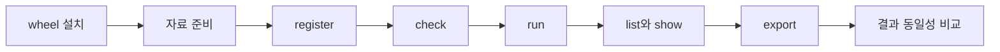

# v0.15 실제 사용자 성능 시험

## 결론

- 기준은 정확히 `develop`의 `v0.15.0` 태그임
- 저장소 내부 함수를 우회하지 않고 설치된 wheel의 공개 명령만 사용함
- 같은 입력·선언·전략 코드로 기준판과 개선판을 비교함
- 8년·1,800종목·여러 자료 묶음·주간 6주 모멘텀을 중앙 조건으로 사용함
- 최종 수익률뿐 아니라 선택·체결·현금·보유·평가 기록이 같아야 통과함
- 기준판에서 실제로 오래 걸린 구간만 개선함

## 실제 사용 흐름

## 중앙 조건

- 기간: 약 8년, 1,963 거래일
- 종목: 1,800개
- 원천 행: 3,533,400개
- 자료 묶음: 가격·거래량, 가치평가, 실적 전망, 주식 수, 지수 편입, 체결
- 판단: 매주 오전 8시 30분
- 체결: 같은 날 오후 3시 30분
- 관찰: 판단일 전까지 공개된 최근 31거래일
- 전략: 16개 입력값으로 점수를 만들고 상위 30개 매수·하위 30개 매도
- 비교군: 점수 비중이 다른 전략 5개
- 계좌: 매일 평가하고 종목별 보유 기록을 남김

## 측정값

- 명령 전체 경과시간
- 사용자 CPU 시간과 시스템 CPU 시간
- 프로세스 전체 최대 메모리
- 실행 기록에 들어 있는 판단, 체결·평가, 전체 시간
- 결과 파일 수와 크기
- 프로파일 상위 함수
- 첫 10%와 마지막 10%의 날짜당 시간

## 비교 순서

1. 작은 조건으로 선언과 결과 모양 확인함
2. 기준 wheel로 전체 조건 1회 예열함
3. 기준 wheel로 전체 조건을 반복 측정함
4. 별도 프로파일 1회로 병목을 확정함
5. 병목별 가설을 하나씩 적용함
6. 개선 wheel로 같은 순서와 입력을 반복함
7. 결과 표의 행 수·키·값·해시를 비교함
8. 실패한 가설도 최종 보고서에 남김

## 성공 기준

- 공개 명령과 사용자 코드를 바꾸지 않은 비교를 첫 표로 제시함
- 모든 핵심 결과가 같음
- 전체 시간과 최대 메모리를 함께 제시함
- 개선이 10% 미만이면 구조 변경을 채택하지 않음
- 빠른 작성법을 따로 시험할 경우 엔진 개선과 구분해 표시함
