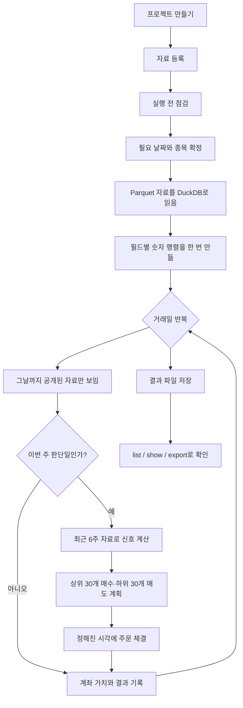

# vqapr 0.15.0 실제 사용자 경로 성능 분석

## 결론

- 정확한 `develop 0.15.0`에서 전체 과정을 다시 수행함
- 기준 커밋은 `8e0045f3`, 태그는 `v0.15.0`임
- 기존 0.9 기반 결과는 이번 결론에 사용하지 않음
- 0.15.0은 이미 자료를 숫자 행렬로 한 번 만들고, 필요한 기간만 잘라 쓰는 구조임
- 따라서 “날짜가 하루 늘 때마다 첫날부터 다시 읽어 시간이 제곱으로 증가함”은 현재 엔진의 기본 동작이 아님
- 새로 확인한 병목은 실제 계산보다 부수 기록을 매번 만드는 일과, 체결 자료를 너무 작게 나누어 읽는 일이었음
- 두 지점을 고친 결과는 다음과 같음

| 실제 실행 조건 | 기존 0.15.0 | 변경 후 | 단축 |
|---|---:|---:|---:|
| 한 전략, 3회 중앙값 | 14.733초 | 9.265초 | 37.1% |
| 서로 다른 전략 5개, 차례로 실행 | 68.019초 | 43.986초 | 35.3% |
| 서로 다른 전략 5개, 4개 작업 동시 실행 | 33.622초 | 18.854초 | 43.9% |
| 한 전략, 메모리 중앙값 | 2.43GB | 1.52GB | 37.4% |
| 5개 전략 차례 실행, 메모리 최고치 | 3.36GB | 1.88GB | 43.9% |
| 5개 전략 동시 실행, 프로세스별 메모리 합계 | 5.93GB | 2.93GB | 50.5% |

- 결과 자료 15개, 총 879,745행이 기존판과 변경판에서 완전히 같음
- 표 내용뿐 아니라 저장된 파일의 바이트도 모두 같음
- 결론적으로 현재 기술 조합을 다른 DB로 전면 교체할 이유는 확인되지 않음
- 권장 구조는 `DuckDB/SQL로 읽기·조인·선집계 → Arrow로 전달 → NumPy 행렬로 반복 계산`임
- 단, 이번 한 전략은 15초 안팎이므로 실제 10분짜리 사용자 전략 전체가 37% 빨라진다고 말할 수는 없음
- 10분 중 대부분이 사용자 작성 계산이라면 이번에 줄인 약 5.5초의 비중은 1% 안팎임
- 다음 최우선 검증은 익명화한 실제 10분 전략을 같은 하네스에 넣어 “엔진 시간”과 “사용자 계산 시간”을 따로 재는 것임

## 1. 현재 코드 작동 방식

### 한눈에 보는 흐름

### 실제 0.15.0의 중요한 특징

- 실행 전에 필요한 전체 기간과 종목을 확정함
- 각 숫자 필드를 `거래일 × 종목` 모양의 행렬로 한 번 만듦
- 전략은 매주 최근 31거래일 부분만 잘라서 사용함
- 잘라낸 부분은 원본 행렬을 다시 복사하지 않는 보기임
- 여러 전략을 동시에 실행하면 같은 읽기 전용 행렬 파일을 여러 작업이 함께 사용함
- 미래에 공개될 자료는 현재 판단에서 보이지 않도록 시간 기준을 적용함
- 매일 계좌 가치, 보유 수량, 주문과 체결 결과를 기록함

### 시간 증가를 쉽게 표현하면

- 전체 시간 = 처음 자료 준비 + 매일 해야 하는 일 + 판단일 계산 + 결과 저장임
- 판단일 계산 = 판단 횟수 × 사용 필드 수 × 종목 수 × 최근 기간의 계산량임
- 현재 기본 엔진은 매일 첫날부터 전체 과거를 다시 읽지 않음
- 사용자가 직접 “첫날부터 오늘까지”를 매번 다시 계산하면 그 사용자 코드에서는 시간이 급격히 늘 수 있음
- 이동 평균, 수익률처럼 반복되는 계산은 최근 구간만 쓰거나 미리 계산한 자료를 쓰는 것이 중요함

## 2. 현재 병목 지점

### 이번 시험에서 확인한 병목

| 엔진 내부 구간 | 기존 0.15.0 | 변경 후 | 설명 |
|---|---:|---:|---|
| 전략 호출 | 7.085초 | 4.215초 | 신호 계산과 자료 요청을 포함함 |
| 매일 실행 처리 | 5.140초 | 3.534초 | 체결, 계좌 갱신, 일별 기록을 포함함 |
| 그중 체결 자료 준비 | 2.889초 | 1.243초 | 위 “매일 실행 처리”에 포함되는 값임 |
| 엔진이 보고한 합계 | 12.260초 | 7.780초 | 명령 시작·종료와 파일 정리 전후는 제외함 |
| 사용자가 느끼는 전체 시간 | 14.733초 | 9.265초 | 3회 중앙값임 |

- 위 구간은 포함 관계가 있으므로 모든 행을 서로 더하면 안 됨

1. 같은 종목 목록을 반복해서 확인하는 비용이 큼

   - 한 번 만든 행렬을 다시 쓸 때도 1,800개 종목 이름을 매번 해시함
   - 프로파일에서 5,317회 실행됨
   - 종목 이름을 바이트로 바꾸고 해시에 넣는 작업이 각각 약 960만 회 발생함

2. 보통 읽지 않는 상세 기록을 매번 즉시 만듦

   - 필드 하나를 읽을 때마다 종목별 유효 행 수를 1,800개의 작은 사전으로 만듦
   - 이 객체들이 실행 종료까지 남아 메모리를 차지함
   - 전략과 일반 결과 저장은 이 상세 사전을 사용하지 않음

3. 체결용 자료를 너무 작은 묶음으로 읽음

   - 3,533,400행을 18번 나누어 읽음
   - 프로파일에서 이 읽기만 4.466초임
   - 매번 쿼리 준비와 Arrow 변환 비용이 반복됨

### 변경 후 남은 주요 비용

- 5,314회의 자료 요청 자체는 그대로임
- 전략의 16개 신호 계산과 순위 계산이 약 4초대임
- 매일 계좌 가치와 결과를 만드는 반복도 남아 있음
- 실제 사용자가 복잡한 Python 반복문, 여러 번의 정렬, 매일 전체 과거 재계산을 넣으면 이 부분이 가장 큰 병목이 될 수 있음
- 이 부분은 사용자의 실제 전략 없이는 정확히 판단할 수 없음

## 3. 대안 및 효과

### 시험 조건

- 원본 자료: `/Users/jason/qlibx/DW`에서 파생해 고정한 시험 자료임
- 원본 고정값: `9b5f0c11...a7547bea1f`
- 기간: 2018-01-02부터 2025-12-30까지 1,963거래일임
- 크기: 1,800종목, 3,533,400행임
- 물리 자료: 가격, 가치평가, 실적 전망, 주식 수, 편입 여부, 체결 자료의 6개 표임
- 사용 필드: 가격·거래량·회전율·베타·PER·PBR·EV/EBITDA·전망치 등 13개임
- 계산 신호: 모멘텀, 변동성, 거래량 변화, 가치, 이익 전망 등 약 16개임
- 판단: 매주 최근 31거래일을 보고 상위 30개 매수, 하위 30개 매도함
- 기간 전체 판단 횟수: 408회임
- 비교 대상: 변경 전 wheel과 변경 후 wheel을 서로 다른 설치 환경에 설치함
- 사용자 경로: `register → check → run → list → show → export`를 실제 공개 명령으로 실행함
- 기존판의 등록은 8.128초, 점검은 0.505초임
- 변경판의 등록은 6.874초, 점검은 0.507초임
- 등록 차이는 같은 소스를 뒤에 실행한 운영체제 파일 캐시의 영향을 받으므로 개선 효과로 계산하지 않음
- 변경판의 결과 목록 0.413초, 상세 보기 1.161초, 내보내기 4.023초임
- 거래 비용과 시장 충격은 넣지 않음
- 메모리는 0.1초마다 부모·자식 프로세스의 RSS를 더해 측정함
- 동시 실행 RSS는 함께 쓰는 메모리도 중복 집계될 수 있으므로 실제 물리 메모리와 같지는 않음

### 가설 A: 부수 기록을 필요할 때만 만들면 빨라짐

- 가설
  - 보통 쓰지 않는 종목별 행 수와 같은 종목 목록의 반복 해시를 없애면 시간과 메모리가 줄어듦
- 변경
  - 이미 만든 행렬을 작은 조건으로 먼저 찾도록 함
  - 상세 행 수는 진단 도구가 실제로 읽을 때만 계산하도록 함
- 확인 방법
  - 공개 실행 경로의 시간과 메모리를 같은 입력으로 비교함
  - 상세 행 수가 기존 사전과 같은지도 단위 검사함
- 결과
  - 행렬 ID 계산이 5,317회에서 5회로 줄어듦
  - 이 변경만 적용한 중간판의 한 전략은 약 11초임
  - 5개 직렬 실행은 68.019초에서 54.030초로 줄어듦
  - 5개 동시 실행은 33.622초에서 21.825초로 줄어듦
- 판정
  - 채택함

### 가설 B: 체결 자료를 더 큰 묶음으로 읽으면 빨라짐

- 가설
  - 한 번에 읽는 행을 20만에서 100만으로 늘리면 반복 쿼리 비용이 줄어듦
- 변경
  - 메모리 한도를 없애지 않고 목표 묶음만 5배로 늘림
  - 한 번에 현재 묶음 하나만 보관하는 방식은 유지함
- 확인 방법
  - 실행 결과 일치, 읽기 횟수, 체결 자료 구간 시간, 최고 메모리를 비교함
- 결과
  - 읽기 횟수가 18회에서 4회로 줄어듦
  - 해당 구간이 약 2.9초에서 1.24초로 줄어듦
  - 최종 한 전략 중앙값이 9.265초가 됨
  - 최고 메모리는 늘지 않고 오히려 부수 기록 제거 효과로 감소함
- 판정
  - 채택함

### 가설 C: Arrow와 DuckDB를 다른 DB로 전면 교체하면 더 빨라짐

- 검토 결과
  - 현재 병목은 DB의 조인 속도가 아니라 이미 읽은 행렬 주변의 반복 기록과 작은 체결 조회였음
  - DuckDB는 로컬 Parquet의 필터·조인·집계에 맞음
  - Arrow는 DB가 아니라 열 단위 자료를 복사 적게 주고받는 공통 형식임
  - NumPy는 전략의 반복 숫자 계산에 맞음
  - 서버 DB를 넣으면 운영, 네트워크, 권한, 자료 복제 비용이 추가됨
- 판정
  - 전면 교체는 보류함
  - 여러 사용자가 큰 창고 자료를 함께 쓰는 경우에만 별도 비교 시험이 필요함

### 가설 D: SQL과 dbt로 미리 계산하면 더 빨라짐

- 유효한 경우
  - 여러 전략이 같은 복잡한 조인과 같은 팩터를 반복 사용함
  - 재무 자료의 공개 시각과 적용 기간을 정확히 보존할 수 있음
- 권장 방식
  - 원천 표는 그대로 보존함
  - 자주 쓰는 조인과 안정된 팩터만 날짜·종목별 마트로 만듦
  - vqapr에는 그 마트를 하나의 등록 자료로 연결함
  - 전략별 가중치, 주문, 계좌 상태처럼 경로에 따라 달라지는 계산은 실행 중에 수행함
- 위험
  - 단순 날짜 조인으로 미래 재무 정보를 과거에 섞을 수 있음
  - 수정 공시와 자료 버전을 덮어쓰면 재현성이 깨짐
- 판정
  - 조건부 권장함
  - 실제 사용자 전략의 반복 조인이 확인된 뒤 별도 실험으로 진행해야 함

### 가설 E: 날짜가 늘 때마다 메모리에 이어 붙이면 더 빨라짐

- 현재 구조
  - 실행 범위 전체의 행렬을 처음에 한 번 만들고 이후에는 부분 보기만 사용함
  - 이미 “이전 자료를 유지하고 새 계산만 함”에 가까운 구조임
- 추가로 가능한 구조
  - 실시간으로 새 날짜가 들어오는 서비스에서는 버전이 붙은 행렬 파일에 새 행만 추가할 수 있음
  - 과거 수정, 종목 추가, 필드 변경 시 다시 만드는 규칙이 반드시 필요함
- 판정
  - 한 번의 과거검증에는 이익이 작아 보류함
  - 매일 같은 전략을 새 날짜만 추가해 재실행하는 운영 환경에서 별도 검토함

### 가설 F: Python을 버리고 C로 내리면 더 빨라짐

- 현재 상태
  - DuckDB, Arrow, NumPy의 무거운 계산은 이미 C/C++ 계열의 구현에서 실행됨
  - Python은 주로 실행 순서, 전략 호출, 계좌 상태를 연결함
- C 또는 Rust가 유효한 경우
  - 실제 10분 전략 프로파일에서 Python 반복문과 계좌 갱신이 대부분을 차지함
  - 소수점, 주문 순서, 오류 메시지의 동일성을 유지할 시험을 만들 수 있음
- 판정
  - 지금은 우선순위가 아님
  - 먼저 전략 계산을 행렬식으로 바꾸거나 SQL 선계산을 적용하는 편이 비용과 위험이 낮음

## 4. 결론: 최종 코드 및 스킬 개선 방안

### 최종 코드

- `src/vqapr/data/store.py`
  - 기존 행렬을 먼저 찾아 반복 해시를 피함
  - 종목별 행 수 기록을 실제 조회 시점까지 미룸
- `src/vqapr/exchange/execution_table.py`
  - 체결 자료의 목표 읽기 묶음을 20만 행에서 100만 행으로 늘림
- `tests/data/test_panel.py`
  - 행렬 ID가 한 번만 계산되는지 확인함
  - 늦게 계산하는 기록이 기존 사전과 같은지 확인함
- `docs/implementations/268-panel-evidence-is-lazy-and-execution-reads-are-wider.md`
  - 변경 이유, 한계, 검증 근거를 기록함

### 정확성 및 품질 확인

- 결과 파일 15개, 879,745행 전수 비교 통과함
- Arrow 표의 값과 스키마가 모두 같음
- 저장 파일 SHA-256도 15개 모두 같음
- 공개 명령 `register`, `check`, `run`, `list`, `show`, `export` 모두 성공함
- 집중 단위 검사 41개 통과함
- 전체 적용 가능 검사 1,791개 통과, 7개 건너뜀, 3개 제외됨
- 제외된 고정 문구 검사와 강제 종료 경쟁 검사는 깨끗한 원본 `v0.15.0`에서도 동일하게 실패함
- 예제 1개는 필요한 `data/DW/fng_k200_members.csv`가 작업 공간에 없어 실행할 수 없었음
- 코드 스타일 검사 통과함
- 정적 타입 검사 오류 0개임
- 소스 배포 파일과 wheel 빌드 성공함

### 사용자용 스킬에 추가할 규칙

- 숫자 팩터 계산은 종목별 Python 반복보다 `matrix()` 기반의 행렬 계산을 먼저 안내함
- 같은 프로젝트에서 여러 전략을 비교할 때 `--jobs` 사용법과 메모리 주의점을 함께 안내함
- “최근 6주”는 전체 과거가 아니라 고정 길이 구간으로 선언하도록 예시를 제공함
- 자주 반복되는 조인은 SQL 또는 날짜·종목별 사전 계산 자료로 분리하는 기준을 제공함
- 재무 자료 선계산 시 `공개 시각`, `적용 시작`, `적용 종료`, `자료 버전`을 필수 열로 안내함
- Arrow를 저장소로 설명하지 않고 DB와 Python 사이의 전달 형식으로 설명함
- 메모리 예상치는 `행 수 × 필드 수 × 자료형 크기 × 동시 작업 수`로 먼저 계산하게 함
- 성능 보고서는 준비, 사용자 계산, 체결 조회, 계좌 기록, 결과 저장을 따로 표시하게 함
- 실제 10분 전략을 재현하지 못한 시험은 엔진 개선치와 전체 전략 개선치를 구분해 쓰게 함

### 다음 우선순위

1. 실제 10분 이상 전략 하나를 익명화해 이 하네스의 `strategy.py` 자리에 넣음
2. 사용자 계산 안에서 전체 과거 재계산, 반복 조인, Python 종목 반복의 비중을 따로 측정함
3. 반복 조인이 크면 DuckDB SQL 또는 dbt 마트를 후보로 시험함
4. 계좌 갱신이 크면 그때만 C/Rust 후보를 같은 결과 전수 비교로 시험함
5. 서로 다른 전략이 같은 행렬을 반복 준비하는 비용이 크면 버전형 영구 행렬 캐시를 별도 실험함

## 재현 자료

- 시험 계획: `TEST-PLAN.md`
- 입력 생성: `prepare_input.py`
- 사용자 프로젝트 생성: `build_project.py`
- 시간·메모리 측정: `measure.py`
- 결과 전수 비교: `compare_records.py`
- 원시 측정값과 프로파일: `outputs/`
- 기준 wheel SHA-256: `67818d36...94df79d59`
- 변경 wheel SHA-256: `5a18cb89...be9c9670`
- 원격 저장소로 push하지 않음
