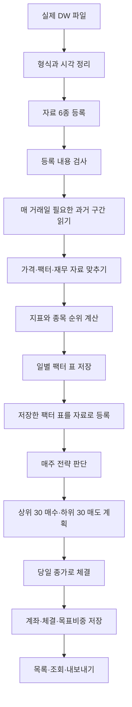

# vqapr v0.15.0 실제 데이터 전체 실행 성능 보고서

> 게시 메모: 아래 측정값은 시험 조건을 고정한 `v0.15.0` 비교 결과임. 채택한 엔진 변경은
> 이후 `develop`의 `v0.16.0` 구조에 병합하고 현재 검사와 새 설치 사용자 여정을 다시 검증함.

## 결론

- 최종 채택안은 `v0.15.0` 엔진 안의 반복 관리 작업을 줄이는 작은 변경 4개임
  - 이미 만든 숫자 묶음을 다시 찾을 때 종목 이름 전체를 매번 해시하지 않음
  - 실제 행 개수는 진단에서 요구할 때만 계산함
  - 같은 출력 묶음의 필드 이름은 처음 한 번만 검사함
  - 체결 자료는 더 큰 묶음으로 읽어 반복 조회 횟수를 줄임
- 실제 DW 자료의 최대 공통 기간과 전체 309종목으로 비교한 결과임
  - 일별 팩터 생성 반복 실행: `15.936초 → 9.722초`, `39.0%` 단축함
  - 일별 팩터 생성 최대 메모리 중앙값: `1.929GB → 0.507GB`, `73.7%` 감소함
  - 5개 전략 순차 실행: `21.307초 → 19.998초`, `6.1%` 단축함
  - 5개 전략 병렬 실행: `12.362초 → 10.868초`, `12.1%` 단축함
  - 반복적인 실제 작업 묶음: `41.408초 → 34.015초`, `17.9%` 단축함
- 기존판과 신규판의 최종 결과는 완전히 같음
  - 일별 팩터 419,686행의 값·스키마·파일 해시가 같음
  - 5개 전략의 계좌·체결·목표비중 15개 표도 값·스키마·파일 해시가 모두 같음
- 팩터를 전략마다 다시 계산하는 구조는 채택하면 안 됨
  - 5개 순차 실행이 `19.998초 → 30.917초`로 느려짐
  - 5개 병렬 실행의 최대 메모리가 `1.378GB → 2.417GB`로 커짐
- 마지막 20거래일만 이어 계산하는 방식은 가장 큰 다음 개선 후보임
  - 전체 2,096일 재계산 `9.722초` 대비 마지막 20일 계산 `0.973초`임
  - 마지막 20일 4,000행은 전체 재계산의 같은 구간과 완전히 같음
  - 현재 공개 저장 기능에는 기존 결과에 안전하게 이어 붙이는 기능이 없어 아직 제품 코드로 채택하지 않음
- DuckDB 직접 SQL 재작성은 채택하지 않음
  - 시험 SQL 자체는 `2.259초`였으나 419,686행 대신 6,806행만 만들어 결과가 달랐음
  - 결측 자료를 각 필드별로 이어 쓰는 기존 규칙을 SQL이 똑같이 재현하지 못했음
  - 최대 메모리도 `2.239GB`로 신규 팩터 생성보다 약 4.4배 컸음
- Arrow와 DuckDB를 없애는 것이 이번 문제의 우선 해법은 아님
  - 느린 지점은 자료 형식 자체보다 Python에서 반복한 검증·해시·진단용 계산이었음
  - C 언어 재작성보다 반복 횟수를 줄이는 변경이 더 작고 안전하며 실제 효과도 확인됨
- 단, 이번 시험은 사용자가 말한 `10분 이상·연산 중심` 실행을 재현하지 못함
  - 최대 실제 조건도 최초 전체 경로 `55.933초`, 신규판 `54.322초`였음
  - 팩터의 지표 계산·순위·출력 조립은 기준 팩터 실행의 약 `28%`였음
  - 따라서 이 결과만으로 10분 이상인 사용자 고유 전략의 개선 폭을 단정하면 안 됨

## 시험 기준

- 기준 코드: `develop`의 `v0.15.0`, 커밋 `8e0045f3`임
- 작업 브랜치: `codex/v015-performance-harness`임
- 원격 저장소에 푸시하지 않음
- 원본 자료: `/Users/jason/qlibx/DW`임
- 원본 자료를 수정하지 않음
- 시험 조건은 기준판 측정 전에 `TEST-PLAN.md`에 고정함
- 기준판은 손대지 않은 `v0.15.0`에서 별도 wheel로 만듦
- 신규판도 별도 wheel과 별도 환경에서 실행함
- 두 환경의 Python과 의존성 버전을 같게 맞춤
- 측정 장비
  - Apple Silicon macOS임
  - 논리 CPU 8개임
  - 메모리 16GB임
  - Python 3.12.4임
- 최대 공통 기간: 2018-01-02~2026-07-20임
  - 가격 자료는 더 오래 존재함
  - 가치·실적예상 자료가 2018년부터 시작함
  - 요청한 10년을 채울 수 없어 실제 가능한 최대 약 8년 7개월을 사용함
- 종목 수: KOSPI200 이력에 한 번이라도 등장한 309종목 전부임
- 종목이나 날짜를 임의로 줄이지 않음
- 사용 자료
  - 가격 6,908,377행임
  - 주식 수 7,415,765행임
  - 가치 지표 5,941,113행임
  - 실적예상 1,315,786행임
  - 지수 구성 이력 419,777행임
- 전략 조건
  - 최근 5·10·20·31거래일 수익률을 사용함
  - 변동성, 하락 빈도, 거래대금, 거래량 변화를 사용함
  - PER, PBR, EV/EBITDA, 베타, 주식 수를 사용함
  - 매출, 영업이익, 순부채, 지배주주이익, 예상 EPS 변화를 사용함
  - 여러 자료를 날짜·종목 기준으로 함께 사용함
  - 매일 5개 종합 점수를 계산해 저장함
  - 매주 마지막 거래일에 상위 30종목 매수·하위 30종목 매도함
  - 서로 다른 점수 조합을 쓰는 전략 5개를 실행함
- 시간 해석에 사용한 가정
  - 가격은 장 마감인 15:30에 알려진 것으로 봄
  - 가치·실적예상·주식 수는 같은 날 18:00에 알려진 것으로 봄
  - 지수 구성은 같은 날 08:00에 알려진 것으로 봄
  - 원본 파일에 최초 발표·수정 시각이 없어 실제 투자 시점의 완전한 PIT 여부는 검증하지 못함

## 1. 현재 코드의 작동 방식

### 전체 흐름

### 하루의 흐름

- 08:00: 당일 지수 구성 정보가 보임
- 08:30: 전날 18:30까지 저장된 팩터로 주간 매매를 결정함
- 15:30: 당일 종가로 주문을 체결하고 계좌를 평가함
- 18:00: 당일 재무·가치·주식 수 정보가 보임
- 18:30: 당일 팩터를 계산해 다음 판단에 쓸 표로 저장함

### 연산량을 쉽게 표현하면

- 전체 비용은 대략 `거래일 수 × 종목 수 × 읽는 필드 수`에 비례함
- 과거 구간 길이는 31일로 고정되어 있음
- `v0.15.0`은 이미 전체 자료를 숫자 묶음으로 한 번 만들고 필요한 구간만 잘라 줌
- 따라서 날짜가 뒤로 갈수록 1일부터 그날까지 전부 다시 읽는 단순한 제곱 증가 구조는 아님
- 이번 병목은 419,686개 출력행의 같은 필드 이름을 반복 검사하고, 같은 종목 목록을 반복 해시하고, 쓰지 않는 진단용 행 수를 미리 만드는 작업이었음

## 2. 단계별 실행 시간과 메모리

### 공개 사용자 전체 경로

| 단계 | 기준판 시간 | 신규판 시간 | 기준판 최대 메모리 | 신규판 최대 메모리 |
|---|---:|---:|---:|---:|
| 실제 자료 준비 | 7.585초 | 7.585초 | 1.347GB | 1.347GB |
| 프로젝트 틀 만들기 | 2.338초 | 6.503초 | 148MB | 172MB |
| 원자료 등록 | 1.802초 | 2.487초 | 722MB | 710MB |
| 팩터 실행 전 검사 | 0.546초 | 0.548초 | 116MB | 117MB |
| 팩터 최초 생성 | 15.540초 | 10.246초 | 1.959GB | 530MB |
| 전략 등록 | 0.505초 | 0.431초 | 98MB | 97MB |
| 전략 실행 전 검사 | 0.518초 | 0.507초 | 119MB | 119MB |
| 전략 5개 순차 실행 | 21.307초 | 19.998초 | 683MB | 664MB |
| 결과 목록 | 0.412초 | 0.428초 | 96MB | 94MB |
| 결과 조회 | 1.215초 | 1.294초 | 215MB | 178MB |
| 결과 내보내기 | 4.165초 | 4.295초 | 427MB | 438MB |
| 합계 | 55.933초 | 54.322초 | 단계별 최댓값 1.959GB | 단계별 최댓값 1.347GB |

- 프로젝트 틀 만들기와 등록은 실행 순서·운영체제 캐시 영향을 크게 받았음
- 전체 합계 개선은 `2.9%`로 작아 보이지만, 핵심 계산 구간은 `36.847초 → 30.244초`, `17.9%` 단축됨
- 신규판 전체 경로의 최대 메모리는 공통 준비 단계 1.347GB에서 발생함
- 전략 반복 실행에서 자료 준비는 다시 하지 않으므로 아래 반복 측정이 실제 연구 반복에 더 가까움

### 최초 실행과 반복 실행

| 구간 | 기준판 | 신규판 | 변화 |
|---|---:|---:|---:|
| 팩터 최초 실행 | 15.540초 | 10.246초 | -34.1% |
| 팩터 반복 중앙값 | 15.936초 | 9.722초 | -39.0% |
| 팩터 반복 최대 메모리 중앙값 | 1.929GB | 0.507GB | -73.7% |
| 전략 1개 최초 실행 | 4.715초 | 4.443초 | -5.8% |
| 전략 1개 반복 중앙값 | 4.761초 | 4.499초 | -5.5% |
| 전략 1개 반복 최대 메모리 중앙값 | 493MB | 437MB | -11.4% |
| 전략 5개 순차 실행 | 21.307초 | 19.998초 | -6.1% |
| 전략 5개 병렬 실행 | 12.362초 | 10.868초 | -12.1% |
| 전략 5개 병렬 최대 메모리 합계 | 1.512GB | 1.378GB | -8.9% |
| 반복 팩터+전략 5개+내보내기 | 41.408초 | 34.015초 | -17.9% |

- 병렬 메모리는 여러 작업의 합계라서 운영체제가 공유한 메모리를 중복 계산할 수 있음

### 팩터 생성 내부 시간

| 세부 단계 | 기준판 최초 | 신규판 최초 | 설명 |
|---|---:|---:|---|
| 자료 조회 | 5.920초 | 2.584초 | 필요한 과거 구간과 필드를 꺼냄 |
| 자료 맞춤 | 0.184초 | 0.194초 | 날짜·종목 위치를 맞춤 |
| 지표 계산 | 1.392초 | 1.844초 | 수익률·변동성·재무 변화 등을 계산함 |
| 종목 순위 계산 | 1.382초 | 1.359초 | 같은 날 종목끼리 비교함 |
| 출력행 만들기 | 1.586초 | 1.544초 | 일별 팩터 행을 만듦 |
| 일정 진행·검사·저장 등 | 5.077초 | 2.721초 | 위 단계 밖의 엔진 작업임 |
| 합계 | 15.540초 | 10.246초 | 실제 벽시계 시간임 |

- 기준판의 지표 계산+순위+출력행 만들기는 `4.360초`, 전체의 약 `28%`임
- 고정한 현실성 기준인 연산 비중 50%를 넘지 못함

### 전략 5개 내부 시간

| 세부 단계 | 기준판 | 신규판 | 변화 |
|---|---:|---:|---:|
| 전략 판단 호출 합계 | 3.231초 | 2.561초 | -20.7% |
| 체결·계좌 처리 합계 | 12.736초 | 12.271초 | -3.7% |
| 그 밖의 준비·결과 정리 | 5.340초 | 5.166초 | -3.3% |
| 벽시계 합계 | 21.307초 | 19.998초 | -6.1% |

- 체결·계좌 구간 안에서 계좌 가격 갱신 약 3.6초, 주문 계획 약 1.5초, 중간 상태 저장 약 1.9~2.5초가 사용됨
- 팩터를 미리 저장한 뒤에는 전략 계산 자체보다 시뮬레이션과 결과 기록 비중이 큼

## 3. 확인된 병목

- 가장 확실한 병목은 출력 검사의 중복임
  - 기준 프로파일: 약 1억 7,717만 번의 함수 호출임
  - 같은 필드 이름의 공백 검사만 약 4,754만 번 실행함
  - 출력 정리·검증의 프로파일 누적 시간은 15.619초임
  - 신규판은 이 구간이 3.429초로 줄었음
- 두 번째 병목은 같은 숫자 묶음의 신원 확인을 반복한 작업임
  - 기준판은 종목 목록 전체를 포함한 해시 계산을 35,632번 호출함
  - 신규판은 실제 새 묶음 5개에 대해서만 실행함
- 세 번째 병목은 사용하지 않는 진단 자료를 미리 만든 작업임
  - 종목별 실제 행 수를 매 조회마다 중첩 사전으로 만들었음
  - 긴 실행에서 수많은 작은 Python 객체가 끝까지 남아 메모리를 키웠음
  - 신규판은 진단에서 요구할 때만 계산함
- 네 번째 병목은 체결 자료를 작은 묶음으로 반복 조회한 작업임
  - 한 번에 읽는 목표를 20만행에서 100만행으로 늘림
  - 실제 장기 전략에서 반복 조회와 중간 상태 저장 시간이 감소함
- 지표 계산 자체는 이번 조건의 주 병목이 아니었음
  - NumPy가 309종목×31일 계산을 이미 묶어서 처리함
  - C 언어로 옮겨도 전체 28% 안에서만 개선할 수 있어 우선순위가 낮음

## 4. 개선안별 가설·시험 방법·결과

### 개선안 A: 반복 관리 작업 제거 — 채택함

- 가설
  - 계산 결과와 무관한 반복 검증·해시·진단 객체 생성을 줄이면 같은 결과로 빨라질 것임
- 시험 방법
  - 실제 전체 기간·전체 종목·같은 전략으로 기준판과 변경판을 별도 설치해 실행함
  - 최초 1회와 반복 2회를 나눠 측정함
  - 프로파일로 호출 횟수와 누적 시간을 확인함
  - 결과 표 전체와 파일 해시를 비교함
- 결과
  - 팩터 반복 실행 39.0% 단축함
  - 팩터 반복 최대 메모리 73.7% 감소함
  - 결과 16개 표가 모두 바이트 단위로 같음
- 판단
  - 고정한 채택 기준인 시간 10% 이상 개선, 메모리 10% 이내, 완전 동일 결과를 통과함

### 개선안 B: 팩터를 한 번 저장해 5개 전략이 재사용 — 채택함

- 가설
  - 같은 팩터를 전략마다 다시 계산하지 않으면 전략 수가 늘수록 이득이 커질 것임
- 시험 방법
  - `일별 팩터 생성 → 실제 표로 저장 → 5개 주간 전략`의 공개 두 단계 경로를 실행함
  - 비교안은 각 전략이 원자료 5종을 읽어 같은 팩터를 직접 다시 계산함
- 결과
  - 저장 후 재사용 순차: 19.998초·664MB임
  - 직접 재계산 순차: 30.917초·1.028GB임
  - 저장 후 재사용 병렬: 10.868초·1.378GB임
  - 직접 재계산 병렬: 19.197초·2.417GB임
  - 직접 계산안의 계좌·체결 경제값은 같지만 의도적으로 다른 실행 이름과 내부 식별자는 다름
- 판단
  - 재사용 구조가 현실적인 기본 구조임

### 개선안 C: DuckDB SQL로 모든 팩터 직접 계산 — 거절함

- 가설
  - 여러 표 결합과 이동 계산을 SQL 엔진에 맡기면 Python 호출 비용을 줄일 수 있음
- 시험 방법
  - 같은 정규화 Parquet 5개와 8개 CPU 스레드를 사용함
  - 날짜×309종목 표를 만들고 이동 수익률·재무 변화·종목 순위를 SQL로 계산함
  - 기존 팩터 표와 스키마·행·값을 비교함
- 결과
  - 실행 2.259초, 최대 메모리 2.239GB임
  - 기존 419,686행과 달리 6,806행만 생성함
  - 날짜 시각대와 결측 자료 이어 쓰기 규칙도 완전히 같지 않았음
- 판단
  - 빠르지만 같은 계산이 아니므로 속도 비교 근거로 사용할 수 없음
  - SQL 수치만 보고 채택하면 전략 결과가 바뀌는 위험이 큼
  - 정확한 SQL판은 자료별 날짜축, 필드별 마지막 유효값, 결측값이 순위 분모에 미치는 규칙까지 명시한 뒤 새 실험으로 검증해야 함

### 개선안 D: 마지막 20거래일만 증분 계산 — 제품 후보임

- 가설
  - 이미 계산한 과거를 보존하고 새 거래일만 계산하면 반복 연구 시간을 크게 줄일 수 있음
- 시험 방법
  - 기존 전체 결과를 과거 상태로 봄
  - 마지막 20거래일만 공개 팩터 실행 경로로 다시 계산함
  - 전체 재계산의 같은 20일과 전수 비교함
- 결과
  - 20거래일 4,000행 생성이 0.973초·243MB임
  - 전체 재계산 반복 중앙값 9.722초·507MB임
  - 마지막 20일의 값과 스키마가 완전히 같음
- 판단
  - 계산 부분의 가능성은 확인됨
  - 현재 공개 저장소는 이전 결과와 새 결과를 원자적으로 이어 붙이고 실패 시 되돌리는 계약이 없음
  - 저장·중복 방지·수정 데이터 무효화 기능을 설계한 뒤 제품 코드로 옮겨야 함

### 개선안 E: 별도 서버 DB·클러스터 키·dbt 마트 — 이번에는 보류함

- 가설
  - 반복 조인과 넓은 원자료 조회가 압도적이면 정렬·클러스터링한 DB와 선계산 마트가 유리할 수 있음
- 확인 결과
  - `v0.15.0`은 한 실행에서 필요한 숫자 자료를 이미 한 번 만들어 재사용함
  - 신규판 팩터 자료 조회는 2.584초까지 줄었음
  - 더 큰 낭비는 출력 검증과 Python 객체 관리였음
  - 서버 DB 도입은 배포·비용·시점 일관성·재현성 부담을 새로 만듦
- 판단
  - 현재 규모에서 새 서버 DB가 우선 해법이라는 근거가 없음
  - 여러 연구자가 같은 수억 행 원자료를 반복 조인하는 환경이라면 별도 시험 가치가 있음
  - 그 경우 권장 정렬 순서는 `자료 종류 → 종목 → 알려진 시각`이며, 팩터 마트에는 계산식 버전과 원본 해시를 함께 저장해야 함

## 5. 기존판과 신규판 비교표

| 항목 | 기존 `v0.15.0` | 신규 구조 | 결론 |
|---|---:|---:|---|
| 팩터 반복 시간 | 15.936초 | 9.722초 | 신규 39.0% 빠름 |
| 팩터 반복 메모리 | 1.929GB | 0.507GB | 신규 73.7% 적음 |
| 전략 1개 반복 시간 | 4.761초 | 4.499초 | 신규 5.5% 빠름 |
| 전략 5개 순차 | 21.307초 | 19.998초 | 신규 6.1% 빠름 |
| 전략 5개 병렬 | 12.362초 | 10.868초 | 신규 12.1% 빠름 |
| 반복 연구 묶음 | 41.408초 | 34.015초 | 신규 17.9% 빠름 |
| 일별 팩터 결과 | 419,686행 | 419,686행 | 완전 동일함 |
| 전략 결과 표 | 15개 | 15개 | 완전 동일함 |
| 공개 사용 순서 | 유지함 | 유지함 | 호환됨 |

## 6. 결과 동일성 검증

- 동일한 한 프로젝트 위치에서 기준 엔진과 신규 엔진을 차례로 실행함
  - 프로젝트 위치가 다르면 내부 실행 식별자가 달라지는 영향을 제거하기 위함
- 일별 팩터
  - 419,686행임
  - 7개 열의 이름과 자료형이 같음
  - 모든 값이 같음
  - 두 Parquet 파일 SHA-256이 `e3847c2c2c3f69f5d5eddb8546d89df587bf1f66659fd912b2a9fc90d7134b34`로 같음
- 전략 결과
  - 5개 전략을 비교함
  - 전략마다 계좌·체결·목표비중을 비교함
  - 15개 표의 행 수·스키마·값·파일 SHA-256이 모두 같음
  - 모멘텀 전략 예시: 체결 37,193행, 목표비중 26,760행임
- 증분 결과
  - 2026-06-22~2026-07-20 20거래일임
  - 4,000행의 값과 스키마가 전체 재계산의 같은 구간과 같음
- 직접 재계산 대안
  - 계좌와 체결의 경제값은 같음
  - 실행 이름과 내부 식별자는 의도적으로 달라 파일 자체는 같지 않음
- SQL 대안
  - 행 수와 값이 달라 동일성 검사에 실패함
  - 성능이 빨라도 개선안으로 인정하지 않음

## 7. 최종 코드와 추가 개선 방안

### 최종 코드

- `src/vqapr/data/store.py`
  - 이미 만든 숫자 묶음을 작은 조건으로 먼저 찾음
  - 종목별 실제 행 수를 필요할 때 계산함
- `src/vqapr/domain/shapes.py`
  - 한 출력 묶음 안에서 같은 필드 이름을 한 번만 검사함
  - 모든 값 검사는 계속 행마다 수행함
- `src/vqapr/exchange/execution_table.py`
  - 체결 자료 조회 목표 크기를 20만행에서 100만행으로 늘림
- `tests/data/test_panel.py`
  - 숫자 묶음 해시가 한 번만 실행되는지 검사함
  - 진단용 행 수의 공개 형태가 유지되는지 검사함
- `tests/domain/test_shapes.py`
  - 반복 필드 이름의 문자 검사가 한 번인지 검사함
- 공개 CLI, 전략 작성법, 결과 표의 모양은 바꾸지 않음

### 검증 결과

- 변경 집중 검사: 21개 통과함
- 코드 규칙 검사: 통과함
- 타입 검사: 오류 0개임
- 기본 전체 검사: 1,764개 통과, 7개 제외, 2개 실패함
- 느린 검사를 포함한 전체 검사: 1,792개 통과, 7개 제외, 3개 실패함
- 실패 2개는 손대지 않은 `v0.15.0`에서도 그대로 재현함
  - 운영체제에 따라 달라지는 오류 문구 고정값 검사임
  - 강제 종료 시점에 따라 결과가 달라지는 경쟁 조건 검사임
- 추가 실패 1개는 저장소의 `data/DW`가 없어서 발생함
  - 실제 `/Users/jason/qlibx/DW`를 임시 위치에 연결해 해당 showcase를 따로 실행하니 통과함
- 패키지 빌드: source 배포 파일과 wheel 모두 성공함

### 다음 코드 개선 순서

1. 증분 팩터 저장 계약을 먼저 설계함
   - 마지막 성공 시각과 원본 파일 해시를 저장함
   - 새 구간에 필요한 31일 여유 구간만 다시 읽음
   - 기존 구간과 새 구간의 중복 키를 검사함
   - 임시 파일에 쓴 뒤 성공할 때 한 번에 교체함
   - 과거 원본이 수정되면 영향 구간부터 다시 계산함
2. DataModel의 열 단위 출력 통로를 별도 설계함
   - Python 사전 419,686개를 만드는 비용을 줄일 수 있음
   - 기존 행 단위 반환도 계속 지원해 호환성을 지켜야 함
3. 체결·계좌 구간을 다음 프로파일 대상으로 삼음
   - 전략 5개에서 약 12.3초로 가장 큰 남은 구간임
   - 계좌 가격 갱신과 중간 상태 저장을 우선 측정함
4. 실제 10분 이상 사용자 전략을 별도 입력으로 재시험함
   - 사용자 전략 파일과 선언을 그대로 받아야 함
   - 이번 하네스의 기간·전체 종목·단계 측정·동일성 검사를 그대로 재사용함
5. SQL판은 의미 명세를 먼저 고정한 뒤 다시 만듦
   - 필드별 마지막 유효값 규칙을 SQL로 명시함
   - 원자료별 거래일 축이 다른 경우를 명시함
   - 기존 결과 전수 동일성 통과 전에는 속도 결과를 채택하지 않음

### 스킬 개선 방안

- `make-datamodel` 안내에 “여러 전략이 공유하는 팩터는 먼저 물리 표로 생성함”을 추가함
- `make-strategy` 안내에 “전략에서는 원자료 5종을 다시 결합하지 않고 등록된 팩터 표를 읽음”을 추가함
- `run-backtest` 안내에 아래 순서를 기본 장기 실행 절차로 추가함
  - 팩터 생성 실행
  - 생성 결과 검사
  - 여러 전략 순차 시험
  - 메모리가 허용될 때만 병렬 시험
  - 결과 동일성 해시 확인
- 향후 증분 기능이 제품에 들어가면 “원본 해시가 같을 때만 이전 팩터를 재사용함”을 안내함
- SQL이나 별도 DB를 추천하기 전 “현재 가장 긴 단계가 조회인지, 계산인지, 저장인지 먼저 측정함”을 필수 규칙으로 추가함

## 8. 실제 사용 환경 재현 수준과 남은 한계

### 잘 재현한 부분

- 실제 DW 원본을 사용함
- 가능한 최대 공통 기간을 사용함
- 실제 지수 이력의 전체 309종목을 사용함
- 가격·주식 수·가치·실적예상·지수 구성·체결 자료를 함께 사용함
- 공개 문서 흐름의 프로젝트 생성·등록·검사·실행·목록·조회·내보내기를 사용함
- `DataModel 생성·물리 저장 → 전략 실행`의 두 단계 경로를 포함함
- 최근 6주 자료를 반복 조회하는 모멘텀 전략을 포함함
- 매주 상위 매수·하위 매도 전략 5개를 포함함
- 최초와 반복, 순차와 병렬을 나눠 측정함
- 결과를 일부 표본이 아니라 전수 비교함

### 충분히 재현하지 못한 부분

- 10분 이상 실행을 재현하지 못함
  - 실제 입력의 경제적 종목 수가 309개이고 공통 기간이 약 8년 7개월임
  - `v0.15.0`이 이미 숫자 자료를 묶음으로 읽어 31일 구간 계산이 빠름
  - 시간을 늘리기 위한 가짜 반복 계산이나 종목 복제를 넣지 않았음
- 연산 중심 조건을 통과하지 못함
  - 지표·순위·출력 조립이 기준 팩터 실행의 약 28%임
  - 고정 기준 50%보다 낮음
  - 사용자의 실제 10분 전략에는 더 무거운 사용자 계산이 있을 가능성이 큼
- 실제 PIT 경제성을 보증하지 못함
  - 파일의 날짜는 확인했지만 최초 발표 시각과 수정 이력은 확인할 수 없음
- 한 장비에서 실행함
  - CPU 수, 디스크 속도, 운영체제 캐시에 따라 절대 시간은 달라질 수 있음
- 최초 전체 경로의 프로젝트 생성·등록 시간은 실행 순서 영향을 받음
  - 이 때문에 핵심 비교는 반복 중앙값과 계산 구간을 함께 제시함
- SQL 시험은 동일성에 실패함
  - SQL의 2.259초를 기존 9.722초와 같은 계산의 속도 차이로 해석하면 안 됨

### 현실성 판정

- 자료 규모·기간·종목 수: 높음
- 공개 사용자 실행 경로: 높음
- 여러 자료 결합·주간 롱숏 전략: 높음
- 10분 이상 사용자 계산 재현: 낮음
- 실제 발표 시점 기준 PIT 보증: 낮음
- 종합 판정: 중간임
- 이 보고서는 `v0.15.0`의 공통 엔진 낭비를 줄였다는 근거로는 충분함
- 사용자의 10분 이상 고유 전략 전체가 같은 비율로 빨라진다는 근거로는 부족함

## 재현 자료 위치

- 고정 시험 계획: `experiments/exp_252_actual_dw_full_user_path/TEST-PLAN.md`
- 원본·정규화 자료 해시: `experiments/exp_252_actual_dw_full_user_path/outputs/inputs/manifest.json`
- 단계별 원시 측정: `experiments/exp_252_actual_dw_full_user_path/outputs/measurements/`
- 내부 단계 시간: `experiments/exp_252_actual_dw_full_user_path/outputs/timings/`
- 기준·신규 프로파일: `experiments/exp_252_actual_dw_full_user_path/outputs/profiles/`
- 전수 동일성 결과: `experiments/exp_252_actual_dw_full_user_path/outputs/comparison.json`
- 시험 하네스: `experiments/exp_252_actual_dw_full_user_path/`
